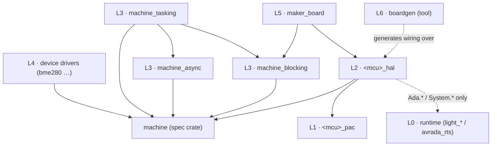

# Ada Machine — An Opinionated Platform Architecture for Embedded Ada


- **Status:** Draft 0.5 — 2026-07-21
- **Author:** Manuel Stahl (with research assistance)
- **In scope:** 8-bit (ATtiny/ATmega AVR) through 32-bit (RP2040-class Cortex-M) to 64-bit (PolarFire SoC-class RISC-V); [MPU](#g-mpu)-based memory protection; [SMP](#g-smp) and [AMP](#g-amp) multicore; two privilege levels (RISC-V M-/U-Mode, ARM privileged/unprivileged) — always on embedded runtime profiles (bare metal / [Ravenscar](#g-ravenscar)-class tasking).
- **Out of scope:** [MMU](#g-mmu)-based virtual memory and IOMMU — the line where full OSes begin (§2) — and x86 targets.

---

## Glossary

- <a id="g-a0b"></a>**A0B** — Vadim Godunko's family of asynchronous, callback-based Ada driver crates ([github.com/godunko/a0b-i2c](https://github.com/godunko/a0b-i2c)); `A0B.Await` converts callbacks to blocking behavior with or without tasking.
- <a id="g-adl"></a>**ADL (Ada Drivers Library)** — AdaCore's monolithic embedded driver library ([github.com/AdaCore/Ada_Drivers_Library](https://github.com/AdaCore/Ada_Drivers_Library)); origin of the current [`hal` crate](#g-halcrate).
- <a id="g-alire"></a>**Alire** — the Ada LIbrary REpository, Ada's package manager and crate ecosystem ([alire.ada.dev](https://alire.ada.dev)).
- <a id="g-amp"></a>**AMP** — Asymmetric MultiProcessing: cores run separate programs/roles (e.g. PolarFire SoC's E51 monitor core + U54 application cores), as opposed to [SMP](#g-smp).
- <a id="g-bsp"></a>**BSP (Board Support Package)** — a crate naming a board's pins/devices and providing board init, on top of an MCU [HAL](#g-hal).
- <a id="g-busclaim"></a>**Bus claim** — exclusive tenure of a shared bus by one driver across a multi-transfer sequence (§8.5); distinct from the §7.1 *transaction*, which is only an error scope.
- <a id="g-chained"></a>**Chained status (sticky error)** — Ada Machine's error convention (§7.1): fallible operations take `Status : in out` and become no-ops while an error is pending, so multi-step transactions fail all-or-nothing with one handler at the end. Precedents: Go's `errWriter` pattern ([Errors are values](https://go.dev/blog/errors-are-values)), C stdio's sticky `ferror` stream state.
- <a id="g-crate"></a>**Crate** — an [Alire](#g-alire) package: sources + manifest, resolved by dependency solving.
- <a id="g-defmt"></a>**defmt (deferred formatting)** — Rust's embedded logging framework ([defmt.ferrous-systems.com](https://defmt.ferrous-systems.com/)): format strings are interned into a host-readable table and never occupy target flash; the target emits only compact event IDs + scalar arguments, the host renders text.
- <a id="g-devicetree"></a>**Devicetree** — Zephyr's/Linux's declarative hardware description ([docs](https://docs.zephyrproject.org/latest/build/dts/index.html)); in Zephyr it is compiled to C macros at build time and instantiates driver structs.
- <a id="g-dma"></a>**DMA** — Direct Memory Access: peripheral-to-memory transfers without CPU involvement, completion signaled by interrupt.
- <a id="g-eh"></a>**embedded-hal** — Rust's trait-based HAL contract ([github.com/rust-embedded/embedded-hal](https://github.com/rust-embedded/embedded-hal)); v1.0 design rationale [here](https://blog.rust-embedded.org/embedded-hal-v1/).
- <a id="g-generic"></a>**Generic package / instantiation** — Ada's compile-time parameterization; GNAT macro-expands each instantiation (monomorphization), enabling full inlining at the cost of code duplication.
- <a id="g-ghal"></a>**GHAL (GNAT Academic Program HAL)** — a generic-package Ada HAL from the [GNAT Academic Program](https://github.com/GNAT-Academic-Program) org (`gpio_generic`, `i2c_generic`, `usart_generic`, MCU crates like `stm32f746_ghal`, board crates, and `ghal_examples`). Uses the same compile-time formal-subprogram binding as Ada Machine's L2/L4 — not [tagged](#g-tagged) dispatch — but is blocking, exception-based (`Bus_Fault`), and carries no [SPARK](#g-spark); its `ghal_examples` runs a full LTDC/DMA2D/touch GUI on a real STM32F746G-DISCO. Ada Machine's closest same-language peer (§3, §17).
- <a id="g-gnatprove"></a>**GNATprove** — the [SPARK](#g-spark) analysis tool: flow analysis and formal proof of Ada/SPARK code.
- <a id="g-hal"></a>**HAL (Hardware Abstraction Layer)** — API layer hiding register-level detail behind peripheral operations.
- <a id="g-halcrate"></a>**`hal` crate (1.x)** — the existing Alire crate of tagged limited interfaces (`HAL.GPIO`, `HAL.SPI`, …) extracted from [ADL](#g-adl) ([alire.ada.dev/crates/hal](https://alire.ada.dev/crates/hal.html)).
- <a id="g-htif"></a>**HTIF** — Berkeley Host-Target InterFace: RISC-V simulator console via magic `tohost`/`fromhost` memory words (Spike, QEMU `spike` machine); not present on real silicon.
- <a id="g-jorvik"></a>**Jorvik** — Ada 2022's relaxed [Ravenscar](#g-ravenscar) tasking profile (multiple entries, pure barriers).
- <a id="g-light"></a>**light runtime** — GNAT's minimal runtime profile (formerly [ZFP](#g-zfp)): no tasking, no exception propagation, no finalization/heap ([GNAT runtimes doc](https://docs.adacore.com/gnat_ugx-docs/html/gnat_ugx/gnat_ugx/gnat_runtimes.html)). **light-tasking** adds Ravenscar/Jorvik tasking; **embedded** adds full exception propagation.
- <a id="g-mmu"></a>**MMU** — Memory Management Unit: page-based virtual memory with address translation; the hardware feature that enables (and in practice implies) a full OS. Out of scope, as is the IOMMU (its DMA-side counterpart).
- <a id="g-mpu"></a>**MPU** — Memory Protection Unit: region-based access control without address translation; standard on Cortex-M and RISC-V (PMP), usable by embedded runtimes for stack guards and partitioning. In scope.
- <a id="g-nep"></a>**No_Exception_Propagation** — GNAT restriction: exceptions may only be handled in the frame that raises them; raising otherwise ends in the Last_Chance_Handler. In force on all light-class runtimes.
- <a id="g-pac"></a>**PAC (Peripheral Access Crate)** — a crate containing only register bindings for one MCU family (Rust convention via [svd2rust](https://docs.rust-embedded.org/book/design-patterns/hal/gpio.html); proposed for Ada by damaki in [thread 4364](https://forum.ada-lang.io/t/towards-a-hal-for-multiple-runtimes/4364)).
- <a id="g-ravenscar"></a>**Ravenscar** — the restricted, analyzable Ada tasking profile used by embedded runtimes.
- <a id="g-rtt"></a>**RTT (Real-Time Transfer)** — debug-probe console via a RAM ring buffer polled by the probe (SEGGER RTT and workalikes); no peripheral registers, no traps, works at full speed while running.
- <a id="g-sso"></a>**Scalar_Storage_Order** — GNAT aspect fixing the byte order of a composite type's scalar components, making a record's wire representation endianness-explicit and host-independent (§15.2).
- <a id="g-semihosting"></a>**Semihosting** — ARM debug console: a breakpoint/trap instruction (`BKPT 0xAB`) the attached debugger services; very slow, and halts or faults when no debugger is attached.
- <a id="g-signature"></a>**Signature package** — a generic package with formal parameters and an empty visible part, used purely to name and type-check a set of operations; the Ada analog of a Rust trait declaration (formal-package pattern).
- <a id="g-smp"></a>**SMP** — Symmetric MultiProcessing: identical cores under one program/scheduler (Ravenscar task dispatching domains; `polarfiresoc-smp` runtime).
- <a id="g-spark"></a>**SPARK** — the formally analyzable Ada subset ([adacore.com/sparkpro](https://www.adacore.com/sparkpro)); notably excludes `access all T'Class`.
- <a id="g-svd"></a>**SVD** — CMSIS System View Description, vendor XML describing an MCU's registers.
- <a id="g-svd2ada"></a>**svd2ada** — AdaCore's [SVD](#g-svd)-to-Ada register binding generator ([github.com/AdaCore/svd2ada](https://github.com/AdaCore/svd2ada)).
- <a id="g-tagged"></a>**Tagged interface / dynamic dispatch** — Ada OOP: `limited interface` + class-wide types; calls through `'Class` dispatch via vtable at runtime.
- <a id="g-vfa"></a>**Volatile_Full_Access** — GNAT aspect forcing full-width register reads/writes; needed on buses that misbehave on sub-word access.
- <a id="g-wfi"></a>**WFI** — Wait For Interrupt: CPU sleep instruction until the next interrupt.
- <a id="g-zfp"></a>**ZFP** — Zero FootPrint runtime, the historical name of the [light](#g-light) profile; still the accurate label for [AVRAda](https://github.com/RREE/AVRAda_Lib)'s runtime.

---

## 1. Summary

**On the name.** The platform claims the term **Ada Machine**; the spec crate and its root package are simply `Machine`. This is a deliberate homage to TinyGo's [`machine` package](https://tinygo.org/docs/reference/machine/) and MicroPython's [`machine` module](https://docs.micropython.org/en/latest/library/machine.html) — the two ecosystems that proved "machine" is the word embedded developers reach for when they mean *the chip, portably* — and it signals the shared philosophy: one name, same spec shape everywhere, selected at build time. Driver code reads accordingly: `with package Bus is new Machine.Blocking.Generic_I2C_Master (<>)`.

Ada Machine is a layered hardware abstraction architecture for embedded Ada, designed as a set of small [Alire](#g-alire) [crates](#g-crate) rather than a monolithic library. Its central commitments:

1. **The portable contract is compile-time, not runtime.** On-chip peripherals are exposed through a *package-spec convention* (same spec shape, different body per MCU — the [TinyGo](https://tinygo.org/docs/reference/machine/)/[modm](https://modm.io) model). Portable device drivers are *[generic packages](#g-generic)* with narrow formal parameters, checked against *[signature packages](#g-signature)*. No [tagged types](#g-tagged), no access-to-class-wide, no dispatching in the core.
2. **The core API never blocks.** Every hardware-access operation either completes in bounded short time or returns immediately with status. Blocking, interrupt/[DMA](#g-dma)-driven, and tasking behavior are *adapters* layered on top, each compiled only when the runtime profile supports it.
3. **Register access lives in per-MCU [PAC](#g-pac) crates** — generated from [SVD](#g-svd), then hand-curated — separate from both the runtime and the HAL implementation.
4. **[SPARK](#g-spark) is mandatory, 8-bit viability is mandatory.** Every core crate carries `SPARK_Mode` specs and must pass [GNATprove](#g-gnatprove) flow analysis; any construct GNATprove rejects, or that costs RAM on an ATtiny (512 B), is excluded from the core contract. Non-provable conveniences are quarantined in one clearly marked optional crate.
5. **Initialization stays MCU-specific.** The contract abstracts only the data phase; configuration is native. On 32-bit-class targets, an optional *compile-time board description* (devicetree-like, resolved entirely at build time into ordinary Ada — §13) generates the wiring; it is a generator, never a runtime mechanism, and not offered for AVR.
6. **Beginner ergonomics are a separate layer** (`maker`), an Arduino-API clone where pins are integers — never a constraint on the HAL itself.

This resolves the tension identified in the forum threads ([4364](https://forum.ada-lang.io/t/towards-a-hal-for-multiple-runtimes/4364), [4296](https://forum.ada-lang.io/t/an-embedded-ecosystem-for-beginners/4296)): the [ADL](#g-adl)'s tagged-interface [`hal` crate](#g-halcrate) works well on Cortex-M with the [light runtime](#g-light) but is not SPARK-provable, effectively unusable on AVR, and forces one synchronous API onto runtimes with different capabilities. Ada Machine instead follows the path Rust's [embedded-hal](#g-eh) 1.0 validated — a tiny, stable, dependency-light contract with per-MCU implementations and execution-model variants in separate crates — translated into Ada's compile-time idioms.

**The stack** (dependency rules in §4, execution detail in §5):

| Layer | Role | Ships as |
|---|---|---|
| L6 | board description — compile-time wiring generator (optional) | `boardgen` |
| L5 | `maker` — Arduino-like beginner API | `maker_<board>` |
| L4 | portable device drivers | one crate per device |
| L3 | execution adapters — blocking / async / tasking | `machine_blocking` · `_async` · `_tasking` |
| L2 | **the contract** — never-blocking per-MCU HAL | `<mcu>_hal` |
| L1 | register bindings | `<mcu>_pac` |
| L0 | runtime — startup, traps, timekeeping (not peripherals) | `light_<mcu>` · `light_tasking_<mcu>` · `embedded_<mcu>` · `avrada_rts` |
| — | shared types, error kinds, [signatures](#g-signature) | `machine` |

## 2. Goals and non-goals

**Goals**

- One contract that a driver author targets once, and that runs unmodified from ATtiny to PolarFire SoC — always on **embedded runtime profiles** ([light](#g-light), light-tasking, embedded / [Ravenscar](#g-ravenscar)/[Jorvik](#g-jorvik)). This includes [MPU](#g-mpu)-partitioned systems, two privilege levels (M-/U-Mode, privileged/unprivileged), and [SMP](#g-smp) as well as [AMP](#g-amp) multicore.
- **Replace vendor driver libraries with SPARK-proven Ada over time.** The `<mcu>_hal` crates are intended to grow toward full-featured, formally analyzed peripheral coverage — taking over the role vendor C libraries (and [ADL](#g-adl)) play today. The Ada Machine *contract*, however, abstracts only the common minimum: full hardware features are native L2 surface of each `<mcu>_hal`, never contract.
- First-class [Alire](#g-alire) integration: everything is a crate; the runtime, [PAC](#g-pac), HAL, adapters, drivers and board support resolve through normal dependency resolution.
- [SPARK](#g-spark) as a hard requirement: all specs in `machine`, PACs, L2 HALs, adapters and portable drivers are `SPARK_Mode`; the contract must never force a user program out of SPARK (see §6.6).
- Zero-cost on the smallest targets: a GPIO toggle through the HAL must compile to the same instructions as direct register access (`sbi`/`cbi` on AVR, single `str` on Cortex-M).
- Honest abstraction: standardize only what is actually common (data-phase operations); leave configuration MCU-specific, because "the abstraction is leaky by design" ([Grosser, thread 4364](https://forum.ada-lang.io/t/towards-a-hal-for-multiple-runtimes/4364)) — no two MCUs configure an I2C peripheral the same way.
- **Declarative, compile-time board/device configuration** as an optional top layer for 32-bit-class targets: a [devicetree](#g-devicetree)-like description resolved entirely at build time into ordinary Ada instantiations and init calls (§13). Explicitly not offered for AVR-class targets.

**Non-goals**

- **Full OS targets, and the hardware that implies them.** Linux (e.g. on PolarFire SoC) and other rich-OS environments are out of scope, and so are [MMU](#g-mmu)-based virtual memory, the IOMMU, and x86 — an Ada Machine program runs in a single physical address space, protected at most by an [MPU](#g-mpu). (A Linux-userspace L2 implementation remains *conceivable* — precedent: [linux_hal](https://alire.ada.dev/crates/linux_hal.html) — and would demonstrate that the contract abstracts behavior rather than silicon, but it is not designed for, tested, or maintained as a target.)
- Runtime-swappable / dynamically loaded drivers. If you need heterogeneous device lists behind one pointer, use the optional `machine_classes` adapter (§8.4) and accept its costs.
- Runtime device discovery or a runtime devicetree: all configuration is resolved at compile time.
- Binary driver distribution ([CMSIS-Driver](https://arm-software.github.io/CMSIS_5/Driver/html/index.html) style). Out of scope for the core; the beginner layer may ship prebuilt board libraries as an optimization.
- A conformance test suite and a migration guide for existing crates — both valuable, both deliberately deferred to separate documents.

## 3. Lessons taken from prior art

| Source | Lesson adopted |
|---|---|
| [Rust embedded-hal 1.0](https://blog.rust-embedded.org/embedded-hal-v1/) | Separate the *contract* from implementations; keep it so small you can promise "no 2.0"; delete abstractions that don't work (their 1.0 removed ADC/timers) rather than freeze bad ones; split execution models into separate crates; standardize error *kinds*, not error types. |
| [Rust avr-hal](https://github.com/Rahix/avr-hal), [modm](https://modm.io), [TinyGo](https://tinygo.org/docs/reference/machine/) | Compile-time polymorphism is the only mechanism that scales down to 8-bit. Function-pointer designs ([Zephyr](https://docs.zephyrproject.org/latest/kernel/drivers/index.html), CMSIS-Driver) set a de-facto 32-bit floor. |
| [Zephyr device model](https://docs.zephyrproject.org/latest/kernel/drivers/index.html) | Even with runtime dispatch, configuration belongs at build time ([devicetree](#g-devicetree) → ROM structs). Ada Machine goes further: dispatch is build-time too, and the devicetree idea returns as a pure generator (§13). Also a warning: devicetree-scale machinery is why Zephyr can't go small. |
| [Arduino / ArduinoCore-API](https://github.com/arduino/ArduinoCore-API) | A tiny, stable, teachable API surface beats architectural sophistication for adoption — but `void` returns and integer pins are a floor for beginners, not a HAL. Hence layer 5, not layer 2. |
| [PlatformIO](https://pypi.org/project/platformio/) | One CLI, one registry, per-project reproducible environments — that developer experience won huge adoption and is what [Alire](#g-alire) must deliver for Ada Machine. But a meta-layer *wrapping* ecosystems it doesn't control [lags native toolchains and loses functionality in translation](https://peterbabic.com/blog/esp32-c6-platformio-fail/) — so Ada Machine owns its stack down to the register bindings instead of wrapping vendor frameworks. |
| [pioarduino](https://github.com/pioarduino) (PlatformIO's Espressif fork) | Governance is architecture: when a central gatekeeper's pace or licensing clashes with a vendor or its community, the community routes around it by forking. Ada Machine keeps every layer independently forkable — small decentralized crates, a spec crate with no owner-controlled services, no component whose maintainer can hold the ecosystem hostage. |
| [Mbed OS](https://os.mbed.com/blog/entry/Important-Update-on-Mbed/) (EOL July 2026) | A portable API, online IDE, registry and corporate backing are not survival traits if one owner's strategy change kills the platform ([Arm halted maintenance in 2024](https://blog.adafruit.com/2026/02/02/a-reminder-that-mbed-os-is-end-of-life-july-2026/), leaving the community to fork as [Mbed CE](https://github.com/mbed-ce/mbed-os)). Design for orphanability: no central mono-repo, no company-owned build service, a contract small enough for a community to maintain indefinitely. Its C++ virtuals-everywhere design also barred scaling down — the same lesson as [hal 1.x](#g-halcrate), at ecosystem scale. |
| [ADL `hal` 1.x](https://alire.ada.dev/crates/hal.html) | Interfaces + `'Class` access break SPARK ([ADL #401](https://github.com/AdaCore/Ada_Drivers_Library/issues/401)), cost vtables, and were never adopted by [AVRAda](https://github.com/RREE/AVRAda_Lib). Status-code error reporting (no exceptions) was right and is kept. Ambiguous I2C addressing (7 vs 8-bit) was a real interoperability bug and is fixed by construction (§7.4). |
| [GHAL](#g-ghal) (GNAT Academic Program) | Independent corroboration of D1: a separate Ada HAL reaches for the *same* mechanism — generic packages with formal subprograms (`Driver_Set`/`Driver_Clr`/`Driver_Read`), MCU driver supplying them, board crate wiring — rejecting [tagged](#g-tagged) dispatch, confirming generics-over-interfaces is the right Ada idiom, not an idiosyncrasy. The contrast is instructive in three axes: GHAL is blocking-by-design (no never-block L2/adapter split, D2), exception-based (`Bus_Fault`, vs chained status D4), and proof-free (no [SPARK](#g-spark), D10) — the exact three separations this architecture is built on. Its `ghal_examples` also shows the half this repo lacks: a complete GUI (LTDC/DMA2D/touch) running on real silicon, where the spikes here mostly compile-and-prove. |
| [Forum thread 4364](https://forum.ada-lang.io/t/towards-a-hal-for-multiple-runtimes/4364) | The four-layer model (registers / hw access / async buffered / sync tasking) is the backbone here, refined into §5. Grosser: low-level ops must be 4–8 inlinable instructions and never block; timer interrupts belong in the runtime; interrupt attachment is the application's decision, not the driver author's. damaki: distribute [PACs](#g-pac) Rust-style. godunko: one async core can serve both tasking and non-tasking runtimes via an await adapter ([A0B](#g-a0b)). SweetAda: don't force one universal generic signature onto genuinely weird hardware. |
| [Thread 4296](https://forum.ada-lang.io/t/an-embedded-ecosystem-for-beginners/4296) (Fabien Chouteau) | The beginner layer copies the [Arduino API](https://docs.arduino.cc/learn/programming/reference/), lives in a single package spec, supports exactly one runtime, and hides Alire/gpr complexity. It complements, never constrains, the HAL. |

## 4. Architecture overview

An arrow **A → B** reads *A depends on B* — solid for an [Alire](#g-alire) crate dependency; the two dashed edges are deliberately *not* crate dependencies (the L0 seam, §10.1, and the `boardgen` tool, §13):



The rules the graph encodes, enforced by crate manifests:

- `machine` depends on nothing. All specs `Pure` or `Preelaborate`.
- L2 depends on `machine` + its own L1 [PAC](#g-pac). It must build against the **[light](#g-light)** runtime — that is the floor.
- L3 adapters depend on `machine`, and may **compose other adapter crates**: `machine_blocking` and `machine_async` depend on `machine` alone, but `machine_tasking` wraps `Machine.Async.SPI` (§8.3) and so also depends on `machine_async` (and `machine_blocking`). Either way an adapter stays generic over L2 [signatures](#g-signature). `machine_tasking` additionally requires a tasking runtime — expressed in its manifest so Alire resolution fails early on a light-runtime project; where no such runtime exists yet (the spike targets), the manifest states that explicitly rather than silently omitting it.
- L4 drivers depend on `machine` **only**. Never on a PAC, an MCU HAL, or an adapter. That is the whole point.
- L5 depends on one board's L2 + `machine_blocking`.
- L6 is a *tool*, not a library: its output depends on L2–L4; nothing depends on it.
- Nothing depends downward on L0 except through `Ada.*`/`System.*` semantics; L0 never depends on L1–L6 *as crates* — the timer/IRQ registers a runtime needs are duplicated-by-generation from the same source of truth as the PAC (see §10.1).

## 5. The layer model, refined from thread 4364

§1 lists the full stack; what refines [thread 4364](https://forum.ada-lang.io/t/towards-a-hal-for-multiple-runtimes/4364)'s original four layers is the execution axis (L2–L3), where blocking and interrupt behavior actually differ:

| Layer | Blocking? | Interrupts? |
|---|---|---|
| L2 — HW access | **never** | none installed; IRQ-status readable |
| L3a — Blocking | busy-wait/[WFI](#g-wfi) | optional |
| L3b — Async buffered | never | yes (user-attached) |
| L3c — Tasking | suspends task | yes |

Two refinements relative to that original four-layer proposal:

1. **L2 is strictly non-blocking.** The original layer 2 ("HW access") already gestured at this (`Is_Transmit_Ready`/`Transmit_Frame`); Ada Machine makes it a hard rule: every L2 subprogram completes in statically bounded time with no waiting loops. This is what makes one L2 serve *all three* execution models above it, and what keeps it callable from interrupt handlers.
2. **Layers 3 and 4 of the original proposal are execution *adapters*, not separate HAL levels.** They contain no hardware knowledge; they are generic units instantiated with L2 subprograms. Whether they compile is determined by the runtime profile, answering the original question "how to ensure higher layers compile only if the runtime supports them": `machine_tasking` references `Ada.Synchronous_Task_Control` and protected types — on a [light](#g-light) runtime the dependency is simply not resolvable/compilable, and the Alire manifest states it up front.

## 6. The contract: package-spec convention (L2)

### 6.1 Convention rules

Every conforming `<mcu>_hal` crate provides a root package named after the crate (e.g. `RP2040`, `ATmega328P`) containing child packages with **standardized names, standardized subprogram profiles, and MCU-specific types**:

- `<Root>.GPIO` — pin configuration and digital I/O
- `<Root>.UART0`, `.UART1`, … — one package per on-chip instance
- `<Root>.SPI0`, `.I2C0`, `.ADC`, `.PWM0`, … — likewise
- `<Root>.Clock` — monotonic time
- `<Root>.HAL_Info` — static constants describing what is implemented

Fixed *names and profiles*, MCU-specific *types*: `Pin_Id` is `range 0 .. 29` on RP2040 and `range 0 .. 5` per port on ATmega — portable code never assumes a width, it instantiates generics with what the MCU offers. Instance packages (`UART0`, `UART1`) rather than objects sidestep the "which abstraction for multiplicity" problem entirely: multiplicity is naming, dispatch is `with`-ing.

**Instance-numbering rule:** an instance package is named after the MCU's own datasheet designation, not after some crate-wide renumbering. Where the silicon has a single, unnumbered instance of a peripheral, the package is bare (`ATmega328P.SPI` — the datasheet just says "SPI"). Where the silicon numbers its instances, the package carries that number, gaps and all (`RP2040.I2C0`/`.I2C1`; `ESP32C3.SPI2`, because SPI0/SPI1 are reserved for the chip's internal flash controller and the datasheet's user-facing instance really is called SPI2). So `ATmega328P.SPI` next to `RP2040.I2C0` is not an inconsistency to fix — it's each MCU's own naming, carried through unchanged (the TinyGo/modm convention). Portable app code should expect the instance suffix (or its absence) to match the datasheet for whichever MCU it targets, not a normalized scheme.

**Multi-interface peripherals.** Some instances can run several *interfaces* on the same silicon — a USART as plain UART, modem-line UART, IrDA or SPI master (AVR MSPIM), an SSP as Motorola SPI, TI SSP or Microwire. The instance package then becomes a *parent* holding what is shared (`Is_Idle`, `Disable`), with one **child package per interface that has its own data phase** — `ATmega328P.USART0.UART`, `ATmega328P.USART0.MSPIM` — each with `Enable (Config)` and `Is_Active`. L2 keeps no mode state of its own: the mode-select bits in the hardware are the state, and `Is_Active` is a volatile read of them. Which variants deserve a child package, a companion signature or only a `Config` field is decided by the rule in §6.3; switching between them is §8.6.

Beyond the convention packages, `<mcu>_hal` exposes its **native surface**: everything the silicon can do (DMA channels, PIO, timers, clock trees), written to the same [SPARK](#g-spark) policy. This native surface is where the "replace the vendor library" goal (§2) lives; the convention packages are its portable subset.

Conformance is checked two ways:

- **At the use site** — a driver instantiation simply fails to compile against a non-conforming HAL. This is the everyday check and it is sufficient (a compile error naming the missing subprogram is a *good* error message).
- **Mechanically, in CI of the HAL crate** — each `<mcu>_hal` includes a non-shipped `conformance.ads` that instantiates every [signature package](#g-signature) from `machine` (§6.3) against its own packages. If it compiles, the crate conforms. This answers the "nothing machine-checks convention D" objection at zero cost to users.

### 6.2 Example L2 spec (UART, shown for RP2040)

```ada
--  rp2040_hal:  rp2040-uart0.ads
package RP2040.UART0
  with Preelaborate, SPARK_Mode
is
   type Frame is mod 2**8;                     --  9-bit MCUs use mod 2**9

   --  Configuration: deliberately MCU-specific, NOT part of the
   --  portable contract beyond the required Enable with defaults.
   type Config is record
      Baud    : Natural  := 115_200;
      Bits    : Positive range 5 .. 8 := 8;
      Parity  : Parity_Kind := None;
      --  … RP2040-specific fields (FIFO thresholds, pins via GPIO)
   end record;
   procedure Enable  (Cfg : Config := (others => <>));
   procedure Disable;

   --  Portable data phase: never blocks, bounded time, IRQ-safe.
   function  Is_Tx_Ready return Boolean with Inline_Always;
   procedure Put_Frame (Data : Frame)
     with Inline_Always, Pre => Is_Tx_Ready;   --  proof obligation, no check
   function  Is_Rx_Ready return Boolean with Inline_Always;
   procedure Get_Frame (Data : out Frame; Status : in out Machine.UART.Line_Status)
     with Inline_Always;   --  chained (§7.1): no-op if Status /= Ok on entry
                           --  Status: Ok | Framing | Parity | Overrun

   --  Event plumbing for L3b — reads/clears flags, installs nothing:
   procedure Enable_Event  (E : Machine.UART.Event);    --  Tx_Ready | Rx_Ready | Error
   procedure Disable_Event (E : Machine.UART.Event);
   function  Pending_Event return Machine.UART.Event_Set with Inline_Always;
   procedure Clear_Event   (E : Machine.UART.Event);
end RP2040.UART0;
```

The preconditions are [SPARK](#g-spark)/proof artifacts and documentation; with checks suppressed (the norm on light runtimes with [`No_Exception_Propagation`](#g-nep)) they cost nothing. Misuse without proof is a hardware-defined no-op or overwrite — exactly the semantics the register itself has.

### 6.3 Signature packages (the machine-checkable contract)

The `machine` spec crate defines, per peripheral class, a generic *[signature package](#g-signature)* — the Ada equivalent of a Rust [trait declaration](#g-eh):

```ada
--  machine:  machine-uart-generic_port.ads — generic child of Machine.UART,
--  which declares the class types (Line_Status, Event, Event_Set)
generic
   type Frame is mod <>;                  --  UART word; mod 2**5 .. 2**9
   with function  Is_Tx_Ready return Boolean;
                                          --  True when Put_Frame may be called
   with procedure Put_Frame (Data : Frame);
                                          --  enqueue one frame; never blocks
   with function  Is_Rx_Ready return Boolean;
                                          --  True when a frame is available
   with procedure Get_Frame (Data : out Frame; Status : in out Line_Status);
                                          --  dequeue one frame; chained (§7.1)
package Machine.UART.Generic_Port is end;
```

```ada
--  machine:  machine-gpio.ads — class vocabulary (the pin-level type);
--  machine-gpio-generic_digital_out.ads — generic child of Machine.GPIO,
--  Level directly visible from the parent
package Machine.GPIO is
   type Level is (Low, High);
end Machine.GPIO;

generic
   with procedure Set (To : Level);       --  drive the pin level; never blocks
package Machine.GPIO.Generic_Digital_Out is end;
```

Portable code (L3 adapters, L4 drivers) is generic over these:

```ada
--  a portable driver crate
generic
   with package UART is new Machine.UART.Generic_Port (<>);
                                    --  the wired serial port
   with package Time is new Machine.Generic_Clock (<>);
                                    --  monotonic time for inter-frame gaps
package Modbus_RTU is …
```

Wiring on any target is mechanical and reads like a board schematic:

```ada
package My_UART is new Machine.UART.Generic_Port
  (Frame => RP2040.UART0.Frame,
   Is_Tx_Ready => RP2040.UART0.Is_Tx_Ready,
   Put_Frame   => RP2040.UART0.Put_Frame, …);
package Bus is new Modbus_RTU (UART => My_UART, Time => My_Clock);
```

Design rules for signatures, learned from [embedded-hal 1.0](#g-eh) and SweetAda's objection in [thread 4364](https://forum.ada-lang.io/t/towards-a-hal-for-multiple-runtimes/4364):

- **Per-class child packages, RM-style.** The `machine` root holds only shared vocabulary (`Byte`, `Byte_Array`); each peripheral class is a child package (`Machine.I2C`, `Machine.UART`, `Machine.GPIO`, …) holding the class types with its signatures as generic children (`Machine.I2C.Generic_Master`, `Machine.GPIO.Generic_Digital_Out`/`Generic_Digital_In` sharing `Machine.GPIO.Level`) — namespacing by structure instead of `I2C_*` name prefixes, one child per future AMRM clause (§19 roadmap). Standalone signatures without companion types (`Machine.Generic_Clock`) remain direct children. Status types carry *domain* names, not a generic suffix: `Bus_Status` for shared buses (I2C, SPI), `Line_Status` for UART (after the 16550's Line Status Register), `Transaction_Status` for the bounded transaction outcome (bus kinds + `Timed_Out`). Execution models form the second axis of the grid: `Machine.<Exec>` roots (`Machine.Blocking`, `Machine.Async`, `Machine.Tasking`) are declared by the spec crate and host the *contracts* that name an execution model (`Machine.Blocking.Generic_I2C_Master`, `Generic_Delays` — delaying is inherently blocking), while the adapter crates contribute the *implementation* children (`Machine.Blocking.I2C` implements `Machine.Blocking.Generic_I2C_Master` over `Machine.I2C.Generic_Master`). Rule of thumb: class packages hold hardware vocabulary and data-phase signatures; exec packages hold execution-semantics signatures and their default implementations (cross-crate children of one root are established practice — the GNATCOLL family).
- **Narrow formals.** A signature captures the *data phase* only. Configuration, clocks, pin muxing stay out — they are done natively via L2 before instantiation. This is what defuses the Z8530 argument: weird devices get weird L2 packages; the signature only ever demands what a portable driver can genuinely use.
- **Interface variants: data-phase shape decides.** When one peripheral supports several interfaces, the question for each is whether the *data phase* a driver sees differs (§8.6): same shape, different wire framing → a `Config` field (`CPOL`/`CPHA`, TI SSP frame format, IrDA modulation, hardware RTS/CTS flow control); same shape plus extra capability → a **companion signature** composed with the base one from the same L2 package (`Machine.UART.Generic_Modem_Lines` next to `Generic_Port`: polled `Set_RTS`/`Set_DTR`, `Get_CTS`/`Get_DSR`/`Get_DCD`/`Get_RI`; changes reported through the existing UART `Event_Set`, RI being trailing-edge only as on the 16550); different shape → its own signature and L2 child package (Microwire, command-oriented QSPI flash access, USART-as-SPI, LIN, smartcard). Raw multi-line data transfer (dual/quad) is a candidate `Config` field, as in Zephyr; command/address/dummy-phase flash access is deferred below.
- **Standardize proven classes only.** v1 signatures: `Digital_Out`, `Digital_In`, `UART`, `SPI_Master`, `I2C_Master`, `I2C_Target`, `RNG`, `Clock`, `Delays`. Explicitly *deferred*: ADC, PWM, timers-as-counters, watchdog, DAC — L2 convention names exist for them (portable *applications* can use `MCU.ADC`), but no signature/driver contract until designs are proven. [embedded-hal shipped 1.0 by deleting exactly these](https://blog.rust-embedded.org/embedded-hal-v1/). `I2C_Target` (target/slave-mode data phase — `Machine.I2C.Generic_Target`, the mirror image of `I2C_Master`: event-driven around address-match/direction/STOP rather than caller-initiated FIFO push/pop, since a target never decides when a transaction starts) and `RNG` (`Machine.RNG.Generic_Source`, one native word per call) were introduced to close spike 4's gap (Appendix D) and were held to the same bar `I2C_Master` cleared — two structurally different hardware instances instantiating the signature unchanged. `I2C_Target`: STM32G474's flag block (ADDR/DIR/RXNE/TXIS/STOPF) and AVR TWI's single-flag-plus-status-code machine (`ATmega328P.I2C_Target`, TODO.md #11). `RNG`: STM32G474's RNG (enable, data-ready and seed/clock health flags) and the ESP32-C3's bare data register with none of those (`ESP32C3.RNG`). Both promoted, with the evidence level stated plainly: the second instances are compiled, flow/proof-checked and conformance-instantiated, not run on silicon or against a hardware model, and the AVR TWI mapping needed contractual clarifications (below), not a signature change. The clarifications now in the signatures' comments: `Ack_Address` may hold the clock stretch for a read phase until the first `Push` when the hardware needs the byte loaded first (TWI; the cost is one bit of L2 state, where STM32 is stateless); `Is_Stop` also covers the master's NACK ending a read phase on hardware that reports it that way; and `RNG`'s `Ok` means "a word was delivered and no fault was reported", never "true random" — a source with no health interface can't report faults, and enabling its entropy source is native configuration (D8). The register-file responder built on `I2C_Target` (`Time_RNG_Target`) stays spike-local until a second target-mode application exists.
- **Code-bloat discipline** (jere's pattern, [thread 4364](https://forum.ada-lang.io/t/towards-a-hal-for-multiple-runtimes/4364)): driver crates put shared logic in a non-generic backend package (byte-level protocol state machines, buffers) and keep the [generic](#g-generic) layer thin. The style guide in the `machine` docs makes this normative for drivers expecting multiple instantiations per program.

### 6.4 GPIO

Two levels, both in L2:

```ada
package RP2040.GPIO with Preelaborate, SPARK_Mode is
   type Pin_Id is range 0 .. 29;
   type Direction is (Input, Output);
   type Pull is (Floating, Pull_Up, Pull_Down);
   procedure Configure (Pin : Pin_Id; Dir : Direction; P : Pull := Floating);
   procedure Set_High (Pin : Pin_Id) with Inline_Always;
   procedure Set_Low  (Pin : Pin_Id) with Inline_Always;
   procedure Toggle   (Pin : Pin_Id) with Inline_Always;
   function  Is_High  (Pin : Pin_Id) return Boolean with Inline_Always;
end RP2040.GPIO;
```

For drivers, a pin is delivered as one or two formal procedures (`Set`, or `Set`+`Get`), typically instantiation-wrapped:

```ada
procedure CS_Set (To : Machine.GPIO.Level) is
begin
   if To = Machine.GPIO.High then RP2040.GPIO.Set_High (5); else RP2040.GPIO.Set_Low (5); end if;
end CS_Set;
```

With `Inline_Always` this folds to a single store. No `GPIO_Point` objects, no port-vs-point mutation puzzle ([ADL issue #25](https://github.com/AdaCore/Ada_Drivers_Library/issues/25)) — the pin identity is bound at instantiation.

### 6.5 Time

The runtime owns the timekeeping interrupt (Grosser: ["just put it in the runtime"](https://forum.ada-lang.io/t/towards-a-hal-for-multiple-runtimes/4364) — delay statements and scheduling break otherwise). L2 exposes reading time, never owning it:

```ada
package RP2040.Clock with Preelaborate, SPARK_Mode is
   type Ticks is mod 2**64;                    --  ≥ 2**32 required; AVR uses 2**32
   Ticks_Per_Second : constant := 1_000_000;
   function Now return Ticks with Inline_Always;
end RP2040.Clock;
```

On tasking runtimes the body reads the same hardware as `Ada.Real_Time.Clock` (or delegates to it). `Machine.Blocking.Generic_Delays` (`Delay_Us`, `Delay_Ms`) is implemented by `machine_blocking` (busy-wait over `Clock`) or `machine_tasking` (`delay until`), so a driver needing pauses works identically on ATtiny and PolarFire.

### 6.6 SPARK policy (mandatory)

[SPARK](#g-spark) compatibility is a conformance requirement, not a bonus:

- **`machine` (spec crate):** 100 % SPARK. Signature packages, error kinds and types contain nothing [GNATprove](#g-gnatprove) rejects — no access types at all.
- **`<mcu>_pac` (L1):** specs `SPARK_Mode On`, registers annotated with precise volatility aspects (`Async_Readers`/`Async_Writers`/`Effective_Reads`/`Effective_Writes`) so user code over them is provable; blanket `Volatile` is a conformance defect.
- **`<mcu>_hal` (L2):** specs `SPARK_Mode On` always; bodies SPARK wherever feasible (register access is exactly what SPARK handles well). Non-SPARK bodies are allowed but must not leak into the spec. This applies to the native full-feature surface too — it is the substance of the "SPARK-proven vendor-lib replacement" goal (§2).
- **`machine_blocking`, `machine_async` (L3):** SPARK specs; completion plumbing in `machine_async` uses statically allocated, access-free mechanisms (generic formal completion procedures rather than access-to-subprogram) precisely so client code stays in SPARK.
- **`machine_tasking` (L3):** SPARK specs targeting the [Ravenscar](#g-ravenscar)/[Jorvik](#g-jorvik) SPARK subset (protected objects and suspension objects are SPARK-supported).
- **drivers (L4):** must have SPARK specs to carry the `machine-` tag; full proof of bodies is encouraged and advertised in the crate description (a provable BME280 driver is an ecosystem selling point).
- **`machine_classes`** is the single designated non-SPARK crate (`SPARK_Mode Off`), and the only place `'Class` and access types may appear. Depending on it moves that unit — and only that unit — outside the proof boundary.
- **CI:** conformance units (§6.1) run `gnatprove --mode=flow` in addition to compilation; proof-level checks are per-crate policy.

This is the direct answer to [ADL #401](https://github.com/AdaCore/Ada_Drivers_Library/issues/401): the reason the current [`hal` crate](#g-halcrate) cannot be proved (`access all …'Class`) is structurally impossible here, because the contract layer has no access types by construction.

### 6.7 Package-hierarchy ordering: exec-first vs. peripheral-first

A peripheral-plus-execution contract straddles two orthogonal axes — the **peripheral class** (SPI, I2C, UART, …) and the **execution model** ([blocking](#g-light)/async/tasking) — so it can be named two ways. Both appear in this design, and the choice between them is settled by Ada's child-unit visibility rules, not by taste. This subsection is the rationale behind §6.3's two-axis grid and decision D18 (§18).

**The two viable orderings** (leaf [generic](#g-generic), parent an ordinary package):

- **Exec-first — `Machine.<exec>.<generic_peripheral>`** (adopted for L3): `Machine.Blocking.Generic_SPI_Master`, `Machine.Blocking.Generic_I2C_Master`, `Machine.Tasking.Generic_DMA_SPI`.
- **Peripheral-first — `Machine.<peripheral>.<generic_exec>`**: `Machine.SPI.Generic_Blocking_Master`, `Machine.I2C.Generic_Blocking_Master`, `Machine.SPI.Generic_Tasking_DMA`.

Both are the *cheap* Ada shape — a generic child of a **non-generic** parent, instantiated in one step (`package B is new …Generic_… (…)`). A third conceivable ordering, making the *peripheral generic itself* the parent (`Machine.Generic_SPI_Master.Blocking`), is excluded outright: RM 10.1.1(19) requires a child of a generic unit to itself be generic, and such a child is instantiable only *through an instance of the parent* (`package B is new Some_SPI_Instance.Blocking (…)`) — which breaks both the formal-package parameters (§6.3) and the `As_Signature` self-conformance pattern (Appendix A) the design leans on. It is not considered further.

So the real question is which *axis* is the parent. Ada child visibility (RM 10.1.1, 10.1.2, 8.1) flows strictly downward and asymmetrically: a child's visible part sees the parent's visible part; a child's private part and body additionally see the parent's private part; the parent never sees the child. **The parent is therefore the home of whatever its children share** — and each ordering shares a different axis's vocabulary for free:

- *Exec-first:* `Machine.Blocking` (parent) offers the execution vocabulary — `Milliseconds`, deadline/timeout notions — to every blocking contract with no `with`. Peripheral types (`Machine.SPI.Transaction_Status`) arrive via an explicit `with Machine.SPI`.
- *Peripheral-first:* `Machine.SPI` (parent) offers the peripheral vocabulary — `Bus_Status`, `Transaction_Status`, `Address_7_Bit` — to every SPI contract for free (no `with`, no qualification). The execution vocabulary arrives via a `with`.

A transaction signature references both, but the **status type appears in every operation** whereas the timeout is a plain `Natural`. Peripheral-first thus grants free visibility to the more-used vocabulary — a real but small ergonomic edge (and since naming a child in a `with` also makes its ancestors visible, RM 10.1.2, exec-first's extra `with Machine.SPI` costs one line, not more). Note this is *not* a repeat of the type-identity trap that killed the generic-parent ordering: because both parents here are **non-generic**, both yield exactly one `Transaction_Status` shared across all instantiations — on the single-shared-type requirement the two are equal.

Where they diverge decisively is **alignment with the crate and runtime-gating structure**:

- The execution model is the axis that determines *runtime-profile compatibility* (§5, §10): blocking compiles everywhere; tasking needs a tasking runtime. Exec-first makes the top-level package name answer "does this compile on a light runtime?", and mirrors the adapter crates one-to-one — `machine_blocking` contributes `Machine.Blocking.*`, `machine_tasking` contributes `Machine.Tasking.*` (cross-crate children of one root, §16). The package tree *is* the crate/runtime tree.
- Peripheral-first cross-cuts that: `machine_blocking` and `machine_tasking` would both inject children into `Machine.SPI`, so one peripheral node is co-owned by crates with different runtime requirements, and a contract's runtime tier is legible only in the leaf name (`…Generic_Tasking_DMA`). A runtime-gated, tasking-only contract like `Generic_DMA_SPI` reads naturally as `Machine.Tasking.Generic_DMA_SPI` but awkwardly as `Machine.SPI.Generic_Tasking_DMA`, mixing tiers under a runtime-neutral node.

Exec-first also keeps the **L2/L3 layer visible in the parent**. The L2 data-phase signatures are deliberately *peripheral-first* — `Machine.SPI.Generic_Master`, `Machine.I2C.Generic_Master` (§6.3) — because at L2 there is no execution model yet, only hardware vocabulary. Hanging the L3 transaction contracts off exec parents makes the *parent name the layer and role*: `Machine.SPI.*` is "class vocabulary + never-blocking data phase," `Machine.Blocking.*` is "bounded blocking transactions." Peripheral-first would collapse both layers under `Machine.SPI`, which would then accrete the data-phase signature and every blocking/tasking transaction contract together, pushing the L2/L3 distinction down into leaf names.

**Verdict — a deliberate hybrid, which is what §6.3's grid already encodes:** peripheral-first for L2 vocabulary and data-phase signatures (`Machine.SPI`, `Machine.I2C`); exec-first for the L3 execution-flavored contracts (`Machine.Blocking`, `Machine.Tasking`). Peripheral-first's advantages — free peripheral-vocabulary visibility, "all of SPI in one place" — are real but modest; exec-first's alignment with the crate/runtime-gating story, and its clean handling of runtime-gated, execution-only contracts, decide it for L3.

| Criterion (RM) | Exec-first `Machine.<exec>.<generic_peripheral>` | Peripheral-first `Machine.<peripheral>.<generic_exec>` |
|---|---|---|
| Ada shape (RM 10.1.1) | generic child of non-generic parent | same |
| Free-visible vocabulary (RM 10.1.1/10.1.2/8.1) | execution (`Milliseconds`, deadlines) | peripheral (`Transaction_Status`, addresses) — the more-used |
| Extra `with`/qualification | `with Machine.SPI` for status types | `with` a `Machine.Blocking`-style pkg for timeouts |
| Single shared status type | yes (non-generic parent) | yes (non-generic parent) |
| Crate / runtime-gating alignment (§10, §16) | one-to-one with adapter crates; tier in top-level name | peripheral node co-owned across runtime tiers |
| L2/L3 separation | parent encodes layer/role | L2 + L3 collapse under one peripheral node |
| Execution-only contracts (`Generic_DMA_SPI`) | natural (`Machine.Tasking.*`) | mixes tiers under the peripheral node |
| Third ordering (generic parent) | — | ruled out by RM 10.1.1(19) |

## 7. Error model

Adopted from [embedded-hal 1.0's `ErrorKind`](https://blog.rust-embedded.org/embedded-hal-v1/), adapted to Ada:

1. **No exceptions in L1–L4.** The floor runtime is [`No_Exception_Propagation`](#g-nep). All fallible operations report via [*chained*](#g-chained) `in out Status` parameters (§7.1).
2. **Per-class error enumerations in per-class child packages** (`Machine.I2C`, `Machine.UART`, … — the class child holds the class vocabulary, its signatures live beneath it as generic children, mirroring how the Ada RM organizes its library), closed but with an `Other` value:
   in `Machine.I2C`: `type Bus_Status is (Ok, Nack_Address, Nack_Data, Arbitration_Lost, Bus_Error, Other_Error);`
   in `Machine.UART`: `type Line_Status is (Ok, Framing_Error, Parity_Error, Overrun, Other_Error);`
   Implementations may expose richer native diagnostics in L2 (extra functions), but the signature carries the portable kind — HALs stay precise, drivers stay portable.
3. **No `Timeout` status in L2** — L2 never waits, so it cannot time out. Timeouts are a property of adapters: `machine_blocking` operations take a `Deadline`/`Timeout_Ms` and add `Timed_Out` to their status type. (This fixes a muddle in [hal 1.x](#g-halcrate), where `Err_Timeout` sat in the port interface.)
4. **Infallible operations are procedures without status** (GPIO set, clock read). Arduino's lesson inverted: where failure is real (buses), it is impossible to ignore accidentally — the chained convention forces every transaction to end at a `Status` value, and [SPARK](#g-spark) flow analysis enforces its initialization.

### 7.1 Chained status — fail all-or-nothing

Every fallible operation takes its status as the **last parameter, mode `in out`**, with sticky-error semantics: if `Status /= Ok` on entry, the operation returns immediately without touching hardware. A multi-step transfer then reads as straight-line code with a single handling point — no `if Status /= Ok then return; end if;` boilerplate between calls:

```ada
--  inside a BME280 driver (L4), over an I2C signature:
procedure Start_Conversion (Status : in out Machine.I2C.Transaction_Status) is
begin
   Write_Reg (Ctrl_Hum,  Osrs_H_X1,  Status);
   Write_Reg (Ctrl_Meas, Osrs_X2 or Mode_Forced, Status);
   Read_Reg  (Status_Reg, S, Status);
end Start_Conversion;

--  application:
Status := Ok;                       --  explicit transaction start
Sensor.Start_Conversion (Status);
Delays.Delay_Ms (10);
Sensor.Read_Measurement (M, Status);
case Status is                      --  handled exactly once
   when Ok           => Report (M);
   when Nack_Address => …           --  device missing: first failing step is
   when others       => …           --  irrelevant, the transaction failed
end case;
```

This is the moral equivalent of Rust's `?` operator without needing syntax, and a proven pattern elsewhere: Go's `errWriter` ([Rob Pike, "Errors are values"](https://go.dev/blog/errors-are-values)) and C stdio's sticky `ferror` state. The convention applies **uniformly at L2, L3 and L4** — uniformity is worth more than the one compare-and-branch it costs per call (2 instructions on AVR, predictable, and proportionally irrelevant even in an ISR pump).

Rules:

1. **Skip semantics:** on entry with `Status /= Ok`, return immediately; hardware untouched; all `out` data parameters set to defined null values (zeros / `'First`) so [SPARK](#g-spark) initialization obligations hold and no garbage propagates.
2. **Fail clean:** on detecting an error, the implementation sets `Status` *and* terminates the hardware transaction in a defined state (e.g. generate I2C STOP after a NACK) before returning. Subsequent skipped calls therefore never see a half-open bus.
3. **Explicit reset:** only the *owner* of the transaction assigns `Ok` — that assignment is the acknowledgment point and marks the transaction's lexical start. Drivers never reset a caller's status.
4. **Cross-class boundaries don't chain implicitly:** `Machine.I2C.Bus_Status` and `Machine.UART.Line_Status` are distinct types by design. An L4 driver exposes its *own* chained status enum and maps bus kinds into it at its boundary; the convention (last parameter, `in out`, skip-if-pending) is identical at every level.
5. **Async variant:** in `machine_async`, initiation calls (`Start_Write`, `Start_Read`) chain the same way — a pending error skips starting the transfer — and the completion procedure receives the final merged status.
6. **SPARK synergy:** `in out` requires a defined value on entry — flow analysis rejects transactions that forget `Status := Ok`; a status whose final value is never read is flagged as an ineffective computation. The pattern that is ergonomic is also the pattern that is provable.
7. **Abort/cleanup exception:** teardown operations — those invoked *to establish* the fail-clean state of rule 2 (e.g. `Cancel_Transfer` after a DMA timeout, a bus reset after a lockup) — are the single exception to skip-if-pending. They are called precisely *because* an error is already pending, so they must run regardless. They therefore do **not** take a chained `in out Status` (which would make them a no-op exactly when they are needed): they take no status, or — if they must report their own result — an `out`-only status, never `in out`. Their contract is best-effort and idempotent (safe to call whether or not a transfer is in flight), and the transaction owner keeps its own pending status unchanged across the call. Peripheral-interface teardown (`Disable`, §6.1/§8.6) is the same kind of operation.
8. **Bus claims are teardown pairs:** where a bus is shared (§8.5), `Acquire` is the *first* chained step of the transaction — a failed claim sets `Busy` (or `Timed_Out`) and everything after it is skipped — and `Release` follows rule 7: it takes no chained status and runs even with an error pending, so a failed transaction never leaves the bus claimed. Rule 3 extends naturally: the transaction owner is the claim holder.

Known cost, accepted: during debugging, skipped calls can surprise ("why did `Read_Reg` not execute?"). Mitigations: the transaction has exactly one status object to watch, statuses are plain values (breakpoint/trace-friendly, unlike unwinding), and rule 3 keeps transaction extent lexically visible.

#### Alternative considered: discriminated result records (Rust-style `Result`)

The idiomatic Ada rendering of Rust's `Result<T, E>` is a function returning a variant record whose discriminant *is* the status, making the payload structurally inaccessible on error:

```ada
type Read_Result (Status : UART.Line_Status := Ok) is record
   case Status is
      when Ok     => Data : Frame;
      when others => null;
   end case;
end record;

function Get_Frame return Read_Result;
--  caller:
R := Get_Frame;
case R.Status is
   when Ok     => Consume (R.Data);   --  R.Data when Status /= Ok:
   when others => Handle (R.Status);  --  discriminant check fails
end case;
```

**Pros of the variant-record style:**

- **Type-level safety instead of convention-level.** Touching `R.Data` on error is a discriminant violation the compiler inserts a check for — and [GNATprove](#g-gnatprove) can *prove* absent. Chaining's rule 1 ("defined null values") is weaker: a caller that forgets to check status computes with zeros, legally.
- **Per-call explicitness.** Each outcome is inspected where it arises — no sticky state, no skipped-call debugging surprise.
- **Self-describing specs.** The result type documents exactly which payload accompanies which status.

**Cons, and why they dominate here:**

- **Ada has no `?`.** Rust's `Result` is ergonomic *because of* the `?` operator; without it, every call site pays a `case`/`if` before the next step — precisely the inter-call boilerplate this chapter exists to eliminate. A three-step transaction becomes three nested inspections or three early returns.
- **SPARK's volatile-function rules.** A fallible hardware read is *effectful* (popping a FIFO clears flags): in SPARK a function may not read a volatile object with `Effective_Reads` — the operation must be a procedure, or a function marked `Side_Effects`, which may then only be called as a standalone assignment statement. Either way the functional composability that motivates result types is lost; one is left holding the record without the idiom that makes it pleasant.
- **The safety check needs the very machinery the floor excludes.** On the light runtime with [`No_Exception_Propagation`](#g-nep), a failed discriminant check is a trip to the Last_Chance_Handler (with checks suppressed: erroneous execution). The type-level guarantee is only real when the code is *proved* — and under proof, the chained style achieves the same guarantee via postconditions (`Post => (if Status /= Ok then Data = Null_Frame)`) at no structural cost.
- **Object size and return cost.** A mutable-discriminant record is allocated at maximum size, and returning composites by value is measurable on 8-bit targets. Worse, bulk transfers would want `Data` as an unconstrained array — and unconstrained function results ride GNAT's secondary stack, a scarce, configured resource on light runtimes (63 bytes default on [AVRAda](https://github.com/RREE/AVRAda_RTS)). In practice buffers are passed as `out` parameters anyway, at which point the "result" degenerates to status-plus-count and the record buys nothing.

| Criterion | Chained `in out` status | Variant-record result |
|---|---|---|
| Inter-call boilerplate | none | inspection at every call |
| Data-on-error protection | defined nulls + contract (proof-level) | discriminant check (type-level, but = LCH trap on floor runtime unless proved) |
| SPARK volatile/effectful rules | procedures: no friction | functions restricted (`Side_Effects` ⇒ statement-only) |
| 8-bit cost | 1 compare/branch per call | max-size record, by-value return, secondary stack for unconstrained payloads |
| Bulk transfers | natural (`out` buffer + status) | degenerates to status + count |
| Debugging | skipped-call surprise | explicit per call |
| Precedent | [Go errWriter](https://go.dev/blog/errors-are-values), C `ferror` | Rust `Result` — viable *because of* `?` and move semantics |

**Verdict:** chained status remains the convention for *operations*. Discriminated records are welcome as *data carriers* where they travel in `in` mode and no effectful function is involved — e.g. the completion payload handed to an `machine_async` completion procedure (final count + status arriving together) or small driver-level query results. The rule of thumb: variant records to *transport* an outcome, chained status to *sequence* outcomes.

### 7.2 I2C addressing, fixed by construction

```ada
--  in package Machine.I2C:
type Address_7_Bit  is range 0 .. 16#7F#;       --  unshifted, as in datasheets
type Address_10_Bit is range 0 .. 16#3FF#;
```

Distinct types, explicitly documented as unshifted; conversion to wire format is the implementation's job. The 7-vs-8-bit ambiguity that bit rp2040_hal vs other implementations ([ADL #401](https://github.com/AdaCore/Ada_Drivers_Library/issues/401)) cannot recur.

## 8. Execution adapters (L3)

### 8.1 `machine_blocking` — blocking over polling

```ada
generic
   with package UART is new Machine.UART.Generic_Port (<>);
                                    --  the L2 port to wrap
   with package Time is new Machine.Generic_Clock (<>);
                                    --  time base for the timeouts
package Machine.Blocking.UART is
   procedure Put (Data    : Frame_Array;
                  Timeout : Milliseconds := 1000;   --  from parent Machine.Blocking
                  Status  : in out Machine.UART.Transaction_Status);
end Machine.Blocking.UART;              --  chained (§7.1); line kinds + Timed_Out
```

Busy-waits (optionally [WFI](#g-wfi)-sleeps where the MCU HAL provides a `Sleep_Hint` hook). Works on every runtime including AVR [ZFP](#g-zfp). This is what L5 and most simple applications use.

### 8.2 `machine_async` — interrupt/DMA-driven, completion-signaled

The [A0B](#g-a0b) insight, ported: operations *start* a transfer and signal completion; the same async core serves non-tasking targets (main loop polls or sleeps via `Await`, which does [WFI](#g-wfi) without tasking) and tasking targets (`Await` uses a suspension object). Unlike A0B, completion is delivered through a **generic formal procedure** (bound at instantiation), not an access-to-subprogram callback record — keeping the adapter access-free and [SPARK](#g-spark)-compatible (§6.6). Rules:

- All state is caller-provided and static — no heap, `No_Implicit_Heap_Allocations` holds; no access types.
- **The adapter never installs interrupt handlers.** It exports `procedure On_Interrupt` (data-phase pump over L2's `Pending_Event`/`Clear_Event`); *the application* attaches it — via `Attach_Handler`, a vector-table symbol, or an RTOS ISR shim. Both attachment styles have valid uses, "so this is not something a driver author should decide" ([Grosser](https://forum.ada-lang.io/t/towards-a-hal-for-multiple-runtimes/4364)). [BSPs](#g-bsp) or the board description (§13) may pre-wire it for convenience.
- [DMA](#g-dma) use is an implementation detail inside `<mcu>_hal`-provided async extensions; the portable async signature stays transfer-oriented (`Start_Write`, `Start_Read`, completion with count + status).
- On AVR, `machine_async` is available but expected to be used sparingly (completion state costs RAM); nothing forbids it.

### 8.3 `machine_tasking` — Ravenscar/Jorvik integration

Protected objects wrapping the event plumbing: interrupt handlers as protected procedures, entries for completion, `delay until` for timeouts. Requires light-tasking or embedded runtime; the manifest says so. Deliberately thin — applications with tasking may equally use `machine_async` + suspension objects.

### 8.5 Bus claims: exclusive tenure across several drivers

§7.1's *transaction* is an error scope — it makes a multi-step transfer fail all-or-nothing but does not stop another driver on the same bus from interleaving its own transfers. Drivers that perform a multi-transfer sequence which must not be interrupted by another driver (an I²C register-pointer write followed by a read, a burst split over several calls) need **exclusive tenure** of the bus. This section calls that a **[bus claim](#g-busclaim)**, to keep it apart from the §7.1 transaction and from `Transaction_Status`. I²C is the common case — many devices on two wires is the standard topology — but SPI buses with several chip-selects are equally eligible.

**Placement.** A claim is an L3 concern, not L2 (§5): L2 holds no state beyond the hardware and never waits (D2), while the right reaction to contention depends on the execution model — wait with a timeout (blocking), refuse or queue with a grant completion (async), a protected entry with a ceiling priority (tasking). The contract is therefore a *signature* in `machine`, like `Generic_Critical_Section` (§14.4), implemented by the adapters:

```ada
generic
   type Config is private;                   --  e.g. Machine.I2C.Config (below)
   with procedure Acquire (Cfg    : Config;
                           Status : in out Transaction_Status);
                                             --  claim the bus; Busy / Timed_Out on failure
   with procedure Release;                   --  teardown (§7.1 rule 8): no status, never skipped
package Machine.Generic_Bus_Claim is end;
```

- `machine_blocking`: a flag guarded by the critical section; `Acquire` spins up to the caller's timeout, then reports `Timed_Out`.
- `machine_async`: the flag plus a *grant* completion, delivered through a generic formal procedure like every other completion (§8.2); no access types.
- `machine_tasking`: a protected object (§8.3).
- `Busy` is added to `Transaction_Status` beside `Timed_Out`, **not** to the L2 `Bus_Status` — L2 cannot observe contention.

**Drivers never decide whether a bus is shared.** An L4 driver takes the claim as null-object formals (§14.1):

```ada
generic
   with package I2C is new Machine.Blocking.Generic_I2C_Master (<>);
   with procedure Acquire (Status : in out Machine.I2C.Transaction_Status) is null;
   with procedure Release is null;
package BME280 is …
```

An application with one device per bus wires nothing and pays zero bytes — the AVR case. Whether a bus *can* safely be shared is a system question (device addresses, speed grades, voltage levels, SPI modes), so it is answered at the application or board level: the application (or the L6 description, §13) instantiates **one arbiter per bus** — D7's one-package-per-instance — and passes the same `Acquire`/`Release` to every driver on that bus. Nothing about sharing is hard-coded in a driver.

**Common configuration.** Devices on one bus often need different settings, so the class packages offer a small, shared `Config` vocabulary for the *most common* settings only — `Machine.I2C.Config` (bus speed: standard/fast/fast-plus) and `Machine.SPI.Config` (mode 0–3, clock rate, bit order). `Acquire` takes the `Config` the driver needs; the arbiter re-applies it only when it differs from the active one. Anything more exotic stays native L2 configuration (D8) — the shared record is a convenience for the usual case, not a configuration abstraction. For I²C a single speed per bus is the norm, so the board description usually fixes it and `Config` merely asserts agreement; for SPI it is genuinely per-device.

**Generalisation.** The same arbiter also serves peripherals with several interfaces (§8.6): its `Config` may select the interface within one class, so a single-interface bus is simply the degenerate case.

**Rules.**
1. **Chip-select needs no claim.** A CS GPIO belongs to exactly one driver and cannot be shared; only the bus is contended. A driver acquires the bus *before* asserting its own CS and releases it after deasserting.
2. **Non-recursive.** Acquiring a bus already held by the caller is a contract violation, not a nested count (SPARK-checked through the ghost `Held` below).
3. **ISR callers cannot wait.** From interrupt context only a `Try_Acquire` form (immediate `Busy`) is offered, mirroring the never-block rule for L2.
4. **Provable release.** As with `In_Critical` in `machine_async`, each arbiter exposes a ghost `Held`; every driver transaction carries `Post => not Held`, so "released on every path" is a proof obligation rather than a convention.

### 8.6 Peripherals with several interfaces

A USART may be a plain two-wire UART, a UART with modem lines or IrDA, or (on AVR, STM32) an SPI master; an SSP may speak Motorola SPI, TI SSP or Microwire. The interfaces are exclusive, or at least switching needs a teardown/setup sequence. Three questions follow: *what is an interface* (the signature question, §6.3), *how is it packaged* (§6.1) and *how is it switched* (this section).

**What is an interface — the data phase decides.**

| Variants differ in … | Examples | Becomes |
|---|---|---|
| wire framing or modulation only | SPI mode 0–3, TI SSP frame format, IrDA, hardware RTS/CTS | `Config` field |
| extra capability on the same data phase | UART modem lines | companion signature, composed with the base from the same L2 package |
| the data phase itself | Microwire, command-oriented QSPI, USART-as-SPI (MSPIM), LIN, smartcard | own signature + own L2 child package |

Microwire belongs in the last row: the master sends a control message (4–32 bits on the PL022) during which it receives nothing, and the slave answers after a wait state, half-duplex; the PL022's half-duplex support is specific to ST's variant of the IP, and control length and wait state are Microwire-only settings. It is not a framing flag on top of full-duplex exchange. TI SSP, by contrast, is a framing choice (Zephyr models it as one flag next to Motorola) and is a `Config` field. For dual/quad, Zephyr likewise models line count as config, with command/address/dummy phases left out of its generic API; this design follows suit and defers command-oriented flash access as its own future signature, since no abstraction of it is proven.

**Packaging.** One parent package per instance (D7) with a child per interface (§6.1). The parent owns what the shifter shares — `Is_Idle` and `Disable` — and each child owns `Enable (Config)` (a single register write where the silicon allows it: the AVR datasheet lets the SPI settings go into the same write that selects MSPIM) and `Is_Active`. Because L2 never waits (§5), `Disable` aborts immediately — bounded, possibly discarding the in-flight frame; waiting for `Is_Idle` is the adapter's job. Pins for the extra lines (RTS/CTS, IO2/IO3) are native configuration (D8, D12).

**Switching: two tiers, one boundary.**

- **Tier A — static, the normal case.** The interface is fixed at build time; only one is instantiated and `Enable` runs once. Exclusion is *proved*, not checked: `Enable` has `Pre => not Is_Active (Any)`, each interface's data-phase operations `Pre => Is_Active (This)`, and `Disable` is a §7.1 rule 7 teardown. The L6 description declares the choice (§13).
- **Tier B — dynamic, within one class.** A QSPI flash driver that needs single-line commands and quad reads, or a bus mixing Motorola and Microwire devices, switches interface per device — which is established practice: Linux's PL022 driver keeps the interface type in per-device data on a shared controller, and Embassy's `SpiDeviceWithConfig` carries per-device configuration on a shared bus. This is the §8.5 claim with an interface-selecting `Config`: `Acquire` takes the claim, waits for `Is_Idle` (with timeout), and, if the requested interface differs, runs `Disable` on the old one and `Enable (Cfg)` on the new. Contention reports `Busy` as before. No new signature is needed: the arbiter's formals are the per-interface `Enable`/`Disable`/`Is_Idle`.
- **The boundary — cross-class switching is Tier A only.** UART ↔ SPI-master on one USART involves different drivers, status types, signatures and pins, so there is no common `Config` type an arbiter could take. An application that really needs it at runtime performs the teardown and setup itself through the native L2 calls, guarded by the preconditions above; L3 does not support it.

### 8.4 Optional: `machine_classes` — tagged adapter for runtime polymorphism

For the cases where [dynamic dispatch](#g-tagged) is genuinely wanted (device menus, test harnesses), `machine_classes` provides tagged wrappers *generated from the same signatures*:

```ada
type UART_Port is limited interface;
procedure Put_Frame (This : in out UART_Port; Data : UInt8) is abstract;
generic
   with package S is new Machine.UART.Generic_Port (<>);
                                    --  the zero-cost contract being wrapped
package Machine.Classes.UART_Impl is
   type Port is new UART_Port with null record;  --  calls S.Put_Frame
end Machine.Classes.UART_Impl;
```

This inverts [hal 1.x](#g-halcrate)'s layering: interfaces become a convenience *on top of* the zero-cost contract instead of the foundation everyone pays for. It is explicitly non-SPARK and non-AVR, and that is fine — it's optional.

## 9. PAC crates (L1)

One `<mcu>_pac` crate per family (`rp2040_pac`, `atmega328p_pac`, `mpfs_pac` for PolarFire SoC), following damaki's Rust-[PAC](#g-pac) proposal with Grosser's curation rules (both from [thread 4364](https://forum.ada-lang.io/t/towards-a-hal-for-multiple-runtimes/4364)):

1. **Own the data, never the generated code.** Vendor [SVDs](#g-svd) are wrong in well-known ways (missing dimensioned groups, interleaved registers, blanket access attributes) — but the fix belongs in the *data*, not in hand-edits to generated Ada. Each `<mcu>_pac` repo carries the pristine vendor SVD plus a reviewed **patch overlay** (svdtools-style YAML, the proven [stm32-rs](https://github.com/stm32-rs/stm32-rs)/[svdtools](https://github.com/rust-embedded/svdtools) workflow) that yields a *curated SVD*; the Ada is regenerated from it and committed for reproducibility, but **never hand-edited**. Every would-be hand edit is by definition a bug report — against the patch set or against the generator. Regeneration thereby stays a routine, diff-reviewed event instead of a merge nightmare, and every [svd2ada](#g-svd2ada) improvement rolls out to all PACs by re-running it.
2. **Representation choices are codegen policy, steered by annotations — an explicit investment in svd2ada.** Grosser's catalogue (arrays instead of 32-field per-pin records; [`Volatile_Full_Access`](#g-vfa) + explicit `Object_Size` on full-width-access buses; restructuring packed sub-word arrays to respect 32-bit write granularity; plain `Unsigned_32` views where a record hurts codegen; [SPARK](#g-spark) volatility aspects `Async_Readers`/`Async_Writers`/`Effective_Reads`/`Effective_Writes` derived from SVD `access`/`readAction`/`modifiedWriteValues` instead of blanket `Volatile`) becomes generator capability plus per-register annotations in the patch overlay — upstreamed to svd2ada where general. Named risk: this bets on svd2ada's maintenance pace; mitigation: it is small, open source, and forkable under Alire if the bet fails (gap analysis: open question §19).
3. **Data ownership pays four times.** The same curated SVD feeds the PAC, the runtime's private register subset (§10.1), `boardgen`'s peripheral/pin validity data (§13), *and* the debugger — probe/IDE register views consume SVD directly, so the curation that fixes the PAC also fixes what you see in the debugger. Hand-patched Ada helps exactly one of these four consumers.
4. **Runtimes keep only their own registers** (damaki's actual practice): the SysTick/timer/interrupt-controller definitions a runtime needs internally stay internal to it — generated from the same curated SVD. No crate dependency between L0 and L1; rationale and duplication management in §10.1.
5. PACs are `Preelaborate`, no subprograms beyond trivial accessors, no elaboration code.

AVR note: AVR has no SVD culture, but Microchip publishes machine-readable ATDF device files, and Rust's [avr-device](https://github.com/Rahix/avr-device) already generates from them — so `atmega*_pac` joins the same data-owned pipeline via ATDF→SVD conversion (or hand-authored SVD seeded from [AVRAda](https://github.com/RREE/AVRAda_Lib)'s `avrada_mcu`), rather than falling back to hand-written Ada.

## 10. Runtime compatibility (L0)

| Runtime profile | Example crates | L2 | machine_blocking | machine_async | machine_tasking | machine_classes |
|---|---|---|---|---|---|---|
| AVR [ZFP](#g-zfp) ([`avrada_rts`](https://github.com/RREE/AVRAda_RTS)) | ATtiny, ATmega | ✔ | ✔ | ✔ (RAM-aware) | ✗ | ✗ |
| [light](#g-light) ([`light_rp2040`](https://alire.ada.dev/crates/light_rp2040.html), [`bare_runtime`](https://alire.ada.dev/crates/bare_runtime.html)) | RP2040, STM32 | ✔ | ✔ | ✔ | ✗ | ✗ (no proof/need) |
| light-tasking (`light_tasking_rp2040`) | RP2040, nRF52 | ✔ | ✔ | ✔ | ✔ | (✔) |
| embedded (`embedded_rp2350`) | RP2350, STM32G4 | ✔ | ✔ | ✔ | ✔ | ✔ |

The floor for the *contract* is the [light](#g-light) profile with [`No_Exception_Propagation`](#g-nep), `No_Implicit_Heap_Allocations`, `No_Finalization`. Everything in L1/L2/L4 must compile and run there.

**PolarFire SoC** (the top of the range) is served bare-metal: [bb-runtimes](https://github.com/AdaCore/bb-runtimes) carries `polarfiresoc` and `polarfiresoc-smp` targets, so light/light-tasking/embedded profiles are available; `mpfs_pac` + `mpfs_hal` follow the same rules as any MCU. The scope features above the single-core baseline are allocated as follows, none of them touching the HAL contract:

- **[SMP](#g-smp)** is a runtime concern (Ravenscar task dispatching domains; `polarfiresoc-smp`). L2 stays per-peripheral; concurrent access control is the application's protected objects, as on one core.
- **[AMP](#g-amp)** is a *system composition* concern: each partition (e.g. the E51 monitor core vs. the U54 application cores, or RP2040's core1) is its own Ada Machine program with its own runtime, sharing the SoC's PACs. Inter-core channels reuse the §10.3 pattern — SPSC RAM FIFOs are core-to-core links when the consumer is another core rather than a probe. Peripheral ownership across partitions is declared in the board description (§13), making cross-core double-assignment a build-time error like any other.
- **[MPU](#g-mpu)/PMP and privilege levels** are runtime/board-layer concerns (stack guards, U-Mode task partitions): the runtime configures regions; the board description declares which peripheral regions a U-Mode partition may touch, so L2 code — being plain statically-bound register access — runs unprivileged wherever its MPU window allows. Nothing in the contract assumes M-Mode.

### 10.1 The L0/L1 seam: why the runtime must not depend on the PAC

There is an apparent contradiction in the layer rules: L0 owns the timekeeping interrupt, tasking traps and interrupt masking — all register-level work — yet it may not depend on the [PAC](#g-pac) crates whose whole purpose is register access. The contradiction is resolved by distinguishing *crate dependency* from *source of truth*.

**What a runtime actually touches.** Take inventory before designing the seam:

| Profile | Hardware surface of the runtime |
|---|---|
| [light](#g-light) | Startup code, vector/trap table, memory init — **zero peripheral registers** ([`bare_runtime`](https://alire.ada.dev/crates/bare_runtime.html) + [startup_gen](https://github.com/AdaCore/startup-gen) prove this is fully target-independent already) |
| light-tasking / embedded | + alarm timer (source of `Ada.Real_Time.Clock` and `delay until`), interrupt controller (enable/priority/masking for ceiling locking), context-switch trap (PendSV on Cortex-M, software trap on RISC-V), [WFI](#g-wfi) idle |
| AVR [ZFP](#g-zfp) | Startup only. No tick: a tick would confiscate one of the application's few timers, so timing stays in L2/L3 (busy-wait on a calibrated clock) — [AVRAda](https://github.com/RREE/AVRAda_RTS)'s actual practice |

So the disputed surface is a handful of words: on Cortex-M, SysTick + NVIC + SCB — which are **architectural**, defined by ARM identically across all vendors; on RISC-V, CLINT (`mtime`/`mtimecmp`) + PLIC at vendor-chosen addresses; plus, occasionally, a vendor timer chosen over SysTick (e.g. a 64-bit vendor timer where SysTick's 24 bits are inconvenient).

**Why a crate dependency is still wrong**, even for those few registers:

1. **Build bootstrapping.** Every Alire crate — including a PAC — is compiled *against* a runtime. A runtime crate depending on the PAC crate creates a cycle (`runtime → pac → runtime`) that GPRbuild/Alire do not model; `Pure`/`No_Elaboration_Code` PACs would make it work only by accident of build ordering.
2. **Trusted computing base.** The runtime is the unit a safety auditor reads. Importing a 50 000-line generated PAC to reach five registers explodes the audit surface and couples certification evidence to PAC churn.
3. **Stability inversion.** PACs are *curated* — they get restructured for better codegen (§9). The runtime must be the most stable artifact in the system; a PAC record-layout improvement must be structurally unable to alter runtime behavior.
4. **Representation freedom.** A context-switch path wants raw word access with explicit barriers, not the user-friendly record views a PAC optimizes for. One shared representation would compromise both sides.
5. **Criticality of context.** Interrupt masking inside ceiling-locking critical sections must be inlined, elaboration-free code *within* the runtime; calling across a crate boundary there invites inlining and elaboration-order surprises.

**Resolution: duplicate by generation, not by hand.** The runtime keeps private, frozen copies of exactly the registers it needs (`System.BB.*`-style units, invisible to users) — but those copies are *generated from the same curated register description that produces the PAC*. One source of truth, zero build coupling, and the duplication is bounded (a handful of architecturally frozen registers) and auditable (regeneration is a diff-reviewed event, same as §9 rule 1). Divergence between what the runtime believes and what the PAC publishes becomes a CI check on the generator's data, not a linker surprise.

### 10.2 Consequence: generic runtimes with a thin board layer — yes, deliberately

Does this architecture encourage generic runtimes that delegate the per-MCU residue, instead of one runtime per MCU variant? **Yes — and Ada Machine should state it as a goal**, because two of its rules shrink the runtime's per-MCU surface to almost nothing:

- D6 gives the runtime *only* timekeeping — it owns no general peripherals, so it has no reason to track vendor peripheral diversity.
- §10.1 reduces its register knowledge to the architectural core (Cortex-M) or a small vendor block (RISC-V CLINT/PLIC).

What remains per MCU *variant* is: the linker script/memory map (already delegated to [startup_gen](https://github.com/AdaCore/startup-gen)-style generation), the clock frequency and IRQ-line count (plain Alire configuration variables), and on RISC-V the CLINT/PLIC addresses. That residue does not justify forked runtime code bases per chip.

The proposed structure makes the seam that [bb-runtimes](https://github.com/AdaCore/bb-runtimes) already has *internally* (`System.BB.Board_Support`) an explicit convention:

- **One generic runtime core per architecture profile** (e.g. `rt_core_armv6m`, `rt_core_armv7m`, `rt_core_riscv`): scheduler, protected-object semantics, exception handling — hardware-free except through the board-layer spec.
- **A per-MCU board layer** implementing a small fixed spec (`Alarm_Timer`, `Interrupt_Ops`, `Startup`): generated from the same register data as the PAC (§10.1), a few hundred lines, mostly mechanical. On Cortex-M, one board layer serves an entire architecture generation; a per-SoC layer exists only where a vendor timer replaces SysTick or (RISC-V) addresses differ.
- **Per-target runtime crates remain the packaging unit** — GNAT's `Runtime ("Ada")` attribute resolves to one concrete runtime directory, so Alire still ships `light_tasking_<soc>` crates — but their *content* becomes ~95 % shared core + generated board layer. damaki's runtime family already demonstrates the maintenance economics: per-SoC deltas over a shared bb-runtimes-derived core are small; Ada Machine's contribution is making the seam and the generation source-of-truth explicit rather than copy-paste.

Two delegation styles are explicitly **rejected**:

- *Delegating to L1 as a crate dependency* — for the five reasons in §10.1.
- *Delegating upward to application-provided hooks at link time* (weak symbols the app must fill in, FreeRTOS-port style): tasking primitives must work during elaboration, before any application code has a say, and link-seam contracts are invisible to both GNATprove and the reader. The one place link-level cooperation already exists — vector-table population — stays tightly specified (runtime owns the table; applications attach through `Attach_Handler` or documented symbol names, §8.2).

The limit cases confirm the direction: the light profile is *already* a fully generic runtime today (`bare_runtime` — zero peripheral registers, everything per-MCU delegated to generated startup/linker files), and AVR needs no seam at all because its floor excludes tasking. The generic-core + generated-board-layer model is the tasking-profile generalization of what the ecosystem's best current practice already does.

### 10.3 `Ada.Text_IO` and the console channel: a runtime FIFO, application-wired transport

`Ada.Text_IO` is the awkward exception to everything above: it lives in the runtime by language definition, yet its body ultimately needs a byte sink — and the traditional choices of sink all drag something unwelcome into L0. This is the one place embedded runtimes have historically smuggled a *peripheral driver* past the L0/L1 boundary: [bb-runtimes](https://github.com/AdaCore/bb-runtimes) routes a reduced `Ada.Text_IO` through a per-board `System.Text_IO` whose body is, on most targets, a polled UART driver with a hard-coded baud rate, clock assumption and pin choice. That violates §10.1 hygiene twice over: the runtime contains vendor peripheral knowledge, and it silently *owns* a UART instance the application might also claim through L2 — double initialization and interleaved output as a debugging bonus.

The available sinks, honestly compared:

| Backend | Registers needed | Works without debugger | Speed | Notes |
|---|---|---|---|---|
| [Semihosting](#g-semihosting) (ARM) | none | **no** — traps halt/fault | very slow | fine for CI under QEMU or probe-attached bring-up |
| [HTIF](#g-htif) (RISC-V) | none (magic RAM words) | simulator only | fast | Spike/QEMU; does not exist on real PolarFire silicon |
| [RTT](#g-rtt)-style RAM ring buffer | none — pure memory | yes (buffer wraps unread) | fast, non-blocking | pure Ada over `Volatile` RAM, zero peripheral knowledge; read by probe **or** drained by the application |
| Polled UART in the runtime | UART block + clocks | yes | wire speed | the historical default — and the only option that pulls peripheral + clock config into L0. **Excluded**; realized instead as a FIFO drain (below) |
| none (`No_IO`) | — | — | — | equivalent to the RAM FIFO with its size set to 0 (below) — the smallest-footprint option, and why AVR needs no special-case backend |

The comparison decides the design: only the RAM ring buffer works on real silicon, at speed, without a debugger halting the core *and* without any peripheral registers. Ada Machine therefore makes it load-bearing:

**The runtime's sink is a non-blocking RAM FIFO — who drains it is not the runtime's business.** The runtime produces bytes into a ring buffer; the consumer is either an attached debug probe reading memory directly, or *any application code* forwarding the bytes to whatever transport the product actually has — an L2 UART, USB CDC, a radio, a flash journal. A UART console still exists, but as an ordinary application loop over ordinary L2/L3 code; the console question turns from "which peripheral does the runtime own?" into "which RAM address does the consumer read?" — exactly the kind of dependency a runtime is allowed to have.

```ada
--  shipped by the runtime crate (ordinary user-visible package,
--  not under Ada.* / System.*):
package Console_FIFO
  with Preelaborate, SPARK_Mode
is
   --  Producer side is internal (Ada.Text_IO, Last_Chance_Handler, §14.2 logs).
   --  Consumer side, non-blocking, L2-rule-conformant:
   function  Available return Natural with Inline_Always;
   procedure Read (Into : out Byte_Array; Last : out Natural)
     with Inline_Always;                    --  never blocks, reads what's there
   function  Dropped return Natural;        --  bytes lost to overflow so far
end Console_FIFO;
```

**FIFO design rules:**

- **SPSC, lock-free, non-blocking on both sides.** Single producer (the runtime), single consumer; head/tail indices are atomic/`Volatile`, buffer size a power-of-two Alire configuration variable — **and size 0 is legal, folding the whole FIFO (buffer *and* bookkeeping) out to zero RAM**, so the one design also covers the AVR floor and silent production builds with no separate `none` backend. The producer never waits: on overflow it drops and counts (`Dropped`) — a runtime must not stall the application because nobody is listening. No access types; [SPARK](#g-spark) throughout.
- **Probe compatibility is optional.** Where the debug toolchain supports it (typically Cortex-M / RISC-V with J-Link/OpenOCD/probe-rs), the control block can be laid out in SEGGER [RTT](#g-rtt) format (magic string, buffer descriptors, dedicated linker section) so the probe reads it with no target cooperation. It is a convenience, **not** a requirement: on targets where RTT tooling is uncommon (AVR), the buffer is plain probe-readable / application-drained `Volatile` RAM. Either way one binary serves both workflows — probe attached during bring-up, application drain in the field.
- **Exactly one consumer at a time.** A probe and an application drain would race on the read index; the drain mode is declared (config variable / `HAL_Info`) rather than discovered.
- **Consumer API obeys L2 rules** (bounded time, never blocks), so it composes with every execution adapter: poll it from the main loop on a [light](#g-light) runtime, drain on TX-ready events with `machine_async`, or dedicate a low-priority task under `machine_tasking`. `boardgen` (§13) can generate the drain wiring.
- **Crash semantics are honest.** `Last_Chance_Handler` writes are non-blocking like all others; if the drain died with the application, the message still sits in RAM for a post-mortem probe read — strictly better than a hung polled-UART loop in a crashed system. Products that need guaranteed crash delivery add it at application level (e.g. LCH-triggered flush to flash), where such policy belongs. When the FIFO is compiled out (size 0), the `Last_Chance_Handler` has nowhere to record and simply parks or resets (board policy) — the honest cost of the zero-footprint setting.
- **Input direction is symmetric and optional:** an RTT-style down-buffer gives `Get`-side data (host→target or application-fed), enabling interactive diagnostics without any runtime changes.

**Console policy:**

1. **The runtime console is a *diagnostic* channel, not the application console.** Application text output goes through L2/L3 like any other UART traffic — `maker`'s `Print` is implemented over the board's L2 UART, never over `Ada.Text_IO`, so beginner code neither depends on runtime IO presence nor fights the runtime over a peripheral. Portable L4/application code that wants logging takes a byte-sink [signature](#g-signature) (§14.2), not `Ada.Text_IO`.
2. **The sink is board-layer content (§10.2), selected at crate level:** `console := fifo | semihosting | htif`, resolved at build time into the `System.Text_IO`-equivalent body; `fifo` with **size 0** is the zero-footprint option (it subsumes the old `none`). Defaults: `fifo` (probe-read) on 32-bit targets, `htif` for simulators; on **AVR and production** the `fifo` size defaults to **0**, so the console is present in the API but costs zero RAM until an application opts in with a nonzero size.
3. **No UART driver in the runtime — ever.** The runtime's I/O register footprint is zero on every path, completing the §10.1 argument: the only hardware the runtime touches is the clock and the interrupt plumbing.
4. **Ownership is declared, not discovered.** The chosen drain (probe vs. application, and which peripheral it uses) is stated in the board description/`HAL_Info`; `boardgen` rejects descriptions that double-assign the drain peripheral. The interleaving/double-init failure mode becomes a build-time error.
5. **The `Last_Chance_Handler` uses the same sink** — a crash message that needs a *differently configured* channel than ordinary output is a classic bring-up trap.

## 11. Device driver crates (L4)

- One crate per device or close family (`bme280`, `machine_ssd1306`), depending on `machine` only.
- Generic over [signatures](#g-signature); narrow formals; non-generic backends for shared logic; no interrupt attachment; no delays except through `Generic_Delays`; no heap; [SPARK](#g-spark) per §6.6.
- Blocking drivers instantiate over `machine_blocking`; async-capable drivers offer a second generic child over `machine_async` completion types. Don't force async on driver authors — most sensor drivers are naturally blocking and short.
- Naming/discovery: `machine-` topic tag in [Alire](#g-alire); the crate index becomes the driver registry (the Arduino Library Manager lesson: the *registry* is the ecosystem).

## 12. The beginner layer (L5): `maker`

Per Fabien Chouteau's design in [thread 4296](https://forum.ada-lang.io/t/an-embedded-ecosystem-for-beginners/4296), as a separate product with a hard dependency boundary:

- **API:** a near-literal [Arduino](https://docs.arduino.cc/learn/programming/reference/) port in one package spec: `Pin_Mode`, `Digital_Write/Read`, `Analog_Read`, `Delay_Ms`, `Millis`, `Print`/`Print_Line` over the default UART (via L2, never `Ada.Text_IO` — §10.3). Pins are integers (`subtype Pin is Natural range …` per board). Ada niceties appear only where free (named parameters, ranges).
- **One runtime** ([light](#g-light) / [`bare_runtime`](https://alire.ada.dev/crates/bare_runtime.html)), no tasking, no exception propagation, no interrupts visible. Application model: user writes a plain main procedure; no Setup/Loop hooks — a `loop` statement is not the hard part of embedded programming, and a real main teaches more.
- **But the Setup/Loop split is not only user convenience — credit where due.** Arduino's `loop()` returning to the framework once per iteration is a *scheduling hook*: the core and libraries run housekeeping invisible to the user between iterations (`serialEvent` dispatch, USB CDC keep-alive, network stack ticks). Dropping the hooks means Ada Machine must route that need elsewhere, and it does: every *blocking* `maker` primitive (`Delay_Ms`, blocking `Print`/reads) internally calls a board-defined `Housekeeping` procedure — draining the console FIFO (§10.3), pumping `machine_async` completions (§8.2), feeding a watchdog — which is exactly the trick Arduino itself plays inside `delay()`. The failure mode is also the same as Arduino's (a tight loop that never blocks starves housekeeping), so `maker` exposes `Maker.Idle` as the explicit pump for busy loops, and the docs say so. What Ada Machine refuses is only the *inversion of control*, not the housekeeping.
- **Implementation:** `maker_<board>` (e.g. `maker_pico`) implements the spec by instantiating `machine_blocking` over the board's `<mcu>_hal` — *not* a binary blob. Source-based keeps [SPARK](#g-spark), inlining, and single-toolchain builds; the "users never build the HAL" goal is met by [Alire](#g-alire) binary artifact caching and by the Hub IDE pre-building, which is where that complexity belongs.
- The graduation path is real and visible: a `maker` user opens `maker_pico`'s source and finds ordinary instantiations of the same HAL they'll use professionally. Arduino never offered that continuity; it is the pedagogical payoff of this architecture.

## 13. Board description (L6): a compile-time devicetree

Initialization is MCU-specific by design (§2, §6.1) — but *wiring a known board* is mechanical, and above the smallest targets it deserves tooling. L6 is an optional, declarative board/product description resolved **entirely at build time**, in the spirit of [Zephyr's devicetree](#g-devicetree) and [modm's lbuild](https://modm.io) but with a crucial difference: the output is ordinary, inspectable, SPARK-checkable Ada source — no runtime structs, no macros, no reflection.

- **Input:** a declarative file (TOML, Alire-friendly) describing the board and attached devices:

  ```toml
  [board]            # maps to a <board>_bsp or product crate
  mcu = "rp2040"
  [uart0]
  baud = 115200
  tx = 0            # GPIO pin mux
  rx = 1
  [i2c0]
  sda = 4
  scl = 5
  [devices.env_sensor]
  driver = "bme280"
  bus = "i2c0"
  address = 0x76
  ```

- **Output:** a generated Ada package (`Board`) containing the L2 `Enable`/`Configure` calls in correct order, the [signature](#g-signature) instantiations, and the driver instantiations (`Board.Env_Sensor` ready to use) — plus optionally pre-wired `On_Interrupt` attachments for `machine_async` users. Precedent for gpr-metadata-driven generation: [startup_gen](https://github.com/AdaCore/startup-gen).
- **A tool crate (`boardgen`), not a library:** it runs before compilation (Alire pre-build action or explicit invocation); its output is committed or generated into the build tree. Nothing at runtime knows a devicetree existed. Generation-not-ifdef is the proven approach for covering hardware diversity ([svd2rust](https://docs.rust-embedded.org/book/design-patterns/hal/gpio.html), modm-devices).
- **Interface selection is declared here:** a peripheral that supports several interfaces takes an `interface =` key (`[usart0] interface = "uart"`); the generator checks that the pins the interface needs (RTS/CTS, IO2/IO3) are mapped and instantiates the matching §6.3 signatures — only one interface per instance unless a Tier B arbiter (§8.6) is requested.
- **Bus sharing is declared here:** when a `[devices.*]` entry names a bus that already has another device, the file must say `shared = true` on the bus, and the generator then instantiates one §8.5 arbiter and wires its `Acquire`/`Release` into every driver on that bus; without it, a second device on the bus is a generation-time error rather than a silent interleaving hazard.
- **Validation at generation time:** pin-mux conflicts, wrong bus assignments, address clashes are reported by the generator with board-schematic vocabulary — errors caught before the compiler runs, in terms a hardware person understands.
- **Scope:** 32-bit-class targets and up. Not offered for AVR: an ATmega program wires two or three instantiations by hand (§6.3) and gains nothing from a generator; keeping AVR out preserves the "no machinery below the floor" rule.
- **Relation to L5:** `maker_<board>` crates are natural consumers — a `maker` board port can be largely `boardgen` output.

## 14. Cross-cutting concerns

Ada's standard library has no logging, tracing, or diagnostics framework, and the desktop-world answers — global logger singletons, access-to-subprogram sink registries, runtime string formatting — are all excluded by the floor (no heap, no exceptions, no access types in the contract, [SPARK](#g-spark)). Rather than solving each concern ad hoc, Ada Machine standardizes **one pattern** and applies it homogeneously.

### 14.1 The uniform pattern: null-object formals

Every cross-cutting service is (a) a small set of types in `machine`, (b) formal subprograms on the generic units that want the service, (c) **defaulted to a null implementation** so that not wiring the service costs nothing:

```ada
generic
   with package I2C is new Machine.I2C.Generic_Master (<>);
                                    --  the bus the device sits on
   with procedure Log_Event (E : Machine.Log.Event_Id;
                             A : Machine.Log.Arg := Machine.Log.No_Arg) is null;
                                    --  optional trace hook; default: no-op
package BME280 is …
```

Ada's `is null` formal-procedure default (since Ada 2005) is the exact null-object idiom needed: an application that wires nothing gets calls to a null procedure, which the compiler eliminates — zero bytes on the ATtiny. An application that cares injects its sink *at instantiation*, so the wiring is visible in source, provable, and per-instance (two motor drivers can log to different channels). No global state exists anywhere.

This is the same move the rest of the architecture makes — behavior arrives through [generic](#g-generic) formals, selection is compile-time — extended from hardware access to services.

### 14.2 Logging and tracing

The main event, and where the pattern needs the most discipline:

- **Levels and static thresholds.** `type Level is (Error, Warning, Info, Debug, Trace)` in `machine`; the enabled threshold is an Alire configuration variable rendered as a static constant. `if L <= Enabled_Level then …` against a static constant folds at compile time — disabled log statements vanish from the binary, which is the 8-bit requirement and also the release-build requirement.
- **Deferred formatting — the [defmt](#g-defmt) lesson.** L2–L4 code never formats strings. A log statement emits a discrete `Event_Id` plus scalar arguments; rendering to text happens on the host. This keeps format strings out of flash, keeps log calls bounded-time (callable from ISR pumps), and keeps SPARK happy (no secondary stack, no `'Image` machinery). Without Rust's proc macros, event IDs are ordinary enumerations declared per crate; a `boardgen`-style helper can harvest them into a host-side rendering table (open question §19). Human-readable `Put_Line`-style convenience remains available *at application level* over the byte sink — it is an application luxury, not a library facility.
- **Transport reuse.** A log sink is just the §10.3 diagnostic channel wearing a different hat: the runtime's non-blocking FIFO by default on 32-bit targets — read by a probe, or drained to any I/O peripheral by application/`boardgen` code — and `null` in production. One sink, three producers (`Ada.Text_IO` diagnostics, `Last_Chance_Handler`, logging), any transport: that is itself the homogeneity the ecosystem lacks.
- **What libraries may log:** state transitions, error paths, recovery actions. Never per-byte data phases (bandwidth and timing poison), never in L2 (L2 primitives are 4–8 instructions; logging belongs to the layers that have decisions to report).

### 14.3 Fault reporting

Contract violations and runtime-check failures funnel to the `Last_Chance_Handler` on the floor runtime ([`No_Exception_Propagation`](#g-nep)). Policy: the default handler writes the failure location through the same diagnostic sink and then parks or resets (board policy); applications may replace it. Because the sink is the §10.3 channel, a crash report needs no working peripheral configuration beyond what the console already established — a crash-only-visible-with-a-differently-wired-UART is a bring-up trap this rules out.

### 14.4 Critical sections

Adapters and drivers occasionally need a few instructions of atomicity against their own ISR pump (`machine_async` completion state). The portable mechanism differs per target — PRIMASK masking on Cortex-M, the I-bit in `SREG` on AVR, protected objects under [Ravenscar](#g-ravenscar) — so it is a signature like everything else:

```ada
generic
   type Mask_State is private;               --  saved interrupt/mask state
   with function  Enter return Mask_State;   --  disable, return previous state
   with procedure Leave (Prev : Mask_State); --  restore (supports nesting)
package Machine.Generic_Critical_Section is end;
```

implemented by each `<mcu>_hal` (and by `machine_tasking` via a protected object where tasking semantics demand it). Portable code never touches interrupt-enable bits directly.

A critical section protects a few instructions against an ISR; exclusive tenure of a shared bus across many transfers is a different tool, built on top of it — see the bus claims of §8.5.

### 14.5 Configuration and test doubles

Two concerns the pattern absorbs for free:

- **Configuration:** every cross-cutting knob (log threshold, sink choice, buffer sizes) is an Alire crate configuration variable → generated static constants. No runtime configuration state exists; what the binary does is what the manifest says.
- **Testing:** because all dependencies arrive as formals, every L3/L4 unit instantiates against scripted or recording implementations on a native GNAT — host-side unit tests of embedded drivers with no hardware, no linker tricks, no mocking framework. The logging formals double as test probes (assert on emitted events). This is a deliberate payoff of D1, worth advertising as such.

## 15. Typed I/O: records on the wire

Applications rarely think in `Byte_Array`: they send telemetry records, protocol frames, sensor packets. Ada appears to have a ready-made answer — the `'Read`/`'Write` stream attributes — so the question deserves an explicit place in the architecture. The answer splits in two: streams cannot be the *core* mechanism, and Ada has a better native tool for the core; streams return as an optional compatibility layer.

### 15.1 Why `'Read`/`'Write` cannot be the core mechanism

- **The stream model is built from excluded constructs.** `Ada.Streams.Root_Stream_Type` is an abstract *tagged* type and the attributes dispatch through `access Root_Stream_Type'Class` — precisely the vtable + class-wide-access combination that D1/D10 ban from the contract ([SPARK](#g-spark)-incompatible, RAM cost, dispatching in I/O paths).
- **Runtime floor.** Stream machinery is not part of [light](#g-light)-class runtimes, and never of the AVR floor. Anything essential must not depend on it.
- **The default attributes are not a wire format.** They serialize element-wise in compiler- and target-defined representation (native endianness, `'Base` sizes, no layout guarantee). Two different nodes on one bus — the normal embedded case — do not agree on it. Default stream attributes are a *checkpointing* format for homogeneous systems, not a protocol tool.
- **Cost model.** Per-component dispatching calls, and composite/unconstrained cases pull in the secondary stack — unbounded-time work in what may be a bounded-time path.

### 15.2 The core answer (L4 utility): representation clauses + flat codecs

Ada's actual superpower for wire data is that the *type itself* can define the wire format: record representation clauses plus `Bit_Order`/[`Scalar_Storage_Order`](#g-sso) make layout **and endianness** explicit, compiler-checked, and independent of the host's native order — something C needs `memcpy`-and-hope and Rust needs derive machinery (`zerocopy`, `serde`) to approximate:

```ada
type Telemetry is record
   Kind     : Message_Kind;              --  enum, 8 bits on the wire
   Sequence : Interfaces.Unsigned_16;
   Temp     : Celsius;                   --  16-bit fixed point (cf. the BME280 driver)
end record
  with Size => 40,
       Bit_Order            => System.Low_Order_First,
       Scalar_Storage_Order => System.Low_Order_First;   --  wire is LE, always
for Telemetry use record
   Kind     at 0 range 0 .. 7;
   Sequence at 1 range 0 .. 15;
   Temp     at 3 range 0 .. 15;
end record;
```

The bridge to the byte-oriented contract is one small generic in a `machine_typed_io` crate:

```ada
generic
   type Item is private;      --  fixed-size, representation-clause'd POD
package Machine.Typed_IO.Codec
  with SPARK_Mode
is
   subtype Wire is Machine.Byte_Array (1 .. Item'Size / 8);
   --  instantiation-time check: Item'Size mod 8 = 0

   function  To_Wire (X : Item) return Wire;
   procedure From_Wire (W : Wire; X : out Item; Valid : out Boolean);
   --  From_Wire applies 'Valid_Scalars after conversion — never trust the bus
end Machine.Typed_IO.Codec;
```

Sending is then `Sink.Put (Telemetry_Codec.To_Wire (T), Timeout_Ms, Status);` — and the implications are exactly the ones the architecture wants:

- **Validity is a first-class outcome.** Raw bytes can decode to out-of-range scalars (enums, ranges, fixed-point). `From_Wire` gates every receive through `'Valid_Scalars`; receiving layers map `Valid = False` into their [chained](#g-chained) status (a `Corrupt_Data` kind) — bus errors and semantic corruption travel the same §7.1 path, handled once.
- **[DMA](#g-dma) synergy.** A representation-clause'd record in a statically allocated buffer *is* a DMA target; a typed receive is a `machine_async` completion followed by the `From_Wire` validity gate. Zero copies, zero reflection.
- **Scope discipline.** Flat codecs are for fixed-size PODs. Discriminated or variable-length records are not flat-convertible and are not force-fitted: variable-length data gets explicit framing (length prefix, kind tag) at the protocol layer, with fixed codecs per frame kind — which is how robust wire protocols are designed anyway.
- **It runs everywhere.** No tagged types, no secondary stack, SPARK throughout, ATtiny-compatible: the mechanism sits at L4 as an ordinary utility crate over the byte signatures.

### 15.3 The compatibility answer (optional): `machine_streams`

Where the runtime affords it, real streams are still worth having — as a quarantined convenience beside `machine_classes`:

- `machine_streams` (non-SPARK, requires the **embedded** profile) provides `Root_Stream_Type` implementations over any blocking byte sink/source — an L3a UART adapter or the `Console_FIFO` (§10.3) — so `'Read`/`'Write`/`'Input`/`'Output` and *existing stream-consuming libraries* just work on 32-bit targets.
- Legitimate uses: structured debug dumps to the console FIFO; interop with desktop-class Ada code on PolarFire-class systems; homogeneous target-to-target links where both ends run the same compiler and target (there the default attributes *do* agree); user-defined stream attributes over a hand-specified format when a library insists on the stream interface.
- Hard rule: streams are an application convenience, never a driver interface — L4 drivers and the contract stay on [signatures](#g-signature) and byte arrays.

| Pattern | Layer | Runtime floor | SPARK | Wire format |
|---|---|---|---|---|
| Flat codec over rep-clause'd record | L4 utility | light / AVR | yes | explicit, portable |
| DMA into record + validity gate | L3b + codec | light | yes | explicit, portable |
| `'Read`/`'Write` via `machine_streams` | application | embedded | no | compiler-defined |
| User-defined stream attributes | application | embedded | no | explicit (hand-written) |

### 15.4 Remote registers: `machine_regmap`

Many external devices — sensors, PMICs, RF chips, Ethernet PHYs over MDIO — expose a *register map* behind a bus. The concept extends to them, with one categorical shift: **remote registers are transactional data, not memory.** No address clauses, no `Volatile` semantics, every access is fallible and costs µs–ms, and shadow state is legitimate (external chips are full of write-only registers). They therefore do not live at L1; they are an L4 utility over the bus signatures, combining §15.2's typed codecs with the [chained](#g-chained) status discipline:

```ada
generic
   with package Bus is new Machine.Blocking.Generic_I2C_Master (<>);
                                        --  transactions to the device's bus
   Device_Address : Machine.I2C.Address_7_Bit;
                                        --  the chip's address on that bus
package Machine.Regmap.I2C_Device
  with SPARK_Mode
is
   type Reg_Address is new Machine.Byte;

   generic
      type Reg is private;              --  rep-clause'd, Reg'Size mod 8 = 0
      Address : Reg_Address;            --  register index within the device
   package Register is
      procedure Read  (Value : out Reg; Status : in out Regmap_Status);
      procedure Write (Value : Reg;     Status : in out Regmap_Status);
      --  Read applies 'Valid_Scalars (§15.2): bus noise surfaces as
      --  Corrupt_Data in the chained status, not as an invalid record.
   end Register;
end Machine.Regmap.I2C_Device;
```

A device driver then becomes mostly declarative — and the spike appendices exercise the byte-level core of this design: `Machine.Regmap.Generic_Device` plus the I2C/SPI bindings carry one BME280 driver across three spikes and two buses (Appendices A–C). Precedents for the shape: Linux's [regmap](https://docs.kernel.org/driver-api/regmap.html) (one register API over MMIO/I2C/SPI) and Rust's [device-driver](https://github.com/diondokter/device-driver) toolkit (typed register interfaces over embedded-hal buses, generated from a description file). Device interrupt pins (INT/DRDY) need no new machinery — they are ordinary L2 GPIO events pumped through `machine_async`.

**Auto-increment assumption, made explicit.** `Generic_Device`'s `Read_Regs` formal is documented as an "auto-incrementing burst read": the caller gives a start address and a length, and the callee is expected to walk the device's own register pointer forward across the burst without re-issuing the address each byte. This is true of BME280 and most register-mapped chips (SPI/I²C sensors, PMICs, PHYs), which is why it's baked into this bus-neutral seam rather than left to each binding. It is nonetheless an assumption, not a law: a device that does *not* auto-increment (each byte requires its own addressed transaction, or the pointer wraps/resets unexpectedly) cannot honestly implement this `Read_Regs` profile. The plan for when such a device arrives, without weakening the existing contract: either (a) the device's I2C/SPI binding internally issues one addressed single-register read per byte and only *presents* the `Read_Regs (Start, Data, Status)` profile outward — legitimate as long as `Start .. Start + Data'Length - 1` is what actually lands in `Data`, just slower; or (b) if that framing doesn't fit (e.g. the address must be re-sent with device-specific side effects each time), introduce a non-burst `Generic_Device` variant with a `Read_Reg (Address, Value, Status)` single-register formal instead of `Read_Regs`, and let that device's L4 driver instantiate the non-burst variant. Route (a) is preferred where it applies, since it keeps the `Generic_Device` seam uniform; (b) is the fallback once a real non-auto-increment chip actually needs it — no such device is in this repo yet, so this is a documented plan, not new code.

**Generating remote register maps from SVD.** The §9 pipeline can serve external chips too, and inspection of [svd2ada](#g-svd2ada) shows the path is shorter than expected. What exists today: svd2ada emits exactly the right *types* (register records with representation clauses, field subtypes, `enumeratedValues` as Ada enums, reset defaults) before locating them; it already has a real configuration surface (`--no-arrays`, `--no-vfa-on-types`, `--gen-uint-always`, `--base-types-package`, `--no-elaboration-code-all`); and it already honors a **helper-file hook** — a `<name>.svd2ada` file beside the SVD, parsed as generation hints — i.e. the annotation mechanism §9 rule 2 calls for half-exists. What is missing for remote maps:

1. **An `--unlocated` (or per-peripheral annotation) mode:** emit register types and `addressOffset` constants only — no peripheral instance objects, no `Import`/`Address` aspects, no `Volatile`/[`Volatile_Full_Access`](#g-vfa) (meaningless off-chip, harmful on the RAM copies the codec works on), no `--gen-interrupts` machinery.
2. **Explicit per-register endianness:** emit [`Scalar_Storage_Order`](#g-sso) from annotations. On-chip SVD assumes native order; remote chips define their own (often MSB-first regardless of host — BME280 mixes both), so this must come from the overlay data.
3. **Access attributes → operations, not aspects:** SVD's `access`/`readAction` map to *which subprograms exist* (read-only register ⇒ no `Write`, write-only ⇒ no `Read`, `modifiedWriteValues` ⇒ a `Modify` over a shadow) instead of to SPARK volatility aspects.
4. **A bus-binding annotation** the overlay must carry because SVD cannot express it: I2C vs. SPI, register-address encoding (e.g. BME280's SPI convention of bit 7 as the read flag), auto-increment burst rules, multi-byte register order — from which the generator can optionally emit the `Machine.Regmap` instantiations themselves.

Vendors do not ship SVD for external chips, so these descriptions will be community-authored — acceptable, because the §9 patch pipeline is already the ecosystem's curated-data machinery, and one schema then feeds PACs, runtimes, `boardgen`, debuggers *and* device drivers.

## 16. Crate map and naming

| Crate | Layer | Contents | Depends on |
|---|---|---|---|
| `machine` | spec | types, error kinds, signature packages | — |
| `machine_blocking` / `machine_async` / `machine_tasking` | L3 | execution adapters: `Machine.Blocking.*` / `Machine.Async.*` / `Machine.Tasking.*` | `machine`; `machine_tasking` also `machine_async`/`machine_blocking` (+ tasking RT) |
| `machine_classes` | opt | tagged wrappers | `machine` |
| `<mcu>_pac` | L1 | curated register bindings | — |
| `<mcu>_hal` | L2 | convention packages + native full-feature surface + CI conformance unit | `machine`, `<mcu>_pac` |
| `<board>_bsp` | L2+ | pin names, board init, pre-wired instantiations | `<mcu>_hal` |
| `machine_<device>` | L4 | portable device drivers | `machine` |
| `machine_typed_io` | L4 | flat record codecs (§15.2) | `machine` |
| `machine_regmap` | L4 | typed remote-register access over buses (§15.4) | `machine` |
| `machine_streams` | opt | `Root_Stream_Type` over byte sinks (§15.3, non-SPARK, embedded profile) | `machine` |
| `maker`, `maker_<board>` | L5 | beginner API + board impls | `machine`, `machine_blocking`, `<mcu>_hal` |
| `boardgen` | L6 | board-description → Ada generator (tool) | — (its *output* uses L2–L4) |
| `light_*` / `embedded_*` / `avrada_rts` | L0 | runtimes (existing ecosystem) | — |

**Namespace reservation.** Several platform crates contribute child units to the root package `Machine`: the spec crate owns every *contract* unit (the class packages, the `Machine.<Exec>` roots and their `Generic_*` signatures), while adapter crates own the *implementation* children (`machine_blocking` provides `Machine.Blocking.I2C`/`.UART`/`.Delays`, `machine_classes` provides `Machine.Classes`, and so on — cross-crate children of one root are established practice, cf. GNATCOLL). That privilege is *reserved*: only crates defined by the AMRM (§19 roadmap item 7) may declare children of `Machine`, exactly as `Ada.*` is reserved to the language. Third-party code — device drivers above all — uses its own root units: the crate may be *named* `bme280` for registry discoverability, but its library unit is `BME280`, never `Machine.BME280`. This keeps the `Machine` namespace a readable table of contents of the standard, and name clashes structurally impossible.

[Alire](#g-alire) specifics:

- **Versioning:** `machine` follows [embedded-hal](#g-eh)'s discipline — reach 1.0 with few, proven signatures; additions are minor versions; the ambition is that 2.0 never happens. The normative artifact at 1.0 is the Reference Manual (roadmap item 7, §19), of which the `machine` crate is the conforming reference implementation. Everything else versions independently (the reason [hal 1.x](#g-halcrate) evolution is hard is that spec and implementations were born in one repo; Ada Machine is decentralized from day one).
- **Configuration:** static choices (buffer sizes, tick width, feature gates) use Alire crate configuration variables → generated config packages, keeping everything compile-time.
- **`provides`:** where useful, `<mcu>_hal` crates can declare `provides` on a virtual name so board-generic project templates depend on "some conforming HAL"; needs validation against current Alire semantics before relying on it (open question §19).
- Runtime selection stays the ecosystem norm: the project (or BSP template) depends on a runtime crate ([damaki-style](https://github.com/damaki/stm32g4xx-runtimes)) and inherits `Runtime ("Ada")` from it.

## 17. Positioning: Ada Machine compared with related ecosystems

Where Ada Machine sits relative to the platforms an embedded developer would actually choose between, and what was deliberately taken or refused from each.

| | Portable contract | Dispatch | Configuration | 8-bit floor | Error model | Formal proof | Packages / registry |
|---|---|---|---|---|---|---|---|
| **Ada Machine** | [signature packages](#g-signature) + spec convention | compile-time | [Alire](#g-alire) config vars + `boardgen` | **yes** (AVR) | [chained](#g-chained) status kinds | **SPARK mandatory** | Alire |
| [Arduino](https://github.com/arduino/ArduinoCore-API) | informal C++ core API | runtime pin tables | IDE / boards.txt | yes | none (`void`) | no | Library Manager |
| [PlatformIO](https://pypi.org/project/platformio/) | none — meta-build over other frameworks | n/a | `platformio.ini` | via frameworks | n/a | no | own registry |
| [Mbed OS](https://os.mbed.com/blog/entry/Important-Update-on-Mbed/) † | C++ classes, virtuals | runtime | JSON + build profiles | no | error codes | no | mbed registry (†) |
| [Zephyr](https://docs.zephyrproject.org/latest/kernel/drivers/index.html) | C vtable driver classes | runtime | [devicetree](#g-devicetree) + Kconfig | no (~32-bit floor) | `-errno` ints | no | west manifests |
| [Rust embedded-hal](#g-eh) / [Embassy](https://embassy.dev) | traits | compile-time (monomorphized) | Cargo features | yes ([avr-hal](https://github.com/Rahix/avr-hal)) | `ErrorKind` | no (strong type safety) | crates.io |
| [TinyGo](https://tinygo.org/docs/reference/machine/) | `machine` package convention | compile-time (build tags) | build tags | yes | Go errors | no | Go modules |
| [MicroPython](https://docs.micropython.org/en/latest/library/machine.html)/CircuitPython | runtime `machine` objects | runtime (interpreted) | runtime | no (~16 KB RAM floor) | exceptions | no | mip / bundles |
| [modm](https://modm.io) | generated C++ templates | compile-time | lbuild + device data | yes | varies | no | lbuild repos |
| [GHAL](#g-ghal) (GNAT Academic Program) | generic pkgs + formal subprograms | compile-time | native + git-pinned board crates | no (ARM M4/M7) | exceptions (`Bus_Fault`) | no | Alire / git |
| Vendor HALs ([STM32Cube](https://www.st.com/en/embedded-software/stm32cube-mcu-mpu-packages.html), ESP-IDF, CMSIS) | none portable | mixed | GUI tools / Kconfig | per vendor | error codes | no | per vendor |

† Mbed OS reaches [end of life in July 2026](https://os.mbed.com/blog/entry/Important-Update-on-Mbed/); Arm halted maintenance in 2024, and continuation rests on the community fork [Mbed CE](https://github.com/mbed-ce/mbed-os).

**Arduino** optimizes for the first ten minutes; Ada Machine confines that optimization to L5 (`maker`) instead of letting it cap the whole stack. Taken: the tiny teachable API, the registry-is-the-ecosystem lesson, the hidden-housekeeping trick (§12). Refused: runtime pin tables, `void` error handling, and the ceiling — an Arduino user who outgrows the API leaves the ecosystem; a `maker` user who outgrows it opens `maker_pico` and finds the professional stack (§12).

**PlatformIO** is not a HAL but a meta-platform: a build system and registry wrapping other ecosystems' frameworks. Its lesson is double-edged. Positively: one CLI, one registry and per-project reproducible environments won it enormous adoption — that role is played natively by [Alire](#g-alire) in Ada Machine's stack, with the advantage that Alire resolves *the actual dependencies* (runtime, PAC, HAL) rather than shrink-wrapping foreign build systems. Negatively: an abstraction layer over ecosystems you don't control [lags the native toolchains and loses functionality in translation](https://peterbabic.com/blog/esp32-c6-platformio-fail/) — and when its governance clashed with a vendor's pace, the community had to fork ([pioarduino](https://github.com/pioarduino)). Ada Machine avoids the trap by owning its layers down to the register bindings instead of wrapping vendor frameworks.

**Mbed OS** is the cautionary tale the decentralization decisions answer. It had a real portable C++ API, an online IDE, a registry, corporate backing — and a single owner whose strategy changed. Ada Machine's counter-position: no central repo to abandon (independent crates, D1/§16), no company-owned build service (plain GNAT + Alire), and the spec crate small enough that a community can maintain it indefinitely. The runtime-virtuals-everywhere design also made Mbed unable to scale down; Ada Machine's compile-time contract is the opposite bet.

**Zephyr** is the strongest 32-bit C ecosystem and the closest thing to an industry default. Ada Machine takes its build-time configuration philosophy (devicetree → §13's `boardgen`) and its warning: the vtable device model plus devicetree machinery set a hard 32-bit floor and a heavyweight developer experience. Where Zephyr integrates dozens of subsystems (networking, filesystems, BLE), Ada Machine deliberately stays a HAL — those belong in L4-style crates on top. For Ada users, Zephyr is also a *host*: an [Ada-on-Zephyr integration](https://forum.ada-lang.io/t/add-ada-support-for-zephyr-rtos/4206) would sit beside Ada Machine (L2 over Zephyr drivers), not compete with it.

**Rust embedded-hal / Embassy** is the closest relative and the primary design source (§3): the tiny stable contract, the PAC/HAL/BSP layering, error *kinds*, the blocking/async split, compile-time dispatch down to AVR. The differences are where Ada changes the calculus. Ada Machine gets *formal proof* (SPARK) where Rust gets type safety; *language-standard tasking* ([Ravenscar](#g-ravenscar)/[Jorvik](#g-jorvik) in the runtime) where Embassy must ship an executor library and async machinery; *signature packages* where Rust has traits — less ergonomic (no `?`, no derive macros, explicit instantiation) but fully explicit and analyzable wiring. Rust's typestate GPIO has no zero-cost Ada equivalent; Ada Machine compensates at a different level (SPARK contracts on `Configure`/use, `boardgen` pin-conflict checks at build time).

**GHAL (GNAT Academic Program)** is the closest *same-language* relative, and independent corroboration of the foundational bet (D1). Its `gpio_generic`/`i2c_generic`/`usart_generic` crates reach for the identical mechanism Ada Machine's L2/L4 use — a generic package with formal subprograms (`Driver_Set`, `Driver_Clr`, `Driver_Read`), an MCU driver supplying them (`stm32f746_ghal`), board crates wiring them — compile-time, zero dispatch, no tagged `'Class`. Two Ada projects converging independently on generics-over-formal-subprograms is strong evidence the idiom fits the language. They part on the three axes this document is organized around: GHAL's operations are **blocking by design** (no never-block L2 + execution-adapter split, D2), **exception-based** (`Bus_Fault : exception`, where the floor runtime forces [chained](#g-chained) status instead, D4), and carry **no SPARK** (no `SPARK_Mode`, no contracts, D10 — the one property §17's one-sentence position turns on). The trade runs both ways, and in GHAL's favour on breadth: its `ghal_examples` drives a complete LTDC + DMA2D + FT5336-touch GUI (a playable 2048) on a real STM32F746G-DISCO over OpenOCD — vertical, on-silicon completeness this repo's mostly-compile-and-prove spikes (Appendices A–D) do not yet match. Read together the two map the design space cleanly: same Ada mechanism, opposite priorities — GHAL maximizes peripheral breadth running on one board family; Ada Machine maximizes the never-block/proof/8-bit-to-64-bit contract. The synthesis neither has yet — GHAL's vertical stacks *under* Ada Machine's L2/L3 + SPARK discipline — is the interesting open direction.

**TinyGo and MicroPython/CircuitPython** validate two individual Ada Machine choices — and donate the platform's name (§1): TinyGo's `machine` package *is* the package-spec convention (D1) with build-tag selection, proving the model's developer experience at scale; CircuitPython owns the education niche `maker` targets — its REPL immediacy is something a compiled stack cannot match, so `maker` competes on the graduation path and on programs that keep running when the cable is pulled, not on interactivity.

**modm** is the philosophical sibling on the C++ side: curated machine-readable device data + a generator emitting a bespoke zero-cost HAL, down to AVR. It validates both the "generate, don't ifdef" rule (§9, §13) and the viability of compile-time HALs across thousands of devices. Ada Machine differs in having a *stable portable contract* on top (modm code is portable only across modm's own generated API surface) and proof obligations.

**Vendor HALs** (STM32Cube, ESP-IDF, nRF Connect, CMSIS-Driver) are what D13 targets for replacement, not coexistence: full-featured, authoritative for their silicon, unportable by construction, and of famously uneven quality. Ada Machine's `<mcu>_hal` native surface takes their role with SPARK behind it; their configuration GUIs are answered by `boardgen`; CMSIS-Driver's binary vtable interfaces are answered by `machine_classes` — as an option, not a foundation.

**The position in one sentence:** Ada Machine is the only proposal in this field that combines a compile-time zero-cost contract (Rust's lesson), build-time declarative configuration (Zephyr's lesson), an 8-bit-to-64-bit range (modm/TinyGo's lesson), a protected beginner tier with a graduation path (Arduino's lesson), *and* mandatory formal verifiability — the one property none of the others offer at any price. The honest costs of that position: a single-vendor toolchain (GNAT), an ecosystem starting from tens of crates where competitors have thousands, and Ada's smaller talent pool — which is why the beginner layer and the forum-driven RFC process (§19 roadmap) are part of the architecture rather than afterthoughts.

## 18. Decision record

| # | Decision | Chosen | Rejected because |
|---|---|---|---|
| D1 | Abstraction mechanism | [Generics](#g-generic) over package-spec convention; [signatures](#g-signature) as contract; [tagged](#g-tagged) wrappers optional (independently corroborated by [GHAL](#g-ghal), which reaches the same generics-over-formal-subprograms shape — §3, §17) | Interfaces: not [SPARK](#g-spark)-provable, vtable/RAM cost, AVR-hostile. Interfaces-as-foundation inverted into wrappers-on-top. |
| D2 | Execution model | Never-blocking L2 core + blocking/async/tasking adapters | Blocking-first forbids power-efficient + tasking designs portably; async-first too heavy for 8-bit and beginners. |
| D3 | Register layer | Per-MCU [PAC](#g-pac) crates; curation at the *data* level (vendor SVD + reviewed patch overlay, stm32-rs style), regeneration routine, representation policy invested into [svd2ada](#g-svd2ada) annotations | In-runtime registers couple HAL to runtime maintenance; hand-written-only doesn't scale; generation-only trusts broken [SVDs](#g-svd); hand-patching generated Ada blocks regeneration and helps neither runtime, `boardgen`, nor debugger — all of which consume the same curated SVD. |
| D4 | Errors | Status enums (kinds) per class, no exceptions, no L2 timeout; [chained](#g-chained) `in out Status` with skip-if-pending semantics (§7.1) | Exceptions violate floor runtime; rich error types break portability; Arduino-style `void` loses information; `out`-only status forces handler boilerplate between every pair of calls; discriminated result records lose to SPARK's effectful-function rules and 8-bit return costs without `?`-style sugar (§7.1). |
| D5 | Interrupts | L2 exposes event flags; adapters export `On_Interrupt`; application attaches | Driver-installed handlers preempt the application's choice of attachment style and break composability. |
| D6 | Timekeeping | Runtime owns the tick interrupt; L2 exposes monotonic `Now` | HAL-owned timers conflict with `delay`/scheduling on tasking runtimes. |
| D7 | Multiplicity | One package per peripheral instance (`UART0`, `UART1`) | Object/handle models reintroduce indirection or generics-per-instance for no gain on fixed silicon. |
| D8 | Scope of signatures | Data phase only; config native; ADC/PWM/timers deferred | Universal configuration abstraction is leaky by design; unproven signatures freeze mistakes ([embedded-hal 0.2 lesson](https://blog.rust-embedded.org/embedded-hal-v1/)). |
| D9 | Beginner layer | Source-based `maker` over `machine_blocking`, single runtime, integer pins | Binary blob sacrifices SPARK/inlining/graduation path; solving "don't build the HAL" belongs to tooling (Alire artifacts, Hub IDE). |
| D10 | SPARK | Mandatory: SPARK specs everywhere, access-free contract, one designated non-SPARK crate (`machine_classes`), flow analysis in CI | SPARK-as-aspiration decays; [hal 1.x](#g-halcrate) shows one access-to-class-wide type in the foundation poisons provability of the whole ecosystem. |
| D11 | Scale ceiling | Embedded runtime profiles only (light → embedded); no full OS targets | OS targets drag in dynamic memory, processes, `/dev` semantics and double the test matrix; the OS world has its own ecosystems. |
| D12 | Init & wiring | Init is native L2; optional compile-time board description (`boardgen`, L6) generates wiring for 32-bit-class targets | Runtime devicetree ([Zephyr model](https://docs.zephyrproject.org/latest/build/dts/index.html)) costs ROM/RAM structs and indirection; abstracting init in the contract is leaky by design (D8); AVR excluded — hand-wiring 3 instantiations needs no tool. |
| D13 | Vendor-lib ambition | `<mcu>_hal` native surface grows toward SPARK-proven full peripheral coverage; contract stays minimal | Putting full coverage *into* the contract reproduces ADL's unportability; abandoning full coverage cedes the safety argument that motivates Ada/SPARK adoption. |
| D14 | L0/L1 seam | No crate dependency runtime→PAC; runtime keeps private register copies generated from the PAC's source-of-truth data; generic runtime core + thin generated board layer per architecture (§10.1–10.2) | PAC dependency: build cycle, audit-surface explosion, stability inversion. App-provided link hooks: tasking must work before application elaboration, invisible to proof. Per-MCU runtime forks: unjustified once the residue is a linker script + 2 config values. |
| D15 | Runtime console | `Ada.Text_IO` = diagnostic channel only; sink is a non-blocking SPSC RAM FIFO (size an Alire config var; **0 = compiled out to zero RAM**, so AVR needs no special case; RTT-format layout optional, §10.3), probe-read or application-drained through L2 to any transport; drain ownership declared in `HAL_Info`/`boardgen`; application console goes through L2 | UART driver inside the runtime: peripheral knowledge in L0, hidden UART ownership, double-init conflicts with L2 users; blocking sinks: a runtime must not stall because nobody listens; making `Ada.Text_IO` the application console couples portable code to runtime IO presence (which may be compiled out — e.g. an AVR or production build with the FIFO size at 0). |
| D16 | Cross-cutting services | Null-object formals (`is null` defaults) + [deferred-formatting](#g-defmt) event logging with static thresholds; one sink shared by console, LCH and logs; critical sections via signature (§14) | Global logger singleton / sink registries: global state, access types, unprovable; runtime string formatting: flash cost, unbounded time, secondary stack; per-crate bespoke logging hooks: heterogeneity is the disease, not a symptom. |
| D17 | Typed I/O | Representation-clause'd records + flat codecs with `'Valid_Scalars` receive gate (`machine_typed_io`, §15.2) as the core mechanism; real streams quarantined in `machine_streams` (embedded profile, application-only) | `'Read`/`'Write` as core: tagged + class-wide access (breaks D1/D10), absent from light runtimes, default attributes are compiler-defined — not a wire format between differing nodes; per-component dispatching in bounded-time paths. |
| D18 | Naming & namespace | Domain status names per class (`Bus_Status`, `Line_Status`, `Transaction_Status`); two-axis grid: class packages hold hardware vocabulary + data-phase signatures, spec-crate-owned `Machine.<Exec>` roots hold execution-semantics contracts (`Machine.Blocking.Generic_I2C_Master`) with adapter crates providing the implementation children (`Machine.Blocking.I2C`); `Machine.*` reserved to AMRM crates, third parties use own roots (§6.3, §6.7, §16) | Generic `Status_Kind`: a workaround name carrying no meaning; blocking signatures inside class packages: misplace the execution model and hide the master role; separate `Machine_Block`-style roots: fragment the namespace the AMRM must document; open `Machine.*`: uncoordinated children make the standard's namespace a land grab. |
| D19 | I2C target/slave role + RNG (spike 4, Appendix D) | `Machine.I2C.Generic_Target` as a peer signature to `Generic_Master` under the same `Machine.I2C` class package, chained on the same `Bus_Status`, but event-driven (address-match/direction/STOP) rather than caller-initiated (FIFO push/pop) — the role, not the class, decides the shape; `Machine.RNG` as a new class with one narrow signature (`Generic_Source`, one native word per call, no byte-run convenience); the register-file *responder* built on top (`Time_RNG_Target`) kept spike-local rather than folded into `machine`/`machine_regmap`. **Update (TODO.md #11):** both signatures promoted to v1 after second structurally different instances (AVR TWI target, ESP32-C3 bare RNG register) instantiated them unchanged; the responder stays spike-local (one application only) | A single combined "target-mode I2C" signature mixing register-file semantics into `machine`: conflates a genuinely new *bus role* (proven once) with an *application-level protocol choice* (which registers, what they mean) that has no claim to portability yet; folding `Time_RNG_Target`-style logic into `machine_regmap` now would standardize a wire protocol from a single example, the same mistake §6.3's "standardize proven classes only" rule exists to prevent. |
| D20 | Shared-bus exclusion | Bus claims (§8.5) in L3: `Machine.Generic_Bus_Claim` signature implemented per execution model; drivers take `Acquire`/`Release` as `is null` formals (§14.1); one arbiter per bus wired by application/L6; `Busy` in `Transaction_Status`; common `Config` records for the usual I²C/SPI settings; `Release` is a §7.1 teardown, non-recursive, ghost `Held` for proof | Claims in L2: stateful and execution-model-specific, breaks never-block (D2); drivers deciding sharing themselves: it is a system property, and hard-wires locking cost into single-device AVR builds; reusing the §7.1 chained status alone: error scope gives no exclusion; one global bus lock: serialises unrelated buses. |
| D21 | Multi-interface peripherals | Data phase decides (§8.6): framing/modulation → `Config` field; extra capability → companion signature (`Generic_Modem_Lines`); different data phase (Microwire, command-oriented QSPI, USART-as-SPI) → own signature + L2 child package under the instance parent (amends D7: one *parent* package per instance, interface children); no mode state in L2 (hardware bits are the state); `Disable` aborts without waiting, adapter waits on `Is_Idle`; Tier A static (SPARK preconditions) / Tier B within-class switching via the D20 claim / cross-class switching static only | One flat package per instance mixing every interface: unbounded subprogram set, no conformance story per interface; `Config` flag for everything: hides different data phases (Microwire control phase, half-duplex) behind a type that cannot express them; mode state mirrored in RAM: duplicates the hardware, can drift (violates D7's stateless L2); variant `Config` for cross-class runtime switching: unrelated status types, pins and drivers share no vocabulary. |

## 19. Open questions and roadmap

**Open questions**

1. Root package naming: strictly crate-derived (`RP2040.GPIO`) vs. a fixed alias (`MCU.GPIO` via project-level renaming) for copy-paste-portable *application* code — leaning crate-derived + BSP-provided renames, needs prototyping.
2. [Alire](#g-alire) `provides` semantics for virtual "conforming HAL" dependencies — validate with current Alire.
3. Async signature details (scatter-gather? completion status payload?) — prototype on RP2040 (IRQ + [DMA](#g-dma)) and ATmega328 (IRQ only) before freezing.
4. 9-bit UART frames, SPI 16-bit words: separate signatures vs. formal `Frame is mod <>` — sketch says formal type; verify codegen on AVR.
5. Board description format (§13): TOML schema vs. an Ada-based DSL vs. gpr metadata ([startup_gen](https://github.com/AdaCore/startup-gen) precedent); how driver crates declare their instantiation template to `boardgen`; where pin-mux validity data comes from (PAC metadata?).
6. Conformance test suite (hardware-in-the-loop, per [ADL #401](https://github.com/AdaCore/Ada_Drivers_Library/issues/401) discussion) — separate concept document.
7. Relationship to existing crates: coexistence is automatic (different namespaces); active migration guidance deferred.
8. Runtime composition tooling (§10.2): can GNAT/Alire assemble a runtime from a core crate + board-layer crate cleanly, or does generation-into-one-crate remain the practical route? `Runtime ("Ada")` expects a single directory tree; coordinate with damaki and the [bb-runtimes](https://github.com/AdaCore/bb-runtimes) maintainers (see also [Porting the GNAT RTS](https://forum.ada-lang.io/t/porting-the-gnat-rts/4397)).
9. Log event interning (§14.2): how to assemble the host-side rendering table for [defmt](#g-defmt)-style deferred formatting without proc macros — convention (enum + comment pragma harvested by a tool), a `boardgen` sibling, or plain per-crate event documentation? Also: wire format of `Machine.Log.Arg` (single scalar vs. fixed tuple vs. per-event record).
10. svd2ada gap analysis (§9): which of the required capabilities (array folding, `Volatile_Full_Access`/`Object_Size` steering, plain-word views, SPARK aspects from SVD access attributes, vendor-extension annotations) exist today, which to upstream, and whether an svdtools-equivalent patch tool must be written for the Ada pipeline or [svdtools](https://github.com/rust-embedded/svdtools) itself can be reused as-is (it is generator-agnostic — it patches SVD, not Rust). Note the existing `<name>.svd2ada` helper-file hook as the natural attachment point for annotations.
11. Remote register maps (§15.4): schema for the bus-binding annotation (I2C/SPI, address encoding, auto-increment, endianness per register); whether `--unlocated` becomes an svd2ada mode or a separate back-end sharing its SVD front end; interaction of generated `Modify` shadows with SPARK state abstraction.
12. Bus claims (§8.5): exact contents of the common `Machine.I2C.Config`/`Machine.SPI.Config` records; whether the async grant completion needs a queue depth or just a single pending waiter; `Try_Acquire` shape for ISR callers; priority-ceiling policy of the tasking arbiter under Jorvik. No spike exercises contention yet — an I²C bus with two drivers (or spike 3 with a second SPI device) is the proving ground.

13. Multi-interface peripherals (§8.6): verify against the PL022 TRM (or the RP2040 datasheet) how Microwire uses the Tx/Rx FIFOs, i.e. whether a Microwire data-phase signature is a variant of `Generic_Master` or genuinely distinct — the survey only established that Microwire is half-duplex with a control phase, not its FIFO behavior; whether `Disable`/`Is_Idle` really are shared on the parent for every target (AVR TXC vs. SSP BSY semantics differ); which datasheet constraints apply when changing the mode-select bits (does AVR require TX/RX disabled?); whether raw dual/quad becomes a `Config` field or waits for the command-oriented signature.


**Roadmap sketch**

1. `machine` 0.x with `Digital_Out/In`, `UART`, `Clock`, `Delays` signatures + `machine_blocking`.
2. Two proving-ground implementations far apart: [`rp2040_hal`](https://github.com/JeremyGrosser/rp2040_hal)-based L2 (Cortex-M0+, light + light-tasking) and `atmega328p_hal` (AVR [ZFP](#g-zfp)) — port one real driver (e.g. SSD1306) across both; measure code size vs. hand-written. Stand up the SVD patch pipeline (§9) on `rp2040_pac` in the same step, including the svd2ada gap analysis (open question 10).
3. Add `SPI_Master`, `I2C_Master`; add `machine_async` prototype on RP2040; [A0B](#g-a0b) interop review with godunko.
4. `maker` + `maker_pico`; Hub IDE integration ([thread 4296](https://forum.ada-lang.io/t/an-embedded-ecosystem-for-beginners/4296)).
5. `boardgen` prototype: TOML → generated `Board` package for the Pico, consumed by `maker_pico`.
6. PolarFire SoC bare-metal: `mpfs_pac` + `mpfs_hal` on the [bb-runtimes](https://github.com/AdaCore/bb-runtimes) `polarfiresoc` targets to validate the top of the range (SMP stays a runtime concern).
7. **Write the Ada Machine Reference Manual (AMRM) and Rationale.** The spec must ultimately be defined the way the Ada standard library is — by a normative document in the style of the [Ada RM](http://www.ada-auth.org/standards/22rm/html/RM-TOC.html)'s library annexes and the accompanying [Rationale](http://www.ada-auth.org/standards/rationale12.html), **not by the Ada sources of the `machine` crate**. RM-style clause structure per convention package and signature: name and visible part, Static Semantics, Dynamic Semantics (bounded-time and never-blocking obligations, chained-status semantics), Legality/conformance rules, Implementation Requirements, Implementation Advice (e.g. `Inline_Always` expectations, code-size guidance), Documentation Requirements (what a `<mcu>_hal` must state in `HAL_Info`). The `machine` crate thereby becomes the *reference implementation that conforms to* the AMRM rather than the definition itself — implementations can be verified against prose semantics, disputes are settled by the manual not by GNAT behavior, and the document (not code) is what a future standardization effort (à la Ravenscar's path into RM D.13) would build on. The Rationale is seeded by this concept document and the §18 decision record.
8. `machine` 1.0 freeze — defined as AMRM 1.0 plus a conforming reference implementation; RFC on [forum.ada-lang.io](https://forum.ada-lang.io) with both documents.

---

## Appendices — the four spikes

These appendices previously sketched contract specs before any code existed. They are rewritten here to document the four end-to-end spikes now implemented as Alire crates under [`ada-machine-spikes/`](ada-machine-spikes/). Spikes 1–3 share one driver across three targets spanning the whole scope range, three execution models, two buses; spike 4 (Appendix D) is a different exercise — the MCU as an I²C *target* instead of a master, closing the "only master peripherals so far" gap and introducing the first RNG signature:

| | Spike 1 (App. A) | Spike 2 (App. B) | Spike 3 (App. C) | Spike 4 (App. D) |
|---|---|---|---|---|
| Crate | `spike1_pico` | `spike2_avr` | `spike3_esp` | `spike4_g474` |
| MCU | RP2040 (Cortex-M0+) | ATmega328P (AVR 8-bit) | ESP32-C3 (RV32IMC) | STM32G474 (Cortex-M4F) |
| Bus / role | I²C, master | SPI (default) or I²C (`BME280_BUS` switch, App. B), master | SPI, master | I²C, **target** |
| Execution model | blocking (L3a) | interrupt-driven (L3b) / blocking (L3a) for I²C | DMA + tasking (L3c) | polled, no adapter (see App. D) |
| Runtime floor | [light](#g-light) | AVR [ZFP](#g-zfp) (`avrada_rts`) | light-tasking | light (native stand-in) |
| Adapter crate | `machine_blocking` | `machine_async` | `machine_tasking` | — |
| Data movement | busy-wait poll | one byte per `SPI_STC` IRQ | whole-block GDMA | one bus event per `Poll` call |
| Timekeeping | busy-wait over `RP2040.Clock` | calibrated busy-wait | `delay until` / `Ada.Real_Time` | free-running `TIM2`, 1 Hz |
| Host build | ✔ | ✗ (one line: inline `sei`) | ✔ | ✔ |
| AVR cross build | — | ✔ (real linked ELF, both bus variants; see App. B) | — | — |

**Shared across spikes 1–3** — the point of that exercise is that none of this changes between spikes:

- the `machine` contract crate ([`ada-machine-spikes/machine/`](ada-machine-spikes/machine/)): the class packages, [signatures](#g-signature), error kinds and `Machine.<Exec>` roots quoted throughout §6–§15 — now real source, not excerpts;
- the bus-neutral register-map bindings (`machine_regmap`, §15.4) — `Generic_I2C_Binding` for spike 1 (and spike 2's I²C variant), `Generic_SPI_Binding` for spike 2's SPI variant and spike 3;
- the portable BME280 driver (`bme280`, §11): one body, `SPARK_Mode`, no access types, a ~26-byte calibration block, the Bosch integer compensation formulas (datasheet 4.2.3);
- `host_test`: instantiates that same driver over recording mocks and checks it against the well-known Bosch reference vector (dig_T1 = 27504 …, adc_T = 519888 → **25.08 °C / 1006.53 hPa / 20.78 %RH**). `make test` builds and runs it; it passes. `host_test` also instantiates spike 4's `Time_RNG_Target` over its own separate set of mocks (Appendix D) — the same crate, two unrelated exercises.

**On "real code" vs. "specs only."** The draft that these appendices replace showed specs and deferred bodies to "implementation." That work is done: the HAL bodies, the three adapters and the driver are implemented and `SPARK_Mode`. `make` builds every crate; targets with no cross toolchain in a typical environment (RP2040 and ESP32-C3's [PACs](#g-pac)/HALs/executables) are compiled against the host GNAT as a stand-in — real target code generation is out of scope for those. Spike 2 is the exception, in the other direction: `spike2_avr.gpr` targets `avr` unconditionally (no native fallback), and a real AVR cross toolchain (a local fork of `avrada_rts`, Appendix B) makes that buildable, so spike 2 actually cross-builds — a genuine linked ELF, not a stand-in. What the spikes validate is that the *shapes* of D1/D2/D4/D18 compose in compilable Ada (and, for spike 2, in real cross-compiled AVR machine code); what none of them attempt is on-silicon bring-up.

### Appendix A — Spike 1: BME280 on RP2040 over I²C, blocking

**Stack.** `spike1_pico` → `rp2040_hal` (+ `rp2040_pac`), `machine_blocking`, `machine_regmap`, `bme280`, `machine`. The [light](#g-light)-runtime, Cortex-M0+ end of the range, and the one I²C spike.

**L2 exercised.** `RP2040.Clock` (the 64-bit TIMER, read through `Now`); `RP2040.I2C0` (the DW_apb_i2c command-FIFO data phase — `Set_Target` / `Can_Push` / `Push_Write` / `Push_Read_Request` / `Can_Pop` / `Pop`, each chained on `Bus_Status`, each `Inline_Always`); and `RP2040.GPIO` for a status LED. `RP2040.I2C0.Enable` performs the RP2040-specific configuration (baud, SDA/SCL pin mux) — native, never contract (D8).

**Wiring** ([`ada-machine-spikes/spike1_pico/src/board.ads`](ada-machine-spikes/spike1_pico/src/board.ads)) reads like the schematic and is the canonical shape the other two spikes vary from:

```ada
package Clock_Sig is new Machine.Generic_Clock
  (Ticks => RP2040.Clock.Ticks, Ticks_Per_Second => RP2040.Clock.Ticks_Per_Second,
   Now   => RP2040.Clock.Now);
package I2C0_Sig is new Machine.I2C.Generic_Master     --  instantiating the signature
  (Set_Target => RP2040.I2C0.Set_Target, Can_Push => RP2040.I2C0.Can_Push,
   Push_Write => RP2040.I2C0.Push_Write, …);            --  *is* the conformance check (§6.1)
package Delays is new Machine.Blocking.Delays (Clock => Clock_Sig);
package I2C    is new Machine.Blocking.I2C (Port => I2C0_Sig, Clock => Clock_Sig);
package Regs   is new Machine.Regmap.Generic_I2C_Binding
  (Bus => I2C.As_Signature, Device_Address => 16#76#);
package Env_Sensor is new BME280 (Regs => Regs.As_Device, Wait => Delays.As_Signature);
```

**Application** ([`…/src/main.adb`](ada-machine-spikes/spike1_pico/src/main.adb)): configures GP25 (the onboard LED), enables I²C0 at 400 kHz on GP4/5, then runs `Initialize` / `Configure` / `Measure` in a loop with a single status inspection at the bottom (§7.1). Status is surfaced physically — one long LED pulse per good measurement, `Device_Status'Pos + 1` short pulses on failure — and the transaction owner resets `Status := Ok` to retry (§7.1 rule 3). There is no runtime console on this floor (§10.3 is a full-runtime feature this spike does not pull in).

**What it surfaces:**

1. **The `As_Signature` / `As_Device` self-conformance export works and should be normative** — adapters instantiate their own signatures, so wiring never re-lists subprogram names that already exist.
2. **Four chained status types coexist cleanly** — `I2C.Bus_Status` → `I2C.Transaction_Status` → `Regmap.Access_Status` → `BME280.Device_Status`, mapped at each boundary, with `Last_Access_Status` as the detail escape. §7.1 rule 4 survives contact with a real driver, and the regmap level is what buys bus neutrality (Appendices B and C swap the two lower levels for their SPI counterparts without the driver noticing).
3. **`Ticks_Per_Second` must be a formal object** of the clock signature, or delays cannot be computed portably — a detail §6.5's prose glossed over.
4. **Whole-stack property check:** no access, tagged or heap types anywhere; every spec `SPARK_Mode`; each layer instantiated exactly once (jere's bloat rule trivially met).
5. **The command-FIFO shape of `I2C.Generic_Master`** matches DW_apb_i2c and, since Appendix B's TWI addition, also drives AVR's register-event state machine unchanged — open question 3 (`TODO.md` P0 #1) is closed; see Appendix B for how the shape's mismatch with TWI's lack of a FIFO was actually resolved.

**Build.** Host-compiles as a stand-in; the real cross-build is the board crate [`spike1_pico_board`](ada-machine-spikes/spike1_pico_board/) (`make cross`), which reuses this crate's sources and links a Cortex-M0+ ELF (with the runtime's boot2 stage) against `light_rp2040` and `gnat_arm_elf`. The runtime's default 125 MHz clk_sys and 1 MHz tick match the HAL; it never enables `clk_peri`, so `RP2040.UART0.Enable` does (see TODO.md #15). Not flashed or run.

### Appendix B — Spike 2: BME280 on ATmega328P over SPI or I²C

**Stack.** `spike2_avr` → `atmega328p_hal` (+ `atmega328p_pac`), `machine_async` or `machine_blocking`, `machine_regmap`, `bme280`, `machine`. The 2 KB, 8-bit, no-tasking floor.

Why SPI was the first bus here: classic AVR has no [DMA](#g-dma), and where the family does (XMEGA's DMAC) SPI/USART are the trigger sources, so SPI was the realistic AVR async story. The AVR **TWI** data point for the I²C signature (`TODO.md` P0 #1) was therefore missing — this crate now closes it: a `BME280_BUS` [Alire](#g-alire) config switch (`alire.toml`, default `SPI`) picks between the original SPI wiring (`src/spi/`, interrupt-driven, L3b) and a new I²C wiring (`src/i2c/`, blocking/polled, L3a — spike 1's execution model, not this crate's own SPI one). Both variants instantiate the *same* `bme280` driver, unchanged.

**L2 exercised, SPI.** `ATmega328P.SPI` presents the never-blocking data phase over a FIFO-less peripheral: `Can_Push` / `Can_Pop` reflect the SPIF/idle state — a *depth-1 FIFO*. `ATmega328P.Delays` is a calibrated busy-wait (`F_CPU` an Alire config variable) plus `Sleep_Idle` (the `SLEEP` instruction, wakes on any IRQ).

**Adapter, SPI.** `Machine.Async.SPI` (L3b) owns the buffers (access-free ⇒ no caller buffers), pumps one byte per interrupt through `On_Interrupt`, and exposes a blocking *view* via `Generic_Await` — which turns the async core into a `Machine.Blocking.Generic_SPI_Master`, so the BME280 driver instantiates unchanged. `Generic_Await` is parameterized with `Sleep_Until_Interrupt => ATmega328P.Delays.Sleep_Idle`, so the CPU sleeps between bytes.

**Wiring, SPI** ([`…/src/spi/avr_board.ads`](ada-machine-spikes/spike2_avr/src/spi/avr_board.ads), [`…/avr_board.adb`](ada-machine-spikes/spike2_avr/src/spi/avr_board.adb)): the delta from spike 1 is the interrupt attachment. ZFP-AVR has no `Attach_Handler`, so the handler is exported directly onto the vector symbol:

```ada
procedure SPI_Interrupt with Export, External_Name => "__vector_17";  --  SPI_STC_vect
pragma Machine_Attribute (SPI_Interrupt, "signal");                   --  ISR prologue/epilogue
--  body: SPI_Async.On_Interrupt;
```

Chip select is an ordinary GPIO owned by the wiring — `CS_Set` drives PB2 (the hardware /SS repurposed as a plain output in master mode), wrapped as a `Machine.GPIO.Generic_Digital_Out` and, in turn, `Machine.SPI.Generic_Chip_Select` (the polarity-aware wrapper: `Active_Low`/`Active_High` plus `Assert`/`Deassert`, a static-formal-and-`Inline_Always` fold to a single `Pin.Set` — zero-cost), handed to `Generic_SPI_Binding` (§6.1: CS is never part of the SPI class, and as of `Generic_Chip_Select`, polarity itself lives in the wiring rather than hardcoded in the bus-neutral binding). `AVR_Board.Setup` (also `avr_board.adb`) does the bus-specific bring-up — CS idle-high, SPI enabled + its interrupt, global interrupts on — so `main.adb` (below) doesn't have to.

**L2 exercised, I²C.** `ATmega328P.I2C` (`atmega328p-i2c.ads/.adb`) is the TWI data phase — the harder validation target of the two, and the actual point of `TODO.md` P0 #1: TWI has no FIFO and no auto-start-on-write, so a full byte transfer needs up to *three* chained hardware actions the first time in a transaction (START, address+R/W, data), each gated one at a time by the single `TWINT` flag, but only *one* (data) after that. `Push_Write`/`Push_Read_Request` are called once per logical byte, so the START/address sub-steps have to be hidden inside a single call rather than surfaced as extra poll cycles the L3 caller doesn't know about (a `Can_Push`-style function can't itself drive hardware forward — SPARK forbids output globals on functions). Resolution: a **bounded busy-spin** through those sub-steps only, on the first byte of a transaction or a direction change — §6.2 permits "completes in bounded short time" as an alternative to "returns immediately", and each sub-step is one hardware action, the same order of magnitude as the register writes `Enable` already does synchronously elsewhere in this HAL. The data byte itself — the repeated, hot-path operation — stays fully async, gated by `Can_Push`/`Can_Pop` reading `TWINT` directly: the same depth-1 shape as `ATmega328P.SPI`'s `Busy`, just reached differently. `ATmega328P.Clock` (`atmega328p-clock.ads/.adb`) is new too: `Machine.Blocking.I2C`, unlike SPI's `Generic_Delays`, takes a `Clock` formal for its timeouts, and this floor had no tick source (§10.1: "AVR ZFP owns no tick — a tick would confiscate one of the application's few timers", why `Delays` stays a pure busy-loop). I²C's blocking adapter has no such shortcut, so this spends Timer0: an overflow interrupt increments a 32-bit counter (README §6.5's own stated AVR requirement), read through a brief `cli`/`sei`-guarded multi-byte load (four separate byte reads on this 8-bit CPU would otherwise risk a torn read against the ISR).

**Adapter, I²C.** None specific to AVR — `Machine.Blocking.I2C` (L3a), the *same* adapter spike 1 uses over RP2040's command FIFO, unmodified. That reuse is the actual TODO #1 validation: two structurally different I²C controllers (a command FIFO, a register-event state machine) drive one signature and one adapter.

**Wiring, I²C** ([`…/src/i2c/avr_board.ads`](ada-machine-spikes/spike2_avr/src/i2c/avr_board.ads), [`…/avr_board.adb`](ada-machine-spikes/spike2_avr/src/i2c/avr_board.adb)) — the same shape as spike 1's (Appendix A), `ATmega328P.I2C`/`.Clock` in place of `RP2040.I2C0`/`.Clock`:

```ada
package Clock_Sig is new Machine.Generic_Clock
  (Ticks => ATmega328P.Clock.Ticks, Ticks_Per_Second => ATmega328P.Clock.Ticks_Per_Second,
   Now   => ATmega328P.Clock.Now);
package I2C_Sig is new Machine.I2C.Generic_Master    --  conformance check, for free
  (Set_Target => ATmega328P.I2C.Set_Target, Can_Push => ATmega328P.I2C.Can_Push, …);
procedure Timer0_Interrupt with Export, External_Name => "__vector_16";  --  TIMER0_OVF_vect
pragma Machine_Attribute (Timer0_Interrupt, "signal");   --  body: ATmega328P.Clock.On_Tick;
package Delays is new Machine.Blocking.Delays (Clock => Clock_Sig);
package I2C    is new Machine.Blocking.I2C (Port => I2C_Sig, Clock => Clock_Sig);
package Regs   is new Machine.Regmap.Generic_I2C_Binding
  (Bus => I2C.As_Signature, Device_Address => 16#76#);
package Env_Sensor is new BME280 (Regs => Regs.As_Device, Wait => Delays.As_Signature);
```

`AVR_Board.Setup` here enables I²C at 100 kHz and `ATmega328P.Clock`, then global interrupts — TWI itself is polled, not interrupt-driven, but the Timer0-overflow tick still needs them on.

**Application, shared** ([`…/src/main.adb`](ada-machine-spikes/spike2_avr/src/main.adb)) — one file, used by *both* bus variants (`spike2_avr.gpr`'s `Source_Dirs` includes it alongside whichever of `src/spi`/`src/i2c` supplies `AVR_Board`): calls `AVR_Board.Setup`, then runs the same `Initialize` / `Configure` / `Measure` retry loop every spike's main does. Moving each variant's setup into its own `Setup` is what makes one `main.adb` possible — it no longer needs to know *which* bus it's talking to, only that `AVR_Board.Env_Sensor` exists. It's also fully `SPARK_Mode` now, on both variants: `System.GCC_Builtins.Sei` (`avr_board.adb`, both variants) replaces the literal `Asm ("sei", …)` this crate used before — same global-interrupt-enable effect (confirmed in the disassembly: a real `sei` opcode, not optimized away), but a plain `pragma Import (Intrinsic, …, "__builtin_avr_sei")` procedure call, not inline asm, so SPARK accepts it (§6.6) — global interrupt enable is still the application's decision on this ZFP floor (D5), just spelled without leaving the language subset to say so. (`Status`'s local `Volatile` — a debugger-probe-visibility aid, not a correctness requirement — had to go too: SPARK forbids an effectively volatile object that isn't at library level, the same restriction that already keeps `Delays.Spin`'s local counter out of SPARK.)

**What it surfaces:**

1. **Portability holds at the extreme, across buses — twice over now.** The BME280 body is byte-for-byte the spike-1 body on *both* of this crate's bus variants; only the wiring package differs. D2 (adapters) plus the bus-neutral regmap seam are what make that sentence true.
2. **The never-blocking L2 shape degenerates gracefully to depth-1 on both AVR buses** — one `Generic_Master` shape spans RP2040's real FIFOs, AVR SPI's single in-flight byte, and AVR TWI's single in-flight hardware action, closing `TODO.md` P0 #1 without a signature revision.
3. **[DMA](#g-dma) is genuinely an implementation detail:** a DMA-capable body of `Machine.Async.SPI` would pump descriptors instead of bytes, with neither the adapter spec nor the driver changing — Appendix C then shows exactly that, at block granularity, on real DMA.
4. **Access-free async forces adapter-owned buffers:** the SPI variant's ISR pump cannot retain a caller's buffer, so exchanged bytes land in a buffer sized at instantiation (32 B here; the 27-byte calibration burst fits) and are copied out. Zero-copy DMA into caller storage would need ownership machinery — a real trade-off to document in the AMRM async clause.
5. **Vector attachment needs ABI care:** `Export` to a vector symbol (`__vector_17` for SPI, `__vector_16` for the I²C variant's Timer0 tick) places the handler; `pragma Machine_Attribute (…, "signal")` gives it the ISR prologue/epilogue — D5's "the application attaches" policy meeting a real calling convention, twice over now.
6. **A FIFO-less bus's setup/data-byte split is a real, honest trade-off, not a workaround.** TWI's bounded busy-spin (above) only covers the START/address handshake, once per transaction; the hot-path data byte stays genuinely async. Documenting *why* the split falls there — not hiding it — is what actually answers `TODO.md`'s "if TWI only fits with contortion, open a design note" without needing to revise the signature.
7. **A tick source is a real, non-free architectural cost.** The SPI variant's clock-less timeouts stay an iteration-count approximation (below); the I²C variant instead spends one of AVR's few timers on `ATmega328P.Clock`, exactly the cost §10.1 flags as the reason `Delays` avoided a timer in the first place — I²C's blocking adapter has no clock-less shortcut, so here that cost was actually paid, not just described.
8. **Clock-less timeouts (SPI variant) are approximate:** with no `Generic_Clock` on this floor, `Generic_Await` can only bound waiting by an iteration count, not a deadline — honest, and stated as such (also `TODO.md` P0 #2, the ISR-race note).
9. **RAM budget:** the SPI variant's 32-byte adapter buffer + bookkeeping + the driver's ~26-byte calibration block, or the I²C variant's much smaller bookkeeping + the same calibration block, both sit comfortably inside 2 KB.
10. **A minimal RTS's completeness gaps are discoverable only by linking real code against it.** `avrada_rts` had gone unused against anything beyond trivial programs; wiring a real driver (checked 64-bit arithmetic, real ISR vectors, a real HAL) through it for the first time is what surfaced the missing `System.Arith_64` — plain compilation of the RTS in isolation could not have found it.
11. **Alire config-variable values have no command-line override — only a depending crate's `[configuration.values]`.** `BME280_BUS`'s default lives in `alire.toml` for `alr show`/discoverability, but the actual bus selection in `spike2_avr.gpr` is a plain GPR `external ("BME280_BUS", "SPI")` (same mechanism as `avrada_rts`'s own build-profile switch) specifically so `alr build -- -XBME280_BUS=I2C` keeps working for anyone building this crate directly, as this repo's own `Makefile` does.
12. **`System.GCC_Builtins` turns "the one line outside SPARK" into no lines outside SPARK.** Both variants' global-interrupt-enable used to force `SPARK_Mode => Off` onto the whole of `main.adb` for one `Asm ("sei", …)` statement; calling the GNAT-internal `System.GCC_Builtins.Sei` instead (a `pragma Import (Intrinsic, …)` procedure, not inline asm) needed no `SPARK_Mode => Off` anywhere and `alr gnatprove` confirms it (a real `sei` opcode still comes out the other end — checked in the disassembly). The trade is portability: the package is explicitly GNAT-internal and version-dependent (`-gnatwi` warns exactly that), unlike the ISA-agnostic Ada source `Asm` calls with inline asm text.
13. **One `main.adb`, once each variant owns its own bring-up.** Moving CS/SPI/interrupt setup (or I²C/Clock setup) into each variant's own `AVR_Board.Setup` is what let the two previously-duplicated `main.adb`s collapse into one bus-agnostic `src/main.adb` — the same "board owns bring-up, main just runs the loop" split every other spike's wiring already uses.

**Build.** This crate never compiles against the native host GNAT as a stand-in the way most other spikes do (both variants historically needed the literal AVR `sei` instruction, which cannot assemble on a non-AVR host ISA — replaced by `System.GCC_Builtins.Sei` above, but `spike2_avr.gpr` targets `avr` unconditionally regardless). Resolved — not with a stand-in, with a real AVR cross toolchain. [`avrada_rts`](ada-machine-spikes/avrada_rts/), a local fork of RREE's [AVRAda_RTS](https://github.com/RREE/AVRAda_RTS), is `with`ed straight into `spike2_avr.gpr` (`Target => "avr"`, `Runtime ("Ada")` pointed at the fork's own directory); `spike2_avr.gpr` restates both, since gprbuild's toolchain auto-configuration reads only the *root* project's attributes, not a `with`ed dependency's. Upstream's `gnat_avr_elf^11 | ^12.2` constraint has no Aarch64/Apple Silicon binary in the Alire index; the fork widens it to also accept `^15.1`. The `-gnatg`-mode runtime sources needed no changes for that jump except one real, pre-existing gap: `System.Arith_64` (`__gnat_mulv64`, checked 64-bit multiply) was missing outright, surfaced only once BME280's Bosch fixed-point math actually got linked against this runtime for the first time — unrelated to the GCC version, just never exercised before. Ported from FSF GCC 9's `libgnat` (the last vintage before SPARK ghost/Big_Numbers annotations, which this minimal runtime can't support). The fork also defaults its own build profile to `Production` (`-Os`, checks suppressed) rather than upstream's `Debug`, and `spike2_avr.gpr` forces the same (`Global_Compilation_Switches`) across its whole dependency closure — the ATmega328P's 32 KB flash has no room for unoptimized Ada exception/tag machinery otherwise. Result: a genuine linked AVR ELF for *each* bus variant (SPI: 6.5 KB `.text`/292 B RAM; I²C: 6.8 KB `.text`/220 B RAM), with `alr build`/`alr gnatprove` exercising the real cross-compiler end to end for both (`make spike2_avr` / `make spike2_avr-i2c`). Every other unit host-compiles.

### Appendix C — Spike 3: BME280 on ESP32-C3 over SPI, DMA-driven under tasking

New in this draft; the top-of-scope counterpart to spike 2's floor. Same sensor, same SPI bus, but every transfer rides a whole-block GDMA transfer awaited under a tasking runtime rather than a byte-pumped ISR.

**Stack.** `spike3_esp` → `esp32c3_hal` (+ `esp32c3_pac`), `machine_tasking`, `machine_regmap`, `bme280`, `machine`. Note the adapter dependency: `machine_tasking` composes `machine_async` / `machine_blocking` — the deviation from §4's "adapters depend on `machine` only" that `TODO.md` P1 #4 tracks.

**L2 exercised.** `ESP32C3.SPI2` provides both a polled data phase (conformance-checked in the HAL's own `conformance.ads`) and a block-DMA path — `Start_Transfer` (kicks one GDMA block and returns immediately, §6.2), `Cancel_Transfer` (on timeout, *synchronously* stops the engine so no late completion can be misattributed to the next transfer — §7.1 rule 2 extended to DMA hardware), `Read_Response`, and `Handle_DMA_Interrupt`. The GDMA descriptor/header records live in `esp32c3_pac` with full representation clauses.

**Adapter.** `Machine.Tasking.Generic_DMA_SPI` (L3c) awaits block completion through a body-private protected object, polled in a `delay until` loop under a real `Ada.Real_Time` deadline. It is deliberately **not** a protected entry / timed entry call: [Ravenscar](#g-ravenscar)'s `No_Select_Statements` bans those (an earlier version that used a timed entry call failed to compile under the profile). The trade — up to one poll period of latency after the completion signal, in exchange for a genuine deadline — is the explicit distinction from the sibling `Machine.Tasking.Generic_SPI`, which uses a `Suspension_Object` (zero latency, but no deadline at all). `Machine.Tasking.Delays` uses `delay until` over `Ada.Real_Time.Clock`.

**Wiring** ([`…/src/board.ads`](ada-machine-spikes/spike3_esp/src/board.ads), [`…/src/board.adb`](ada-machine-spikes/spike3_esp/src/board.adb)): the DMA-done bridge is a protected object whose procedure calls `ESP32C3.SPI2.Handle_DMA_Interrupt` and forwards the outcome to `DMA_SPI.Signal_Complete` — the tasking, block-transfer counterpart of spike 2's `SPI_Interrupt`. CS is GPIO10 (the default IOMUX FSPICS0 pin), again an ordinary `Machine.GPIO.Generic_Digital_Out`:

```ada
package DMA_SPI is new Machine.Tasking.Generic_DMA_SPI
  (Start_Transfer => ESP32C3.SPI2.Start_Transfer, Cancel_Transfer => ESP32C3.SPI2.Cancel_Transfer,
   Read_Response  => ESP32C3.SPI2.Read_Response);
package Regs is new Machine.Regmap.Generic_SPI_Binding (Bus => DMA_SPI.As_Blocking, CS => CS);
package Env_Sensor is new BME280 (Regs => Regs.As_Device, Wait => Machine.Tasking.Delays.As_Signature);
```

**Application** ([`…/src/main.adb`](ada-machine-spikes/spike3_esp/src/main.adb)) stays fully in [SPARK](#g-spark) — no inline asm is needed, since global interrupt enable and interrupt attachment are runtime-owned on a light-tasking profile (unlike spike 2's ZFP floor). It sets CS idle-high, enables SPI2, and runs the measure loop.

**What it surfaces:**

1. **DMA-as-detail, proven at block granularity.** Going from spike 2's byte pump to real GDMA changed neither the `bme280` driver nor the portable adapter *contract* — only the L2 body and the choice of L3 adapter. This is §8.2's central claim, demonstrated at the opposite end of the range from spike 2.
2. **Two tasking await strategies, two honest trade-offs** (`Suspension_Object` vs. `delay until` polling), forced by Ravenscar's restrictions rather than chosen freely — a genuine finding about what the profile allows.
3. **Tasking-floor code stays SPARK-clean without *any* application-level interrupt-enable call** — the runtime owns the interrupt plumbing entirely. Spike 2's ZFP floor still needs one (D5: the application's decision there, not the runtime's) but, since Appendix B's `System.GCC_Builtins.Sei` fix, no longer needs inline asm to make it.
4. **The runtime-gating mechanism is real and bites here.** The DMA-done interrupt is left *unattached*: an actual attachment needs an `Ada.Interrupts.Interrupt_ID` for ESP32-C3's SPI2/DMA source, which needs the interrupt matrix programmed by a light-tasking runtime for the ESP32-C3 that does not exist in this repo or its dependencies (§10). The `DMA_Handler` protected object is the wiring artifact marking exactly where that attachment goes — the spike compiles but cannot run for real until that runtime exists ([`…/esp32c3_hal/alire.toml`](ada-machine-spikes/esp32c3_hal/alire.toml); `TODO.md` P1 #4).

**Build.** Host-compiles as a stand-in. A real link needs an ESP32-C3 runtime that is still pending (TODO.md #15). Meanwhile [`esp32c3_hal_check`](ada-machine-spikes/esp32c3_hal_check/) (`make cross`) compiles, without linking, `esp32c3_pac` and `esp32c3_hal` for RISC-V with `gnat_riscv64_elf`: compile-checked, runtime pending.

### Appendix D — Spike 4: I²C target on STM32G474, exposing time + RNG

New in this draft. Spikes 1–3 all put the MCU in the I²C/SPI *master* role talking to an external sensor; this spike flips it — the MCU becomes the addressable I²C *target*, and an external master reads a settable epoch and a hardware-RNG word off it. Not a BME280 exercise: there is no sensor here, and the "driver" is the register-file responder described below.

**Stack.** `spike4_g474` → `stm32g474_hal` (+ `stm32g474_pac`), `time_rng_target`, `machine`. No execution-adapter crate at all — the first spike with none (see "What it surfaces" #3).

**L2 exercised.** `STM32G474.Clock` (a free-running `TIM2` counter prescaled to 1 Hz — `Ticks_Per_Second = 1`, deliberately coarse since nothing here needs finer resolution); `STM32G474.RNG` (the hardware RNG's `CR`/`SR`/`DR`, health-checked via `SR`'s seed-/clock-error bits — `Machine.RNG`'s first real instantiation); and `STM32G474.I2C1`, the first *target*-mode L2 in this repo — `Is_Address_Matched` / `Is_Read_From_Master` / `Ack_Address` / `Can_Pop` / `Pop` / `Can_Push` / `Push` / `Is_Stop` / `Clear_Stop`, chained on the same `Bus_Status` `Generic_Master` uses, but event-driven around address match and STOP rather than caller-initiated FIFO operations — a target never decides when a transaction starts. `STM32G474.I2C1.Enable` performs the STM32-specific configuration (PB6/PB7 alternate-function muxing, own address, bus timing) — native, never contract (D8), same split as `RP2040.I2C0.Enable`.

**No execution adapter.** Spikes 1–3 each pick one of `machine_blocking` / `machine_async` / `machine_tasking`. Spike 4 uses none: `main.adb` calls `Time_RNG_Target.Poll` in a tight, non-blocking loop and reads `STM32G474.Clock.Now` directly for its heartbeat LED instead of a busy-wait delay — a target device must stay continuously responsive to the bus, so blocking between polls (as spike 1's main loop freely does between measurements) would stall it.

**Wiring** ([`…/spike4_g474/src/board.ads`](ada-machine-spikes/spike4_g474/src/board.ads)):

```ada
package I2C1_Sig is new Machine.I2C.Generic_Target      --  instantiating the
  (Is_Address_Matched => STM32G474.I2C1.Is_Address_Matched,  --  *target* signature
   Ack_Address => STM32G474.I2C1.Ack_Address, Pop => STM32G474.I2C1.Pop, …);
package RNG_Sig is new Machine.RNG.Generic_Source
  (Word => Interfaces.Unsigned_32, Is_Ready => STM32G474.RNG.Is_Ready,
   Get_Word => STM32G474.RNG.Get_Word);
package Responder is new Time_RNG_Target
  (Bus => I2C1_Sig, Rng => RNG_Sig, Clock => Clock_Sig);
```

**`Time_RNG_Target`** ([`…/time_rng_target/`](ada-machine-spikes/time_rng_target/)) is spike 4's driver-equivalent: generic over the two new signatures plus `Machine.Generic_Clock`, depending on `machine` only (the same L4 shape as `bme280`, §11), so `host_test` instantiates it over mocks with zero HAL/PAC dependency. It implements a tiny fixed register file the master reads like any I²C sensor — the *inverse* of `Machine.Regmap.Generic_Device` (regmap is "a master reads a remote device's registers"; this is "be the device"):

| Register | Contents |
|---|---|
| `0x00` | status/version byte |
| `0x01..0x04` | current epoch, seconds, big-endian |
| `0x05..0x08` | one fresh RNG word, big-endian |

Both the epoch and the RNG word are *latched* the instant a read-direction transaction is acknowledged, served from that one snapshot until the transaction ends — otherwise a multi-byte burst read could straddle a rollover or hand out two different random words mid-transfer, the same reason RTC chips latch on first read. A well-formed 4-byte write at `0x01` sets the epoch (the "settable epoch" design, §6.5): the master writes a Unix timestamp once, and the responder free-runs from `Clock.Now` offset by it afterward — real wall-clock semantics with no RTC peripheral. Before any write, reads report boot-relative seconds.

**Application** ([`…/src/main.adb`](ada-machine-spikes/spike4_g474/src/main.adb)): enables the clock, RNG and I²C1 target (own address `0x42`), then loops `Responder.Poll` flat-out with a once-per-second heartbeat blink on the Nucleo board's user LED, paced by reading `STM32G474.Clock.Now` directly rather than delaying — `Poll` reports no status to react to (see "What it surfaces" #4), so unlike spike 1's error-counting blink pattern, this one only says "the loop is alive."

**What it surfaces:**

1. **The master/target asymmetry is a real, distinct shape, not a renaming.** `Generic_Target`'s nine formals have no `Set_Target`-equivalent (a target doesn't pick who addresses it) and no direct FIFO-depth analog (`Can_Push`/`Can_Pop` gate *whether the master is ready*, not *whether our own hardware buffer has room*) — confirming the plan's prediction that master and target need peer signatures under one class, not one signature serving both roles.
2. **`Machine.RNG` needed nothing borrowed from any other class.** One formal type, one ready flag, one fetch, chained on health-check-derived status — the narrowest possible v1 candidate, and evidence that "narrow formals" (§6.3) scales down to a peripheral with no configuration surface at all.
3. **A spike can validate a shape with zero execution adapters.** L3a/b/c all assume the MCU decides when to start a transfer; a target never does, so none of the three existing adapters even apply — `Poll` is an L2-adjacent primitive called directly from application code. Whether that generalizes (a `machine_target`-style adapter class) or stays a one-off is an open question this single data point cannot answer.
4. **Chained status doesn't fit a reactive service loop, and forcing it would be worse.** `Poll` has no `Status : in out` parameter at all — a deliberate, documented departure from §7.1's usual rule, because there is no "next step" for a caller to skip after an error, only "the next bus event," which the hardware presents fresh regardless. Recorded here rather than silently: a future AMRM clause for target-mode responders needs its own convention, not a forced fit into D4.
5. **The latching property is exactly the kind of bug only a scripted test catches.** `host_test`'s mock changes the RNG word and the clock strictly *after* a transaction's first `Poll` call and confirms every byte served still reflects the pre-change snapshot — proving the responder doesn't re-sample mid-burst, the one property real hardware can't be trusted to get right by accident and a type signature alone can't enforce.
6. **Register-pointer persistence across a repeated START works for free.** The classic "write the register address, repeated-START, read" idiom every I²C sensor uses (and `Machine.Blocking.I2C.Write_Read` encapsulates for masters) falls out of `Poll`'s own state machine on the target side with no special-casing — `Reg_Ptr` is just package state a repeated `Is_Address_Matched` naturally leaves untouched.
7. **STM32G474 was picked over the more Ada-storied STM32F4 specifically for target-mode correctness.** The modern "I2C v2" IP (`ADDR`/`DIR`/`TXIS`/`RXNE`/`ICR`) that G4 shares with F0/F3/F7/G0/L0/L4/L5/H7 replaces the legacy F1/F4/L1 peripheral's well-documented slave-mode quirks — a deliberate trade of a richer existing Ada_Drivers_Library ecosystem (F4) for a cleaner register model on the exact axis this spike stresses. It also wasn't a cold start: damaki already publishes a Ravenscar runtime for this family (`embedded_stm32g4xx`), JCGobbi has an existing Ada_Drivers_Library port for this exact board, and this document already namedropped STM32G4 as its own aspirational "embedded" runtime example (§10) before this spike existed.
8. **Checking the register-level PAC data against ST's own header found a real error.** Base addresses were cross-checked from the start; the RCC enable-*bit positions* were first transcribed from memory and flagged as unverified. Reading ST's `cmsis-device-g4` `stm32g474xx.h` (TODO.md #11) corrected `AHB2ENR.RNGEN` from bit 18 — the L4 position the memory had carried over — to bit 26, which would have left the RNG unclocked on silicon while every test still passed; `APB1ENR1.I2C1EN` (bit 21) and the I²C ISR/ICR error bits were right. The same pass surfaced two things no scripted test could: the RNG's 48 MHz kernel clock comes from HSI48, which is *off* after reset (the HAL now starts it), and the runtime `embedded_stm32g4xx` defaults to a 170 MHz PLL clock, which would silently invalidate the I²C `TIMINGR` the HAL derives for the reset-default 16 MHz HSI16 — a real-runtime build must pin `SYSCLK_Src = HSI16` (see Build). `TIMINGR` itself was re-derived by hand against the I²C v2 timing constraints (`0x30420F13`, standard mode, 16 MHz) and is still not run through STM32CubeMX. The lesson is the same one as the register-volatility work (§9): *a flagged "unverified" constant is a debt with interest*, and a machine-readable source (the CMSIS header, ultimately a patched SVD) retires it cheaply.

**Build.** Host-compiles by default. A real cross-build works too (TODO.md #11): with `gnat_arm_elf` 15.3.1 and `embedded_stm32g4xx` 16.0.0 (damaki, an Alire-published Ravenscar runtime for exactly this family — unlike RP2040/ESP32-C3 no runtime had to be written) added to a scratch copy of the crate, `alr build` links a Cortex-M4 (ARMv7E-M) ELF of about 67 kB text. The recipe is two manifest edits plus the three runtime project-file lines, and one trap: set `embedded_stm32g4xx.SYSCLK_Src = "HSI16"` (and the AHB/APB dividers to `DIV1`), because the runtime's default 170 MHz PLL clock would break the HAL's I²C `TIMINGR`. It is now permanent as the board crate [`spike4_g474_board`](ada-machine-spikes/spike4_g474_board/) (`make cross`), built on the smaller `light_stm32g4xx` (5.9 kB text; spike 4 uses no tasking) with the HSI16 clock pinned; the host crate stays the default build, so `make` keeps working without the runtime download. It has not been flashed or run. No real bus was exercised: `host_test` scripts `Time_RNG_Target` through mock target/RNG/clock signatures and passes, including the latch-consistency and repeated-START scenarios above; `stm32g474_hal/tests/conformance.gpr` instantiates both new signatures against the real STM32G474 register bindings and proves clean under GNATprove (all checks proved, no residuals): `Pop`/`Push` now detect `BERR`/`ARLO` (`Bus_Error`/`Arbitration_Lost`, flags cleared at the transaction boundary so the error path stays write-free), which also retired the earlier "Status not modified" notes. On-silicon bring-up — does the peripheral actually ACK, does clock-stretch timing hold against a real master — is out of scope here, the same footing spikes 1 and 3 already stand on.

---

*Prepared 2026-07-14; appendices rewritten 2026-07-20 to document the first three implemented spikes; Appendix D added 2026-07-21 for spike 4 (I²C target + RNG on STM32G474). Sources: [Towards a HAL for multiple runtimes (thread 4364)](https://forum.ada-lang.io/t/towards-a-hal-for-multiple-runtimes/4364); [An embedded ecosystem for beginners (thread 4296)](https://forum.ada-lang.io/t/an-embedded-ecosystem-for-beginners/4296); [Ada_Drivers_Library](https://github.com/AdaCore/Ada_Drivers_Library) and issues [#25](https://github.com/AdaCore/Ada_Drivers_Library/issues/25)/[#401](https://github.com/AdaCore/Ada_Drivers_Library/issues/401); [Alire crate index](https://alire.ada.dev/crates.html); [embedded-hal 1.0 announcement](https://blog.rust-embedded.org/embedded-hal-v1/) and [migration notes](https://github.com/rust-embedded/embedded-hal/blob/master/docs/migrating-from-0.2-to-1.0.md); [Zephyr device model](https://docs.zephyrproject.org/latest/kernel/drivers/index.html) and [devicetree](https://docs.zephyrproject.org/latest/build/dts/index.html); [ArduinoCore-API](https://github.com/arduino/ArduinoCore-API); [TinyGo machine package](https://tinygo.org/docs/reference/machine/); [modm](https://modm.io); [GNAT Academic Program / GHAL](https://github.com/GNAT-Academic-Program) ([ghal_examples](https://github.com/GNAT-Academic-Program/ghal_examples), [gpio_generic](https://github.com/GNAT-Academic-Program/gpio_generic), [i2c_generic](https://github.com/GNAT-Academic-Program/i2c_generic)); [A0B](https://github.com/godunko/a0b-i2c) (godunko); [rp2040_hal](https://github.com/JeremyGrosser/rp2040_hal) (JeremyGrosser); [AVRAda](https://github.com/RREE/AVRAda_Lib) (RREE); [damaki runtime crates](https://github.com/damaki/stm32g4xx-runtimes) (including [embedded_stm32g4xx](https://alire.ada.dev/crates/embedded_stm32g4xx) on Alire); [bb-runtimes](https://github.com/AdaCore/bb-runtimes) (PolarFire SoC targets); [svd2ada](https://github.com/AdaCore/svd2ada); [startup_gen](https://github.com/AdaCore/startup-gen); for Appendix D: [STM32G474RE product page](https://www.st.com/en/microcontrollers-microprocessors/stm32g474re.html) and [RM0440 reference manual](https://www.st.com/resource/en/reference_manual/rm0440-stm32g4-series-advanced-armbased-32bit-mcus-stmicroelectronics.pdf) (STMicroelectronics); the STM32G474xx CMSIS device header ([stm32duino/Arduino_Core_STM32](https://github.com/stm32duino/Arduino_Core_STM32)); [JCGobbi/Nucleo-STM32G474RE](https://github.com/JCGobbi/Nucleo-STM32G474RE).*
