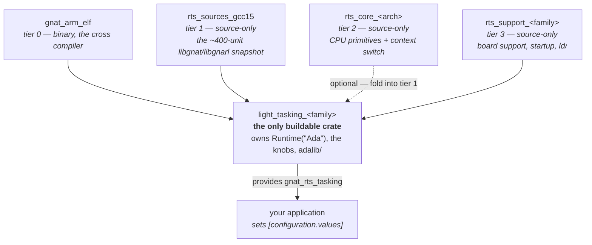

# Building GNAT Bare-Board Runtimes with Alire and GPR

*A guide to replacing a Python runtime generator with a package manager and a build system.*

Today a GNAT runtime for a microcontroller is produced by [bb-runtimes](https://github.com/AdaCore/bb-runtimes): a Python program walks a table of target descriptions and stamps out a directory per (target × profile × board). This guide shows how to get the same set of runtimes using **only Alire manifests, GPR project files, and Ada** — no generation step, no preprocessing, no code that writes code.

The design is not hypothetical. Every mechanism it uses is either in production in a published crate or was measured directly; [RTS.md](RTS.md) is the evidence base and [Appendix B](#appendix-b--numbers-worth-knowing) repeats the numbers that matter most.

---

## In one page

**One idea does most of the work.** A GNAT runtime is a *directory*. GPR can already assemble a directory's worth of sources out of several crates, and Alire can already give a crate typed configuration knobs. Put those together and the generator has nothing left to do.

**One rule decides every boundary question:**

> - **Separate crate** when the variation changes the dependency graph or the exported API.
> - **Configuration variable** when it changes only numbers, addresses, or which sources are selected behind a fixed interface.

**Four things are crates. Everything else is a knob.**

<div style="display: flex;"><div style="flex: 1;">

**Crate**

- the **target** — `arm-eabi`, `riscv64-elf`; it is a different compiler
- the runtime **profile** — `light`, `light-tasking`, `embedded`
- the device-support **family** — one SoC or MCU series
- the shared `libgnat`/`libgnarl` snapshot
</div><div style="flex: 1;border-left: 1px;">

**Configuration**

- device / MCU
- board
- **ISA / ABI** — the counterintuitive one
- memory map, clocks, stack sizes, console, SMP
</div></div>

**The shape.** One binary crate, up to three source-only crates, and exactly one buildable crate:



**Tier 2 is dashed because it is the one boundary that may not be worth having.** Measured on a real runtime it holds **six files against tier 1's ~1050**, and it shares tier 1's release cadence, so start by folding it into tier 1 as a subdirectory and split it out only if an architecture set proves to need its own version stream ([§3](#3-the-crate-hierarchy)). Fold it and the diagram has two source-only crates, which is the recommended shape.

Note also that the profile — `light` versus `light-tasking` versus `embedded` — is a crate boundary but not a *box*: it is **which leaf you are looking at**. The four required crate axes map onto the picture as target → tier 0, snapshot → tier 1, family → tier 3, and profile → the leaf itself. Architecture generation, which tier 2 would carve out, is deliberately absent from that list: it changes sources but no dependent selects on it, so it is a source-selection axis first and a crate only if you want the blast radius ([§2.1](#21-the-three-answers-that-surprise-people)).

**Each bb-runtimes mechanism has exactly one replacement:**

| bb-runtimes does this in Python | You do this instead |
|---|---|
| target-description classes declaring source lists and flags | `[configuration.variables]` in the leaf's manifest |
| filename suffixes (`s-bbbosu__armv7m`) picking a variant | `Source_Dirs` **order** — a directory overlay shadows the generic file |
| `profiles.py` flag closure (`check_deps()`) computing a unit set | one `Source_List_File` per profile, closure evaluated once and committed |
| feature flags deriving other feature flags | static expressions in a `Pure` Ada spec |
| templating `runtime.xml` and linker scripts | `-Wl,--defsym=` for numbers; GPR selection for structure |
| `build_rts.py` assembling a directory | nothing — `Source_Dirs` reaches into the other crates |

**Five things to get right, because each fails silently if you don't.** They are the whole of [§11](#11-the-silent-failures).

1. A duplicate basename resolves by `Source_Dirs` order **with no diagnostic**.
2. A *missing* `ada_source_path` entry breaks the build; a *stale* one is ignored.
3. `pragma Compile_Time_Error` enforces a constraint. A constrained subtype only *warns*.
4. A hardcoded `.cpu` in an assembly file overrides the command line, silently.
5. Only the `.ali` files record what was actually compiled. Project files record intent.

**What you gain.** A board port becomes a crate with a version number instead of a patch to a generator. An unaffiliated maintainer can add a target without forking anything or vendoring 400 files.

**What you pay.** The first build of any application compiles the whole runtime (~8 s for `light`, ~21 s for `embedded`). The compiled result is byte-identical either way — this buys maintenance, not build time.

---

## How to read this

| If you want | Read |
|---|---|
| to decide whether to do this at all | the page above, then [§12](#12-what-is-still-unsolved) |
| to build your first runtime crate | [§1](#1-what-a-runtime-actually-is), [§4](#4-anatomy-of-the-leaf-crate), [§10](#10-a-worked-order-of-work) |
| to understand why it is shaped this way | [§2](#2-the-boundary-rule)–[§3](#3-the-crate-hierarchy) |
| to add a board or a device to an existing crate | [§5](#5-configuration-getting-values-into-sources), [§10.2](#102-adding-a-device-or-a-board) |
| to avoid the traps | [§11](#11-the-silent-failures) — read this one even if you skip everything else |

Every section states the rule plainly first. The **Why** blocks that follow may assume you know GPR attribute semantics, Alire's solver, or Ada's staticness rules; you can skip them and still follow the guide.

---

# Part I — Concepts

## 1. What a runtime actually is

A GNAT runtime for a bare-board target is a **directory**. That is the whole of it:

```
light-cortex-m4f/
├── ada_source_path        # newline-separated list of source DIRECTORIES
├── ada_object_path        # likewise, for objects
├── ada_target_properties  # the target's arithmetic and type model
├── adalib/                # libgnat.a (+ libgnarl.a), one .ali per unit
├── gnat/                  # the runtime sources
└── gnat_config/           #   ... in more than one directory
```

`for Runtime ("Ada") use <dir>` in a project file names exactly one such directory. There is no mechanism by which two crates each contribute half a runtime to a link.

**So every crate hierarchy is a *source*-composition hierarchy that terminates in one crate owning that directory.** That crate is called the **leaf** throughout this guide, and it is the only one Alire ever builds.

### 1.1 Nothing in that directory is shipped compiled

This surprises people, so it is worth stating early: a published runtime crate contains **no `adalib/` and no object files**. It ships sources, the three metadata files, and a library project. The application `with`s that project, so gprbuild compiles the runtime *before* the application and produces `adalib/libgnat.a` on the spot.

That is not a clever trick — it is what the ecosystem already does.

> **Why a library project, and not just extra source directories in the application?** Because the runtime needs a different compilation régime than application code: `-gnatg` (internal GNAT implementation mode), `-nostdinc`, its own `Global_Configuration_Pragmas`, and per-unit switch overrides — `a-except.adb` at `-O1 -fno-inline`, `s-macres.adb` at `-fno-inline`, `system.ads` with `-gnatet=`. None of that may leak onto application units. The library is a build product; only its recipe is shipped.
>
> Two consequences to plan for. The first build of any application pays for the whole runtime. And `adalib/`/`obj/` land *inside the Alire dependency cache* — the build writes into what is otherwise a read-mostly directory.

### 1.2 Tasking profiles are two library projects

`light` is one library project. `light-tasking` and `embedded` add a `gnarl/` source tree and a **second** library project, conventionally `ravenscar_build.gpr`, which `with`s the first and puts `libgnarl.a` into the *same* `adalib`.

Both go in the manifest's `project-files`, and the application must `with` both. `embedded` additionally compiles C (`for Languages use ("Ada", "Asm_Cpp", "C")`) for the unwinder.

So one leaf owns one runtime directory but up to two library projects, **each listing only its own source directories**. That last detail causes a real failure in [§11.2](#112-a-missing-ada_source_path-entry-is-fatal-a-stale-one-is-silent).

### 1.3 Which tool reads which metadata file

You cannot skip these files, and knowing who consumes each one tells you how carefully to get it right:

| File | Read by | If it is absent |
|---|---|---|
| `ada_source_path` | **gnatbind** — and the compiler, for one case below | compilation succeeds, *binding* fails: `gprbind: invocation of gnatbind failed` |
| `ada_object_path` | gnatbind, the linker | build fails outright |
| `ada_target_properties` | GNATprove, CodePeer | ordinary builds are fine; static analysis is not |

The interesting one is `ada_source_path`, because the build has **three** consumers of source location, not two:

- **Application units** get the runtime's source list from the *project* — `Source_Dirs` filtered by the exclusion attributes. Not from `ada_source_path`.
- **Runtime units being compiled** go through `ada_source_path` for two things: a reference to the runtime's *other* library (each library project lists only its own directories, so nothing else can resolve a `libgnat` unit's reference to a `libgnarl` unit), and **locating a subunit** ([§6.3](#63-separate-splits-a-body-across-files)).
- **Binding** reads `ada_source_path` straight from the runtime directory.

So `ada_source_path` is not only a bind-time file, and an incomplete one can fail the *compile*.

> **Why this bites unevenly.** Drop the `gnarl` entries from `ada_source_path` and `embedded` fails at *compile* time — `s-ransee.adb:34:06: error: "Ada.Real_Time" is not a predefined library unit`, which is `System.Random_Seed` in `libgnat` reaching for `Ada.Real_Time` in `libgnarl`. Do the same to `light-tasking` and it builds fine, because its `libgnat` happens to contain no such reference. A truncated path list is therefore a defect whose loudness depends on the profile.

## 2. The boundary rule

> - **Separate crate** when the variation changes the dependency graph or the exported API.
> - **Configuration variable** when it changes only numbers, addresses, or which sources are selected behind a fixed interface.

Apply it as three tests, in order:

1. **Solver test.** Does a *dependent* crate need to select on it? A configuration variable is invisible to dependency resolution, so anything an application must be able to *require* — a tasking runtime, a particular compiler — is a crate.
2. **Version test.** Does it have its own release cadence, provenance, or licence? A snapshot of GCC's `libgnat` is versioned against the compiler. Family support generated from vendor register data is versioned against that data. Different cadences want different crates.
3. **Otherwise** — configuration variable. Numbers, addresses, memory sizes, timer choice, stack sizes, and body selection behind a frozen spec are all knobs.

**The rule is worth stating explicitly because the temptation runs the other way.** bb-runtimes has a *directory* per variation, so it feels natural to make a *crate* per variation. Almost all of those directories are the cross product, not the design.

### 2.1 The three answers that surprise people

**ISA/ABI is a configuration variable, not a crate.** The objection is that the switches live in a static `runtime.xml`. But that file's `<config>` block is GPR source and the stock version already declares `Loader : Loaders := external("LOADER", "ROM")` and switches on it. Anything GPR can compute, it can compute. One source tree builds a consistent hard-float Cortex-M4 and a consistent soft-float Cortex-M3 binary.

The real boundary is one level out: crossing an **architecture generation** (ARMv6-M ↔ ARMv7-M ↔ ARMv8-M) changes the *sources*, because ARMv6-M has no Thumb-2 wide encodings and the ARMv7-M assembly does not assemble. That is a source-selection axis — which is still expressible inside one crate ([§6](#6-choosing-between-source-variants)).

**A board is never a crate.** A board is a crystal frequency, a flash chip, a startup delay, a memory size and a name. It fails the solver test (nothing depends on "the Nucleo-G474RE variant") and it fails the version test (it is a row in a table). Boards are the highest-churn dimension in the whole system; making each one a crate is how you get 60 crates that must be released in lockstep.

**`cert` and `none` are not profiles.** bb-runtimes defines `cert` as `light` plus I/O exceptions minus packing support — a *flag set* over `light`, not a distinct unit set or API. No dependent selects on it. It belongs with the feature flags. `none` is `light` with everything switched off.

> **Where a crate boundary genuinely is required — only three places.** The target (a different compiler crate). The runtime profile (the solver test: an application must be able to require tasking). And the device-support family — not for any mechanical reason, but because support code differs *in kind* between vendors, and one crate spanning every family would make every fix churn every user. Family is where you draw the blast radius.

### 2.2 Declaring a profile so the solver can see it

Profile is a crate, and the mechanism for saying so is `provides`:

```toml
provides = ["gnat_rts_tasking=1.0.0"]
```

The version must be a full three-part semver. The mechanism is in production: seven compiler crates declare `provides = ["gnat=<version>"]`.

**But a virtual name is a constraint, not a selector.** With seven crates providing `gnat`, a bare `gnat = "*"` dependency silently resolves to the *host* compiler. The same would happen to an application depending only on `gnat_rts_tasking` — it would get an arbitrary SoC's runtime. So:

- a **library** crate uses the virtual name to say "I require a tasking runtime", satisfied by whichever concrete runtime the application already pulled in;
- the **application** must still name its runtime crate concretely.

Never let the virtual name be the only runtime-shaped dependency in a solution.

## 3. The crate hierarchy

| Tier | Crate | Holds | Buildable | Verdict |
|---|---|---|---|---|
| 0 | `gnat_arm_elf`, `gnat_riscv64_elf` | the cross compiler | binary | — |
| 1 | `rts_sources_gcc15` | the ~400-unit `libgnat`/`libgnarl` snapshot | **no** | **pays** |
| 2 | `rts_core_cortexm` | `CPU_Primitives` + context-switch asm | **no** | barely — consider folding into tier 1 |
| 3 | `rts_support_<family>` | board support, startup, vectors, linker scripts, register subset | **no** | **pays** |
| leaf | `light_tasking_<family>` | manifest, knobs, metadata, the library projects | **yes** | pays, and must stay thin |

**Tier 1 pays clearly.** One version axis (the compiler), one licence, one provenance — and ~400 units that are otherwise vendored into every single runtime crate, dozens of times over across an index.

**Tier 1 is not one flat directory, though.** Eighteen units differ in *content* between profiles — `a-strsup` and `a-except` among them — and a list of basenames cannot choose between two versions of the same name. So tier 1 exposes a **common directory plus per-profile overlay directories**, mounted ahead of it.

**Tier 2 barely pays.** Partitioning a real runtime puts **six files** in tier 2 against tier 1's ~1050, and one of the six is an empty `pragma Pure` documentation package. The `Threads`/`Time`/`Interrupts`/protected-object units that look like tier-2 material contain no architecture-specific content at all — they call through the `CPU_Primitives` seam. Tier 2 also shares tier 1's release cadence. **Start by folding it into tier 1 as a subdirectory**; split it out only if an architecture set proves to need its own cadence.

**Tier 3 pays.** Its own cadence, generated from vendor register data, shared across all three profiles of a family.

> **Name tier 3 for the family, not the device.** A crate whose variation axis is *family* cannot be named `rts_support_rp2040` without contradicting itself. Measured against two published crates for two different chips in one family: of ~400 units, 378 were byte-identical, and the device-only file names were *disjoint*. Disjoint names need no overlay at all — one directory holds them and each leaf's `Source_List_File` picks its own.

---

# Part II — Building it

## 4. Anatomy of the leaf crate

The leaf is the only crate anyone builds, and everything per-target lands here. Keep it thin.

```
light_tasking_myfamily/
├── alire.toml              # knobs, dependencies, provides
├── runtime_build.gpr       # library project -> libgnat.a
├── ravenscar_build.gpr     # library project -> libgnarl.a  (tasking profiles only)
├── target_options.gpr      # THE one place the ISA/ABI is decided
├── runtime.gnat.lst        # which units go into libgnat
├── runtime.gnarl.lst       # which units go into libgnarl
├── ada_source_path         # generated: the directory list
├── ada_object_path         # "adalib"
├── ada_target_properties   # build product of compiling system.ads with -gnatet=
├── gnat_config/            # Alire's generated config package lands here
└── src/                    # units this leaf genuinely owns
```

### 4.1 The manifest

```toml
name = "light_tasking_myfamily"
version = "0.1.0"
licenses = "GPL-3.0-or-later WITH GCC-exception-3.1"
project-files = ["runtime_build.gpr", "ravenscar_build.gpr"]

#  A tasking floor, so the solver can be told about it (§2.2).
provides = ["gnat_rts_tasking=1.0.0"]

[[depends-on]]
gnat_arm_elf = "^15"          # the compiler is a real dependency, not a PATH assumption
rts_sources_gcc15 = "^15.1"
rts_support_myfamily = "^1.0"

[configuration]
output_dir = "gnat_config"    # see §5.1 -- this is deliberate, not a default
generate_c = false

[configuration.variables]
Device       = { type = "Enum", values = ["mcu_a", "mcu_b"], default = "mcu_a" }
Board        = { type = "Enum", values = ["generic_board", "devkit_a"], default = "devkit_a" }
Flash_Size_KB = { type = "Integer", first = 256, last = 16384, default = 2048 }
Main_Stack_Size = { type = "Integer", first = 1024, default = 16384 }
```

Two habits that pay for themselves:

- **Prefer `Enum` over `String`.** `Device = { type = "String" }` sends a typo straight to the compiler as an unknown `-mcpu=`; an `Enum` makes Alire reject it. The same applies to memory-size selectors: an `Enum` of the five valid letters beats a free string that ends up in a path.
- **Prefer `Integer` over an `Enum` of numbers.** If the value is a number, let it be one — see [§7](#7-linker-scripts-and-other-non-ada-artifacts) for what happens when a number is enumerated as a set of directories instead.

### 4.2 The library project

```ada
with "rts_sources_gcc15.gpr";           --  found via Alire's GPR_PROJECT_PATH
with "rts_support_myfamily.gpr";
with "gnat_config/light_tasking_myfamily_config.gpr";
with "target_options.gpr";

project Runtime_Build is

   for Languages use ("Ada", "Asm_Cpp");
   for Target use "arm-eabi";
   for Runtime ("Ada") use Project'Project_Dir;   --  this crate IS the runtime

   for Library_Name use "gnat";
   for Library_Kind use "static";
   for Library_Dir  use "adalib";
   for Object_Dir   use "obj";

   --  ORDER IS LOAD-BEARING (§6.1): board shadows core shadows shared.
   --  gnat_config and src belong to this leaf and win over all of them.
   for Source_Dirs use
     ("gnat_config", "src",
      Rts_Support_Myfamily.Src_Dir,
      Rts_Sources_Gcc15.Gnat_Light_Dir,     --  the per-profile overlay (§3)
      Rts_Sources_Gcc15.Gnat_Dir);          --  the common snapshot

   --  Membership, separately from visibility (§6.2).
   for Source_List_File use "runtime.gnat.lst";

   RTS_ADAFLAGS := Target_Options.ALL_ADAFLAGS & ("-gnatg", "-nostdinc");

   package Compiler is
      for Default_Switches ("Ada")     use RTS_ADAFLAGS;
      for Default_Switches ("Asm_Cpp") use Target_Options.ALL_ASMFLAGS;

      --  Per-unit overrides. NOTE: these do NOT inherit Default_Switches (§8).
      for Switches ("a-except.adb") use RTS_ADAFLAGS
        & ("-g", "-O1", "-fno-inline", "-fno-toplevel-reorder");
      for Switches ("s-macres.adb") use RTS_ADAFLAGS & ("-fno-inline");
      for Switches ("system.ads")   use RTS_ADAFLAGS
        & ("-gnatet=" & Project'Project_Dir & "ada_target_properties");
   end Compiler;

   Linker_Switches :=
     ("-L", Rts_Support_Myfamily.Ld_Dir, "-T", "common-ROM.ld")
     & Target_Options.ISA_Switches
     & ("-nostartfiles", "-nolibc",
        "-Wl,--defsym=__stack_size=" & Config.Main_Stack_Size);

end Runtime_Build;
```

### 4.3 How a source-only crate exports its sources

A tier crate is never compiled by Alire. It ships an `abstract` project whose only job is to hand out paths:

```ada
--  rts_sources_gcc15.gpr, in the tier-1 crate
abstract project Rts_Sources_Gcc15 is
   for Source_Dirs use ();                        --  this project builds nothing
   Gnat_Dir       := Project'Project_Dir & "libgnat";
   Gnat_Light_Dir := Project'Project_Dir & "libgnat-light";
   Gnarl_Dir      := Project'Project_Dir & "libgnarl";
end Rts_Sources_Gcc15;
```

Set `auto-gpr-with = false` in its manifest so Alire does not auto-`with` it into the root project.

That is the whole build-side composition: **no file is copied anywhere.** `Source_Dirs` reaches directly into the dependency's directory, wherever Alire put it.

> **Why `Project'Project_Dir` and not a relative path.** Alire places crates in hash-keyed directories under `~/.local/share/alire/builds/<crate>_<version>_<id>/<hash>/`, and `[[pins]]` relocates them entirely during development. `Project'Project_Dir` is resolved by gprbuild at build time and is correct in both cases; a relative path is correct in at most one.

### 4.4 The application's side of the handshake

```ada
with "runtime_build.gpr";
with "ravenscar_build.gpr";
with "target_options.gpr";

project My_App is
   --  Restated because gprbuild reads these ONLY from the root project.
   for Target use Runtime_Build'Target;
   for Runtime ("Ada") use Runtime_Build'Runtime ("Ada");

   --  Renaming, not restating: the ABI is decided once, in the runtime crate.
   package Builder renames Target_Options.Builder;

   package Linker is
      for Switches ("Ada") use
        Runtime_Build.Linker_Switches & ("-Wl,--gc-sections");
   end Linker;
end My_App;
```

Three lines of convention, and [§8](#8-switches-without-runtimexml) explains why each is unavoidable.

## 5. Configuration: getting values into sources

### 5.1 Point Alire's generated package at a runtime source directory

```toml
[configuration]
output_dir = "gnat_config"
```

List `gnat_config` in both `ada_source_path` and the library project's `Source_Dirs`, and Alire's generated `<crate>_config.ads` becomes an ordinary runtime unit that runtime sources may `with`. **No templating, no substitution pass** — this is the single move that removes most of the generator's reason to exist.

> **On the directory name.** Published crates point `output_dir` at `gnat_user`, and `gnat_user`/`gnarl_user`/`ld_user` are the directories GNAT's own runtimes reserve for *users* to drop in overriding sources. Pointing generated configuration at one is a pun on a hook that then no longer serves its purpose. Use `gnat_config` (and `gnarl_config` where a second library project needs one). The `gnat`/`gnarl` half is load-bearing — it says which library project claims the units, and a unit cannot belong to two. Keep hand-written files out of it so the whole directory can be gitignored.

### 5.2 Add a renaming shim so shared sources can `with` a stable name

Alire names the generated package after the crate, and the crate name embeds the profile: `light_myfamily_config` versus `light_tasking_myfamily_config`. Shared sources cannot `with` a name that varies. One file per leaf fixes it:

```ada
pragma Restrictions (No_Elaboration_Code);
with Light_Tasking_Myfamily_Config;
package Myfamily_Runtime_Config renames Light_Tasking_Myfamily_Config;
```

Every shared source `with`s the stable name. **This shim is what makes source sharing across leaves possible at all.** Keep it in `src/`, not in the generated directory.

### 5.3 Derive in Ada, not in a generator

bb-runtimes computes feature-flag closure in Python. Alire has no derivation mechanism — no computed defaults, no cross-variable constraints — and does not need one. Derivation belongs in a `Pure` Ada spec, where static expressions do the work and the type system checks it:

```ada
Reference : constant Hertz :=
  (if Has_XOSC then Myfamily_Runtime_Config.XOSC_Frequency else ROSC_Frequency);

Clk_Sys_Frequency : constant Hertz :=
  ((Reference / Config.PLL_Reference_Div) * Config.PLL_VCO_Multiple)
    / (Config.PLL_Post_Div_1 * Config.PLL_Post_Div_2);
```

You now have **two-stage validation**, and the second stage is something no package manager could offer:

- Alire's types check each knob in isolation — `PLL_VCO_Multiple` must be `16 .. 320`.
- Ada checks the *consequences* — whether the resulting frequency overclocks the part, which depends on four knobs at once.

### 5.4 Enforce with `pragma Compile_Time_Error` — subtypes only warn

**This is the most important single line in the guide.** A constrained subtype looks like it enforces a constraint. It does not:

```ada
--  WRONG: this compiles, with warnings, and bricks the board.
subtype Clk_Range is Hertz range 1 .. 133_000_000;
Clk : constant Clk_Range := Bad_Value;   --  warning: Constraint_Error will be raised
```

An out-of-range static value yields only *warnings* — `value not in range of type`, `Constraint_Error will be raised at run time` — **and the build succeeds**. A violated `Static_Predicate` is likewise only a warning. Under a `light` profile with `No_Exception_Propagation`, that surviving build reaches `Last_Chance_Handler` during startup: a silently bricked board from a mistyped divider.

```ada
--  RIGHT: this stops the build.
pragma Compile_Time_Error
  (PLL_VCO_Freq not in PLL_VCO_Range,
   "Invalid PLL configuration. PLL VCO output frequency must be in the"
     & " range 96 .. 344 MHz");
```

So the pattern is: **constrained subtypes to document intent, `pragma Compile_Time_Error` to enforce it.** Adding `-gnatwe` to the runtime's own switches promotes the subtype warnings to errors as well, and is cheap hardening.

Use the same pragma to reject *ignored* knobs, which are otherwise silent:

```ada
pragma Compile_Time_Error
  (Config.Board /= Generic_Board and then Config.XOSC_Frequency /= 0,
   "XOSC_Frequency is ignored unless Board is generic_board");
```

> **Two traps in `Compile_Time_Error` itself.** The condition must be a **flat, independent, named scalar constant** — an indexed or selected non-static expression silently never fires, which is a check that looks like assurance and is not. And the unit holding it must be named in the leaf's `Source_List_File`, or it is never compiled at all ([§6.2](#62-source_list_file-decides-membership)).

### 5.5 The three device/board levels

Boards and devices are knobs, arranged as three levels that narrow:

1. **Device** — `Device = { type = "Enum", values = [...] }`. Picks the interrupt-name package, the memory map, the peripheral set.
2. **Board** — `Board = { type = "Enum", values = ["generic_board", "devkit_a", ...] }`. Picks crystal, flash chip and startup delay for a known board in one setting.
3. **Individual knobs** — honoured only when `Board = generic_board`, for a custom board no enumeration will ever list.

Per-board tables are static `case` expressions over the `Board` enumeration in that same `Pure` spec, so adding a board is a diff to one file. Per-device unit selection uses the `Naming` package:

```ada
for Spec ("Ada.Interrupts.Names") use "a-intnam-" & Config.Device & ".ads";
```

and the unselected variants go in `Excluded_Source_Files`. All of this is production code in a published crate today.

**What N devices in one crate costs:** N interrupt-name specs, N memory maps, an N-way `case` — all excluded from the build except the selected one, so the compiled artifact is unchanged. Adding a board is a row in an enumeration plus a row in each `case`.

## 6. Choosing between source variants

A runtime carries the same unit in several forms — per profile, per word size, per console, per FPU. Four mechanisms choose between them, and they differ in **granularity**, which is what decides whether a given variation can use them at all:

| Mechanism | Granularity | Cannot express |
|---|---|---|
| `Source_Dirs` order / overlay directories | **directory** | nothing — but duplicates the whole unit |
| `Source_List_File` | **file** | content differences; it names basenames |
| `separate` (subunits) | **subprogram** | anything in a **spec** |
| static test in the body | **expression** | variation the unit cannot see a constant for |

**Reach for the finest one the variation allows.** A directory pair duplicates an entire unit to vary a line; a subunit duplicates one subprogram; an in-body test duplicates nothing.

### 6.1 `Source_Dirs` order replaces the filename suffixes

Where the same basename appears under two `Source_Dirs` values, the *earlier* one wins. Order the directories board → architecture → shared, and a board-specific `s-bbbosu.adb` shadows the architecture-generic one with **no filename suffix and no exclusion list**. That is bb-runtimes' `__armv7m` convention, natively.

**The hazard is in the same sentence: no error is reported.** See [§11.1](#111-silent-basename-shadowing).

### 6.2 `Source_List_File` decides membership

`Source_List_File` names the basenames that go into *this* library. Two properties matter:

- bb-runtimes' per-profile unit sets — the `profiles.py` flag closure — port over directly as list contents. Evaluate the closure once, commit the list, and it becomes a reviewable manifest instead of a Python computation.
- **A unit present on the source path but named by no list is inert.** Not compiled, not in the library, costs nothing.

That second property is what lets *one directory serve two profiles, or even two different libraries*, with membership decided per project rather than by where the file sits. It is also why a unit being merely *visible* to another profile is harmless.

### 6.3 `separate` splits a body across files

Subunits are idiomatic in this codebase, not exotic — twelve units in a real runtime tree are already subunits, including one whose parent spec sits in the shared snapshot while only the subunit varies by word size.

**Its limit is exact: subunits exist for bodies, not specs.** Of six units that vary between `light` and `embedded`, five vary in the *spec*, so exactly one could use it.

**And a subunit is found differently from every other source file** — this is measured, and it is the one thing about `separate` that will surprise you. A subunit is *not* named in `Source_List_File`; the compiler locates it by searching `ada_source_path` while compiling its parent. So a directory that holds only subunits must be in `ada_source_path` even though no list mentions its contents, and dropping it produces a diagnostic that names the *wrong* unit:

```
s-dourea.adb:51:04: warning: subunit "System.Double_Real.Product" in file "s-dorepr.adb" not found
compilation of s-exponr.adb failed
```

A **warning** on the parent, then a hard failure on a third unit that merely depends on it. If you use `separate` to factor a variant, treat `ada_source_path` completeness as part of the mechanism, not as bind-time bookkeeping.

> **Why that limit bites hardest where the prize is largest.** `a-strsup`'s spec and body total ~5000 lines and differ by **23** — and every one of those lines is the Ada 2022 `Put_Image` chain: a `with`, an aspect on the type, a declaration, and an eleven-line body. The body is a textbook subunit candidate; the spec is not. You cannot stub out a subprogram the light spec never declares, and an aspect cannot be conditional. Ada offers nothing below file granularity for a spec, so ~5000 lines stay duplicated to vary 23.

### 6.4 A static test in the body needs no extra file at all

Upstream already does this:

```ada
if RTS_Capabilities.Has_Hw_Sqrt_Single then
   return Fpu_Sqrt (X);           --  one instruction
end if;
...                              --  the software estimate, untouched
```

Two things make it safe, and both were checked rather than assumed. The branch is folded in the **front end**, not by the optimiser — the same unit compiles for a target without the instruction at `-O0`. And a capability supplied as a **static Boolean** folds more reliably than comparing `Standard'Target_Name`, because equality on an enumeration is RM-static while whole-string equality is not.

**This is the only mechanism with per-*file* reach**, which matters more than it sounds. A Cortex-M4F or M33 has single-precision hardware square root but *not* double. Two constants in two bodies say that directly; a directory pair cannot, because it selects both units together.

Its cost is the mirror image of `separate`'s: the constant must be **visible** to the unit that tests it. A unit shared between targets cannot `with` a per-target configuration package, so it needs one stable name every leaf provides — and if the unit is `Pure`, that package must be `Pure` too:

```ada
--  <leaf>/src/rts_capabilities.ads -- one per leaf, stable name
with Light_Tasking_Myfamily_Config;
package RTS_Capabilities is
   pragma Pure;
   Has_Hw_Sqrt_Single : constant Boolean := False;
   Has_Hw_Sqrt_Double : constant Boolean := False;
end RTS_Capabilities;
```

## 7. Linker scripts and other non-Ada artifacts

Linker scripts and boot stages cannot read an Ada spec. Two mechanisms cover them, and the line between them is **numbers versus structure**:

| Varies | Mechanism | Because |
|---|---|---|
| a value — length, base, alignment | `-Wl,--defsym=` | `ld` accepts a symbol wherever it accepts a constant |
| a *shape* — which files, which sections, what order | selection in GPR | no symbol can add an output section or swap a boot blob |

### 7.1 A file per value is the failure mode to avoid

It is easy to fall into, because the value often *looks* enumerable:

```ada
--  DON'T: four committed directories for one number
Linker_Switches := ("-L", Project'Project_Dir & "/ld/flash-" & Flash_Size, ...);
```

That pattern, in a published crate, is `ld/flash-{2,4,8,16}/memory-map.ld`, 46 lines each, and **exactly one line differs between any two of them**: the `LENGTH` of the flash region. 184 lines carrying one line of information.

```
--  DO: one script, one symbol
flash (rx) : ORIGIN = 0x10000000, LENGTH = FLASH_LENGTH
```

`--defsym` accepts `ld`'s own size suffixes, so the switch is `-Wl,--defsym=FLASH_LENGTH=2048K` with no unit conversion anywhere. `ORIGIN` takes a symbol the same way, and derived symbols follow — `__heap_end` comes out at exactly `ORIGIN + LENGTH`. A region at `LENGTH = 0` is legal, which makes zero a natural encoding for "absent" and turns any placement there into a link error.

**The rule is "a symbol for what *varies*", not "a symbol for every number."** On-chip SRAM is a property of the die; external flash is a board choice. Only one of those is configuration.

### 7.2 The genuine selection case is content

```ada
case Flash_Chip is
   when "at25sf128a" | "gd25q64c" =>
      Excluded_Sources := ("boot2-generic_03.S", "boot2-w25qxx.S");
   when others =>
      Excluded_Sources := ("boot2-generic_03.S", "boot2-generic_qspi.S");
end case;
for Excluded_Source_Files use Excluded_Sources;
```

Same configuration variable, same `case`, different mechanism — a second-stage bootloader for a different QSPI part is not a number.

### 7.3 Two things `ld` will not do for you

- **It checks overflow, never overlap.** A section too large for its region is reported precisely; two regions *declared* overlapping by 32 KB produce no diagnostic at all. Overlap has to be checked in Ada.
- **It does not enforce the region attributes.** The `(rx)` above binds only *orphan* sections. With an explicit `> region`, writable data placed in an `(rx)` region links with exit 0. Those letters are documentation.

What `ld` *will* enforce on request is an explicit `ASSERT`, which is how a placement rule becomes a link error instead of a comment:

```
ASSERT (LENGTH (flash) >= 2M, "FLASH_LENGTH is smaller than any shipped part")
```

## 8. Switches without `runtime.xml`

**Do not use `runtime.xml`. Delete it and put the switches in GPR.**

Be clear about what this decision does *not* rest on: `runtime.xml` **works**, and a published crate relies on it in production. The choice is between two working mechanisms, and it turns on fit:

| | `runtime.xml` | pure GPR |
|---|---|---|
| Reach | every unit in the tree, unforgettable | root-project `Builder`, or each project's `Compiler` |
| Driven by Alire configuration | **no** — `external()`/`-X` only | **yes**, via the generated config project |
| Languages to maintain | two (XML wrapping GPR) | one |
| Failure mode of a typo | **silently ignored entirely** | GPR syntax error, build stops |

**The second row is decisive.** A gprconfig `<config>` fragment cannot `with` the crate's generated configuration project, so every value in it must arrive as an `external()`. Your Alire configuration variable and the switch it is supposed to control become two independent facts kept in step by hand — and the fourth row is what makes that expensive to debug. In one case a leaf with a correct configuration value still produced wrong-ABI images because a second, independent default in `runtime.xml` was nominally in charge.

### 8.1 The replacement

One project decides the ISA, folds it into the runtime's own flags, and exports a `Builder` package:

```ada
abstract project Target_Options is
   with "gnat_config/light_tasking_myfamily_config.gpr";

   --  DERIVE ONCE. Every other project re-exports; none reassigns.
   Cpu := "cortex-m4";
   Fpu := ("-mfloat-abi=hard", "-mfpu=fpv4-sp-d16");
   case Config.Device is
      when "mcu_a" => Cpu := "cortex-m4"; Fpu := ("-mfloat-abi=hard", ...);
      when "mcu_b" => Cpu := "cortex-m0plus"; Fpu := ("-mfloat-abi=soft");
   end case;

   ISA_Switches := ("-mcpu=" & Cpu, "-mthumb", "-mlittle-endian") & Fpu;

   --  Must reach EVERY unit, application included. See the warning below.
   Global_Ada_Switches := ISA_Switches & ("-fno-tree-loop-distribute-patterns");

   ALL_ADAFLAGS := ADAFLAGS & COMFLAGS & ISA_Switches;

   package Builder is
      for Global_Compilation_Switches ("Ada")     use Global_Ada_Switches;
      for Global_Compilation_Switches ("Asm_Cpp") use ISA_Switches;
   end Builder;
end Target_Options;
```

The application renames that package. It cannot restate it, and no other mechanism has the reach:

| Mechanism | Reach | Verdict |
|---|---|---|
| `Compiler'Leading_Required_Switches` in an ordinary project | none — **silently ignored** outside a configuration project | unusable |
| `Builder'Global_Compilation_Switches` in the **root** project | whole closure, including dependency library projects and per-file `Switches` overrides | **use this** |
| `Builder'Global_Compilation_Switches` in a **dependency** project | none — read only from the root | unusable |
| `Compiler'Default_Switches` in the runtime's own project | its own sources, **except** units with a per-file `for Switches` override | insufficient |

> **That last row is a real trap.** The library project has seven per-file overrides. Adding the ISA flags to `Default_Switches` leaves every one of those units without them, because `Switches` does not inherit `Default_Switches`. Fold the ISA into the variable that *all* the override lines concatenate — `RTS_ADAFLAGS` in [§4.2](#42-the-library-project) — and the problem disappears.

### 8.2 Three things a migration loses if it is careless

1. **`-fno-tree-loop-distribute-patterns`.** `runtime.xml` carried this to *applications*, not just the runtime. Without it GCC may rewrite a loop into a `memcpy`/`memset` call that a bare-metal runtime does not provide. It must go into whatever replaces the file's global reach. A migration that transcribes only the ISA switches loses it silently.
2. **`embedded`'s link group.** `embedded`'s `runtime.xml` adds `-Wl,--start-group,-lgnarl,-lgnat,-lc,-lgcc,--end-group` to resolve a genuinely circular dependency. Transcribing `light`'s linker content verbatim yields ~30 undefined references to `memcpy`, `memset`, `memmove`, `memcmp`. `light-tasking` needs no group.
3. **`embedded` needs `Global_Compilation_Switches ("C")`** as well as `("Ada")` and `("Asm_Cpp")`, because its library project compiles C.

### 8.3 Why the ABI is safe even though the rename is forgettable

Because `target_options.gpr` compiles the runtime library from its *own* derived ISA, an application with a mismatched ABI **cannot link**:

```
ld: libgnat.a(a-elchha.o): can't link soft-float modules with double-float modules
```

That is a witness by construction, not a check someone has to remember to run. The residual exposure is narrow: it applies only where the intended ISA happens to equal the compiler default *and* there is no float-ABI difference to disagree about — in which case the accidental build and the correct build are the same bytes.

**A pure *instruction-set* difference at the same float ABI is not caught**, and that is the one genuinely open gap ([§12](#12-what-is-still-unsolved)).

## 9. Verifying what you actually built

**Read the `.ali` files. Nothing in the project files is evidence.**

`Source_Dirs` records where gprbuild *looked*. `Source_List_File` records what it was *allowed* to select. Neither says which file was compiled — and [§11.1](#111-silent-basename-shadowing) guarantees that a wrong answer is silent.

Each `.ali` in `adalib/` carries:

- a `U` line naming its unit,
- `D` lines naming **every source it depended on, with timestamp and checksum**,
- `A` lines giving the exact switches, including `--RTS=`.

So the list of `.ali` files *is* the unit set, and the `D` lines *are* the provenance. Treat the `Source_List_File` as the claim and the `.ali` set as the evidence.

Useful cross-checks beyond that:

| Question | Command |
|---|---|
| did the ABI come out as intended? | `readelf -A` — `Tag_CPU_arch`, `Tag_ABI_VFP_args`, `Tag_RISCV_arch` |
| which crate versions supplied the sources? | `alr show --solve` |
| is this `-march`/`-mabi` pair actually supported? | `gcc -print-multi-directory`; if it answers `.`, the link will fail |
| are two separately linked images colliding? | compare `readelf -lW` `PT_LOAD` segments — `ld` cannot see across two links |

---

# Part III — Practice

## 10. A worked order of work

### 10.1 Standing up the first crate

1. **Pick one concrete target × profile × family** and get it building end to end before generalising anything. Resist adding a second device until the first links.
2. **Create the tier-1 crate** as a snapshot of the installed toolchain's runtime sources. Split it into a common directory plus one overlay directory per profile you intend to support ([§3](#3-the-crate-hierarchy)). Put the architecture core — `CPU_Primitives` and the context-switch assembly — in a subdirectory of *this* crate rather than a tier-2 crate of its own; that is six files, and you can always split them out later if they turn out to need their own version stream.
3. **Create the tier-3 crate** for the family: `Board_Support` body, `Board_Parameters`, `MCU_Parameters`, startup, vector table, linker scripts, the private register subset. Name it for the family.
4. **Create the leaf** with the layout in [§4](#4-anatomy-of-the-leaf-crate). Start with *no* configuration variables — hardcode everything — and get an ELF out.
5. **Write `runtime.gnat.lst`** by listing what the shipped runtime actually contains. Derive it from the `.ali` files of a build against the stock runtime, not from a directory listing.
6. **Now introduce knobs, one at a time**, and after each one check the artifact still matches ([§9](#9-verifying-what-you-actually-built)).
7. **Delete `runtime.xml` last**, once the ISA derivation in `target_options.gpr` is known good — so that if the artifact changes you know which change did it.

### 10.2 Adding a device or a board

A board should be: one row in an `Enum`, one row in each `case` expression in the board-parameters spec. Nothing else.

A device is that, plus one interrupt-name spec and possibly one linker script. **Neither touches a manifest, a dependency, or the index.** If you find yourself editing a dependency, the boundary is in the wrong place — re-read [§2](#2-the-boundary-rule).

### 10.3 Consolidating what already exists

The chip-agnostic runtimes are the cheapest win, because they have no support layer and no peripheral registers at all — the *only* thing distinguishing them is the switch set plus a few architecture-generation source variants.

- **ARM.** Eleven installed `light-cortex-m*` directories become one crate with two knobs. **Prerequisite:** delete the five hardcoded `.cpu cortex-m4` directives in the assembly sources ([§11.4](#114-a-hardcoded-cpu-overrides-the-command-line)), or the ISA knob silently produces mixed-ISA binaries.
- **RISC-V.** Twelve directories become one, with no source obstacle at all — the assembly carries no ISA directives. **Prerequisite:** an honest `Enum` of `-march`/`-mabi` pairs that *resolve* to a libgcc multilib. Query `-print-multi-directory` and reject any pair that answers `.`; that set is a strict superset of the installed directories, because GCC's multilib reuse table maps many `-march` values onto one directory.

> **On RISC-V, an application may widen `-march` but the runtime must never narrow it.** Because the ISA arrives as leading switches and gcc takes the *last* `-march`, an application can add extensions for its own units and `ld` merges the attributes to the union. That is a safe escape hatch for a toolchain gap. Setting the *runtime's* `-march` below what the silicon is would silently deny the runtime instructions it depends on — and on a tasking profile the protected-object and interrupt-masking paths are exactly where lost atomics would matter, with nothing to diagnose it.

## 11. The silent failures

Everything in this section produces a working-looking build. Read it once, and come back to it when something is inexplicably wrong.

### 11.1 Silent basename shadowing

Where the same basename appears in two `Source_Dirs`, the earlier wins and **no error is reported**. Get the order wrong, or leave a stale file where a variant should be, and you compile different text with no diagnostic at all.

Mitigations: keep the order comment in the project file (`ORDER IS LOAD-BEARING`), and check the `.ali` `D` lines when it matters. If you have a populate or vendoring step, make it **prune** rather than merely copy — a stale file left behind by a rename is exactly this failure.

### 11.2 A missing `ada_source_path` entry is fatal, a stale one is silent

Completeness is checked; correctness is not. Adding a nonexistent directory to `ada_source_path` changes nothing and warns about nothing — a published crate lists a `gnat_user` directory that does not exist and builds regardless. Removing a real one fails, but *where* it fails depends on what happened to be in it:

| What you did to `ada_source_path` | What happens |
|---|---|
| added a directory that does not exist | nothing, silently — `gnatls -v` prints it, the build ignores it |
| removed a directory holding only ordinary units | `gprbind: invocation of gnatbind failed`, after everything compiled |
| removed a directory holding a **subunit** | a *warning* on the parent unit and a *compile error* on a third unit ([§6.3](#63-separate-splits-a-body-across-files)) |
| removed the `gnarl` entries | `embedded` fails to compile; `light-tasking` builds fine ([§1.3](#13-which-tool-reads-which-metadata-file)) |

Three different failure sites for one kind of mistake, and one of them is no failure at all. Generate this file rather than hand-maintaining it, and generate it from the same paths the project file already resolves.

### 11.3 A constrained subtype does not enforce anything

See [§5.4](#54-enforce-with-pragma-compile_time_error--subtypes-only-warn). An out-of-range static constant is a warning and a successful build; under `No_Exception_Propagation` it becomes a startup failure on real hardware.

### 11.4 A hardcoded `.cpu` overrides the command line

Five assembly files in the ARM sources carry `.cpu cortex-m4`, which GNU `as` honours over `-mcpu`. The Ada objects move with the switch and those five do not, producing a **linked ELF with no diagnostic at all**. `.syntax unified` stays; `.cpu` goes. Hardcoding the ISA in a source file is simply a bug in a crate that intends to be ISA-configurable.

### 11.5 Two leaves that look alike will diverge

The tiers above the leaf are easy to reason about. The leaves are where this rots. Three hand-written `target_options.gpr`/`runtime_build.gpr`/manifest sets are near-copies — close enough that nobody diffs them, different enough that a divergence reads as intentional.

In one spike that produced a real defect: a leaf silently re-derived the ISA, hardcoded to hard-float, overriding what its own configuration implied, and every build of that profile was wrong until the files were compared line by line.

Two rules, both cheap:

- **Derive once.** One site computes the ISA; every other project re-exports it and is forbidden to reassign it.
- **Share overlays by content, not by name.** Two profiles that agree on a unit mount *one* directory, with an automated check that they still agree. And place the spec and the body independently — they do not have to vary together, and often only one of them does.

Generate the leaves if you can. Hand-writing them is the assumption most likely to fail.

### 11.6 `for Switches` does not inherit `Default_Switches`

See [§8.1](#81-the-replacement). Every per-unit override silently loses whatever you added to `Default_Switches`.

## 12. What is still unsolved

Be honest about these before committing to the design.

1. **Emitting `ada_source_path` is the one genuinely unproven mechanism.** Everything else in this guide is either published practice or directly measured. The leaf must write this file before binding, with paths only known after dependency resolution. `post-fetch` runs before configuration values exist; `pre-build` ordering across a dependency graph needs verifying against your Alire version. Note how small the problem has become — emitting three lines of text, not staging 400 files.
2. **Staleness of that file.** If only tier 1's version changes, the leaf is not refetched, so a `post-fetch`-emitted list goes stale and binding fails against the old path. This argues for `pre-build`, or a content check.
3. **Source-only crates are unidiomatic.** Tiers 1–3 cannot be compiled by Alire at all — they need `-gnatg -nostdinc`, the cross compiler, and no runtime to compile against, which is a bootstrap cycle. The `abstract`-project pattern works, but `alr build` inside such a crate is a no-op and the usual hygiene (`alr gnatprove`, `alr test`, unit CI) does not apply. Expect to argue the pattern upstream.
4. **Rebuild granularity.** Any configuration change alters Alire's build hash and rebuilds all ~400 units. Same cost as today, but newly visible as a penalty on a one-line clock-tree tweak.
5. **A `with`ed project cannot force switches on its dependents.** This is a gap in GPR, not a design choice. `Compiler'Leading_Required_Switches` has exactly the right semantics but is configuration-project-only; `Builder'Global_Compilation_Switches` has the reach but is root-project-only. So the runtime guarantees its own library's ABI and must *ask* the application to opt in ([§8.3](#83-why-the-abi-is-safe-even-though-the-rename-is-forgettable)).
6. **Certification.** Silent shadowing plus sources arriving from three separately versioned crates complicate "show me exactly what is in this runtime." The mitigation has three parts and only the third is evidence: the `Source_List_File` states the intended unit set, `alr show --solve` states which crate versions supplied it, and **the `.ali` files record what was actually compiled**. Point an auditor at the `.ali` set. Whether that suffices for qualification is a question for someone who has taken a runtime through it.
7. **Versioning tier 1 against FSF GCC releases** needs a real story. It is a snapshot of someone else's tree.

### The strongest counterargument

The hierarchy buys nothing at *build* time — the compiled artifact is identical either way. It buys maintenance-time sharing, and that can also be achieved without a package manager at all: [community-bb-runtimes](https://github.com/damaki/community-bb-runtimes) carries upstream bb-runtimes as a git submodule plus per-target overlay directories and a script that stamps out self-contained crates. The sharing happens *upstream* of Alire, every published crate is flat and independent, and there is one moving part instead of four.

What the crate hierarchy adds over that is narrower than it looks, but real:

- **Third-party targets.** A submodule-and-overlay generator shares sources only among targets inside one repository. A tier-1 crate lets an unaffiliated maintainer add a board without forking the generator or vendoring 400 files.
- **Independent version bumps.** A GCC upgrade becomes a dependency bump in each leaf's manifest, not a regeneration of every published crate.
- **Visible provenance.** `alr show --solve` reports which snapshot a runtime was built from — which matters when the runtime is the artifact under audit.

If none of those three is worth anything to you, the submodule approach is a perfectly defensible answer to the same problem.

---

## Appendix A — Prior art worth reading before you start

| Project | What to take from it |
|---|---|
| [bb-runtimes](https://github.com/AdaCore/bb-runtimes) | The variation axes, and the realisation that `support/rts_sources/profiles.py` is *already* a flag-plus-derivation system rather than a set of unit lists — which is why it ports to configuration variables cleanly |
| [community-bb-runtimes](https://github.com/damaki/community-bb-runtimes) | Runtime-as-Alire-crate at production quality: one crate per target × profile, all device/clock/stack variation as configuration variables, seven MCU families. The source of most techniques in [§5](#5-configuration-getting-values-into-sources) — and the strongest counterargument to this whole design |
| [AVRAda_RTS](https://github.com/RREE/AVRAda_RTS) | The minimal end: a whole ZFP runtime in one crate, no `runtime.xml` at all, ISA flags in a `*_tool_options.gpr` applied by the consumer through `Builder'Global_Compilation_Switches`. This is [§8](#8-switches-without-runtimexml) in production, which is why it is a real option rather than a thought experiment |
| [startup-gen](https://github.com/AdaCore/startup-gen) | That memory maps and startup code are generatable artifacts, not hand-maintained per chip |

## Appendix B — Numbers worth knowing

Anecdotal, from experiments on `alr 2.1.0` with `gnat_arm_elf` and `gnat_riscv64_elf` 15.1.2 on macOS/Apple Silicon. Full method and command output are in [RTS.md](RTS.md) Appendix A; these are the figures that changed a design decision.

**On how much duplication there is to remove**

- ~400 `libgnat`/`libgnarl` units are vendored into *every* published runtime crate. One installation carries ~60 runtime directories.
- Eleven chip-agnostic ARM `light-cortex-m*` runtimes reduce to **one crate with two knobs**. Twelve RISC-V `light-rv*` runtimes reduce to **one**. Fingerprinting the RISC-V trees collapses those twelve directories to **six distinct source trees** — four of the twelve share one byte-identical tree.
- Across two devices in one family, **378 of ~400** tier-3 units were byte-identical, 5 differed, and the device-only names were disjoint.
- Tier 2, measured honestly: **six files against tier 1's ~1050** — and one of the six is an empty `pragma Pure` documentation package.

**On duplication that is *not* divergence**

- `a-strsup` holds **~5000 lines twice to vary 23**, and all 23 lines are the `Put_Image` chain. Meanwhile `a-except` and `a-tags` are 79–95 % different — genuinely separate implementations. Duplication and divergence are unrelated, so measure before you factor.
- The published flash-size linker scripts: **four directories, 46 lines each, one line different.** 184 lines carrying one line of information.

**On things that fail silently**

- Two `MEMORY` regions declared overlapping by 32 KB: **no diagnostic whatsoever.** A section too large for its region, by contrast, is reported to the byte.
- Writable data placed with an explicit `> region` into a region declared `(rx)`: **links, exit 0.**
- An out-of-range static constant in a constrained subtype: **warning, successful build.** A violated `Static_Predicate`: also a warning.
- Forcing `-mcpu=cortex-m3` on the Ada units while five assembly files hardcode `.cpu cortex-m4`: **a linked ELF with no diagnostic at all.**
- A malformed `runtime.xml` — an em-dash inside an XML comment is enough — is **silently ignored in its entirety** by gprconfig. This is the fourth row of [§8](#8-switches-without-runtimexml)'s table, and it cost days.

**On things that fail loudly, which is better**

- Wrong ABI in an application that skipped the `Builder` rename: `ld: can't link soft-float modules with double-float modules`.
- A `-mabi` with no matching libgcc multilib: `undefined reference to '__floatundisf'`. Five of the twelve shipped RISC-V runtimes have no matching multilib — a pre-existing toolchain packaging inconsistency, not something configuration introduces.
- An application `with`ing a unit excluded from the runtime library: `"Ada.Strings.Fixed" is not a predefined library unit` — even though the file is physically present in a directory named in `ada_source_path`. Membership is defined by the project and enforced at compile time.

**On cost**

- First build of an application, from clean: **~8 s** for `light`, **~21 s** for `embedded`. Every subsequent build is normal.
- The compiled artifact is **byte-identical** with and without `runtime.xml`: same `text`/`data`/`bss`, same `Tag_CPU_name`, `Tag_FP_arch`, `Tag_ABI_VFP_args`. This design does not change what you ship — only how you maintain it.
