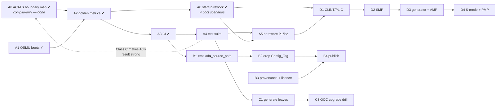

# Getting the MPFS runtime to production quality

A plan for turning `rts-spikes/` into runtime crates other people can depend on.

**Assumed definition of done**, because the answer branches on it: *a set of Alire crates a third party can add to a project without pins, which boot on a real Icicle Kit, and which survive a GCC release.* Certification is deliberately **not** assumed — [Phase E](#phase-e--only-if-certification-is-in-scope) says what it would add. If the goal is narrower (internal use, no publishing) then [Phase B](#phase-b--make-it-publishable) collapses and this gets much shorter; say so before starting.

---

## Where we actually are

Honest reading of the spike as it stands: **281 tracked files, 52 commits, six applications that build — and, since [A1](#a1-get-one-byte-out-of-qemu), three of them execute and print under QEMU.**

*This sentence used to end "…and not one instruction that has ever executed", which was the single most important line in this document. It is no longer true, and that is the largest thing that has changed. What remains untrue is the version of it that matters most: nothing has run on **real silicon** ([A5](#a5-real-hardware)).*

| | Status |
|---|---|
| The design composes | **proved.** Four crates, three profiles, two targets, one tier-1 snapshot |
| Every mechanism it relies on | **measured**, except one ([B1](#b1-generate-ada_source_path--the-one-unproven-mechanism)) |
| The profile chain (`light` ⊆ `light-tasking` ⊆ `embedded`) | **no counter-example**, on a weak sample — [A0](#a0-map-the-profile-boundary-with-acats--compile-only-no-hardware) ✔ |
| The images run | **under QEMU, yes** — `clock_switch_e51`, `hello_mpfs` and `hello_envm_mpfs` print their own output ([A1](#a1-get-one-byte-out-of-qemu) ✔). On silicon, still **unknown** ([A5](#a5-real-hardware)) |
| Startup handles the four boot scenarios | **yes** — hart gate derived from `Harts_Mask`, `.data` copied when LMA ≠ VMA, role-conditional parking ([A6](#a6-rework-start-rams-for-the-four-boot-scenarios) ✔) |
| Regressions get caught | **no.** `make verify` prints a table; it asserts nothing |
| Someone else can use it | **no.** Path pins, hand-written `ada_source_path`, `Config_Tag` |
| It survives a toolchain bump | **untested.** `populate.sh` has guards, but they have only ever seen 15.1.2 |

That table is the plan. The three gaps are *different in kind* — running, publishing, staying correct — and they want different work.

**The row about running was the most important one, and A1 half-answered it.** A runtime that builds and has never run is not most of the way done: `text 1396`, `Tag_RISCV_arch` and the ELF segment layout are all properties of a *file*. QEMU has now shown that the console emits a byte and that `.data` is initialised — and it immediately paid for itself, because it exposed a startup that ran the E51's image on a U54 and never copied `.data` at all ([A6](#a6-rework-start-rams-for-the-four-boot-scenarios)). Both were invisible to every build-time check in the project.

What an emulator still cannot tell us is whether the **clock tree** is programmed correctly, whether the trap vector is reachable on real silicon, or whether `delay until` returns against a real `mtime`. QEMU will happily model a clock tree we configured wrongly. That is [A5](#a5-real-hardware), and it is now the largest unknown in the plan.

---

## One finding that changes the shape of the plan

**QEMU models this board, and it is already installed here.**

```
$ qemu-system-riscv64 -M help | grep -i microchip
microchip-icicle-kit Microchip PolarFire SoC Icicle Kit
```

(QEMU 11.0.1 via Homebrew.) That means "does it run?" is answerable **in CI, on every commit, without a board**, which is normally the expensive part of bare-metal work.

What I measured, so this is not oversold: QEMU accepts both `hello_mpfs` (U54, hard-float) and `clock_switch_e51` (E51, soft-float) via `-M microchip-icicle-kit -kernel <elf>` **without complaint** — no load error, no illegal-instruction abort — and produced **no console output** within ~15–20 s in either case. So the emulator is a real path, and getting the first byte out of it is a bounded piece of work, not a formality. Likely causes to work through, in order of suspicion: QEMU's Icicle model expects HSS in eNVM and may need `-bios none` for a direct `-kernel` boot; the machine's hart-release behaviour may not match what our startup assumes; and our MMUART base/divisor may disagree with QEMU's model.

That task is [A1](#a1-get-one-byte-out-of-qemu). With [A0](#a0-map-the-profile-boundary-with-acats--compile-only-no-hardware) done, it is the next thing to do and the largest remaining unknown in Phase A.

---

## Phase A — Make it run, and keep it running

The whole phase is cheap relative to its value, and it retires the largest unknown.

### A0. Map the profile boundary with ACATS — compile-only, no hardware

> ### ✔ DONE

**Delivered** in `rts-spikes/acats/` — `select_tests.py`, `run_boundary.py`, committed `out/*.tsv` evidence, and [`BOUNDARY.md`](rts-spikes/acats/BOUNDARY.md) with the measurement. Reproduce with `cd rts-spikes/acats && python3 run_boundary.py --acats-root <unpacked ACATS>/x`.

| Result | |
|---|---|
| Chain violations | **none** — no test compiles on a lower profile and fails on a higher one, across 386 × 3 compilations |
| Supporting signal | monotone relaxation: restriction violations **40 → 37 → 36**, absent units **6 → 6 → 5**. Nothing gets stricter going up |
| Boundary markers | `light` → `light-tasking` is `NO_TASKING` lifting to Ravenscar/Jorvik restrictions; `light-tasking` → `embedded` shows as `Storage_Size` on access types and `Ada.Streams` appearing |
| Correctly *not* a chain finding | file I/O (`Sequential_IO`, `Direct_IO`, `Stream_IO`) is absent from **all three** — a target property, no filesystem |

**Read the result as "no counter-example found", not "the chain is verified."** 348 of the 386 selected tests are Class B, which must be *rejected* to meet their own objective — so for nine tenths of the sample "compiles clean" is not success, and 29 of the 39 that did compile clean are themselves Class B. The compiles/does-not-compile axis the set-difference method rests on is close to meaningless for most of what was measured. `BOUNDARY.md` §3c states this. **The strong version needs Class C, which needs the `Report` retarget** — i.e. [A4](#a4-a-test-suite-that-exercises-the-runtimes-own-surface).

The most valuable thing it produced is not in the results table: **without `-x ada`, gcc silently no-ops on ACATS's `.ADA`/`.A` extensions and exits 0 having compiled nothing.** The first full run showed 386/386 "ok" everywhere. Caught, fixed, and a permanent `harness_error` category added so it cannot recur silently. That is the third instance of this project's signature failure mode in one sitting — after a stale object and an uncompiled unit — and all three presented as "everything passes".

Scaling blockers, in order: `gnatchop` for multi-unit files, foundation-code resolution, then the `Report` retarget.

The original rationale, for anyone revisiting the choice:

The [ACATS](http://www.ada-auth.org/acats.html) is 4,835 tests written by people with no stake in this design. That makes it a far better corpus than anything we would author for the one claim we have asserted and never tested: **`light` ⊆ `light-tasking` ⊆ `embedded`**, on which the whole `provides` capability-floor scheme rests.

Measured from ACATS 4.2 (User's Guide dated 14 June 2024, the current baseline; Ada 2012):

| Class | Files | Requires |
|---|---:|---|
| **B** | **1,903** | must be *rejected* — **compile-only** |
| C | 2,661 | compile, execute, report |
| A / D / E / L | 77 / 4 / 12 / 178 | execute, capacity, inapplicable, link-must-fail |

Of the Specialized Needs Annex tests, **62 are Annex D (Real-Time)** — a hand-triageable shortlist for what Ravenscar permits.

**Why this is A0 and not later:** it needs no execution, no QEMU, no ported `Report`, no `ImpDef`. A compiler is the entire dependency, so it runs today. And the method derives the answer instead of asserting it:

1. Compile the corpus against `embedded`, then `light-tasking`, then `light`, recording each test's diagnostics.
2. Tests that stop compiling at each step **are** the profile boundary, measured — which is also the feature matrix we currently do not have.
3. **The assertion that matters:** anything compiling under `light` but *failing* under `light-tasking` or `embedded` is a **layering bug**, because the chain claims there can be none.

> **Exit:** a committed harness, a boundary table for the three profiles, and either zero chain violations or a list of them.

**Licensing is settled, so vendoring is available.** Every test file carries a *Grant of Unlimited Rights* — the notice appears in 4,856 of them — conferring rights to "use, duplicate, release or disclose … in whole or in part, in any manner and for any purpose whatsoever", AS-IS. Prefer a checksum-pinned fetch to keep 5,264 files out of the repo, and vendor only if CI proves flaky.

**Three things ACATS gives us that I expected to have to invent**, all from the User's Guide:

- **Bare targets are contemplated.** Appendix D refers to the customized suite "for bare target validations" outright.
- **Retargeting `Report` is sanctioned** (§5.2.4): *"the target system for a cross-compiler may require a simpler I/O package than the standard package Text_IO."* One context clause, 18 I/O call sites in 591 lines — plus an `Ada.Calendar` dependency that a `light`-class runtime also lacks.
- **`NOT_APPLICABLE` is a graded result**, and Appendix D enumerates the affected tests *by filename* per unsupported feature (text/sequential/direct/stream files, task attributes, reserved interrupts, multiprocessor systems). A grading tool ships as Ada source (§6).

**Two limits to state up front.** ACATS 4.2 is **Ada 2012**; there is no Ada 2022 baseline, so the `Put_Image` chain — precisely what distinguishes `embedded`'s `a-strsup` from `light`'s — is not covered by it. And the ACAA is explicit: *"This test suite should not be used to make claims of conformance unless used in accordance with ISO/IEC 18009."* This is regression testing and boundary mapping, never a published pass rate.

**Where to aim it.** Appendix D covers implementation-*dependent* features, not features a conforming implementation must have — so it has no vocabulary for "needs exception propagation" or "violates Ravenscar":

| Profile | Fit |
|---|---|
| `embedded` | **a plausible target** — full exceptions, `Text_IO`, finalization, tasking |
| `light-tasking` | partial; Ravenscar excludes much of Annex D |
| `light` | not an ACATS target, but still the *lower bound* of the boundary map |

### A1. Get one byte out of QEMU

> ### ✔ DONE

**Delivered**: `make qemu` in `rts-spikes/Makefile` and [`rts-spikes/QEMU.md`](rts-spikes/QEMU.md) with the full measurement. The command was `qemu-system-riscv64 -M microchip-icicle-kit -m 2G -nographic -serial mon:stdio -bios none -kernel clock_switch_e51/bin/clock_switch_e51 -no-reboot`, which prints `clock_switch_e51`'s own three lines; `hello_mpfs` was used for the causality check (message changed, rebuilt, output changed, reverted).

**Which suspicion killed it, with the evidence:**

| Suspicion | Verdict | Evidence |
|---|---|---|
| LIM not backed by QEMU | **wrong** | Both console-producing apps link at LIM (`0x0800_0000`) and print fine |
| MMUART base/divisor mismatch | **wrong, not even engaged** | Our console driver programs no divisor at all; base address matches QEMU's `mmuart0` exactly |
| Boot flow / HSS-in-eNVM expectation | **right** | QEMU's default `-bios` loads OpenSBI, which produced *no* output at all (not even its own banner) in a bounded run; `-bios none` fixed it completely |

**A finding beyond the QEMU question itself, board-relevant and unresolved:** `rts_support_mpfs/src/start-ram.S` gates on a hard-coded `mhartid == 1`, independent of an image's `Harts_Mask`. Under QEMU (`-bios none`), *every* hart is sent to the same entry point unconditionally (measured by instrumenting a local, uncommitted copy of the file), so hart 1 — a U54 — is the one that actually executes `clock_switch_e51`, not hart 0, the E51 the image is built for. The output is genuinely ours (causality-checked), but it does not exercise the scenario the E51 monitor exists for. Whether real hardware's HSS would release hart 0 into a `Harts_Mask => 1` partition, making this gate correct there too or exposing the same bug on the board, is **not measured**. Not fixed here: the file is shared, byte-for-byte, by every RISC-V MPFS leaf, and any change to it would move the pinned metrics (`1340 / 1756 / 8058 / 52436`) this task had to preserve exactly. `QEMU.md` has the full writeup and a reproduction recipe.

No new app crate was needed — `lim` (the profile all four MPFS apps but `embedded_app` already use) works once `-bios none` is supplied, so the DDR fallback this section originally suggested trying was never required.

### A2. Make the metrics assertions rather than decoration

> ### ✔ DONE

**Delivered**: `rts-spikes/metrics.golden` (committed expectation), `rts-spikes/metrics.sh`, and `make verify` / `make bless` in `rts-spikes/Makefile`. `verify` now exits non-zero on any difference, showing expected vs. actual per field; `bless` regenerates the golden file so a deliberate change is a reviewable diff committed with its cause. It records `text`, `data`, `bss`, entry point, ELF `e_flags`, the full ISA tag (`Tag_RISCV_arch` / `Tag_CPU_arch`) and every other build-attribute tag, raw. It fails, rather than skips or compares equal, on: a missing image, an application set that differs from the golden file in either direction, an unusable toolchain, and an empty or unparseable field. Each was demonstrated by deliberately breaking it (see the commit message). `verify` measures what is on disk and does not build; use `make all`.

`make verify` prints `1340 / 1756 / 8058 / 52436 / 1984` and exits 0 regardless. Those numbers appear in a dozen commit messages *because a human retyped them*. Replace with a committed golden file and a non-zero exit on drift, with a documented way to re-bless.

> **Exit:** `make verify` fails when any image's `text`, `bss`, entry point or ABI tag changes without the golden file changing.

Do this before A3 — it is what makes CI meaningful rather than a build-only smoke test.

### A3. CI

> ### ✔ DONE

Build all five applications and run the QEMU smoke test on every push. Needs the two toolchains and `alr`; a container or a cached toolchain install.

> **Exit:** a red build on a deliberately broken commit, from a clean checkout — which also proves the `make populate` prerequisite is honestly documented.

> **Status when committed, before any GitHub run.** [`.github/workflows/rts-spikes.yml`](.github/workflows/rts-spikes.yml) runs `make all` (`build → verify → smoke`) on `ubuntu-26.04`; the exit criterion needs a red run on a broken commit and a green one on a good commit *on GitHub*, so **A3 is not done** until the first push has produced both. Local proxy, passed: a `git clone` into a path containing a space, `make all` from nothing on macOS/aarch64 (green, `metrics.golden` unchanged), and `make all` going red at `verify` for a source change that moves `.text` and at `smoke` for one that changes console output. What changed to make that honest:
>
> - **A fresh machine could not run `make build` at all.** `populate` copies tier 1 out of the installed toolchains, and the only thing that installed them (`alr build`) ran after it. Worse, the leaf manifests said `gnat_*_elf = "^15"`, and the community index now also carries 15.2.1 and 15.3.1: measured, a clean machine resolves `^15` to **15.3.1**, so even a successful fetch gave the wrong compiler. The manifests now say `"=15.1.2"` and `make toolchains` (a prerequisite of `populate`) installs both compilers with `alr build --stop-after=post-fetch` (measured to fetch dependencies and compile nothing; the fresh download of the 15.1.2 compilers themselves has not been run).
> - **`make smoke`** asserts the three console outputs listed in `rts-spikes/smoke.expected`, and fails — never skips — without a QEMU ≥ 10.1. Ubuntu 24.04's packaged QEMU (8.2.2) is below that floor: it boots `-kernel` only together with `-dtb` ([`QEMU.md`](rts-spikes/QEMU.md)).
> - **Unverified until the first run:** the action input names and package names in the workflow, the Linux toolchain path, and — most likely to fail first — whether the Linux/x86_64 build of the 15.1.2 cross compiler reproduces `metrics.golden` (blessed on macOS/aarch64) byte for byte. `make verify` now prints the host and exact toolchain build above its expected/actual pairs so that failure is self-explanatory. Per-host golden files were deliberately not added.
>
> **First GitHub run ([36883023286](https://github.com/ThyMYthOS/ada-machine/actions/runs/36883023286)): red, and for the predicted reason.** Every guessed step held — `qemu-system-riscv` 10.2.1 from apt, `setup-alire` 2.1.0, a fresh download of both 15.1.2 compilers, the bootstrap, all six applications built. Only `verify` failed, and the cause is upstream: **Alire's `gnat_riscv64_elf`/`gnat_arm_elf` 15.1.2 is GCC 15.0.1 20250418 (prerelease) on macOS/aarch64 and GCC 15.1.0 on Linux/x86_64** — one crate version, two compilers. `data`, entry point, e_flags, the full ISA string and every attribute tag matched on all six images; `text` was smaller on Linux by exactly 24 bytes on every RISC-V image and 20 on the ARM one, and two `bss` values moved by ±8.
>
> **Second run ([36886035327](https://github.com/ThyMYthOS/ada-machine/actions/runs/36886035327)): `smoke` green on Linux, `verify` red by design.** `smoke`, now a separate step, ran on Linux for the first time: QEMU 10.2.1 (Ubuntu's package) boots all three console images and every expected line appears. `verify` failed with "no baseline" for compiler `15.1.0`, as intended, and printed the six Linux rows; diffed field by field against the Mac rows they differ *only* in `text` and two `bss` values.
>
> **The size difference is now fully explained.** The run's per-section sizes show `.text` — the code — is **the same size on both hosts, on both targets** (1600 bytes for `hello_rp2040`, 1028 for `hello_mpfs`). Only `.rodata` moves: the binder embeds `GNAT Version: <compiler>` NUL-terminated, 43 bytes on the Mac and 21 on Linux, and the next object being 4-aligned on ARM and 8-aligned on RISC-V turns that into exactly **−20** and **−24** — computed from the string's actual address, matching what was measured. The two `bss` moves are a 16-byte alignment inside `.bss` absorbing the 24-byte shift. An earlier model that predicted 24 for ARM had left out the terminator.
>
> **Response: the golden file is keyed on (app, compiler)**, the compiler being the image's own `GNAT Version:` string — not the host, because the compiler is the variable. Each host checks its own rows; `make bless` rewrites only the current compiler's and keeps the rest; an unknown compiler fails with "no baseline" and prints the rows to seed. The six `15.1.0` rows were seeded verbatim from run 2's output, after confirming they differ from the Mac rows only where the explanation says they should.
>
> **Third run ([36887999831](https://github.com/ThyMYthOS/ada-machine/actions/runs/36887999831)): green** — the first. On a fresh Linux runner from a clean checkout: `verify OK: 6 application(s) match metrics.golden exactly` against the `15.1.0` rows, and `smoke OK: 3 image(s)` under QEMU 10.2.1. The same commit is green under `make all` on the Mac against the `15.0.1` rows. That left one path unexercised: a red run on a deliberately broken commit. Run 1 went red on a real difference, but the compiler caused it, not a commit.
>
> **Fourth run ([36890306683](https://github.com/ThyMYthOS/ada-machine/actions/runs/36890306683)): red, exactly as intended.** A throwaway branch, `ci-red-check`, never to be merged, changed `Hello` to `Jello` in `hello_mpfs` — the same length, so the image's metrics do not move. `make build` and `make verify` passed (`verify OK: 6 application(s) match metrics.golden exactly`, compiler `15.1.0`); `make smoke` failed on `hello_mpfs` alone, `MISSING: "Hello from PolarFire SoC"`, while `clock_switch_e51` and `hello_envm_mpfs` passed; the diagnostic steps still ran. Together with run 3 that meets the exit criterion: green on a good commit, red on a broken one, both from a clean checkout on GitHub. One observation: the cross-compiler cache **missed** on the new branch even though earlier runs had saved it, because GitHub scopes caches to the branch that saved them plus the default branch, and `rts` is not the default. Every new branch therefore downloads both compilers once; saving the cache from a run on `main` would make it shared.

### A4. A test suite that exercises the runtime's own surface

There are **no tests in `rts-spikes/`** today. The runtime's job is exactly the thing no application-level check covers, so this is not optional at production quality:

| Area | Minimum test |
|---|---|
| tasking | two tasks, `delay until`, verify ordering and elapsed time |
| protected objects | entry with a barrier, released from an ISR |
| interrupts | a timer interrupt reaches its handler on the *owning* hart |
| exceptions (`embedded`) | raise across a subprogram boundary, catch, propagate |
| `Text_IO` | round-trip through the selected `Console` value |
| the `light` floor | that a `light` build *rejects* tasking constructs |
| configuration checks | each `Compile_Time_Error` fires — build-time negative tests |

The last row deserves emphasis: CONTRACT.md §7.4/§7.12 record that these checks have twice been silently dead. Negative build tests are the only thing that keeps them honest, and `pragma Pure` ([`d15429f`](rts-spikes/rts_support_mpfs/src/mpfs_config_checks.ads)) now covers only the staticness half.

**Take the bodies from ACATS rather than writing them**, for everything except the last two rows. [A0](#a0-map-the-profile-boundary-with-acats--compile-only-no-hardware) has already vendored or fetched the corpus; what execution adds is the `Report` retarget (§5.2.4, sanctioned) and `ImpDef` tailoring — six files, of which `IMPDEFD.A` is the Real-Time one. Aim the executable run at **`embedded`**, where exception propagation and `Text_IO` are exactly the two things nothing here has ever exercised. The 62 Annex D files are the tasking shortlist.

The last two rows have no ACATS equivalent and stay ours: the `light` floor is a claim about *our* profile chain, and the configuration checks are *our* pragmas.

> **Exit:** the suite runs under QEMU in CI, and each `Compile_Time_Error` has a build that must fail.

### A5. Real hardware

QEMU is a model; it will happily emulate a clock tree we programmed wrongly. The RTS-POLARFIRE.md §10 milestones are the right ladder: **P1** an E51 and a U54 image from one crate at `Memory_Profile => lim`, then the same U54 image at `ddr_by_bootloader`; **P2** Ravenscar tasking on hart 3 and an ISR in that hart's ITIM.

> **Exit:** P1 and P2 pass on an Icicle Kit, with the QEMU suite from A4 also green there.

### A6. Rework `start-ram.S` for the four boot scenarios

> ### ✔ DONE

**Delivered**: the design below, implemented exactly as specified — `rts_support_mpfs/src/start-ram.S` rewritten, `Boot_Role` added to all three MPFS leaves (`alire.toml`, `target_options.gpr`'s `ASMFLAGS`, and `Config_Tag`), and a new app crate, `hello_envm_mpfs`, added to prove the XIP cell.

**The hart gate, measured fixed.** Instrumenting a local, uncommitted copy of the new file (same technique A1/QEMU.md used, reverted before committing) showed both hart 0 and hart 1 reaching `_start_ram` under QEMU — confirming the reset-ROM behaviour QEMU.md already established — but only hart 0 (the E51 `clock_switch_e51` is built for, `Harts_Mask => 1`) passing the gate and printing the monitor's own text; hart 1 parked. `make qemu` and `make qemu QEMU_APP=hello_mpfs` still print, unbounded run count zero.

**The `.data` copy, measured working, and eNVM genuinely backed.** `hello_envm_mpfs` (`Memory_Profile => envm`, entry `0x2022_0100`) is a new app whose one job is printing `XIP_Marker.Text`, a package-level non-constant `String` that can only be correct if the copy ran. Under QEMU it printed `XIP DATA COPY OK` — and a causality check (message changed, rebuilt, output tracked the change, reverted) confirms the bytes are genuinely copied, not a stale-memory coincidence. So QEMU's icicle-kit model **does** back eNVM as a loadable, executable region; no LIM-displaced-LMA fallback was needed.

**`secondary` produces no parking code, disassembled.** Temporarily overriding `hello_mpfs`'s and `hello_envm_mpfs`'s `Boot_Role` to `secondary` (reverted before committing) and disassembling both: no `mhartid` read, no `infinite_loop` label, no `wfi` anywhere in either binary — while the `.data` copy loop is still present, unconditionally, in the XIP one.

**All four cells built**, two of them (primary × both media) also booted and printed under QEMU; the other two (secondary × both media) built and were disassembled clean, per the scope boundary — release is D2, not this task.

**Metrics moved, as expected** (`rts-spikes/QEMU.md`'s pinned `1340 / 1756 / 8058 / 52436 / 1984` → `1396 / 1812 / 8106 / 52500 / 1984`, `+56 / +56 / +48 / +64 / +0`): every RISC-V image gained the wider gate (`csrr`/`sll`/`li`/`and`/`beqz` replacing `li`/`csrr`/`bne`) plus the unconditional `.data`-copy loop's instructions, present even where it runs zero iterations; `hello_rp2040` is untouched, exactly `1984`, because nothing here is on the ARM path.

**Not done, deliberately** (scope boundary, D1/D2): no CLINT MSIP/WFI release protocol, no IPI, no SMP startup — parking is *structurally* ready for a release handshake but does not implement one. Whether real hardware's HSS releases hart 0 alone into a `Harts_Mask => 1` partition (QEMU.md's open question) is still not measured; it needs a board.

The original task specification follows, for anyone checking the design against what was asked for.

**Numbered last in Phase A, but it *blocks* [A5](#a5-real-hardware) and is a prerequisite for [D1](#phase-d--the-features-that-are-still-missing)/D2.** [A1](#a1-get-one-byte-out-of-qemu) surfaced it: the file is 75 lines and wrong in three separate ways for anything but the one case it was written for.

An image can arrive in memory two ways, and can be started in two roles, and the axes are **orthogonal**:

| | **Primary** — first thing running, must park the other harts | **Secondary** — a supervisor or JTAG already placed and released us |
|---|---|---|
| **XIP from eNVM** (`0x2022_0100`) | copy `.data`, clear `.bss`, park foreign harts | copy `.data`, clear `.bss`, **touch no other hart** |
| **Already in RAM** (LIM / DTIM / DDR) | clear `.bss`, park foreign harts | clear `.bss` only |

**What is broken today**, all measured:

1. **The hart gate is hard-coded `mhartid == 1`**, regardless of `Harts_Mask` — with a comment admitting the reasoning (`"the monitor doesn't have floating point support"`) applies only to a U54 image. So `clock_switch_e51`, built for the **E51** at `Harts_Mask => 1`, is executed by **hart 1, a U54**. It appears to work only because soft-float code runs happily on a hard-float core.
2. **There is no `.data` copy at all** — only a `.bss` clear. `place-envm.ld` already says so in its own header: *"a program built against it would run with `.data` uninitialised … until that copy loop is added."* The XIP profile is link-clean and would not run correctly.
3. **Parking is a dead `wfi` loop with no release path.** A parked hart can never be woken, which D2's SMP release needs and which the secondary role must not perform at all.

Plus two defects to sweep up: `.type _start_rom,@function` names a symbol that does not exist here (the label is `_start_ram`), and the FPU comment is stale reasoning.

**The design, in this project's own idiom.**

- **Axis 1 collapses to nothing.** Do *not* add a `start-rom.S`. Every placement script already emits `__data_load`, `__data_start` and `__data_end`, so one code path serves both: copy when `__data_load /= __data_start`, skip when they are equal. **The linker answers the question, so neither a knob nor a file variant is needed** — the strongest form of [RTS-GUIDE](RTS-GUIDE.md) §5.3's numbers-versus-structure rule, where the value is not even ours to supply.
- **Axis 2 is a genuine configuration variable:** `Boot_Role = { type = "Enum", values = ["primary", "secondary"], default = "primary" }`.
- **The gate derives from `Harts_Mask`** — test bit `mhartid`, not equality with 1. That is correct for a single E51 (`mask = 1`), a single U54, and a multi-hart mask, with no special cases.
- **Configuration reaches assembly through `-D`.** `.S` files run through the C preprocessor, and `ALL_ASMFLAGS` already flows to `Default_Switches ("Asm_Cpp")`. This is the assembly analogue of [RTS-GUIDE](RTS-GUIDE.md) §6.4's in-body static test: finest granularity, no duplicated file. `Boot_Role` must also join `Config_Tag` — a compiled unit reads it.

**Ownership is not in question.** `start-ram.S` is tier 3, and tier 3 is ours ([CONTRACT.md](rts-spikes/CONTRACT.md) §1). A1 left it alone for scope reasons, not permission.

**Expect the metrics to move**, since startup code changes — which is a concrete argument for doing [A2](#a2-make-the-metrics-assertions-rather-than-decoration) *first*, so the delta is a deliberate re-bless rather than a number nobody compared.

> **Exit:** `clock_switch_e51` runs on **hart 0** under QEMU; an `envm`-profile image has correct `.data`; a `secondary` build contains no parking code; all four cells of the table build.

Optional and last, because it touches nine list files: rename to `start.S`, since a file that also handles XIP is no longer "ram".

---

## Phase B — Make it publishable

Nothing here is optional if a third party is to use these crates, and one item is the only genuinely unproven mechanism in the whole design.

### B1. Generate `ada_source_path` — the one unproven mechanism

Today it is hand-committed with relative entries (`../rts_sources_gcc15/libgnat`), which work **only because the crates are path-pinned siblings**. Verified: a fetched crate lands in `~/.local/share/alire/builds/<crate>_<version>_<id>/<hash>/`, and no relative path reaches from one to another. RTS.md §8 item 1 has called this out from the start.

Also verified, and it raises the stakes: `ada_source_path` is read **during compilation**, not only at bind time — a subunit is located by searching it, so an incomplete list fails the compile of a *different* unit than the one that looks wrong.

Decide between `post-fetch` (runs before configuration values exist) and `pre-build` (ordering across a dependency graph needs checking against the Alire version in use), then implement and test **against a fetched, unpinned crate**. Emitting three lines of text is the easy part; being emitted at the right moment is the whole problem.

> **Exit:** a leaf consumed with no `[[pins]]` at all, from a different directory, builds and binds.

### B2. Delete `Config_Tag`

CONTRACT.md §7.11 says outright: *"Do not copy this into a published crate."* It exists because path-pinned crates build in-tree and share one `adalib`. Once B1 lets crates be fetched, Alire's hash-keyed build cache provides the isolation and `for Library_Dir use "adalib"` is correct.

> **Exit:** two applications at different configurations of one fetched runtime crate, each getting its own library, with no tag in any project file. Then `ada_object_path` becomes truthful again — it currently names an `adalib` that does not exist.

### B3. Tier 1 provenance, licensing, and versioning

The hardest *non-technical* item, and the one most likely to stall a submission.

- **Provenance.** `populate.sh` copies ~1050 units out of an installed toolchain. A published crate cannot do that: a fresh clone does not build, and the crate's content depends on what the publisher had installed. Either vendor the snapshot into the crate (and carry the bytes) or make the copy step reproducible from a named GCC release.
- **Licensing.** These are FSF/AdaCore sources under GPL-3.0-or-later WITH GCC-exception-3.1. Redistribution needs the notices right, and `authors`/`maintainers` need to distinguish "wrote it" from "packaged it".
- **Versioning.** RTS.md §8 item 7. `rts_sources_gcc15` must have a version scheme tied to the GCC release it snapshots, so a leaf can depend on a range and a GCC bump is a manifest edit.

> **Exit:** a clean-machine `alr get` of the leaf produces something that builds, with a licence and provenance statement a reviewer would accept.

### B4. Verify the `provides` ordering, then publish

The capability-floor scheme (`gnat_rts=1|2|3`) has its **declaration** half measured — `alr show` reports each floor — and its **constraint** half unverified: whether `gnat_rts = ">=2.0.0"` resolves against a *virtual* name as it does against a real crate. Two throwaway local crates settle it in twenty minutes. Fallback if it fails: one virtual name per capability, losing the ordering.

Then publish to a private index first and consume from a clean machine, before proposing to the community index.

> **Exit:** a third-party project depends on `light_tasking_mpfs` by name plus `gnat_rts = ">=2.0.0"`, and resolves.

---

## Phase C — Make it survive maintenance

### C1. Generate the leaves

RTS.md §7 is explicit that the entire tier analysis *assumes the leaf is thin and generated*, and that hand-writing them fails immediately: three near-copy `target_options.gpr`/`runtime_build.gpr`/manifest sets, close enough that nobody diffs them and different enough that divergence reads as intentional. That already produced one real defect — a leaf silently re-derived the ISA hardcoded to hard-float, and every build of that profile was wrong until the files were compared by hand.

Four leaves is where this is still cheap to fix. Twelve is where it is not.

> **Exit:** the leaves are emitted from one description plus per-profile data, and a diff of the generated output against today's files is empty or explained.

### C2. Settle tier 2

Measured at **six files against tier 1's ~1050**, one of them an empty `pragma Pure` package, sharing tier 1's release cadence. RTS.md recommends folding it in. The counter-evidence is that `rts_core_cortexm` is now serving a second target — so decide on evidence rather than leaving it as an open question in three documents.

> **Exit:** either folded, or a written reason naming the cadence that justifies it.

### C3. Rehearse a GCC upgrade

The `assert_identical` guards in `populate.sh` have only ever run against 15.1.2. They exist precisely for the case where a compiler release breaks a sharing assumption — so run that case deliberately, on the next available toolchain, and measure the churn.

> **Exit:** a written report: which guards fired, how many files moved, how long it took. That number is what a downstream user needs in order to trust the crate.

### C4. Write the consumer's documentation

`RTS.md`, `RTS-GUIDE.md`, `RTS-POLARFIRE.md` and `CONTRACT.md` are for *us*. A board porter needs a short document that says: add these dependencies, set these values, here is what each knob does, here is how to add your board.

> **Exit:** someone who has not read the other four documents ports a board.

---

## Phase D — The features that are still missing

These are RTS-POLARFIRE.md §10's P2–P5 and they are the largest bodies of work, but they are *additive*: none of Phase A–C depends on them.

| | Work | Notes |
|---|---|---|
| **D1** | Hart-indexed CLINT/PLIC; L1 cache/SRAM split | RTS-POLARFIRE §8 item 1 and item 6. Prerequisite for anything multi-hart |
| **D2** | SMP — `Harts_Mask` sets, SMP startup, `Max_Number_Of_CPUs > 1` | Multiplies with `Privilege`: single/SMP × M/S-mode is four startup variants |
| **D3** | Fork the vendor generator → real `mpfs_system` → derived mode → AMP | `mpfs_system` is a hand-written stand-in today. This is where the design is most novel and most likely to need revision |
| **D4** | S-mode, PMP/U-mode partitioning, IPC over the non-cached alias | §6.5 settled the linker-script question; the grain `G` still comes from the XML |

Two known-open items sit inside D3/D4: `make amp` **fails by design** because both demo partitions link at `0x08000000` and need per-partition placement from `mpfs_system`; and the RP2350 leaf needs its linker scripts, hard-float switches and a single-precision `rts_capabilities.ads` — the tier-3 overlay for it already exists.

---

## Phase E — Only if certification is in scope

Not assumed, and it changes Phase A and B rather than appending to them: requirements traceability from the SoC documentation through the configuration checks, `.ali`-based evidence packaging (the `Source_List_File` is the *claim*, the `.ali` set is the *evidence*), and a defensible answer to silent basename shadowing. Ask someone who has taken a runtime through qualification before committing to a route.

Note what [A0](#a0-map-the-profile-boundary-with-acats--compile-only-no-hardware) does **not** buy here. ACATS is used there for regression testing, and the ACAA is explicit that conformance claims require ISO/IEC 18009 and an accredited ACAL — with `Report` body modifications needing advance approval. A formal assessment is a separate undertaking with a separate suite configuration; A0 makes it *cheaper to start*, not started.

---

## Sequencing, and what I would do first



**A0 → A1 → A2 → A3 is the whole recommendation**, and A0 is done. It converts a design that is argued into a design that is exercised, it is the cheapest work in the plan, and everything after it gets safer because a regression becomes visible the same day.

**A1 is next**, and it is the largest remaining unknown in Phase A: open-ended debugging rather than mechanical work, which is why A0 went ahead of it.

A2 is embarrassing to be missing and takes an afternoon: the numbers this project quotes as evidence are currently checked by eye. A0 reinforced why — its own first run reported 386/386 passing while compiling nothing at all.

Note the dashed edge: **A4 loops back to A0.** Class C tests are what make the boundary map strong rather than merely negative, so A0 is worth re-running once the `Report` retarget exists.

**B1 is the one that could invalidate something.** It is the only mechanism in the design that has never been demonstrated. If `pre-build` ordering turns out not to give the leaf a chance to write `ada_source_path` before binding, the fallback — vendoring tier 1 into each leaf — undoes most of the sharing the hierarchy exists for. Worth doing early *for information*, even out of order.

**Do not start Phase D before A3** (now done). D2 through D4 are where multi-hart timing bugs live, and debugging those without a regression suite is how the schedule disappears.

---

## Risk register

| Risk | Signal | Response |
|---|---|---|
| **B1 has no working mechanism** | `pre-build` runs too late, or before configuration exists | Vendor tier 1 per leaf; accept the duplication and keep the hierarchy for provenance only |
| ~~A0 finds chain violations~~ | — | **retired:** none found, but on a sample too weak to settle it. Re-run after A4's `Report` retarget before treating the chain as verified |
| **A test harness reports success without testing anything** | a suspiciously round pass rate; every case in one bucket | Happened three times in one sitting (stale object, unlisted unit, `-x ada` no-op). Every new harness needs a deliberately-broken case proving it can fail |
| QEMU cannot boot our images | A1 stalls past a couple of days | Hardware-in-the-loop runner; Phase A gets materially more expensive |
| Tier 1 licensing blocks publication | Reviewer objects to redistributing GCC sources | Publish the *lists* plus a reproducible fetch, not the bytes |
| The `>=` on a virtual name does not resolve | B4 experiment fails | One virtual name per capability; lose the floor ordering |
| A GCC bump breaks the shared overlays badly | C3 shows large churn | Split the overlays the guards name; the guards were built for this |
| Hand-written leaves diverge again | Any two leaves disagree on something neither README explains | C1, sooner rather than later |

## Housekeeping, worth doing today

- **47 commits are unpushed** on `claude/gnat-runtimes-alire-crates-401089`.
- `light_tasking_pico/alire/settings.toml` still names deleted crates (`rts_sources_gcc15_arm`, `rts_support_rp2040`) — generated and untracked, harmless, but it will confuse someone.
- `rts_support_pico/ld/memory-map.ld`'s `(rx)` comment reads as a guarantee; `ld` does not enforce region attributes ([RTS.md A.25](RTS.md#a25)).
