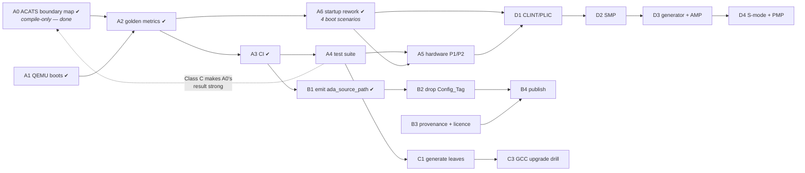

# Getting the MPFS runtime to production quality

A plan for turning `rts-spikes/` into runtime crates other people can depend on.

**Assumed definition of done**, because the answer branches on it: *a set of Alire crates a third party can add to a project without pins, which boot on a real Icicle Kit, and which survive a GCC release.* Certification is deliberately **not** assumed — [Phase E](#phase-e--only-if-certification-is-in-scope) says what it would add. If the goal is narrower (internal use, no publishing) then [Phase B](#phase-b--make-it-publishable) collapses and this gets much shorter; say so before starting.

---

## Where we actually are

Honest reading of the spike as it stands: **286 tracked files, six applications that build — and, since [A1](#a1-get-one-byte-out-of-qemu), three of them execute and print under QEMU, checked by CI on every push ([A3](#a3-ci)).**

*This sentence used to end "…and not one instruction that has ever executed", which was the single most important line in this document. It is no longer true, and that is the largest thing that has changed. What remains untrue is the version of it that matters most: nothing has run on **real silicon** ([A5](#a5-real-hardware)).*

| | Status |
|---|---|
| The design composes | **proved.** Four crates, three profiles, two targets, one tier-1 snapshot |
| Every mechanism it relies on | **measured** — the last one, [B1](#b1-generate-ada_source_path--the-one-unproven-mechanism), included ✔ |
| The profile chain (`light` ⊆ `light-tasking` ⊆ `embedded`) | **no counter-example**, on a weak sample — [A0](#a0-map-the-profile-boundary-with-acats--compile-only-no-hardware) ✔ |
| The images run | **under QEMU, yes** — `clock_switch_e51`, `hello_mpfs` and `hello_envm_mpfs` print their own output ([A1](#a1-get-one-byte-out-of-qemu) ✔). On silicon, still **unknown** ([A5](#a5-real-hardware)) |
| Startup handles the four boot scenarios | **yes** — hart gate derived from `Harts_Mask`, `.data` copied when LMA ≠ VMA, role-conditional parking ([A6](#a6-rework-start-rams-for-the-four-boot-scenarios) ✔) |
| Regressions get caught | **at the image level, yes** — `make verify` asserts every image's metrics against `metrics.golden` per compiler ([A2](#a2-make-the-metrics-assertions-rather-than-decoration) ✔), `make smoke` asserts the console output under QEMU, and both run in CI on Linux ([A3](#a3-ci) ✔). The runtime's own behaviour — tasking, exceptions, interrupts — now has tests ([A4](#a4-a-test-suite-that-exercises-the-runtimes-own-surface)), and they found that **no tasking image reaches `main` under QEMU** and that embedded exceptions cannot propagate: three of the eight positive tests are `xfail`, each pinned to a named defect (a fourth, `Console` selecting nothing, was found by the same suite and is repaired) |
| Someone else can use it | **not yet, but the blocker is smaller.** A leaf now builds from a fetched, unpinned dependency closure ([B1](#b1-generate-ada_source_path--the-one-unproven-mechanism) ✔). Still open: `Config_Tag` ([B2](#b2-delete-config_tag)), tier-1 provenance and licence ([B3](#b3-tier-1-provenance-licensing-and-versioning)), and nothing is published |
| It survives a toolchain bump | **one bump rehearsed, smooth** ([C3](#c3-rehearse-a-gcc-upgrade)): 15.1.2 → 15.3.1 moved no tier-1 file and fired no guard. The guards have still never been seen to *fire*, and a major bump (16) is untested |

That table is the plan. The three gaps are *different in kind* — running, publishing, staying correct — and they want different work.

**The row about running was the most important one, and A1 half-answered it.** A runtime that builds and has never run is not most of the way done: `text 1396`, `Tag_RISCV_arch` and the ELF segment layout are all properties of a *file*. QEMU has now shown that the console emits a byte and that `.data` is initialised — and it immediately paid for itself, because it exposed a startup that ran the E51's image on a U54 and never copied `.data` at all ([A6](#a6-rework-start-rams-for-the-four-boot-scenarios)). Both were invisible to every build-time check in the project.

What an emulator still cannot tell us is whether the **clock tree** is programmed correctly, whether the trap vector is reachable on real silicon, or whether `delay until` returns against a real `mtime`. QEMU will happily model a clock tree we configured wrongly. That is [A5](#a5-real-hardware), and it is now the largest unknown in the plan.

---

## One finding that changes the shape of the plan

**QEMU models this board, and it is already installed here.**

```
$ qemu-system-riscv64 -M help | grep -i microchip
microchip-icicle-kit Microchip PolarFire SoC Icicle Kit
```

(QEMU 11.0.1 via Homebrew.) That means "does it run?" is answerable **in CI, on every commit, without a board**, which is normally the expensive part of bare-metal work.

What I measured, so this is not oversold: QEMU accepts both `hello_mpfs` (U54, hard-float) and `clock_switch_e51` (E51, soft-float) via `-M microchip-icicle-kit -kernel <elf>` **without complaint** — no load error, no illegal-instruction abort — and produced **no console output** within ~15–20 s in either case. So the emulator is a real path, and getting the first byte out of it is a bounded piece of work, not a formality. Likely causes to work through, in order of suspicion: QEMU's Icicle model expects HSS in eNVM and may need `-bios none` for a direct `-kernel` boot; the machine's hart-release behaviour may not match what our startup assumes; and our MMUART base/divisor may disagree with QEMU's model.

That task was [A1](#a1-get-one-byte-out-of-qemu), now done: with `-bios none` all three console images print under QEMU, and [A3](#a3-ci) runs them in CI.

---

## Phase A — Make it run, and keep it running

The whole phase is cheap relative to its value, and it retires the largest unknown.

### A0. Map the profile boundary with ACATS — compile-only, no hardware

> ### ✔ DONE

**Delivered** in `rts-spikes/acats/` — `select_tests.py`, `run_boundary.py`, committed `out/*.tsv` evidence, and [`BOUNDARY.md`](rts-spikes/acats/BOUNDARY.md) with the measurement. Reproduce with `cd rts-spikes/acats && python3 run_boundary.py --acats-root <unpacked ACATS>/x`.

| Result | |
|---|---|
| Chain violations | **none** — no test compiles on a lower profile and fails on a higher one, across 386 × 3 compilations |
| Supporting signal | monotone relaxation: restriction violations **40 → 37 → 36**, absent units **6 → 6 → 5**. Nothing gets stricter going up |
| Boundary markers | `light` → `light-tasking` is `NO_TASKING` lifting to Ravenscar/Jorvik restrictions; `light-tasking` → `embedded` shows as `Storage_Size` on access types and `Ada.Streams` appearing |
| Correctly *not* a chain finding | file I/O (`Sequential_IO`, `Direct_IO`, `Stream_IO`) is absent from **all three** — a target property, no filesystem |

**Read the result as "no counter-example found", not "the chain is verified."** 348 of the 386 selected tests are Class B, which must be *rejected* to meet their own objective — so for nine tenths of the sample "compiles clean" is not success, and 29 of the 39 that did compile clean are themselves Class B. The compiles/does-not-compile axis the set-difference method rests on is close to meaningless for most of what was measured. `BOUNDARY.md` §3c states this. **The strong version needs Class C, which needs the `Report` retarget** — i.e. [A4](#a4-a-test-suite-that-exercises-the-runtimes-own-surface).

The most valuable thing it produced is not in the results table: **without `-x ada`, gcc silently no-ops on ACATS's `.ADA`/`.A` extensions and exits 0 having compiled nothing.** The first full run showed 386/386 "ok" everywhere. Caught, fixed, and a permanent `harness_error` category added so it cannot recur silently. That is the third instance of this project's signature failure mode in one sitting — after a stale object and an uncompiled unit — and all three presented as "everything passes".

Scaling blockers, in order: `gnatchop` for multi-unit files, foundation-code resolution, then the `Report` retarget.

The original rationale, for anyone revisiting the choice:

The [ACATS](http://www.ada-auth.org/acats.html) is 4,835 tests written by people with no stake in this design. That makes it a far better corpus than anything we would author for the one claim we have asserted and never tested: **`light` ⊆ `light-tasking` ⊆ `embedded`**, on which the whole `provides` capability-floor scheme rests.

Measured from ACATS 4.2 (User's Guide dated 14 June 2024, the current baseline; Ada 2012):

| Class | Files | Requires |
|---|---:|---|
| **B** | **1,903** | must be *rejected* — **compile-only** |
| C | 2,661 | compile, execute, report |
| A / D / E / L | 77 / 4 / 12 / 178 | execute, capacity, inapplicable, link-must-fail |

Of the Specialized Needs Annex tests, **62 are Annex D (Real-Time)** — a hand-triageable shortlist for what Ravenscar permits.

**Why this is A0 and not later:** it needs no execution, no QEMU, no ported `Report`, no `ImpDef`. A compiler is the entire dependency, so it runs today. And the method derives the answer instead of asserting it:

1. Compile the corpus against `embedded`, then `light-tasking`, then `light`, recording each test's diagnostics.
2. Tests that stop compiling at each step **are** the profile boundary, measured — which is also the feature matrix we currently do not have.
3. **The assertion that matters:** anything compiling under `light` but *failing* under `light-tasking` or `embedded` is a **layering bug**, because the chain claims there can be none.

> **Exit:** a committed harness, a boundary table for the three profiles, and either zero chain violations or a list of them.

**Licensing is settled, so vendoring is available.** Every test file carries a *Grant of Unlimited Rights* — the notice appears in 4,856 of them — conferring rights to "use, duplicate, release or disclose … in whole or in part, in any manner and for any purpose whatsoever", AS-IS. Prefer a checksum-pinned fetch to keep 5,264 files out of the repo, and vendor only if CI proves flaky.

**Three things ACATS gives us that I expected to have to invent**, all from the User's Guide:

- **Bare targets are contemplated.** Appendix D refers to the customized suite "for bare target validations" outright.
- **Retargeting `Report` is sanctioned** (§5.2.4): *"the target system for a cross-compiler may require a simpler I/O package than the standard package Text_IO."* One context clause, 18 I/O call sites in 591 lines — plus an `Ada.Calendar` dependency that a `light`-class runtime also lacks.
- **`NOT_APPLICABLE` is a graded result**, and Appendix D enumerates the affected tests *by filename* per unsupported feature (text/sequential/direct/stream files, task attributes, reserved interrupts, multiprocessor systems). A grading tool ships as Ada source (§6).

**Two limits to state up front.** ACATS 4.2 is **Ada 2012**; there is no Ada 2022 baseline, so the `Put_Image` chain — precisely what distinguishes `embedded`'s `a-strsup` from `light`'s — is not covered by it. And the ACAA is explicit: *"This test suite should not be used to make claims of conformance unless used in accordance with ISO/IEC 18009."* This is regression testing and boundary mapping, never a published pass rate.

**Where to aim it.** Appendix D covers implementation-*dependent* features, not features a conforming implementation must have — so it has no vocabulary for "needs exception propagation" or "violates Ravenscar":

| Profile | Fit |
|---|---|
| `embedded` | **a plausible target** — full exceptions, `Text_IO`, finalization, tasking |
| `light-tasking` | partial; Ravenscar excludes much of Annex D |
| `light` | not an ACATS target, but still the *lower bound* of the boundary map |

### A1. Get one byte out of QEMU

> ### ✔ DONE

**Delivered**: `make qemu` in `rts-spikes/Makefile` and [`rts-spikes/QEMU.md`](rts-spikes/QEMU.md) with the full measurement. The command was `qemu-system-riscv64 -M microchip-icicle-kit -m 2G -nographic -serial mon:stdio -bios none -kernel clock_switch_e51/bin/clock_switch_e51 -no-reboot`, which prints `clock_switch_e51`'s own three lines; `hello_mpfs` was used for the causality check (message changed, rebuilt, output changed, reverted).

**Which suspicion killed it, with the evidence:**

| Suspicion | Verdict | Evidence |
|---|---|---|
| LIM not backed by QEMU | **wrong** | Both console-producing apps link at LIM (`0x0800_0000`) and print fine |
| MMUART base/divisor mismatch | **wrong, not even engaged** | Our console driver programs no divisor at all; base address matches QEMU's `mmuart0` exactly |
| Boot flow / HSS-in-eNVM expectation | **right** | QEMU's default `-bios` loads OpenSBI, which produced *no* output at all (not even its own banner) in a bounded run; `-bios none` fixed it completely |

**A finding beyond the QEMU question itself, board-relevant and unresolved:** `rts_support_mpfs/src/start-ram.S` gates on a hard-coded `mhartid == 1`, independent of an image's `Harts_Mask`. Under QEMU (`-bios none`), *every* hart is sent to the same entry point unconditionally (measured by instrumenting a local, uncommitted copy of the file), so hart 1 — a U54 — is the one that actually executes `clock_switch_e51`, not hart 0, the E51 the image is built for. The output is genuinely ours (causality-checked), but it does not exercise the scenario the E51 monitor exists for. Whether real hardware's HSS would release hart 0 into a `Harts_Mask => 1` partition, making this gate correct there too or exposing the same bug on the board, is **not measured**. Not fixed here: the file is shared, byte-for-byte, by every RISC-V MPFS leaf, and any change to it would move the pinned metrics (`1340 / 1756 / 8058 / 52436`) this task had to preserve exactly. `QEMU.md` has the full writeup and a reproduction recipe.

No new app crate was needed — `lim` (the profile all four MPFS apps but `embedded_app` already use) works once `-bios none` is supplied, so the DDR fallback this section originally suggested trying was never required.

### A2. Make the metrics assertions rather than decoration

> ### ✔ DONE

**Delivered**: `rts-spikes/metrics.golden` (committed expectation), `rts-spikes/metrics.sh`, and `make verify` / `make bless` in `rts-spikes/Makefile`. `verify` now exits non-zero on any difference, showing expected vs. actual per field; `bless` regenerates the golden file so a deliberate change is a reviewable diff committed with its cause. It records `text`, `data`, `bss`, entry point, ELF `e_flags`, the full ISA tag (`Tag_RISCV_arch` / `Tag_CPU_arch`) and every other build-attribute tag, raw. It fails, rather than skips or compares equal, on: a missing image, an application set that differs from the golden file in either direction, an unusable toolchain, and an empty or unparseable field. Each was demonstrated by deliberately breaking it (see the commit message). `verify` measures what is on disk and does not build; use `make all`.

`make verify` prints `1340 / 1756 / 8058 / 52436 / 1984` and exits 0 regardless. Those numbers appear in a dozen commit messages *because a human retyped them*. Replace with a committed golden file and a non-zero exit on drift, with a documented way to re-bless.

> **Exit:** `make verify` fails when any image's `text`, `bss`, entry point or ABI tag changes without the golden file changing.

Do this before A3 — it is what makes CI meaningful rather than a build-only smoke test.

### A3. CI

> ### ✔ DONE

Build all five applications and run the QEMU smoke test on every push. Needs the two toolchains and `alr`; a container or a cached toolchain install.

> **Exit:** a red build on a deliberately broken commit, from a clean checkout — which also proves the `make populate` prerequisite is honestly documented.

> **Status when committed, before any GitHub run.** [`.github/workflows/rts-spikes.yml`](.github/workflows/rts-spikes.yml) runs `make all` (`build → verify → smoke`) on `ubuntu-26.04`; the exit criterion needs a red run on a broken commit and a green one on a good commit *on GitHub*, so **A3 is not done** until the first push has produced both. Local proxy, passed: a `git clone` into a path containing a space, `make all` from nothing on macOS/aarch64 (green, `metrics.golden` unchanged), and `make all` going red at `verify` for a source change that moves `.text` and at `smoke` for one that changes console output. What changed to make that honest:
>
> - **A fresh machine could not run `make build` at all.** `populate` copies tier 1 out of the installed toolchains, and the only thing that installed them (`alr build`) ran after it. Worse, the leaf manifests said `gnat_*_elf = "^15"`, and the community index now also carries 15.2.1 and 15.3.1: measured, a clean machine resolves `^15` to **15.3.1**, so even a successful fetch gave the wrong compiler. The manifests now say `"=15.1.2"` and `make toolchains` (a prerequisite of `populate`) installs both compilers with `alr build --stop-after=post-fetch` (measured to fetch dependencies and compile nothing; the fresh download of the 15.1.2 compilers themselves has not been run).
> - **`make smoke`** asserts the three console outputs listed in `rts-spikes/smoke.expected`, and fails — never skips — without a QEMU ≥ 10.1. Ubuntu 24.04's packaged QEMU (8.2.2) is below that floor: it boots `-kernel` only together with `-dtb` ([`QEMU.md`](rts-spikes/QEMU.md)).
> - **Unverified until the first run:** the action input names and package names in the workflow, the Linux toolchain path, and — most likely to fail first — whether the Linux/x86_64 build of the 15.1.2 cross compiler reproduces `metrics.golden` (blessed on macOS/aarch64) byte for byte. `make verify` now prints the host and exact toolchain build above its expected/actual pairs so that failure is self-explanatory. Per-host golden files were deliberately not added.
>
> **First GitHub run ([36883023286](https://github.com/ThyMYthOS/ada-machine/actions/runs/36883023286)): red, and for the predicted reason.** Every guessed step held — `qemu-system-riscv` 10.2.1 from apt, `setup-alire` 2.1.0, a fresh download of both 15.1.2 compilers, the bootstrap, all six applications built. Only `verify` failed, and the cause is upstream: **Alire's `gnat_riscv64_elf`/`gnat_arm_elf` 15.1.2 is GCC 15.0.1 20250418 (prerelease) on macOS/aarch64 and GCC 15.1.0 on Linux/x86_64** — one crate version, two compilers. `data`, entry point, e_flags, the full ISA string and every attribute tag matched on all six images; `text` was smaller on Linux by exactly 24 bytes on every RISC-V image and 20 on the ARM one, and two `bss` values moved by ±8.
>
> **Second run ([36886035327](https://github.com/ThyMYthOS/ada-machine/actions/runs/36886035327)): `smoke` green on Linux, `verify` red by design.** `smoke`, now a separate step, ran on Linux for the first time: QEMU 10.2.1 (Ubuntu's package) boots all three console images and every expected line appears. `verify` failed with "no baseline" for compiler `15.1.0`, as intended, and printed the six Linux rows; diffed field by field against the Mac rows they differ *only* in `text` and two `bss` values.
>
> **The size difference is now fully explained.** The run's per-section sizes show `.text` — the code — is **the same size on both hosts, on both targets** (1600 bytes for `hello_rp2040`, 1028 for `hello_mpfs`). Only `.rodata` moves: the binder embeds `GNAT Version: <compiler>` NUL-terminated, 43 bytes on the Mac and 21 on Linux, and the next object being 4-aligned on ARM and 8-aligned on RISC-V turns that into exactly **−20** and **−24** — computed from the string's actual address, matching what was measured. The two `bss` moves are a 16-byte alignment inside `.bss` absorbing the 24-byte shift. An earlier model that predicted 24 for ARM had left out the terminator.
>
> **Response: the golden file is keyed on (app, compiler)**, the compiler being the image's own `GNAT Version:` string — not the host, because the compiler is the variable. Each host checks its own rows; `make bless` rewrites only the current compiler's and keeps the rest; an unknown compiler fails with "no baseline" and prints the rows to seed. The six `15.1.0` rows were seeded verbatim from run 2's output, after confirming they differ from the Mac rows only where the explanation says they should.
>
> **Third run ([36887999831](https://github.com/ThyMYthOS/ada-machine/actions/runs/36887999831)): green** — the first. On a fresh Linux runner from a clean checkout: `verify OK: 6 application(s) match metrics.golden exactly` against the `15.1.0` rows, and `smoke OK: 3 image(s)` under QEMU 10.2.1. The same commit is green under `make all` on the Mac against the `15.0.1` rows. That left one path unexercised: a red run on a deliberately broken commit. Run 1 went red on a real difference, but the compiler caused it, not a commit.
>
> **Fourth run ([36890306683](https://github.com/ThyMYthOS/ada-machine/actions/runs/36890306683)): red, exactly as intended.** A throwaway branch, `ci-red-check`, never to be merged, changed `Hello` to `Jello` in `hello_mpfs` — the same length, so the image's metrics do not move. `make build` and `make verify` passed (`verify OK: 6 application(s) match metrics.golden exactly`, compiler `15.1.0`); `make smoke` failed on `hello_mpfs` alone, `MISSING: "Hello from PolarFire SoC"`, while `clock_switch_e51` and `hello_envm_mpfs` passed; the diagnostic steps still ran. Together with run 3 that meets the exit criterion: green on a good commit, red on a broken one, both from a clean checkout on GitHub. One observation: the cross-compiler cache **missed** on the new branch even though earlier runs had saved it, because GitHub scopes caches to the branch that saved them plus the default branch, and `rts` is not the default. Every new branch therefore downloads both compilers once; saving the cache from a run on `main` would make it shared.

### A4. A test suite that exercises the runtime's own surface

There are **no tests in `rts-spikes/`** today. The runtime's job is exactly the thing no application-level check covers, so this is not optional at production quality:

| Area | Minimum test |
|---|---|
| tasking | two tasks, `delay until`, verify ordering and elapsed time |
| protected objects | entry with a barrier, released from an ISR |
| interrupts | a timer interrupt reaches its handler on the *owning* hart |
| exceptions (`embedded`) | raise across a subprogram boundary, catch, propagate |
| `Text_IO` | round-trip through the selected `Console` value |
| the `light` floor | that a `light` build *rejects* tasking constructs |
| configuration checks | each `Compile_Time_Error` fires — build-time negative tests |

The last row deserves emphasis: CONTRACT.md §7.4/§7.12 record that these checks have twice been silently dead. Negative build tests are the only thing that keeps them honest, and `pragma Pure` ([`d15429f`](rts-spikes/rts_support_mpfs/src/mpfs_config_checks.ads)) now covers only the staticness half.

**Take the bodies from ACATS rather than writing them**, for everything except the last two rows. [A0](#a0-map-the-profile-boundary-with-acats--compile-only-no-hardware) has already vendored or fetched the corpus; what execution adds is the `Report` retarget (§5.2.4, sanctioned) and `ImpDef` tailoring — six files, of which `IMPDEFD.A` is the Real-Time one. Aim the executable run at **`embedded`**, where exception propagation and `Text_IO` are exactly the two things nothing here has ever exercised. The 62 Annex D files are the tasking shortlist.

The last two rows have no ACATS equivalent and stay ours: the `light` floor is a claim about *our* profile chain, and the configuration checks are *our* pragmas.

> **Exit:** the suite runs under QEMU in CI, and each `Compile_Time_Error` has a build that must fail.

> **Status: not done — the suite exists and `make all` ends green with it, but three of its eight positive tests cannot run, because writing them found three defects in the runtime (a fourth, CONSOLE_DEAD, is repaired).** The `make test` CI step is **verified on GitHub** (run [36923218568](https://github.com/ThyMYthOS/ada-machine/actions/runs/36923218568), Linux, QEMU 10.2.1): 5 passed, 3 `xfail` as documented, 30 negative builds — the same result as on the Mac. The exit criterion is met for the negative builds and **not** met for the QEMU half: what runs under QEMU today is Text_IO, and the tasking, protected-object and exception tests are `xfail`, pinned to the defects below.
>
> **Delivered** (all under [`rts-spikes/tests/`](rts-spikes/tests/README.md); `make test`, also the last phase of `make all`; its own CI step after `smoke`). The test applications are *not* in `APPS`, so `metrics.golden` and the six images are untouched — `make all` ends `verify OK: 6 application(s) match metrics.golden exactly` and `smoke OK`.
>
> | Test | Profile | State |
> |---|---|---|
> | `textio_test` | light | **passes.** Output asserted by the host against `console.expected` (the guest cannot check its own wire); a line of **input** fed through QEMU's serial (`-chardev file,input-path=`, measured on QEMU 11.1.1 only; whether CI's 10.2.1 has the option is a guess) and read back with `Ada.Text_IO.Get` — so the round trip is feasible and done |
> | `tasking_test` | light-tasking | `xfail` ([PLIC_INIT](#plic_init)). Two tasks interleaved by `delay until` (`ABABAB`), a priority tie-break at one alarm, monotonic `Clock`, elapsed time |
> | `protected_test` | light-tasking | `xfail` ([PLIC_INIT](#plic_init)). Entry barrier released by a task, re-closed after the body; **released from the timer interrupt** via a `Timing_Event` handler; a cancelled event never fires |
> | `exceptions_test` | embedded | `xfail` ([PLIC_INIT](#plic_init), then [EH_FRAME_HDR](#eh_frame_hdr)). Raise through two unwound frames, user exception, `raise;` in an intermediate handler, `Exception_Name`/`Message`/`Information`, `Reraise_Occurrence`, division by zero and index errors, finalization during propagation |
> | `console_test`, `console_mmuart2_test`, `console_mmuart3_test`, `console_mmuart4_test` | light, `Console => mmuart1..4` | **pass** ([CONSOLE_DEAD](#console_dead) repaired). The verdict must be on QEMU's serial 1..4 (= MMUART1..4, measured) **and every other port must stay empty** — a `pass` row now fails on stray output |
> | 30 negative builds | all three leaves | **pass.** `tests/negative/`: 3 controls (must build), the `light` floor rejecting a `task`, a protected object and `Ada.Real_Time`, the `Compile_Time_Error`s of `mpfs_config_checks.ads` on each leaf where reachable, and (new, CONSOLE_DEAD) `Console => ram_fifo` and non-multiple-of-16 `Secondary_Stack_Size`/`Interrupt_Stack_Size`, which only fail if those variables are read |
>
> `xfail` is not a skip. The test is still built and booted; it fails the build if it **passes** (flip the row) or fails in **any way but the documented one** — each row carries a regexp that must match QEMU's `-d int,guest_errors` trace or the serial output, so a different breakage cannot hide behind a known one. See `tests/tests.list`.
>
> **The ISR case.** "Released from an ISR" is done with the timer interrupt, which the runtime already wires end to end (`Install_Alarm_Handler` → `mtimecmp` → the M-mode timer trap): a `Timing_Event` handler runs in the alarm interrupt, and the environment task is blocked in the entry with no other task able to run it, so if the barrier opens the interrupt did it. An *external* interrupt (a PLIC source, e.g. the UART's) was **not attempted**: `PLIC_Hart_Id` and `CLINT_Mtimecmp_Offset` are literals for hart 1 and the hart-indexed CLINT/PLIC is plan step D1. "A timer interrupt reaches its handler on the *owning* hart" is therefore only tested for hart 1, the one hart the runtime supports.
>
> **Timing tolerance** (`tasking_test`, `protected_test`). QEMU's `mtime` follows the host's clock, so a delay is not real-time-exact. "Never returns early" is asserted **exactly** (no slack): it is the bound that catches a mis-programmed alarm or a mis-scaled `Clock_Frequency`. The upper bound is a loose **500 ms**, there to catch "never wakes or wakes at the wrong scale", not to measure jitter; a tight one would be flaky on a loaded runner. Measured on a shared Mac (load average up to ~60 during some runs): task lateness 6 ms, a requested 250 ms elapsing as 255–265 ms, a 150 ms timer-interrupt release as 155 ms. The guest compares `Ada.Real_Time` with itself, so a wrong `mtime` frequency would *not* be caught — only a host-side wall-clock comparison could, and none is made.
>
> #### What the tests found
>
> Measured with `qemu -d int,guest_errors`, `objdump`, `readelf` and `gdb`; the repairs below were tried in a **scratch copy** of the tree and are not applied here, because each moves `tasking_mpfs`'s and `embedded_app`'s `.text` and so `metrics.golden` — which this task was told to stop and report, not to re-bless.
>
> <a id="plic_init"></a>**PLIC_INIT — every tasking image traps before `main` under QEMU.** `System.BB.RISCV_PLIC.Initialize` (called from `Initialize_Board`) clears the PLIC's enable block with aggregate assignments, which GNAT compiles to `memset`, i.e. 64-bit `sd` stores. QEMU's PLIC accepts only 32-bit accesses:
>
> ```
> riscv_cpu_do_interrupt: hart:1, async:0, cause:0000000000000007, epc:0x8000695e,
>                         tval:0x000000000c002080, desc=fault_store      (sd in memset)
> ```
>
> `mtvec` is not installed yet, so the trap jumps to 0 and takes an illegal-instruction trap forever. This is why `tasking_mpfs` and `embedded_app` were silent in A1 — [QEMU.md](rts-spikes/QEMU.md) called that "expected and uninformative" and has been corrected. `light` images never call `Initialize_Board`, which is why `smoke` never saw it. **Whether real hardware's PLIC tolerates a 64-bit store is not measured.** The repair, per-register stores in `s-bbripl.adb`:
>
> ```diff
> -      Hart_0_M_Mode_Enables := (others => (others => False));
> -      Harts_Enables := (others => (M_Mode => (others => (others => False)),
> -                                   S_Mode => (others => (others => False))));
> +      for R in Hart_0_M_Mode_Enables'Range loop
> +         Hart_0_M_Mode_Enables (R) := (others => False);
> +      end loop;
> +      for H in Harts_Enables'Range loop
> +         for R in Enable_Array'Range loop
> +            Harts_Enables (H).M_Mode (R) := (others => False);
> +            Harts_Enables (H).S_Mode (R) := (others => False);
> +         end loop;
> +      end loop;
> ```
>
> **With only that change in a scratch copy, `tasking_test` and `protected_test` PASS under the unmodified runner** (all 11 and 13 checks; task lateness 6 ms; interrupt release 155 ms), and the same runner then reports their `xfail` rows as `UNEXPECTED PASS` — so the guard works in both directions, and the test bodies are known good against a runtime that boots. Applying the repair for real is a one-line list edit (`expect` → `pass`) plus a re-bless.
>
> **Deferred until [A5](#a5-real-hardware).** The repair is not applied until the unmodified `Initialize` has run on an Icicle Kit. If the real PLIC accepts 64-bit stores, this is a QEMU model limitation, not a runtime defect, and the right response may be different (a QEMU-only workaround, or a second emulator — see [EMULATORS.md](rts-spikes/EMULATORS.md)). Until then the `xfail` rows stay as they are.
>
> <a id="eh_frame_hdr"></a>**EH_FRAME_HDR — embedded exception propagation aborts in the unwinder (diagnosed, not repaired).** With PLIC_INIT repaired in the scratch copy, `exceptions_test` reaches `TEST exceptions_test: START` — so `ddr_by_bootloader` **does** print under QEMU, answering [QEMU.md](rts-spikes/QEMU.md)'s open question — then dies at the first raise: `ebreak` in `uw_init_context_1` (`unwind-dw2.c:1343` per the line table; from memory of that source it is the `gcc_assert` on the unwinder's own frame — the libgcc source was not at hand). The image has **no `.eh_frame_hdr` section**, and the bare-board unwinder (`unwind-dw2-fde-bb.c`) finds FDEs only through it. The vendor runtime gets one from `--specs=link-zcx.spec` (`-u _Unwind_Find_FDE --eh-frame-hdr`); this leaf links with `-nostartfiles`, which drops that spec's `*endfile` part, and this toolchain's `ld` (binutils 2.44, `riscv64-elf`) **rejects `--eh-frame-hdr` outright** (`unrecognized option`), also when passed as `-Wl,`. Passing `--specs=` anyway linked but still produced no section. The causal chain (no `.eh_frame_hdr` ⇒ the assert) is **inferred**, not shown by a repair; whether any switch makes this `ld` emit one is **unresolved**. If it cannot, embedded exception propagation needs a different mechanism on this toolchain.
>
> <a id="console_dead"></a>**CONSOLE_DEAD — the `Console` configuration value selected nothing. REPAIRED.** `UART_Base_Address` was the literal `16#2000_0000#` in `s-bbbopa.ads`; `Console` only entered `Config_Tag`; a `Console => mmuart1` build printed on MMUART0 and nothing on MMUART1 (`console_test`, which was `xfail`). `Interrupt_Stack_Size` and `Secondary_Stack_Size` were likewise read by no source (`s-bbpara.ads` hard-coded 8 KiB; `s-parame.ads` hard-coded 512 KiB / 1 MiB).
>
> **Repair.**
> - *Console.* `UART_Base_Address` and a new `UART_Present` in `s-bbbopa.ads` are static conditional expressions over `MPFS_Runtime_Config.Console` (MMUART0..4 = `0x2000_0000`, `0x2010_0000`, `0x2010_2000`, `0x2010_4000`, `0x2010_6000`, from QEMU's `microchip_pfsoc.c`); `none` makes `s-textio.adb` discard output; `ram_fifo` has no driver and is refused at compile time (check 10). `s-bbbopa.ads` and `s-textio.ads` swap the transitive `No_Elaboration_Code_All` for `Restrictions (No_Elaboration_Code)` (CONTRACT.md §7.3). **All six images are byte-identical: `verify OK: 6 application(s) match metrics.golden exactly`, no re-bless.**
> - *What is assumed on hardware.* The driver programs no divisor and no SYSREG clock/reset bit; for MMUART1..4 it assumes the boot stage (HSS) enabled the clock, released the reset and set the baud rate. QEMU models none of that, so no test can see a violation. **Not implemented because the register layout could not be verified from here; to be validated on the first A5 run with `mmuart1`** (`rts_support_mpfs/README.md`, "The console").
> - *Measured QEMU mapping.* The *n*-th `-serial` is MMUART*n* for n = 0..4: with five files attached, each of `textio_test` (0), `console_test` (1), `console_mmuart2/3/4_test` puts its verdict on its own file and nothing on the others. `run_tests.sh` now takes `serial` 0..4 and fails a `pass` row on output on any other port; `xfail` semantics are untouched.
> - *The stack sizes.* `Secondary_Stack_Size` is now `System.Parameters.Runtime_Default_Sec_Stack_Size` (`s-parame.ads`) in all three leaves, with defaults equal to the old hard-coded values (1 MiB `light`, 512 KiB the others). The coordinator's hypothesis was that the right mechanism is the binder's `-D`; **measured**: `-D2k` in `embedded_app`'s `package Binder` does move the image (`bss` 1 144 944 to 100 464, the two binder-allocated default stacks), but it needs a `package Binder` in the *application's* project, whereas the binder reads `Runtime_Default_Sec_Stack_Size` when no `-D` is given, so wiring the constant gives the same image with no application change (`Secondary_Stack_Size = 2048` in `embedded_app`'s manifest: `bss` 100 464 — identical to `-D2k`); an application can still pass `-D`. `Interrupt_Stack_Size` has no binder or linker-script mechanism (the script only brackets `.noinit.interrupt_stacks`; `s-bbinte.adb` sizes the arrays from `System.BB.Parameters.Interrupt_Stack_Size`), so it is now that constant in the two tasking leaves (measured: `tasking_mpfs` with `Interrupt_Stack_Size = 4096`: `bss` 42 368 to 38 272, minus 4096). `light_mpfs` has no interrupt stacks, so the variable was **deleted** there. `tasking_mpfs`'s manifest set `Interrupt_Stack_Size = 4096`, which had been dead; with it wired the image would shrink, so the line was removed to keep `metrics.golden` exact — the effective configuration is unchanged. The three tasking tests keep their `4096` (now live; they never reach `main` while PLIC_INIT stands).
> - *Guards.* `console_*test` (the broken case: `UART_Base_Address` hard-wired back to `16#2000_0000#` — `FAIL console_test: the START line never appeared on serial 1`, while MMUART0 shows the whole test; a stray write to MMUART0 from a correct console_test — `FAIL ... output appeared on MMUART0, but the test belongs to MMUART1`). Negative builds `chk_secstack_*`, `chk_intstack_*`, `chk_console_ram_fifo*`; broken case for the stack ones: `Runtime_Default_Sec_Stack_Size` made independent of the variable gives `FAIL chk_secstack_light_tasking: the build SUCCEEDED`. These guard that the variables are *read*, not that the stack lands where intended beyond the measurements above.
>
> **The configuration checks.** Seven `Compile_Time_Error`s plus a documented gap. Each has a build that fails with its own message on `light` (checks 4–7, 9; 8 and 2 below) and, on `light-tasking` and `embedded`, checks 4, 7, 8, 9 — each leaf has its own config package and membership list, which is what §7.12 says goes dead. Findings: **check 2** (the E51 mixed with a U54) **cannot be reached by any build**: every mask it forbids is rejected earlier by the project file's typed string (`value "3" is illegal for typed string …`), so it is driven at the unit (`mpfs_config_checks.ads` compiled alone against the leaf's generated config with one constant patched) and the build-level diagnostic is asserted separately. **Check 8** (ITIM with a multi-hart mask) is unreachable on `light`, whose mask type has no multi-hart values. **Check 1** is documented in the file as not implementable and has no case. Check 5 (`L2_LIM_Ways > 15`) cannot fire alone — it forces check 4 or 6 as well — so its case asserts only that its own message appears.
>
> #### The harness can fail — deliberately broken, each reverted
>
> Run with `make -C rts-spikes test` (demos 2–4 with `NEG_LIST` pointing at a two-case list, to avoid the 2½-minute negative stage; exit status of `make` was 2 each time):
>
> | Kind | What was broken | What it printed |
> |---|---|---|
> | positive test | `textio_test.adb` expected `round trip 12346` for the input `12345` | `FAIL: Ada.Text_IO.Get returned exactly the bytes the host sent` · `TEST textio_test: FAIL` · `FAIL textio_test: the test reported failing checks` · `tests FAILED: 1 of 5 test(s) did not do what tests.list says` · `make test FAILED (see above)` |
> | missing sentinel / hang | `loop null; end loop;` before `Finish` in `textio_test.adb` | `FAIL textio_test: no verdict line (TEST textio_test: PASS or FAIL) within 30s -- hung, crashed or looped before Finish (QEMU exit status 137 …)` |
> | negative build succeeds (a dead check) | `mpfs_config_checks.ads`: `… /= 16` made `… /= 16 and then False` | `FAIL chk_l2_sum: the build SUCCEEDED (exit 0); it was required to fail with: L2_Cache_Ways + L2_LIM_Ways + L2_Scratchpad_Ways must be 16` · `negative builds FAILED: 1 of 2 case(s)` |
> | negative build, wrong message | expected diagnostic changed to `way counts do not add up` | `FAIL chk_l2_sum: the build failed (exit 1) but no error line contains: way counts do not add up` |
> | `xfail` guard | tasking/protected tests run against the PLIC-repaired scratch runtime | `FAIL tasking_test: UNEXPECTED PASS …` ; `FAIL exceptions_test: it failed, but NOT in the documented way … (the test DID print its START line)` |
>
> The first `xfail` implementation had a real bug that this found: a guest stuck in a trap loop makes QEMU's `-d int` trace grow without bound (**2.4 GB in under a minute**), and `grep` over it outran a watchdog that counted polls rather than seconds. QEMU now runs under `ulimit -f` (20 MB) and the watchdog counts wall-clock time.
>
> **Not done.** *ACATS execution (the `Report` retarget and Class C runs) was not attempted:* its targets — Annex D tasking and exception tests on `light-tasking`/`embedded` — are exactly the images that cannot reach `main` (PLIC_INIT) or propagate an exception (EH_FRAME_HDR), so there is nothing to run them on, and a `light` run would execute almost none of Class C. No counts are claimed. This is also why [A0](#a0-map-the-profile-boundary-with-acats--compile-only-no-hardware)'s "strong version" is still pending. *Real interrupts* (PLIC sources) and *multi-hart* behaviour wait for D1/D2. *CI:* verified in run [36923218568](https://github.com/ThyMYthOS/ada-machine/actions/runs/36923218568). Both guesses held: the runner image has `rsync`, and QEMU 10.2.1's trace prints the `riscv_cpu_do_interrupt:` line the `xfail` rows match. The step takes about 6 minutes there (3 locally), almost all of it the negative builds. The run before it ([36916251336](https://github.com/ThyMYthOS/ada-machine/actions/runs/36916251336)) failed earlier, in `make toolchains`, on a B1 interaction now fixed (see the B1 table); this one downloaded both compilers fresh and got through it.
>
> **Next, in order:** settle whether `ld` can emit `.eh_frame_hdr` (it decides whether `embedded` can propagate exceptions at all). PLIC_INIT is **deferred until A5** has run the unmodified `Initialize` on a board; then repair it (or not), re-bless, flip the rows and see which of `tasking_test`/`protected_test` stay green on a loaded runner.

### A5. Real hardware

QEMU is a model; it will happily emulate a clock tree we programmed wrongly. The RTS-POLARFIRE.md §10 milestones are the right ladder: **P1** an E51 and a U54 image from one crate at `Memory_Profile => lim`, then the same U54 image at `ddr_by_bootloader`; **P2** Ravenscar tasking on hart 3 and an ISR in that hart's ITIM.

> **Exit:** P1 and P2 pass on an Icicle Kit, with the QEMU suite from A4 also green there.

**First question for the board: [PLIC_INIT](#plic_init).** Does the unmodified `RISCV_PLIC.Initialize`, with its 64-bit stores into the enable block, survive on the real PLIC? That answer decides whether A4's PLIC repair is a runtime fix or a QEMU workaround.

### A6. Rework `start-ram.S` for the four boot scenarios

> ### ✔ DONE

**Delivered**: the design below, implemented exactly as specified — `rts_support_mpfs/src/start-ram.S` rewritten, `Boot_Role` added to all three MPFS leaves (`alire.toml`, `target_options.gpr`'s `ASMFLAGS`, and `Config_Tag`), and a new app crate, `hello_envm_mpfs`, added to prove the XIP cell.

**The hart gate, measured fixed.** Instrumenting a local, uncommitted copy of the new file (same technique A1/QEMU.md used, reverted before committing) showed both hart 0 and hart 1 reaching `_start_ram` under QEMU — confirming the reset-ROM behaviour QEMU.md already established — but only hart 0 (the E51 `clock_switch_e51` is built for, `Harts_Mask => 1`) passing the gate and printing the monitor's own text; hart 1 parked. `make qemu` and `make qemu QEMU_APP=hello_mpfs` still print, unbounded run count zero.

**The `.data` copy, measured working, and eNVM genuinely backed.** `hello_envm_mpfs` (`Memory_Profile => envm`, entry `0x2022_0100`) is a new app whose one job is printing `XIP_Marker.Text`, a package-level non-constant `String` that can only be correct if the copy ran. Under QEMU it printed `XIP DATA COPY OK` — and a causality check (message changed, rebuilt, output tracked the change, reverted) confirms the bytes are genuinely copied, not a stale-memory coincidence. So QEMU's icicle-kit model **does** back eNVM as a loadable, executable region; no LIM-displaced-LMA fallback was needed.

**`secondary` produces no parking code, disassembled.** Temporarily overriding `hello_mpfs`'s and `hello_envm_mpfs`'s `Boot_Role` to `secondary` (reverted before committing) and disassembling both: no `mhartid` read, no `infinite_loop` label, no `wfi` anywhere in either binary — while the `.data` copy loop is still present, unconditionally, in the XIP one. *(Superseded in part: see the follow-up below — a `secondary` image now has one `wfi`, reached only after `main` returns.)*

**Follow-up: interrupts masked before parking, exit is role-aware.** Two defects in `start.S`, found by review against the A5 findings (the PLIC, `mtimecmp` and `mie` have no defined power-up value):

- **`mie`/`mstatus.MIE` were cleared *after* the hart gate**, so a parked hart kept whatever it inherited. `wfi` resumes on any pending interrupt enabled in `mie` even with `mstatus.MIE` clear, and a hart handed over from an earlier stage may also still have `MIE` set and a stale `mtvec`. The mask now happens before the gate, for every hart and both roles. The park loop does not yet read MSIP, so no release can happen either way; D2 should enable only `mie.MSIE` there.
- **`__gnat_exit` always wrote `0xDEAD` to `MSS_RESET_CR`**, which resets the whole MSS — wrong for a `secondary` image, which must not disturb its supervisor or the other harts. The reset is now `MPFS_BOOT_ROLE_PRIMARY`-only, and both roles end in the shared `infinite_loop` (so a `secondary` binary has a `wfi`, unlike the claim above). A primary no longer re-writes the reset in a loop.

Also dropped the stale `.globl _abort` (no such symbol; `abort` is the Ada export in `s-macres.adb`, and making the local label global is a duplicate-definition link error). **Measured:** all six images rebuilt; `make verify` passes with `metrics.golden` unchanged (the instructions merely moved); the `.start` disassembly for both roles shows `mhartid`/reset only under `primary`. `make smoke` was not run (no QEMU on this machine), and neither was hardware.

**All four cells built**, two of them (primary × both media) also booted and printed under QEMU; the other two (secondary × both media) built and were disassembled clean, per the scope boundary — release is D2, not this task.

**Metrics moved, as expected** (`rts-spikes/QEMU.md`'s pinned `1340 / 1756 / 8058 / 52436 / 1984` → `1396 / 1812 / 8106 / 52500 / 1984`, `+56 / +56 / +48 / +64 / +0`): every RISC-V image gained the wider gate (`csrr`/`sll`/`li`/`and`/`beqz` replacing `li`/`csrr`/`bne`) plus the unconditional `.data`-copy loop's instructions, present even where it runs zero iterations; `hello_rp2040` is untouched, exactly `1984`, because nothing here is on the ARM path.

**Not done, deliberately** (scope boundary, D1/D2): no CLINT MSIP/WFI release protocol, no IPI, no SMP startup — parking is *structurally* ready for a release handshake but does not implement one. Whether real hardware's HSS releases hart 0 alone into a `Harts_Mask => 1` partition (QEMU.md's open question) is still not measured; it needs a board.

The original task specification follows, for anyone checking the design against what was asked for.

**Numbered last in Phase A, but it *blocks* [A5](#a5-real-hardware) and is a prerequisite for [D1](#phase-d--the-features-that-are-still-missing)/D2.** [A1](#a1-get-one-byte-out-of-qemu) surfaced it: the file is 75 lines and wrong in three separate ways for anything but the one case it was written for.

An image can arrive in memory two ways, and can be started in two roles, and the axes are **orthogonal**:

| | **Primary** — first thing running, must park the other harts | **Secondary** — a supervisor or JTAG already placed and released us |
|---|---|---|
| **XIP from eNVM** (`0x2022_0100`) | copy `.data`, clear `.bss`, park foreign harts | copy `.data`, clear `.bss`, **touch no other hart** |
| **Already in RAM** (LIM / DTIM / DDR) | clear `.bss`, park foreign harts | clear `.bss` only |

**What is broken today**, all measured:

1. **The hart gate is hard-coded `mhartid == 1`**, regardless of `Harts_Mask` — with a comment admitting the reasoning (`"the monitor doesn't have floating point support"`) applies only to a U54 image. So `clock_switch_e51`, built for the **E51** at `Harts_Mask => 1`, is executed by **hart 1, a U54**. It appears to work only because soft-float code runs happily on a hard-float core.
2. **There is no `.data` copy at all** — only a `.bss` clear. `place-envm.ld` already says so in its own header: *"a program built against it would run with `.data` uninitialised … until that copy loop is added."* The XIP profile is link-clean and would not run correctly.
3. **Parking is a dead `wfi` loop with no release path.** A parked hart can never be woken, which D2's SMP release needs and which the secondary role must not perform at all.

Plus two defects to sweep up: `.type _start_rom,@function` names a symbol that does not exist here (the label is `_start_ram`), and the FPU comment is stale reasoning.

**The design, in this project's own idiom.**

- **Axis 1 collapses to nothing.** Do *not* add a `start-rom.S`. Every placement script already emits `__data_load`, `__data_start` and `__data_end`, so one code path serves both: copy when `__data_load /= __data_start`, skip when they are equal. **The linker answers the question, so neither a knob nor a file variant is needed** — the strongest form of [RTS-GUIDE](RTS-GUIDE.md) §5.3's numbers-versus-structure rule, where the value is not even ours to supply.
- **Axis 2 is a genuine configuration variable:** `Boot_Role = { type = "Enum", values = ["primary", "secondary"], default = "primary" }`.
- **The gate derives from `Harts_Mask`** — test bit `mhartid`, not equality with 1. That is correct for a single E51 (`mask = 1`), a single U54, and a multi-hart mask, with no special cases.
- **Configuration reaches assembly through `-D`.** `.S` files run through the C preprocessor, and `ALL_ASMFLAGS` already flows to `Default_Switches ("Asm_Cpp")`. This is the assembly analogue of [RTS-GUIDE](RTS-GUIDE.md) §6.4's in-body static test: finest granularity, no duplicated file. `Boot_Role` must also join `Config_Tag` — a compiled unit reads it.

**Ownership is not in question.** `start-ram.S` is tier 3, and tier 3 is ours ([CONTRACT.md](rts-spikes/CONTRACT.md) §1). A1 left it alone for scope reasons, not permission.

**Expect the metrics to move**, since startup code changes — which is a concrete argument for doing [A2](#a2-make-the-metrics-assertions-rather-than-decoration) *first*, so the delta is a deliberate re-bless rather than a number nobody compared.

> **Exit:** `clock_switch_e51` runs on **hart 0** under QEMU; an `envm`-profile image has correct `.data`; a `secondary` build contains no parking code; all four cells of the table build.

Optional and last, because it touches nine list files: rename to `start.S`, since a file that also handles XIP is no longer "ram".

---

## Phase B — Make it publishable

Nothing here is optional if a third party is to use these crates, and one item is the only genuinely unproven mechanism in the whole design.

### B1. Generate `ada_source_path` — the one unproven mechanism

> ### ✔ DONE

**Delivered**: each leaf commits `ada_source_path.in` (a template) and `gen-ada-source-path.sh`, wired in its `alire.toml` as a `post-fetch` *and* a `pre-build` action; `ada_source_path` itself is generated and gitignored. [`rts-spikes/fetched-check.py`](rts-spikes/fetched-check.py) (`make fetched-check`) is the exit criterion as a command. All measured with Alire 2.1.0 on macOS/arm64; **not** run on Linux, and not with any other Alire version.

**The problem, as it was.** `ada_source_path` was hand-committed with relative entries (`../rts_sources_gcc15/libgnat`), right only for path-pinned siblings. A fetched crate lands in `<cache>/builds/<crate>_<version>_<id>/<hash>/`, and no relative path reaches its dependencies from there. The failure is reproducible: the same leaf, fetched, with the old committed file, dies in the *compile* — `s-dourea.adb:51:04: warning: subunit "System.Double_Real.Product" in file "s-dorepr.adb" not found`, then `compilation of s-exponr.adb failed` — a different unit from the one whose entry is wrong, as predicted.

**The exit criterion, demonstrated.** `make fetched-check` (a few minutes on this Mac; the compilers are not downloaded): packs the four leaves and the five tier crates they pin into release tarballs; publishes them to a throwaway file-based index in a scratch directory; copies each leaf's in-tree application into *another* directory with its `[[pins]]` **and** its `[[depends-on]]` removed; `alr with <leaf>`; `alr build`. Alire fetches every crate into a private cache, runs the actions, gprbuild compiles the runtime and links. The script then asserts what it claims: the consumer has no pin and no `path =`; the leaf was built under the private cache; every foreign entry of the generated `ada_source_path` is an absolute path inside that cache; the image exists; and the image's `size` output is **identical to the in-tree build's** for all four leaves (`hello_mpfs` 1396/11/65541, `tasking_mpfs` 8106/1673/42368, `embedded_app` 52500/4568/1144944, `hello_rp2040` 1984/4/2196). With `--qemu`, the fetched `hello_mpfs` boots under QEMU 11.1.1 and prints `Hello from PolarFire SoC`. It touches no global Alire state: `alr -s <scratch>/settings`, `cache.dir` in the scratch directory, a *copy* of the community index; the one shared thing is `toolchain.dir`, pointed at the existing compilers so nothing is downloaded.

**Decision: `post-fetch` or `pre-build`? Both**, running one idempotent script — because each covers a flow the other misses, which is measured rather than argued:

| Flow | `post-fetch` | `pre-build` |
|---|---|---|
| `alr build`, fetched leaf | runs (once per deployment) | runs (every build) |
| `alr build`, **path-pinned** leaf (the in-tree workflow) | runs **once, on the workspace's first sync** — not again, even after deleting the file. *Corrected:* B1 recorded "does not run" on a workspace that had already synced; CI run [36916251336](https://github.com/ThyMYthOS/ada-machine/actions/runs/36916251336) showed the first sync running it, inside `make toolchains`, before `populate` — so it failed on every missing tier-1 directory. In `post-fetch` mode the script now **defers** (writes nothing, exit 0) when a directory is missing; `pre-build` stays strict | runs; regenerates a deleted file |
| `alr exec -- gprbuild …` right after a fetch (IDE, scripts) | the file is there, and the build succeeds | **does not run** |

(The table, the probe and the staleness experiment were run on `light_mpfs`; the other three leaves carry the same script and manifest block and are covered by `fetched-check` only.)

**What the probe saw.** A probe action (`env`, `pwd`, a listing of `gnat_config/` and `ada_source_path`, a timestamp) was added to all three action kinds of every crate and to the root, and `alr build` run against a fresh cache:

- **Every action of every crate in the solution — dependencies' as well as the root's — sees `<CRATE>_ALIRE_PREFIX` for every crate in the solution** (the four crates, the root application, `gnat_riscv64_elf`, `gprbuild`). That is the whole mechanism: the script substitutes `@rts_sources_gcc15@` by `$RTS_SOURCES_GCC15_ALIRE_PREFIX`.
- The working directory is the crate's own root (the build directory, for a fetched crate) — i.e. the runtime directory.
- **Order**: for each crate in dependency order (tiers, then leaf) `post-fetch`, `pre-build`, `post-build`; *then* the root's `pre-build`; then gprbuild; then the root's `post-build`. All dependency actions had finished before the first object file existed (0 `.ali` files at the leaf's `post-build`; 3, the root's own, at the root's). So a **dependency's `post-build` is not "after build"** — it fires before anything is compiled — and `pre-build` ordering across the graph is *not* a problem: dependencies are done before the dependent starts.
- **`post-fetch` does *not* run before configuration exists** — the premise of RTS.md §8 item 1 and of this section's original text was wrong in the helpful direction. The leaf's `gnat_config/<crate>_config.{ads,gpr}` is already there, carrying the root's values (`Harts_Mask := "2"`), when `post-fetch` runs. (For a pinned crate it is regenerated before `pre-build`: deleted `gnat_config/`, `alr build --stop-after=pre-build`, back again.)
- **Staleness (RTS.md §8 item 2) does not occur.** The leaf's `alire/build_hash_inputs` contains a `dependency:<crate>=<version>=<hash>` line per dependency. Publishing `rts_core_riscv64 0.1.1-dev` and running `alr update` gave the leaf a **second build directory** with its own `post-fetch` and a file naming the 0.1.1 tier; the 0.1.0 directory kept its old, still-correct file. (A tier whose *content* changes under an unchanged version is not seen — as for any crate.)

**What was tried and is not a mechanism.** `[environment]` (`ADA_INCLUDE_PATH.append`) would avoid a generated file, but a crate's environment value may use `${CRATE_ROOT}` and not another crate's prefix — `Unknown formatting key: RTS_SOURCES_GCC15_ALIRE_PREFIX` — so a leaf cannot assemble its own list of tier-1 directories with it; a tier cannot either, because the right subset is per leaf. There is no GPR-level equivalent: gprbuild never writes the file, and the runtime directory must contain it. The risk register's fallback (vendor tier 1 per leaf) is **not needed**.

**Things the work turned up that the next steps need:**

- **A released manifest must not carry `[[pins]]`.** Measured: an index release with relative pins is rejected on load (`Pin path is not a valid directory: <index>/…`), so that release is never offered. `fetched-check.py` strips them when it builds the index; B3/B4's packaging has to do the same. (Also true: the in-tree manifests keep their pins, so the development workflow is unchanged.)
- **The generator is stricter than GNAT on purpose.** GNAT ignores a nonexistent `ada_source_path` entry silently (RTS-GUIDE §11.2); the script fails the build naming it, so an unpopulated tier or a template out of step with a moved directory is an error, not a quiet half-working runtime. **Not yet guarded:** nothing checks that `ada_source_path.in` lists the same directories as the leaf's `Source_Dirs` (a *missing* entry still fails — at bind, or at compile for a subunit — but by GNAT's rules). That check, and the four byte-identical copies of the script, are C1's job (generate the leaves) or a `populate.sh` guard.
- **Alire quirk that cost time:** symlinking the whole `<cache>/toolchains` directory into an isolated cache crashes Alire (`ADA.IO_EXCEPTIONS.NAME_ERROR` on a doubled path); the documented `toolchain.dir` setting is the way to share compilers, and is what the check uses.
- **Unrelated, found on the way:** every `alr build` of every image recompiles the whole runtime (315 units for `hello_mpfs`) — `-> GNAT version changed: ALI version = GNAT 15; expected version = GNAT 15.0` from gprbuild 26 against the 15.1.2 prerelease compiler. Not caused by B1 (the generated file's mtime is untouched); it is why "nothing recompiled" cannot be used as an idempotence test and why incremental builds are slower than they should be.

**Not covered.** Linux (the script is written to be portable, never run there; not in CI). Alire versions other than 2.1.0. A real remote index or `alr publish`. Windows (the action runs `sh`). The `light_tasking_pico` leaf was done the same way and passes the same check; it differs only in its template and in having no `Config_Tag` (it already uses `Library_Dir "adalib"`).

> **Exit:** a leaf consumed with no `[[pins]]` at all, from a different directory, builds and binds. **Met** — all four leaves, `make fetched-check`; `make all` still ends `verify OK` / `smoke OK` with `metrics.golden` unchanged.

### B2. Delete `Config_Tag`

CONTRACT.md §7.11 says outright: *"Do not copy this into a published crate."* It exists because path-pinned crates build in-tree and share one `adalib`. Once B1 lets crates be fetched, Alire's hash-keyed build cache provides the isolation and `for Library_Dir use "adalib"` is correct.

**What B1 leaves for this step (measured, not yet acted on).** In a fetched leaf the library already lands in `<hash>/adalib-<tag>/` — inside a directory Alire keys by the configuration — so the tag is redundant *there* and `ada_object_path` (`adalib`, still committed) names a directory that does not exist. Deleting the tag makes both true at once. What it does not make true is the **in-tree** workflow: `hello_mpfs`, `hello_envm_mpfs` and `clock_switch_e51` pin one `light_mpfs` at three configurations and would share one `adalib` and one `obj` — exactly the collision the tag prevents. So B2 needs a decision B1 did not make: build those applications through the `fetched-check` route (each gets its own hash directory), or keep a tag in a development-only layer. `light_tasking_pico` already uses plain `adalib`/`obj` and has no tag to delete; `lists/config-tag-exempt.lst` goes with it, and so does the tag-versus-`build_hash_inputs` guard that CONTRACT.md §7.11 says `populate.sh` enforces — which, found while checking, it no longer does: nothing in the tree reads that list.

> **Exit:** two applications at different configurations of one fetched runtime crate, each getting its own library, with no tag in any project file. Then `ada_object_path` becomes truthful again — it currently names an `adalib` that does not exist.

### B3. Tier 1 provenance, licensing, and versioning

The hardest *non-technical* item, and the one most likely to stall a submission.

- **Provenance.** `populate.sh` copies ~1050 units out of an installed toolchain. A published crate cannot do that: a fresh clone does not build, and the crate's content depends on what the publisher had installed. Either vendor the snapshot into the crate (and carry the bytes) or make the copy step reproducible from a named GCC release.
- **Licensing.** These are FSF/AdaCore sources under GPL-3.0-or-later WITH GCC-exception-3.1. Redistribution needs the notices right, and `authors`/`maintainers` need to distinguish "wrote it" from "packaged it".
- **Versioning.** RTS.md §8 item 7. `rts_sources_gcc15` must have a version scheme tied to the GCC release it snapshots, so a leaf can depend on a range and a GCC bump is a manifest edit.

> **Exit:** a clean-machine `alr get` of the leaf produces something that builds, with a licence and provenance statement a reviewer would accept.

### B4. Verify the `provides` ordering, then publish

The capability-floor scheme (`gnat_rts=1|2|3`) has its **declaration** half measured — `alr show` reports each floor — and its **constraint** half unverified: whether `gnat_rts = ">=2.0.0"` resolves against a *virtual* name as it does against a real crate. Two throwaway local crates settle it in twenty minutes. Fallback if it fails: one virtual name per capability, losing the ordering.

Then publish to a private index first and consume from a clean machine, before proposing to the community index.

> **Exit:** a third-party project depends on `light_tasking_mpfs` by name plus `gnat_rts = ">=2.0.0"`, and resolves.

---

## Phase C — Make it survive maintenance

### C1. Generate the leaves

RTS.md §7 is explicit that the entire tier analysis *assumes the leaf is thin and generated*, and that hand-writing them fails immediately: three near-copy `target_options.gpr`/`runtime_build.gpr`/manifest sets, close enough that nobody diffs them and different enough that divergence reads as intentional. That already produced one real defect — a leaf silently re-derived the ISA hardcoded to hard-float, and every build of that profile was wrong until the files were compared by hand.

Four leaves is where this is still cheap to fix. Twelve is where it is not.

> **Exit:** the leaves are emitted from one description plus per-profile data, and a diff of the generated output against today's files is empty or explained.

### C2. Settle tier 2

Measured at **six files against tier 1's ~1050**, one of them an empty `pragma Pure` package, sharing tier 1's release cadence. RTS.md recommends folding it in. The counter-evidence is that `rts_core_cortexm` is now serving a second target — so decide on evidence rather than leaving it as an open question in three documents.

> **Exit:** either folded, or a written reason naming the cadence that justifies it.

### C3. Rehearse a GCC upgrade

The `assert_identical` guards in `populate.sh` had only ever run against 15.1.2. They exist precisely for the case where a compiler release breaks a sharing assumption — so run that case deliberately, on the next available toolchain, and measure the churn.

> **Exit:** a written report: which guards fired, how many files moved, how long it took. That number is what a downstream user needs in order to trust the crate.

> ### ✔ DONE
>
> **Rehearsal: `gnat_riscv64_elf` / `gnat_arm_elf` 15.1.2 → 15.3.1 (macOS/aarch64, alr 2.1.0, QEMU 11.1.1). Verdict: smooth — zero fixes beyond the pin itself.** Everything below is *measured* unless marked *assumed*.
>
> **What the new compiler is.** `gcc (GNAT-FSF-builds) 15.3.0` and binutils 2.46.1 (15.1.2 here was `GCC 15.0.1 20250418 (prerelease)`, binutils 2.44). The image's `GNAT Version:` string is therefore **`15.3.0`** — a real release string, *not* a prerelease one on macOS. Still GCC 15, so the `rts_sources_gcc15` name holds.
>
> **Places the pin lives: 9 functional, ~67 mentions in ~31 files.** The functional ones: four leaf `alire.toml` (`=15.x.y`), `Makefile` `GNAT_VERSION`, the workflow's `GNAT_VERSION` env (which must equal the Makefile's — I found no check that they agree), `toolchains.sh` and `populate.sh` defaults, and `acats/run_boundary.py`'s toolchain glob (found only by grep). The rest is comments and measurement prose (RTS*.md, READMEs, `target_options.gpr` headers), left as history. Nine hand-synchronised edits for one number is the C1 argument in miniature: a generated manifest set would make it one. Two comments are now slightly off and were left alone: the manifests' "`^15` also admits 15.2.1 / 15.3.1" (true, but 15.3.1 is now the pin), and `rts_sources_gcc15/README.md` / `rts_core_riscv64/README.md`, which say the snapshot "corresponds to 15.1.2" (it is byte-identical to 15.3.1's, below).
>
> **Guards fired: none.** Every `assert_identical` (riscv64 vs arm-eabi for `libgnat.lst` and `libgnarl.lst`; light vs light-tasking; librestrictions) printed `verified`, and every list copied with `0 missing` — the same counts as 15.1.2 (libgnat 488, libgnarl 70, libgnat-embedded 459, libgnarl-embedded 9, libgnat-light 10, librestrictions 3, libgnat-64 3, libgnat-32 3, and one each for textio, semihosting, sp, smp). No other failure: `make populate`, `build`, `smoke`, `test` all passed first time. **Read this carefully:** a silent run shows the guards do not misfire, not that they fire when they should — nothing here exercised a failing guard.
>
> **Files that moved: 0 in tier 1, and 0 upstream.** Per tier-1 directory, 15.1.2 vs 15.3.1, files changed / added / removed: `libgnat` 0/0/0 (488), `libgnarl` 0/0/0 (70), `libgnat-embedded` 0/0/0 (459), `libgnarl-embedded` 0/0/0 (9), `libgnat-light` 0/0/0 (10), `libgnat-64` / `-32` / `-textio` / `-semihosting`, `libgnarl-sp` / `-smp`, `librestrictions` 0/0/0. Wider than tier 1: diffing the *entire* `lib/gnat` of both toolchains, excluding build products (`adalib`, `*.ali`, `*.o`, `*.a`), shows **no source file differing in any of the 17 riscv64 or the arm-eabi runtimes**. The only differences are 37 (riscv64) and 131 (arm-eabi) `obj/*.ci` files — compiler-written stack-usage graphs, e.g. `s-exnflt` `Expon` 80 → 32 bytes — which are evidence of a code-generation change, not of a source one. (So the 15.3.1 FSF-builds runtime sources are the 15.1.2 ones; whether that holds for 16.1.0 is not known.)
>
> **Overrides needing manual re-check: 0.** 44 override `.ads`/`.adb` files (2 `libgnat-patched`, 5 `rts_core_riscv64`, 6 `rts_core_cortexm`, 13 `rts_support_mpfs`, 18 `rts_support_pico`, counting `.ads`/`.adb` only) were looked up by basename in both toolchains; 43 shadow at least one upstream unit (everything but `mpfs_config_checks.ads`), at up to 88 upstream copies each, and **none of those upstream copies changed**, so `s-lidosq`/`s-lisisq` need no re-merge and no override needs the old→new diff. (The old→new diff of a shadowed unit is the C3 procedure when one *does* change; there was nothing to apply it to.)
>
> **Metrics.** As designed, `make verify` failed first with `no baseline for the compiler that built it` (`built by: 15.3.0`), and `make bless` added six rows, keeping the 12 for other compilers. Deltas against the 15.1.2 *macOS* rows (`15.0.1 20250418 (prerelease)`): text −24 for `hello_mpfs`, `clock_switch_e51`, `tasking_mpfs`, `hello_envm_mpfs`; **−52 for `embedded_app`**; −20 for `hello_rp2040`; data unchanged everywhere; bss +8 `hello_mpfs`, −8 `clock_switch_e51`, otherwise unchanged. `make sections` explains them: the −24/−20 is `.rodata` only (the shorter `GNAT Version:` string plus alignment — the same effect as between hosts, RISC-V −24, ARM −20) and the bss ±8 moves with it (consistent with that alignment shift, not separately investigated); `.text` is identical for all but one image. **`embedded_app` `.text` 38882 → 38854 (−28) is a real code change** (−24 `.rodata` + −28 `.text` = −52), consistent with the `.ci` differences; it is also −28 against the *Linux* 15.1.0 row (52476 → 52448). For the other five images the 15.3.0 numbers are **identical to the committed Linux 15.1.0 rows**. Part of this is unexplained: *which* function shrank in `embedded_app` was not looked for. **Linux rows for 15.3.1 cannot be produced here.** CI will fail `verify` with `no baseline` and print rows to seed. *Assumed:* the Linux 15.3.1 compiler also says `15.3.0`, in which case both hosts check **the same rows** (the case `metrics.sh` anticipates) and Linux's numbers should equal these; if Linux instead differs in `.text`, the `(app, compiler)` key cannot hold two answers and the key will need a host component.
>
> **Behaviour.** `make smoke`: OK, the same three images and strings. `make test`: **5 passed, 3 `xfail` as documented, 30 negative builds OK** — the 38 result lines (`PASS` / `XFAIL` / negative `ok`) are **byte-identical** to the 15.1.2 run, so every asserted diagnostic still matches. `PLIC_INIT` is unchanged (a runtime-source defect; the sources are the same). `EH_FRAME_HDR` is unchanged: `riscv64-elf-ld` 2.46.1 still answers `unrecognized option '--eh-frame-hdr'` exactly as 2.44 did, so the diagnosis stands. The **"every `alr build` recompiles all runtime units" issue persists**: a second `alr build` of `hello_mpfs` ran 315 compiles, with `-> GNAT version changed: ALI version = GNAT 15; expected version = GNAT 15.3` (was `GNAT 15.0`) — the ALI records `GNAT 15` while gprbuild expects `GNAT 15.3`, so it is not specific to the 15.1.2 prerelease compiler. `make fetched-check`: OK for all four leaves from the 15.3.1 closure, fetched images' text/data/bss identical to the in-tree ones; scratch directory 155 MB (137 MB cache, 15 MB private settings, 2.4 MB dist).
>
> **Time (wall-clock).** Compilers: `make toolchains` 1 m 20 s for both on this connection, installing 1.0 GB (riscv64) + 1.9 GB (arm) on disk beside the 15.1.2 pair (bytes transferred were not measured; the 15.1.2 compilers, the user's default toolchain selection and Alire's global configuration were not touched, and Alire reported the leaf solutions as `upgraded from 15.1.2`). `make populate` 12 s. `make build` 1 m 43 s. `verify` + `smoke` 4 s. `make test` 6 m 47 s. Full `make all` on 15.3.1 with the toolchains present: **8 m 35 s**; `fetched-check` 2 m 15 s. The 15.1.2 baseline `make all` (fresh worktree, cold) took **5 m 14 s** — but the 15.3.1 numbers were taken with a machine load average of about 11 (other agents building), so **the 5 m 14 s → 8 m 35 s gap is not evidence that 15.3.1 is slower**; the comparison was not repeated unloaded.
>
> **What CI needs.** (1) Run once: it fails `verify` with `no baseline` on `15.3.0` (or whatever the Linux build prints) — copy the printed rows into `metrics.golden`. (2) The `xtc-` toolchain cache key changes with the pin (it hashes the four manifests), so the first run downloads both compilers. (3) `GNAT_VERSION` in the workflow was bumped with the Makefile's.
>
> **Is 16.1.0 a separate rehearsal?** Yes, and a bigger one: it is a different major, so the tier-1 crate's `gcc15` name would no longer be true (the crate would need a `gcc16` sibling or a rename), the `GNAT 15` ALI-version behaviour above changes, and the runtime sources are *expected* to move — the identical-source result here is a property of 15.1.2 → 15.3.1, not evidence about 16. 16.1.0 is in the community index; its source tree was not inspected. Not attempted.

### C4. Write the consumer's documentation

`RTS.md`, `RTS-GUIDE.md`, `RTS-POLARFIRE.md` and `CONTRACT.md` are for *us*. A board porter needs a short document that says: add these dependencies, set these values, here is what each knob does, here is how to add your board.

> **Exit:** someone who has not read the other four documents ports a board.

---

## Phase D — The features that are still missing

These are RTS-POLARFIRE.md §10's P2–P5 and they are the largest bodies of work, but they are *additive*: none of Phase A–C depends on them.

| | Work | Notes |
|---|---|---|
| **D1** | Hart-indexed CLINT/PLIC; L1 cache/SRAM split | RTS-POLARFIRE §8 item 1 and item 6. Prerequisite for anything multi-hart |
| **D2** | SMP — `Harts_Mask` sets, SMP startup, `Max_Number_Of_CPUs > 1` | Multiplies with `Privilege`: single/SMP × M/S-mode is four startup variants |
| **D3** | Fork the vendor generator → real `mpfs_system` → derived mode → AMP | `mpfs_system` is a hand-written stand-in today. This is where the design is most novel and most likely to need revision |
| **D4** | S-mode, PMP/U-mode partitioning, IPC over the non-cached alias | §6.5 settled the linker-script question; the grain `G` still comes from the XML |

Two known-open items sit inside D3/D4: `make amp` **fails by design** because both demo partitions link at `0x08000000` and need per-partition placement from `mpfs_system`; and the RP2350 leaf needs its linker scripts, hard-float switches and a single-precision `rts_capabilities.ads` — the tier-3 overlay for it already exists.

---

## Phase E — Only if certification is in scope

Not assumed, and it changes Phase A and B rather than appending to them: requirements traceability from the SoC documentation through the configuration checks, `.ali`-based evidence packaging (the `Source_List_File` is the *claim*, the `.ali` set is the *evidence*), and a defensible answer to silent basename shadowing. Ask someone who has taken a runtime through qualification before committing to a route.

Note what [A0](#a0-map-the-profile-boundary-with-acats--compile-only-no-hardware) does **not** buy here. ACATS is used there for regression testing, and the ACAA is explicit that conformance claims require ISO/IEC 18009 and an accredited ACAL — with `Report` body modifications needing advance approval. A formal assessment is a separate undertaking with a separate suite configuration; A0 makes it *cheaper to start*, not started.

---

## Sequencing, and what I would do first



**A0 → A1 → A2 → A3 was the whole recommendation, and it is done**, together with A6. The design is now exercised rather than argued: every push builds all six images on Linux, asserts their metrics per compiler, and boots the three console images under QEMU. A regression in what the images *are* or what they *print* is visible the same day.

**Next: A4 and B2.** A4 makes the runtime's own behaviour regression-checked, not just the images' shape — it is what Phase D needs before it starts. B2 is now unblocked by B1 and is the next step toward a consumable crate. (B1, the one mechanism that could have invalidated the design, was taken early *for information*, out of the phase order, and came out well.)

**After those: A5**, which needs a board and is now the largest unknown in the plan — QEMU cannot say whether the clock tree is right.

Note the dashed edge: **A4 loops back to A0.** Class C tests are what make the boundary map strong rather than merely negative, so A0 is worth re-running once the `Report` retarget exists.

**B1 was the one that could have invalidated something, and did not.** It was the only mechanism in the design that had never been demonstrated; had no Alire mechanism worked, the fallback — vendoring tier 1 into each leaf — would have undone most of the sharing the hierarchy exists for. It is now measured, on Alire 2.1.0 only.

**Do not start Phase D before A4.** A3 catches regressions in the images, but D2 through D4 are where multi-hart timing bugs live, and debugging those without tests of tasking and interrupts is how the schedule disappears.

---

## Risk register

| Risk | Signal | Response |
|---|---|---|
| ~~**B1 has no working mechanism**~~ | — | **retired:** a `post-fetch` + `pre-build` action reading `<CRATE>_ALIRE_PREFIX` works for fetched and pinned crates, all four leaves. Re-measure on a different Alire version before relying on it there |
| ~~A0 finds chain violations~~ | — | **retired:** none found, but on a sample too weak to settle it. Re-run after A4's `Report` retarget before treating the chain as verified |
| **A test harness reports success without testing anything** | a suspiciously round pass rate; every case in one bucket | Happened three times in one sitting (stale object, unlisted unit, `-x ada` no-op). Every new harness needs a deliberately-broken case proving it can fail |
| QEMU cannot boot our images | A1 stalls past a couple of days | Hardware-in-the-loop runner; Phase A gets materially more expensive |
| Tier 1 licensing blocks publication | Reviewer objects to redistributing GCC sources | Publish the *lists* plus a reproducible fetch, not the bytes |
| The `>=` on a virtual name does not resolve | B4 experiment fails | One virtual name per capability; lose the floor ordering |
| A GCC bump breaks the shared overlays badly | C3 shows large churn | Split the overlays the guards name; the guards were built for this. *15.1.2 → 15.3.1 showed zero churn; 16.x is the real test* |
| Hand-written leaves diverge again | Any two leaves disagree on something neither README explains | C1, sooner rather than later |

## Housekeeping, worth doing today

- ~~47 commits are unpushed~~ — **done:** everything is on GitHub's `rts` branch, which CI builds.
- `light_tasking_pico/alire/settings.toml` still names deleted crates (`rts_sources_gcc15_arm`, `rts_support_rp2040`) — generated and untracked, harmless, but it will confuse someone.
- ~~`rts_support_pico/ld/memory-map.ld`'s `(rx)` comment reads as a guarantee~~ — **done:** the comment now says what is enforced (the `ASSERT` and `LENGTH(flash)`) and nothing more ([RTS.md A.25](RTS.md#a25)).
