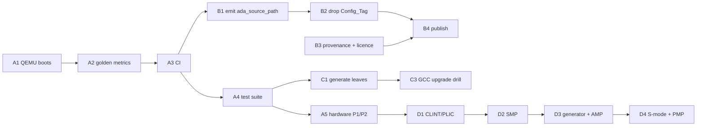

# Getting the MPFS runtime to production quality

A plan for turning `rts-spikes/` into runtime crates other people can depend on.

**Assumed definition of done**, because the answer branches on it: *a set of Alire crates a third party can add to a project without pins, which boot on a real Icicle Kit, and which survive a GCC release.* Certification is deliberately **not** assumed — [Phase E](#phase-e--only-if-certification-is-in-scope) says what it would add. If the goal is narrower (internal use, no publishing) then [Phase B](#phase-b--make-it-publishable) collapses and this gets much shorter; say so before starting.

---

## Where we actually are

Honest reading of the spike as it stands: **268 tracked files, 42 commits, five applications that build, and not one instruction that has ever executed.**

| | Status |
|---|---|
| The design composes | **proved.** Four crates, three profiles, two targets, one tier-1 snapshot |
| Every mechanism it relies on | **measured**, except one ([B1](#b1-generate-ada_source_path--the-one-unproven-mechanism)) |
| The images run | **unknown.** Nothing has been executed, on hardware or emulator |
| Regressions get caught | **no.** `make verify` prints a table; it asserts nothing |
| Someone else can use it | **no.** Path pins, hand-written `ada_source_path`, `Config_Tag` |
| It survives a toolchain bump | **untested.** `populate.sh` has guards, but they have only ever seen 15.1.2 |

That table is the plan. The three gaps are *different in kind* — running, publishing, staying correct — and they want different work.

**The most important line is the third.** A runtime that builds and has never run is not most of the way done. Every number quoted so far — `text 1340`, `Tag_RISCV_arch`, ELF segment layout — is a property of a *file*. None of it is evidence that the clock tree initialises, that the trap vector is reachable, that `delay until` returns, or that the console emits a byte.

---

## One finding that changes the shape of the plan

**QEMU models this board, and it is already installed here.**

```
$ qemu-system-riscv64 -M help | grep -i microchip
microchip-icicle-kit Microchip PolarFire SoC Icicle Kit
```

(QEMU 11.0.1 via Homebrew.) That means "does it run?" is answerable **in CI, on every commit, without a board**, which is normally the expensive part of bare-metal work.

What I measured, so this is not oversold: QEMU accepts both `hello_mpfs` (U54, hard-float) and `clock_switch_e51` (E51, soft-float) via `-M microchip-icicle-kit -kernel <elf>` **without complaint** — no load error, no illegal-instruction abort — and produced **no console output** within ~15–20 s in either case. So the emulator is a real path, and getting the first byte out of it is a bounded piece of work, not a formality. Likely causes to work through, in order of suspicion: QEMU's Icicle model expects HSS in eNVM and may need `-bios none` for a direct `-kernel` boot; the machine's hart-release behaviour may not match what our startup assumes; and our MMUART base/divisor may disagree with QEMU's model.

That task is [A1](#a1-get-one-byte-out-of-qemu), and it is the first thing I would do.

---

## Phase A — Make it run, and keep it running

The whole phase is cheap relative to its value, and it retires the largest unknown.

### A1. Get one byte out of QEMU

Boot `clock_switch_e51` under `-M microchip-icicle-kit` and see a character on the console. Work the three suspicions above; expect to read QEMU's `hw/riscv/microchip_pfsoc.c` to find what the machine actually does at reset.

> **Exit:** a documented `qemu-system-riscv64` command line that prints something our program wrote. Record it in the `Makefile`.

**If QEMU turns out not to be viable**, say so early and loudly, because the rest of Phase A reshapes around a hardware-in-the-loop runner and gets substantially more expensive.

### A2. Make the metrics assertions rather than decoration

`make verify` prints `1340 / 1756 / 8058 / 52436 / 1984` and exits 0 regardless. Those numbers appear in a dozen commit messages *because a human retyped them*. Replace with a committed golden file and a non-zero exit on drift, with a documented way to re-bless.

> **Exit:** `make verify` fails when any image's `text`, `bss`, entry point or ABI tag changes without the golden file changing.

Do this before A3 — it is what makes CI meaningful rather than a build-only smoke test.

### A3. CI

Build all five applications and run the QEMU smoke test on every push. Needs the two toolchains and `alr`; a container or a cached toolchain install.

> **Exit:** a red build on a deliberately broken commit, from a clean checkout — which also proves the `make populate` prerequisite is honestly documented.

### A4. A test suite that exercises the runtime's own surface

There are **no tests in `rts-spikes/`** today. The runtime's job is exactly the thing no application-level check covers, so this is not optional at production quality:

| Area | Minimum test |
|---|---|
| tasking | two tasks, `delay until`, verify ordering and elapsed time |
| protected objects | entry with a barrier, released from an ISR |
| interrupts | a timer interrupt reaches its handler on the *owning* hart |
| exceptions (`embedded`) | raise across a subprogram boundary, catch, propagate |
| `Text_IO` | round-trip through the selected `Console` value |
| the `light` floor | that a `light` build *rejects* tasking constructs |
| configuration checks | each `Compile_Time_Error` fires — build-time negative tests |

The last row deserves emphasis: CONTRACT.md §7.4/§7.12 record that these checks have twice been silently dead. Negative build tests are the only thing that keeps them honest, and `pragma Pure` ([`d15429f`](rts-spikes/rts_support_mpfs/src/mpfs_config_checks.ads)) now covers only the staticness half.

> **Exit:** the suite runs under QEMU in CI, and each `Compile_Time_Error` has a build that must fail.

### A5. Real hardware

QEMU is a model; it will happily emulate a clock tree we programmed wrongly. The RTS-POLARFIRE.md §10 milestones are the right ladder: **P1** an E51 and a U54 image from one crate at `Memory_Profile => lim`, then the same U54 image at `ddr_by_bootloader`; **P2** Ravenscar tasking on hart 3 and an ISR in that hart's ITIM.

> **Exit:** P1 and P2 pass on an Icicle Kit, with the QEMU suite from A4 also green there.

---

## Phase B — Make it publishable

Nothing here is optional if a third party is to use these crates, and one item is the only genuinely unproven mechanism in the whole design.

### B1. Generate `ada_source_path` — the one unproven mechanism

Today it is hand-committed with relative entries (`../rts_sources_gcc15/libgnat`), which work **only because the crates are path-pinned siblings**. Verified: a fetched crate lands in `~/.local/share/alire/builds/<crate>_<version>_<id>/<hash>/`, and no relative path reaches from one to another. RTS.md §8 item 1 has called this out from the start.

Also verified, and it raises the stakes: `ada_source_path` is read **during compilation**, not only at bind time — a subunit is located by searching it, so an incomplete list fails the compile of a *different* unit than the one that looks wrong.

Decide between `post-fetch` (runs before configuration values exist) and `pre-build` (ordering across a dependency graph needs checking against the Alire version in use), then implement and test **against a fetched, unpinned crate**. Emitting three lines of text is the easy part; being emitted at the right moment is the whole problem.

> **Exit:** a leaf consumed with no `[[pins]]` at all, from a different directory, builds and binds.

### B2. Delete `Config_Tag`

CONTRACT.md §7.11 says outright: *"Do not copy this into a published crate."* It exists because path-pinned crates build in-tree and share one `adalib`. Once B1 lets crates be fetched, Alire's hash-keyed build cache provides the isolation and `for Library_Dir use "adalib"` is correct.

> **Exit:** two applications at different configurations of one fetched runtime crate, each getting its own library, with no tag in any project file. Then `ada_object_path` becomes truthful again — it currently names an `adalib` that does not exist.

### B3. Tier 1 provenance, licensing, and versioning

The hardest *non-technical* item, and the one most likely to stall a submission.

- **Provenance.** `populate.sh` copies ~1050 units out of an installed toolchain. A published crate cannot do that: a fresh clone does not build, and the crate's content depends on what the publisher had installed. Either vendor the snapshot into the crate (and carry the bytes) or make the copy step reproducible from a named GCC release.
- **Licensing.** These are FSF/AdaCore sources under GPL-3.0-or-later WITH GCC-exception-3.1. Redistribution needs the notices right, and `authors`/`maintainers` need to distinguish "wrote it" from "packaged it".
- **Versioning.** RTS.md §8 item 7. `rts_sources_gcc15` must have a version scheme tied to the GCC release it snapshots, so a leaf can depend on a range and a GCC bump is a manifest edit.

> **Exit:** a clean-machine `alr get` of the leaf produces something that builds, with a licence and provenance statement a reviewer would accept.

### B4. Verify the `provides` ordering, then publish

The capability-floor scheme (`gnat_rts=1|2|3`) has its **declaration** half measured — `alr show` reports each floor — and its **constraint** half unverified: whether `gnat_rts = ">=2.0.0"` resolves against a *virtual* name as it does against a real crate. Two throwaway local crates settle it in twenty minutes. Fallback if it fails: one virtual name per capability, losing the ordering.

Then publish to a private index first and consume from a clean machine, before proposing to the community index.

> **Exit:** a third-party project depends on `light_tasking_mpfs` by name plus `gnat_rts = ">=2.0.0"`, and resolves.

---

## Phase C — Make it survive maintenance

### C1. Generate the leaves

RTS.md §7 is explicit that the entire tier analysis *assumes the leaf is thin and generated*, and that hand-writing them fails immediately: three near-copy `target_options.gpr`/`runtime_build.gpr`/manifest sets, close enough that nobody diffs them and different enough that divergence reads as intentional. That already produced one real defect — a leaf silently re-derived the ISA hardcoded to hard-float, and every build of that profile was wrong until the files were compared by hand.

Four leaves is where this is still cheap to fix. Twelve is where it is not.

> **Exit:** the leaves are emitted from one description plus per-profile data, and a diff of the generated output against today's files is empty or explained.

### C2. Settle tier 2

Measured at **six files against tier 1's ~1050**, one of them an empty `pragma Pure` package, sharing tier 1's release cadence. RTS.md recommends folding it in. The counter-evidence is that `rts_core_cortexm` is now serving a second target — so decide on evidence rather than leaving it as an open question in three documents.

> **Exit:** either folded, or a written reason naming the cadence that justifies it.

### C3. Rehearse a GCC upgrade

The `assert_identical` guards in `populate.sh` have only ever run against 15.1.2. They exist precisely for the case where a compiler release breaks a sharing assumption — so run that case deliberately, on the next available toolchain, and measure the churn.

> **Exit:** a written report: which guards fired, how many files moved, how long it took. That number is what a downstream user needs in order to trust the crate.

### C4. Write the consumer's documentation

`RTS.md`, `RTS-GUIDE.md`, `RTS-POLARFIRE.md` and `CONTRACT.md` are for *us*. A board porter needs a short document that says: add these dependencies, set these values, here is what each knob does, here is how to add your board.

> **Exit:** someone who has not read the other four documents ports a board.

---

## Phase D — The features that are still missing

These are RTS-POLARFIRE.md §10's P2–P5 and they are the largest bodies of work, but they are *additive*: none of Phase A–C depends on them.

| | Work | Notes |
|---|---|---|
| **D1** | Hart-indexed CLINT/PLIC; L1 cache/SRAM split | RTS-POLARFIRE §8 item 1 and item 6. Prerequisite for anything multi-hart |
| **D2** | SMP — `Harts_Mask` sets, SMP startup, `Max_Number_Of_CPUs > 1` | Multiplies with `Privilege`: single/SMP × M/S-mode is four startup variants |
| **D3** | Fork the vendor generator → real `mpfs_system` → derived mode → AMP | `mpfs_system` is a hand-written stand-in today. This is where the design is most novel and most likely to need revision |
| **D4** | S-mode, PMP/U-mode partitioning, IPC over the non-cached alias | §6.5 settled the linker-script question; the grain `G` still comes from the XML |

Two known-open items sit inside D3/D4: `make amp` **fails by design** because both demo partitions link at `0x08000000` and need per-partition placement from `mpfs_system`; and the RP2350 leaf needs its linker scripts, hard-float switches and a single-precision `rts_capabilities.ads` — the tier-3 overlay for it already exists.

---

## Phase E — Only if certification is in scope

Not assumed, and it changes Phase A and B rather than appending to them: requirements traceability from the SoC documentation through the configuration checks, `.ali`-based evidence packaging (the `Source_List_File` is the *claim*, the `.ali` set is the *evidence*), an ACATS subset argument for a configurable runtime, and a defensible answer to silent basename shadowing. Ask someone who has taken a runtime through qualification before committing to a route.

---

## Sequencing, and what I would do first



**A1 → A2 → A3 is the whole recommendation.** It converts a design that is argued into a design that is exercised, it is the cheapest work in the plan, and everything after it gets safer because a regression becomes visible the same day. A2 in particular is embarrassing to be missing: the numbers this project quotes as evidence are currently checked by eye.

**B1 is the one that could invalidate something.** It is the only mechanism in the design that has never been demonstrated. If `pre-build` ordering turns out not to give the leaf a chance to write `ada_source_path` before binding, the fallback — vendoring tier 1 into each leaf — undoes most of the sharing the hierarchy exists for. Worth doing early *for information*, even out of order.

**Do not start Phase D before A3.** D2 through D4 are where multi-hart timing bugs live, and debugging those without a regression suite is how the schedule disappears.

---

## Risk register

| Risk | Signal | Response |
|---|---|---|
| **B1 has no working mechanism** | `pre-build` runs too late, or before configuration exists | Vendor tier 1 per leaf; accept the duplication and keep the hierarchy for provenance only |
| QEMU cannot boot our images | A1 stalls past a couple of days | Hardware-in-the-loop runner; Phase A gets materially more expensive |
| Tier 1 licensing blocks publication | Reviewer objects to redistributing GCC sources | Publish the *lists* plus a reproducible fetch, not the bytes |
| The `>=` on a virtual name does not resolve | B4 experiment fails | One virtual name per capability; lose the floor ordering |
| A GCC bump breaks the shared overlays badly | C3 shows large churn | Split the overlays the guards name; the guards were built for this |
| Hand-written leaves diverge again | Any two leaves disagree on something neither README explains | C1, sooner rather than later |

## Housekeeping, worth doing today

- **42 commits are unpushed** on `claude/gnat-runtimes-alire-crates-401089`.
- `light_tasking_pico/alire/settings.toml` still names deleted crates (`rts_sources_gcc15_arm`, `rts_support_rp2040`) — generated and untracked, harmless, but it will confuse someone.
- `rts_support_pico/ld/memory-map.ld`'s `(rx)` comment reads as a guarantee; `ld` does not enforce region attributes ([RTS.md A.25](RTS.md#a25)).
