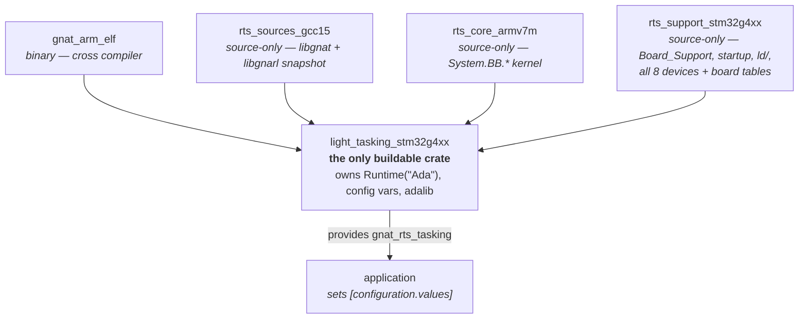

# Composing GNAT Bare-Board Runtimes as a Hierarchy of Alire Crates

- **Status:** Draft 1 — 2026-07-26
- **Question:** GNAT runtimes for microcontrollers are generated today by [bb-runtimes](https://github.com/AdaCore/bb-runtimes), a Python build system over a monolithic source repository. Could a hierarchy of Alire crates produce the same set of variations instead? Where do the boundaries belong — what is a configuration variable, and what requires its own crate?
- **Short answer:** Yes, and about a third of it already exists. The boundaries sit much further out than they first appear: only the target triple, the runtime profile, the device-support family, and the separately versioned source bodies are genuinely crates. Device, board, *and* ISA/ABI are all configuration variables — every claim here was checked by building real Cortex-M and RISC-V ELFs (Appendix A), and two of the document's own earlier verdicts were retracted that way. The hierarchy's payoff is in maintenance, not in the build.

---

## 1. What has to be produced

A GNAT runtime for a bare-board target is a **directory**, and everything below is downstream of that fact. Inspecting a stock `arm-eabi` installation:

```
light-cortex-m4f/
├── ada_source_path        # newline-separated list of source DIRECTORIES
├── ada_object_path        # likewise for objects
├── ada_target_properties  # target arithmetic/type model, for GNATprove & CodePeer
├── runtime.xml            # gprconfig fragment: -mcpu, -mfloat-abi, linker switches
├── adalib/                # libgnat.a (+ libgnarl.a), one .ali per unit
├── gnat/                  # the runtime sources
└── gnat_user/             #   … in more than one directory
```

`for Runtime ("Ada") use <dir>` resolves to exactly one of these. There is no mechanism by which two crates each contribute half a runtime to a link: the compiled artifact is monolithic per (target × profile × configuration). **Any crate hierarchy is therefore a source-composition hierarchy that terminates in a single crate owning the directory above.** That single crate is called the *leaf* throughout this document.

**Nothing in that directory has to be shipped compiled.** A published runtime crate contains no `adalib/` and no object files at all — only the sources, the metadata files, and a library project. `runtime_build.gpr` declares `Library_Name "gnat"`, `Library_Dir "adalib"`, and `for Runtime ("Ada") use Project'Project_Dir`; the application `with`s it, so gprbuild compiles the runtime *before* the application and produces `adalib/libgnat.a` on the spot. A pure-source runtime is therefore not merely sufficient — it is what the ecosystem already ships (verified in Appendix A).

What the library *project* buys, and why the runtime cannot simply be extra source directories in the application's own project, is the separate compilation régime: `-gnatg -nostdinc`, `Global_Configuration_Pragmas`, and per-unit switch overrides (`a-except.adb` at `-O1 -fno-inline`, `s-macres.adb` at `-fno-inline`, `system.ads` with `-gnatet=`) that must not apply to application code. The library is a build product; only its recipe is shipped.

Two consequences of building at application-build time are worth naming: the first build of any application pays for the whole runtime (~8 s for `light`, ~21 s for `embedded` on a current laptop), and the resulting `adalib/` and `obj/` land *inside the Alire dependency cache directory* — the build writes into what is otherwise a read-mostly shared cache.

**The tasking profiles are two library projects, not one.** `light-tasking` and `embedded` add a `gnarl/` and `gnarl_user/` source tree and a second library project, `ravenscar_build.gpr`, which `with`s `runtime_build.gpr` and produces `libgnarl.a` into the *same* `adalib`. Both appear in the manifest's `project-files`, and the application must `with` both. So the leaf owns one runtime directory but up to two library projects, each listing only its own source directories — a detail with consequences in §1.1 and §5.4. `embedded` additionally compiles C (`for Languages use ("Ada", "Asm_Cpp", "C")`) for the unwinder.

The variation to be produced spans roughly:

| Axis | Range in bb-runtimes today |
|---|---|
| Target triple | `arm-eabi`, `riscv64-elf`, `aarch64-elf`, `powerpc-elf`, `avr`, … |
| Architecture / ISA | `cortex-m0`, `m0p`, `m1`, `m23`, `m3`, `m4`, `m4f`, `m7f`, `m7df`, `m33f`, Cortex-A/R, RV32/64 |
| Runtime profile | `none`, `light`, `light-tasking`, `embedded`, `cert` — but only three are distinct crates; see §4 on `cert`/`none` |
| SoC / board | ~40 boards under `arm/`, plus `riscv/`, `powerpc/`, … |
| Multiprocessing | single-core vs. SMP (`rpi-pico-smp`, `polarfiresoc-smp`) |
| Feature flags | `Has_FPU`, `Memory_Profile`, `Add_Image_Int`, `Has_Compare_And_Swap`, … |
| Board parameters | crystal frequency, PLL dividers, flash/RAM size, timer choice, IRQ count |
| Tunables | stack sizes, secondary-stack size, tick rate, build profile |

The cross product is what makes the current design what it is: `light-cortex-m4f`, `light-tasking-stm32f4`, `embedded-samv71`, and so on — 60-odd directories in one installation.

### How bb-runtimes expresses that variation

Three mechanisms, worth naming because each maps onto a different Alire/GPR facility:

1. **Python target descriptions.** `arm/cortexm.py`, `arm/cortexar.py`, `riscv/…` define classes per board that declare source lists, `runtime.xml` content, and feature flags. `build_rts.py` walks them.
2. **Filename-suffix variant selection.** `src/` holds `s-bbbosu__armv7m`, `s-bbbosu__rp2040`, `s-bbcppr__armv7m`, `s-bbbopa__polarfiresoc`, `a-intnam__…` — one unit, many variants, the suffix picked per target at generation time.
3. **Scenario flags with dependency closure.** `support/rts_sources/profiles.py` defines the five profiles not as unit lists but as dictionaries of flags (`{"Add_Image_Int": "yes", "Has_FPU": …, "Memory_Profile": …}`); `sources.py`'s `check_deps()` evaluates conditional rules to derive which files the flags imply.

Point 3 is the important one. The profiles are *already* a configuration-variable system with a derivation step — it just happens in Python at generation time rather than in a package manager at build time.

---

### 1.1 Which tool consumes which metadata file

The three metadata files look like legacy scaffolding that a project-driven Alire build might bypass. They are not: each is consumed by a different stage, and removing any one breaks the build differently. Measured by deleting each from a working runtime crate and rebuilding a trivial Cortex-M4F application from clean (Appendix A):

| File | Consumer | Symptom when absent |
|---|---|---|
| `runtime.xml` | gprconfig, at configuration time | ISA switches vanish; the assembler falls back to generic ARM and rejects Cortex-M instructions — `Error: selected processor does not support 'cpsid i' in ARM mode` |
| `ada_source_path` | **gnatbind** | Compilation succeeds, *binding* fails: `gprbind: invocation of gnatbind failed` |
| `ada_object_path` | gnatbind / linker | Build fails outright |

Identical results on all three profiles (`light`, `light-tasking`, `embedded`). The `ada_source_path` result is the informative one, and it decomposes the build into three consumers rather than two:

- **Compilation of application units** takes the runtime's source list from the *project* — `Source_Dirs` filtered by `Excluded_Source_Files`, not from `ada_source_path`.
- **Compilation of runtime units that reference another of the runtime's own libraries** goes through `ada_source_path`. Each library project lists only its own directories, so nothing else can resolve a `libgnat` unit's reference to a `libgnarl` unit. Dropping the `gnarl` entries breaks `embedded` at *compile* time — `s-ransee.adb:34:06: error: "Ada.Real_Time" is not a predefined library unit`, i.e. `System.Random_Seed` in `libgnat` reaching for `Ada.Real_Time` in `libgnarl`. The same truncation leaves `light-tasking` building fine, because its `libgnat` happens to contain no such reference (A.13).
- **Binding** reads `ada_source_path` directly from the runtime directory.

So its content must be complete, not merely present — and how loudly an incomplete list fails is profile-dependent, which makes it a poor thing to get subtly wrong. The asymmetry is worth knowing: a *missing* directory breaks the build, while a *stale* one is silently ignored — `AVRAda_RTS` lists a `gnat_user` directory that does not exist in the crate and builds regardless. Completeness is checked; correctness is not. This matters twice over in §6.

## 2. What Alire and GPR actually provide

### 2.1 GPR source resolution

For each non-abstract, non-aggregate project view, GPR scans every directory in `Source_Dirs` **in declaration order**, then filters the resulting candidate set by `Source_Files` / `Source_List_File` (restrict to a list), `Excluded_Source_Files` / `Excluded_Source_List_File` (remove), and the `Naming` package ([source resolution reference](https://docs.adacore.com/live/wave/gprbuild/html/gpr_reference/source_resolution.html)).

Two properties matter here:

- **Selection is file-granular, both ways.** bb-runtimes' per-profile unit sets port over directly as `Source_List_File` contents; per-configuration body choices port over as `Excluded_Source_Files`. Nothing has to be rearranged into per-profile directories.
- **Duplicate basenames resolve by `Source_Dirs` order.** Where the same basename appears under two different `Source_Dirs` values, *"the directory corresponding to the earlier value takes precedence; no error is reported."* (The exception: within a single recursive `"src/**"` value, a duplicate is an error, since ordering cannot resolve it.)

That precedence rule is a native replacement for mechanism 2 above. Order the directories board → architecture → shared, and a board-specific `s-bbbosu.adb` shadows the architecture-generic one with no filename suffixes and no exclusion lists. It makes a crate hierarchy *layered* rather than merely additive, which is what a family support layer wants to be.

The hazard is the same sentence: *no error is reported*. Silent shadowing inside the one artifact a certification reader has to audit is the wrong failure mode. So use ordering for **variants of a unit** and an explicit `Source_List_File` for **membership**: the list makes the runtime's unit set a reviewable manifest, and a typo becomes a missing source rather than a quietly different one.

### 2.2 Alire

| Mechanism | Use here |
|---|---|
| `[configuration.variables]` | typed knobs (`Integer` with `first`/`last`, `Enum`, `Boolean`); Alire generates an Ada spec, a GPR fragment and a C header |
| `[configuration] output_dir` | **where** those generated files land — set it to a directory that is itself a runtime source dir |
| `[configuration.values]` | the only way to set a dependency's variables: the *application* configures the runtime |
| `provides = ["name=version"]` | crate equivalence: lets several crates satisfy one abstract dependency |
| `[[actions]]` | `post-fetch`, `pre-build`, `post-build`, `test`, executed in dependency order |
| `auto-gpr-with = false` | stop Alire auto-`with`ing a crate's GPR into the root project |
| build hash | configuration values are part of it, so a knob change forces a rebuild |

Two limits shape everything downstream:

- **A configuration variable cannot select a dependency.** Alire resolves the graph before configuration is applied, so there is no "one runtime crate whose `Architecture` variable pulls in a different compiler." Anything a *dependent* must be able to select on has to be expressed as a crate name or a `provides` alias.
- **A multi-binary system has no common configuration root.** Configuration flows downward from *a* root, so two programs that must agree on something — a shared memory allocation, ownership of a peripheral, which CPU runs which image — have no crate that can carry the agreement. This bites on any AMP or multi-partition target, and the only answer is to move the agreement out of configuration and into *generated data* that every root depends on. §10.4 is the worked case.
- **Configuration values have no command-line override.** Only a depending crate's `[configuration.values]` sets them. For runtimes this is benign — the application is exactly who should declare the clock tree — but it means no `alr build -XClock=48000000`. Where a knob genuinely needs command-line reach, it has to be a plain GPR `external()` alongside (or instead of) a configuration variable.

---

## 3. The boundary rule

> **Separate crate** when the variation changes the dependency graph or the exported API.
> **Configuration variable** when it changes only numbers, addresses, or which sources are selected behind a fixed interface.

Applied as three tests, in order:

1. **Solver test** — does a *dependent* crate need to select on it? A configuration variable is invisible to dependency resolution, so anything an application must be able to require (a tasking runtime, a particular compiler) is a crate. Note what this does *not* catch: a hard-float ABI looks like a solver concern and is not, because every Ada crate in the index is a source crate rebuilt against the application's runtime (§4.2).
2. **Version test** — does it have its own release cadence, provenance, or licence? A snapshot of GCC's `libgnat` is versioned against the compiler; family support code generated from vendor register data is versioned against that data. Different cadences want different crates.
3. **Otherwise** — configuration variable. Numbers, addresses, memory sizes, timer selection, stack sizes, and body selection behind a frozen spec are all knobs.

The reason this rule is worth stating rather than deriving case by case: it is very tempting to make a crate per variation because bb-runtimes has a *directory* per variation. Almost all of those directories are the cross product, not the design.

---

## 4. Where each axis falls

| Axis | Verdict | Reasoning |
|---|---|---|
| Target triple | **crate** (compiler) | `depends-on gnat_arm_elf` vs. `gnat_riscv64_elf`; solver test, decisively |
| Runtime profile (`light` / `light-tasking` / `embedded`) | **crate** | Solver test: an application must be able to require tasking. Also changes the exported unit set (`libgnarl`, full `a-except`) and the `System` restrictions. Matches ecosystem practice |
| ISA / ABI within one architecture generation (`m3` / `m4` / `m4f`) | **variable** | `runtime.xml` is not static — its CDATA is GPR source and already uses `external()` with a `case`. One crate builds consistent hard-float M4 and soft-float M3 binaries from one source tree (A.16). See §4.2 |
| Architecture generation (ARMv6-M ↔ ARMv7-M ↔ ARMv8-M) | **variable** selecting source variants, or a crate | Not a switch axis: ARMv6-M rejects the Thumb-2 wide instructions in the ARMv7-M sources (A.16). Expressible in one crate via `Excluded_Source_Files` over `s-bbcppr__*`/`s-bbbosu__*` variants; a crate split is a packaging choice, not a requirement (§4.2) |
| `libgnat`/`libgnarl` source snapshot | **crate**, but *not* a flat union | Version test: versioned strictly against the compiler, licence `GPL-…-or-later WITH GCC-exception-3.1`, and the largest single duplication in the ecosystem today. It is **not** identical for every target: GNAT decides feature availability from what is *visible* on the source path, so the crate must expose a common set plus per-profile overlays (A.23) |
| Architecture core sources (`System.BB.CPU_Primitives`, context switch, threads, time) | **crate** (tier 2), or a subdirectory of the snapshot crate | This is *where the per-generation variants live*, not a second leaf-splitting axis. Version test, weakly — see §7, the boundary that pays least |
| Device-support family (`System.BB.Board_Support`, startup, vectors, register subset) | **crate** per family | Version test: generated from vendor register data with its own cadence. One crate carries *every* device, board and ISA in the family — see §4.1 |
| Device within a family | **variable** | `MCU_Sub_Family` + memory-size selector; picks interrupt names, memory map, peripheral set (§4.1) |
| Physical board | **variable** — never a crate | `Board` enum of known boards plus a `generic_board` escape hatch whose individual knobs apply only in that case (§4.1) |
| Board parameters (crystal, PLL dividers) | **variable** | Numbers. See §5 |
| Memory map | **variable** selecting a pre-generated linker script | Not textual generation — see §5.3 |
| Timer choice | **variable** | `Time_Base = { type = "Enum", values = ["ALARM0", …] }` |
| SMP | **variable** | `Max_CPUs = { type = "Integer", first = 1, last = 2 }`. Changes core sources, but no dependent needs to solve on it |
| Stack sizes, secondary stack, tick rate | **variable** | Numbers |
| Build profile (`Production` / `Debug` / `Assert`) | **variable** or GPR external | Prefix the external with the crate name so it can be set for the runtime alone |
| `Ada.Text_IO` backend | **variable** | The `System.Text_IO` spec is frozen; only the body changes. Selection by `Excluded_Source_Files`. Collapse the axis further where possible: a RAM-ring-buffer sink whose size may be 0 subsumes both "semihosting" and "none" without separate bodies |
| Feature flags (`Has_FPU`, `Memory_Profile`, `Add_Image_Int`) | **variable**, derived | These are bb-runtimes' scenario flags; §5.2 covers derivation |
| `cert` | **variable** on the `light` crate, not a profile of its own | bb-runtimes defines it as `light` plus I/O exceptions minus packing support — a flag set over `light`'s, not a distinct unit set or API. It fails the solver test (no dependent selects on it) and belongs with the other feature flags. `none` is likewise `light` with everything switched off |

Two entries deserve emphasis because they are counterintuitive.

**Profile is a crate, and the mechanism for saying so is `provides` — with one important limit.** Every tasking-capable leaf declares

```toml
provides = ["gnat_rts_tasking=1.0.0"]
```

The mechanism is real and in production use: seven compiler crates declare `provides = ["gnat=<version>"]`, and a dependency on `gnat = "*"` resolves, with the solution reporting the provider — `gnat=16.1.0 (gnat_native)` (A.17). Note the version must be a full three-part semver.

**But a virtual name is a constraint, not a selector.** With seven crates providing `gnat`, a bare `gnat = "*"` dependency silently resolved to the *host* compiler — not an embedded one. The same would happen to an application depending only on `gnat_rts_tasking`: it would get an arbitrary SoC's runtime. So the division of labour is:

- a **library** crate uses the virtual name to say "I require a tasking runtime", which is satisfied by whichever concrete runtime the application already pulled in;
- the **application** must still name its runtime crate concretely. The virtual name must never be the only runtime-shaped dependency in a solution.

With that split, the compatibility matrix between library crates and runtime profiles stops being documentation and becomes something the resolver enforces. Without it, `provides` silently picks for you.

**SMP is a variable, not a crate.** It flips which core sources compile, which feels like a crate-sized change — but the test is whether a *dependent* selects on it, and nothing outside the runtime does. Published practice agrees: `Max_CPUs` is an ordinary `Integer` configuration variable.

---

### 4.1 The device and board dimension

Boards are the cheapest artifact in the whole system to produce and therefore the highest-churn dimension: a board is a crystal frequency, a flash chip, a startup delay, a memory size and a name. **A new board must never require a new crate**, and neither should a new device within a family. Both are configuration.

The reason follows straight from §3 rather than from convenience. A board fails the **solver test** — no crate ever needs to depend on "the Nucleo-G474RE variant" — and it fails the **version test**, because a board is a row in a table, not a component with a release cadence. What a board *is*, in the runtime's terms, is a set of values for knobs that already have to exist.

**The shape: three levels, narrowing.**

1. **Device** — `MCU_Sub_Family = { type = "Enum", values = ["G431", "G441", "G473", "G474", …] }`, plus a memory-size selector. Picks the interrupt-name package, the memory map, and the peripheral set.
2. **Board** — `Board = { type = "Enum", values = ["generic_board", "rpi_pico", "adafruit_feather_rp2040", …] }`. Picks the crystal, flash chip and startup delay for a known board in one setting.
3. **Individual knobs** — honoured when `Board = generic_board`, for a custom board that no enumeration will ever list.

Both halves of this exist in production today: the STM32G4 crate does level 1 plus a fully exposed clock tree; the RP2040 crate does level 2 with a `generic_board` escape hatch whose knobs (`XOSC_Frequency`, `XOSC_Startup_Delay_Mult`, `Flash_Chip`) are consulted only in that case. Neither does all three; combining them is the obvious synthesis, and needs no mechanism that is not already proven.

**Where a crate boundary *is* required.** Only three things:

- **Target triple** — a different compiler crate.
- **Runtime profile** — the solver test (§4).
- **Device-support family** — not for any mechanical reason, but because the support code differs *in kind* between vendors. One crate spanning every MCU family for a triple would carry every vendor's registers, board support and startup, and every fix would churn every user. Family is where the blast radius is drawn.

Architecture generation is *not* on the list: the sources differ, but that is expressible as a source-selecting knob rather than a crate (§4.2).

Everything else — device, memory size, board, clock tree, timer choice, flash chip, stack sizes, **and the ISA/ABI itself** — is a knob. So the rule is: **one crate per (target triple × runtime profile × device-support family); device, board and ISA inside that are configuration.**

The degenerate case is instructive: a `light` runtime has no support code at all, so its family set is empty and the rule collapses to one crate per (triple × profile) — which is exactly the consolidation §4.2 identifies.

**The current split does not follow that rule, and the evidence is in one repository.** `light_stm32g4xx` covers eight sub-families (G431 … G4A1) with a `MCU_Sub_Family` enum, five flash-size and three RAM-size linker-script directories, and the whole clock tree — one crate per profile for the entire family. Meanwhile `light_nrf52832`, `light_nrf52833` and `light_nrf52840` are three separate crates generated from a *single* `nrf52_src` overlay whose per-device content is `setup_board.adb`, `a-intnam.ads`, `handler.S`, a register subset, and a `memory-map_nrf52XXX.ld`. All three parts are Cortex-M4F. Every one of those differences is something the STM32G4 crate already handles as configuration within one crate. The nRF52 split is inherited from bb-runtimes' Python target table, not chosen — which is exactly the kind of accident a stated boundary rule prevents.

**The mechanisms needed to hold N devices in one crate are all verified.** Nothing here is speculative:

- **Per-device unit selection** via the `Naming` package: `for Spec ("Ada.Interrupts.Names") use "a-intnam-" & Config.MCU_Sub_Family & ".ads";` — production code in the STM32G4 crate.
- **Suppressing the unselected variants** via config-driven `Excluded_Source_Files`, which the same crate uses to drop the other seven `a-intnam-*.ads` files. Enforced against application code with a clean diagnostic (A.12).
- **Per-device linker scripts** by selecting a directory rather than templating text (§5.3).
- **Per-device data** as static `case` expressions over the device or board enumeration (§5.2).

**Two gaps worth closing while adopting this.** First, an ignored knob is currently silent: setting `XOSC_Frequency` while `Board = rpi_pico` has no effect and no warning. `pragma Compile_Time_Error` fixes it, and works under a `light` runtime (A.15):

```ada
pragma Compile_Time_Error
  (Config.Board /= Generic_Board and then Config.XOSC_Frequency /= 0,
   "XOSC_Frequency is ignored unless Board is generic_board");
```

Second, `MCU_Flash_Memory_Size = { type = "String", default = "E" }` is untyped where an `Enum` of the five valid letters would have Alire reject a typo instead of passing it into a linker-script path.

**What it costs.** A crate covering N devices ships N interrupt-name specs, N memory maps, and an N-way `case` — all excluded from the build except the selected one, so the compiled artifact is unchanged. Adding a board is a row in an enumeration plus a row in each `case`. Adding a device is that plus one interrupt-name spec and one linker script. Neither touches a manifest, a dependency, or the index.

### 4.2 The ISA/ABI dimension — configuration, not a crate

An earlier draft of this document put ISA/ABI on the crate side, on the grounds that `runtime.xml` is a static file. **That premise is false, and the file itself disproves it**: its `<config>` CDATA is GPR source, and the stock version already declares `Loader : Loaders := external("LOADER", "ROM")` and switches on it. Anything GPR can compute, `runtime.xml` can compute — including the switch list.

Measured on one crate, one source tree, three switch sets (A.16):

| `-XFLOAT_ABI` / `-XMCPU` | Result | `Tag_CPU_arch` | FP tags |
|---|---|---|---|
| `hard` / `cortex-m4` | builds | `v7E-M` | `VFPv4-D16`, `VFP registers` |
| `soft` / `cortex-m3` | builds | `v7` | **none** |
| `soft` / `cortex-m0plus` | **assembler error** | — | — |

The middle row is the point: a fully consistent soft-float ARMv7-M binary, no VFP attributes anywhere, from the crate that ships as hard-float M4F. So ABI *is* a configuration variable.

**The one precondition is a source fix.** The mixed-ISA artifact reported in A.7 was caused entirely by five asm files carrying `.cpu cortex-m4`, which overrides the command line and silently pins those objects to M4 while the Ada objects moved. Deleting those five directives — GNU `as` then honours `-mcpu` — makes the variant consistent, and the hard-float control is unaffected. Hardcoding the ISA in a source file is simply a bug in a crate that intends to be ISA-configurable; `.syntax unified` stays, `.cpu` goes.

**Where the real boundary is.** The `cortex-m0plus` row fails with `cannot honor width suffix -- 'and r0,lr,#0xF'`: ARMv6-M has no Thumb-2 wide encodings, so `breakpoint_handler-cortexm.S` cannot assemble. That is not a switch problem and no `runtime.xml` expression can fix it. Crossing an **architecture generation** — ARMv6-M ↔ ARMv7-M ↔ ARMv8-M — changes the *sources*: bb-runtimes already carries `s-bbbosu__armv6m` / `__armv7m` / `__armv8a`, `s-bbcppr__armv7m`, and per-generation handler variants.

But a source-set axis is not automatically a crate axis either. `Excluded_Source_Files` driven by a configuration value is exactly how the STM32G4 crate already picks one of eight `a-intnam-*.ads`, and it is enforced against application code with a clean diagnostic (A.6, A.12). A single crate carrying an `Architecture = { type = "Enum", values = ["armv6m", "armv7m", "armv7em", "armv8m"] }` and selecting among source variants is therefore mechanically available — it is bb-runtimes' `__armv6m`/`__armv7m` filename-suffix convention re-expressed as configuration. Whether to split there is a packaging judgement about blast radius and audit surface, not a constraint.

**What this consolidates.** The chip-agnostic `light` family is the clearest win, because those runtimes have no support layer and no peripheral registers at all — the *only* thing distinguishing `light-cortex-m0`, `m0p`, `m1`, `m23`, `m3`, `m33df`, `m33f`, `m4`, `m4f`, `m7df` and `m7f` is the switch set plus a few architecture-generation source variants. Eleven installed runtime directories become one crate with two knobs.

**What replaces the safety argument I withdrew.** "No tool checks ABI consistency" was the wrong objection — the toolchain does emit ELF attributes, and mismatches show up there; what it lacks is a *diagnostic*. The right mitigations are in-crate and already proven:

- Delete hardcoded `.cpu` directives, so the switch set is the single source of truth.
- Constrain invalid combinations with `pragma Compile_Time_Error` (§5.2, A.15) — e.g. `Float_ABI = hard` on an M0+, or an `-mfpu` value the selected `-mcpu` cannot support.
- Prefer typed `Enum` configuration variables over `external()` strings, so `bogus-cpu` is rejected by Alire instead of reaching `arm-eabi-gcc` (A.7).

Cross-crate ABI mismatch — the classic reason to encode an ABI in a package name — cannot arise here in any case: every Ada crate in the index is a source crate, rebuilt against the application's chosen runtime with the switches that runtime injects. There are no prebuilt binary Ada libraries whose ABI could disagree.

### 4.3 RISC-V: the same conclusion, with cleaner evidence and one new limit

RISC-V was the case where the rule looked least safe — vendor-chosen CLINT/PLIC addresses mean the "architectural core" is not fixed the way Cortex-M's SysTick/NVIC is. Measured on `gnat_riscv64_elf` 15.1.2, it is instead the **strongest** case for ISA-as-configuration, and it exposes a limit ARM did not.

`gnat_riscv64_elf` ships seventeen runtimes, twelve of them chip-agnostic `light-rv*`. Their entire ISA content in `runtime.xml` is two switches — `-march=` and `-mabi=` — and fingerprinting their source trees (A.18) collapses twelve directories to **six**:

| Source tree | `-mabi` | Runtimes sharing it |
|---|---|---|
| rv32, soft | `ilp32` | `rv32i`, `rv32iac`, `rv32im`, `rv32imac` |
| rv32, single | `ilp32f` | `rv32imafc` |
| rv32, double | `ilp32d` | `rv32imafdc` |
| rv64, soft | `lp64` | `rv64im`, `rv64imac`, `rv64imc` |
| rv64, single | `lp64f` | `rv64imafc`, `rv64imfc` |
| rv64, double | `lp64d` | `rv64imafdc` |

Two things follow, and both were confirmed by building:

- **The extension set is a pure switch axis with zero source impact.** Four runtimes share one byte-identical tree. Rebuilding a real RISC-V ELF with `-XRV_ARCH=rv32imac` and then `rv32i` from one source tree both succeed, and `Tag_RISCV_arch` tracks the switch exactly — `rv32i2p1_m2p0_a2p1_c2p0_…` versus a bare `rv32i2p1`.
- **The source axis is (XLEN × float width), and it is three files**: `s-dorepr.adb`, `s-lidosq.adb`, `s-lisisq.adb` — the `Has_FPU` scenario flag of `profiles.py`, choosing between a software reciprocal-sqrt and the hardware `sqrt` instruction.

So a single `light_riscv` crate with an `-march`/`-mabi` pair and a float-width knob replaces twelve installed runtime directories, against ARM's eleven. Combined, roughly two dozen chip-agnostic runtime directories collapse into two crates.

**The new limit: the knob's domain is bounded by the compiler crate's multilibs — but less tightly than it first appears.** Moving `-mabi` from `ilp32` to `ilp32d` fails at link with `undefined reference to '__floatundisf'` and `'__fixsfdi'`. Swapping in the hard-float source variants does *not* fix it: this GNAT build ships only seven libgcc multilibs and `rv32imafdc/ilp32d` is not among them (A.18). Five of the twelve shipped `light-rv*` runtimes have no matching libgcc — a pre-existing inconsistency in the toolchain packaging, not something configuration introduces.

The obvious conclusion — enumerate the seven installed multilibs — is **wrong, and would over-restrict users**. Extensions are not an ABI feature; `-mabi` and XLEN are. GCC's multilib *reuse* table already maps many `-march` values onto an installed directory, which `-print-multi-directory` reports directly (A.19):

| `-march` (with `-mabi=ilp32`) | resolves to |
|---|---|
| `rv32im` | `rv32im/ilp32` |
| `rv32imc` | `rv32im/ilp32` — reused, no directory of its own |
| `rv32imafc`, `rv32imafdc` | `rv32imac/ilp32` — reused; F/D with a soft ABI needs no float multilib |
| `rv32ima` | `.` — **no reuse rule; link fails** |

So the correct constraint is not "must be an installed multilib" but **"must resolve to one"** — i.e. `-print-multi-directory` must not return `.`. That set is a strict superset of the seven directories, it is mechanically generatable by querying the compiler crate, and it is what the `Enum` should list. The one real gap here is `a`-without-`c` (`rv32ima`), plus 32-bit double-float.

**And the application is not confined to the runtime's `-march`.** Because `runtime.xml` injects it as `Leading_Required_Switches` and gcc takes the *last* `-march`, an application can widen it for its own units:

```ada
package Compiler is
   for Default_Switches ("Ada") use ("-march=rv32imac");   --  runtime built at rv32im
end Compiler;
```

Verified (A.19): with the runtime at `rv32im` and the application at `rv32imac`, the build links cleanly, the application really does get `amoadd.w.aqrl` instructions, and `ld` merges `Tag_RISCV_arch` to the union `rv32i2p1_m2p0_a2p1_c2p0_…`. Atomics in application code are therefore *not* blocked by a narrower runtime, as long as the ABI matches.

**But widen the application, never narrow the runtime.** This escape hatch is safe in that direction only. Setting the runtime's `-march` below what the silicon actually is would silently deny the runtime instructions it may depend on — on a tasking profile, the protected-object and interrupt-masking paths are exactly where lost atomics would matter, and nothing diagnoses it. The runtime's `-march` should describe the target; application widening is a workaround for a toolchain gap, not the normal path.

**Two asymmetries worth recording.** RISC-V fails *loudly* where ARM failed silently: an inconsistent ABI here is unresolved libgcc symbols, whereas the ARM mixed-ISA case linked with no diagnostic at all (§4.2). And the RISC-V vendor family layer is remarkably thin — `light-polarfiresoc` differs from chip-agnostic `light-rv64imafdc` by five added files (`s-bbbopa.ads`, a PLIC register binding reused from the SiFive FE310, `riscv_def.h`, `start-ram.S`) plus a different `s-textio.adb`. The CLINT/PLIC concern turns out to be one board-parameters spec and one register binding, which is exactly the tier-3 shape of §4.1 — so the family boundary holds on RISC-V too.

**One incidental confirmation.** The chip-agnostic `light-rv*` runtimes have *no* board layer whatsoever: linking against them leaves `_start`, `putchar` and `__gnat_exit` undefined for the application to supply. That is the empirical form of the claim in §4.2 that these runtimes are pure switch-variants with nothing per-chip in them.

## 5. Plumbing configuration into runtime sources

This is the part that decides whether the scheme is pleasant or awful, and it is fully solved in published practice. Three techniques (§5.1–§5.3), then one question they raise (§5.4).

### 5.1 Generate the configuration unit *into* a runtime source directory

```toml
[configuration]
output_dir = "gnat_config"
```

The directory is listed in both `ada_source_path` and the build project's `Source_Dirs`, so Alire's generated `<crate>_config.ads` is an ordinary runtime unit that runtime sources may `with`. No templating, no substitution pass.

**A note on the name.** Published crates point `output_dir` at **`gnat_user`** — `embedded_rp2040` does — and `avrada_rts` uses Alire's default `config`. `gnat_user`/`gnarl_user`/`ld_user` are the directories the runtimes GNAT ships reserve for *users* to drop in their own overriding sources, so pointing generated configuration at one is a pun on a hook that no longer serves its purpose. Prefer **`gnat_config`** (and `gnarl_config`, where a second library project needs one) for a new crate: the `gnat`/`gnarl` half is load-bearing — it says which library project claims the units, and a unit cannot belong to two — while `_user` describes nobody. Keep hand-written files such as the shim below out of it, in `src/`, so the generated directory can be wholly gitignored.

One problem: the generated package is named after the crate, and the crate name embeds the profile — `light_rp2040_config` vs. `light_tasking_rp2040_config`. Shared sources cannot `with` a name that varies. The fix is a one-line renaming shim, the only per-leaf generated Ada in the whole design:

```ada
pragma Restrictions (No_Elaboration_Code);
with Light_Tasking_RP2040_Config;
package RP2040_Runtime_Config renames Light_Tasking_RP2040_Config;
```

Every shared source `with`s the stable name. **This shim is what makes source sharing across leaves possible at all** — without some such indirection every shared file would be crate-name-dependent. A renaming shim is the approach in production; a `Naming` rule mapping a fixed unit name to the per-crate generated file would serve equally, and is worth comparing before committing.

### 5.2 Derive in Ada, not in the generator

bb-runtimes computes feature-flag closure in Python (`check_deps()`). Alire has no derivation mechanism for configuration variables — no computed defaults, no cross-variable constraints. It does not need one: the derivation belongs in a `Pure` Ada spec, where static expressions do the work and the type system checks it.

```ada
Reference : constant Hertz :=
  (if Has_XOSC then RP2040_Runtime_Config.XOSC_Frequency else ROSC_Frequency);

Clk_Sys_Frequency : constant Clk_Sys_Frequency_Range :=
  (((Reference / RP2040_Runtime_Config.PLL_Sys_Reference_Div)
    * RP2040_Runtime_Config.PLL_Sys_VCO_Multiple)
   / (RP2040_Runtime_Config.PLL_Sys_Post_Div_1
      * RP2040_Runtime_Config.PLL_Sys_Post_Div_2));
```

This yields **two-stage configuration validation**, and the second stage is something no package manager could offer:

- Alire's types check each knob in isolation — `PLL_Sys_VCO_Multiple` must be `16 .. 320`.
- Ada checks the *consequences* — whether the resulting `Clk_Sys_Frequency` would overclock the part, which depends on four knobs at once and which Alire cannot see.

**The enforcing mechanism is `pragma Compile_Time_Error`, not the subtype.** This is worth stating precisely, because the subtypes above look like they do the work and they do not. Declaring `Clk_Sys_Frequency : constant Clk_Sys_Frequency_Range := …` with an out-of-range static value yields only *warnings* — `value not in range of type "Hertz"`, `Constraint_Error will be raised at run time` — and the build succeeds (A.15). A violated `Static_Predicate` is likewise only a warning (`static expression fails static predicate check`, `expression is no longer considered static`). Under a `light` profile with `No_Exception_Propagation`, that surviving build reaches `Last_Chance_Handler` during startup: a silently bricked board from a mistyped divider.

The production crate does it explicitly, with authored messages — from `setup_pll.adb`:

```ada
pragma Compile_Time_Error
  (PLL_VCO_Freq not in PLL_VCO_Range,
   "Invalid PLL configuration. PLL VCO output requency must be in the"
     & " range 96 .. 344 MHz");
```

So the pattern is: **constrained subtypes to document intent, `pragma Compile_Time_Error` to enforce it.** Verified to work under a `light` runtime (A.15). Adding `-gnatwe` to the runtime's own switches would promote the subtype warnings to errors as well, and is a cheap hardening the runtime crates do not currently apply.

Per-board tables live in the same place, as static `case` expressions over the `Board` enumeration, so adding a board is a diff to one spec rather than a new crate — which is the subject of §4.1.

### 5.3 Select, don't generate, non-Ada artifacts

Linker scripts and boot stages cannot read an Ada spec. Do not template them — pre-generate the variants and select a path in GPR from the configuration value:

```ada
Flash_Size := "16";
case Flash_Chip is
   when "w25q16jv"  => Flash_Size := "2";
   when "w25q32jv"  => Flash_Size := "4";
   when "gd25q64c" | "w25q64jv" => Flash_Size := "8";
   when others      => Flash_Size := "16";
end case;

Linker_Switches :=
  ("-L", Project'Project_Dir & "/ld/flash-" & Flash_Size,
   "-T", Project'Project_Dir & "/ld/common-ROM.ld");
```

and for alternative bodies, negative selection over the candidate set:

```ada
case Flash_Chip is
   when "generic_qspi_128" | "at25sf128a" | "gd25q64c" =>
      Excluded_Sources := ("boot2-generic_03.S", "boot2-w25qxx.S");
   when others =>
      Excluded_Sources := ("boot2-generic_03.S", "boot2-generic_qspi.S");
end case;
for Excluded_Source_Files use Excluded_Sources;
```

GPR is doing the derivation `Board → Flash_Chip → Flash_Size → linker path + excluded sources` here, mirroring in GPR what §5.2 does in Ada. Both are needed: Ada for anything the runtime *code* reads, GPR for anything the *build* reads.

**Selection covers placement, not sizes.** The pattern above works because "which flash chip" is a small enumeration. It fails as soon as a region's *size* is continuous — a configurable memory split, a board-dependent DRAM size — because the cross product of sizes cannot be enumerated as committed files. For those, `ld` accepts a **symbol** where a constant is expected, and `-Wl,--defsym=` supplies it:

```
MEMORY
{
  ram        (wxa) : ORIGIN = 0x80000000,       LENGTH = RAM_LENGTH
  local_sram (rwx) : ORIGIN = LOCAL_SRAM_ORIGIN, LENGTH = LOCAL_SRAM_LENGTH
}
```

Both `LENGTH` and `ORIGIN` work this way, verified (A.20), and derived symbols follow: `__heap_end` came out at exactly `ORIGIN + LENGTH`. So the division is **selection for placement, `--defsym` for sizes** — and a region set to `LENGTH = 0` is legal, which makes zero a natural encoding for "absent" and turns any placement into that region into a link-time error.

**But `ld` checks overflow, never overlap.** A section too large for its region is reported precisely (`region 'ram' overflowed by 2096944 bytes`); two regions *declared* overlapping by 32 KB produce no diagnostic at all (A.20). Linker-side arrangement therefore buys "I placed something where I declared nothing" and never "my declarations collide" — anything needing the latter has to check it in Ada, per §5.2.

---

### 5.4 Can `runtime.xml` be eliminated in favour of pure GPR?

`runtime.xml` is a second language to maintain — XML wrapping a CDATA block that is itself GPR source — for what is ultimately a list of compiler switches. It is fair to ask whether it can simply be deleted.

**It can, and the resulting binary is identical** (verified, Appendix A.8: same `text`/`data`/`bss`, same `Tag_CPU_name`, `Tag_FP_arch`, `Tag_ABI_VFP_args`). It is also already being done: [AVRAda_RTS](https://github.com/RREE/AVRAda_RTS) ships **no `runtime.xml`** — its ISA flags (`-mmcu=`) live in `avr_tool_options.gpr`, and a consuming project applies them through `Builder'Global_Compilation_Switches`. So this is an existence proof, not only an experiment. What `runtime.xml` contributes is only:

- `Compiler'Leading_Required_Switches` for every language — the ISA/ABI flags;
- `Linker'Required_Switches` — the same flags plus `-nostartfiles`, `-nolibc`, and `-L` paths into the runtime's `adalib`, `ld` and `ld_user`.

The linker half moves into GPR trivially: the crate already exports `Linker_Switches`, and applications already `with` it. The compiler half is where the cost sits, because **only two GPR mechanisms have comparable reach, and both have limits that were measured, not assumed**:

| Mechanism | Reach | Verdict |
|---|---|---|
| `Compiler'Leading_Required_Switches` in an ordinary project | none — **silently ignored** outside a configuration project | unusable (A.10) |
| `Builder'Global_Compilation_Switches` in the **root** project | whole closure, including dependency library projects and units with per-file `Switches` overrides | works (A.8) |
| `Builder'Global_Compilation_Switches` in a **dependency** project | none — read only from the root project | unusable (A.9) |
| `Compiler'Default_Switches` in the runtime's own project | its own sources, **except** units with a per-file `for Switches (…)` override | insufficient (A.11) |

So the substitution works, but it relocates responsibility for the ABI from the runtime to the application:

```ada
--  in the runtime crate's project: own the definition, export it
ISA_Switches := ("-mlittle-endian", "-mthumb", "-mfloat-abi=hard",
                 "-mcpu=cortex-m4", "-mfpu=fpv4-sp-d16",
                 "-fno-tree-loop-distribute-patterns");
```

```ada
--  in the APPLICATION's root project — nobody else can do this
package Builder is
   for Global_Compilation_Switches ("Ada")     use Runtime_Build.ISA_Switches;
   for Global_Compilation_Switches ("Asm_Cpp") use Runtime_Build.ISA_Switches;
end Builder;
```

Three consequences worth weighing before deleting the XML:

1. **The runtime crate can guarantee its own library, but not its dependents'.** With `runtime.xml`, the flags are `Leading_Required_Switches`: prepended to every compilation in the tree, unforgettable, and immune to per-file `Switches` overrides. In GPR that reach exists only in the root project, so every application must opt in — by renaming the crate's `Builder` package (`avrada_rts`'s pattern), which is an *extension of an existing convention* rather than a new burden: applications already restate `for Target use Runtime_Build'Target;` and `for Runtime ("Ada") use Runtime_Build'Runtime ("Ada");` for the same underlying reason. What the crate *can* enforce unilaterally is the ABI of its own `libgnat`/`libgnarl`, by deriving the ISA in `target_options.gpr` and folding it into `ALL_ADAFLAGS`. That is what turns a forgetful application from a silent miscompile into a link error (§5.4).
2. **The failure mode is loud where the ABI differs, silent where only the ISA does.** An application that forgets the `Builder` package fails at the assembler on the runtime's own inline asm — `Error: selected processor does not support 'cpsid i' in ARM mode` (A.11) — and on RISC-V, where the runtime library is built from its own derived ISA, `ld` refuses outright: `can't link soft-float modules with double-float modules`. Both are good diagnostics. Neither covers a pure *instruction-set* difference at the same float ABI: forcing `-mcpu=cortex-m3` on the Ada units while five runtime asm files hardcode `.cpu cortex-m4` produced a linked ELF with no diagnostic at all (A.7) — a source defect with its own fix (§4.2), but one nothing in the toolchain reports.
3. **`Default_Switches` is not inherited by `Switches`.** The crate's project has seven per-file overrides (`a-except.adb`, `s-macres.adb`, `system.ads`, …). Adding the ISA flags to `Default_Switches` leaves every one of those units without them (A.11). Only the root-project `Global_Compilation_Switches` route avoids having to patch each override.

**The substitution is per-profile, not one template.** Verified on all three profiles, each producing an artifact identical to its baseline — but only after two profile-specific corrections that a copy-paste migration would miss (A.14):

- **`embedded`'s `runtime.xml` is not `light`'s.** It adds `-Wl,--start-group,-lgnarl,-lgnat,-lc,-lgcc,--end-group` — a link group resolving the circular `libgnarl`/`libgnat`/`libc`/`libgcc` dependencies. Transcribing `light`'s linker content verbatim yields ~30 undefined references to `memcpy`, `memset`, `memmove`, `memcmp`. `light-tasking` needs no group.
- **`embedded` needs `Global_Compilation_Switches ("C")`** as well as `("Ada")` and `("Asm_Cpp")`, since its `runtime_build.gpr` compiles C.

Each leaf's linker content therefore has to be transcribed individually — which is fine when leaves are generated (§6), but it is one more thing the generator must get right, and the failure mode is a wall of undefined references rather than a clear message.

**Decision: do not use `runtime.xml`; follow `avrada_rts` and delete it.** Note carefully what this decision does *not* rest on. An earlier version of this section argued that `runtime.xml` is "parsed but ineffective" when the runtime is reached through a withed library project. **That was false** — the file under test was malformed XML, which gprconfig ignores silently, and the mechanism works exactly as documented once the file is valid (A.22, retracted in full). `Compiler'Leading_Required_Switches` reaches application units too, as [`embedded_rp2040`](https://github.com/damaki/community-bb-runtimes) demonstrates in production.

So the choice is between two mechanisms that both work, and it turns on fit rather than function:

| | `runtime.xml` | pure GPR (`avrada_rts`) |
|---|---|---|
| Reach | every unit in the tree, unforgettable | root-project `Builder`, or each project's `Compiler` |
| Driven by Alire configuration | **no** — `external()`/`-X` only | **yes**, via the generated config project |
| Languages to maintain | two (XML wrapping GPR) | one |
| Failure mode of a typo | **silently ignored entirely** | GPR syntax error, build stops |

The second row is decisive for an Alire-native design. A gprconfig `<config>` fragment cannot `with` the crate's generated configuration project, so every value in `runtime.xml` must arrive as an `external()` — which means an Alire configuration variable and the switch it is supposed to control are two independent facts that must be kept in step by hand. That is precisely the "two sources of truth" hazard: in this spike a leaf with a correct `Hart_Class => e51` still produced hard-float E51 images because a second, independent ISA default in `runtime.xml` was nominally in charge. The fourth row is what made that hazard so expensive to find.

`avrada_rts` shows the alternative in production, and the spike now follows it exactly:

- `target_options.gpr` derives `Hart_Class` from the hart mask **once**, computes `ISA_Switches` from it, and folds them into `ALL_ADAFLAGS`/`ALL_CFLAGS`, so the runtime library's own compilation is correct independently of anything the application does.
- It exports a `Builder` package which each application **renames** — `package Builder renames Target_Options.Builder;` — rather than restating. `Global_Compilation_Switches` then reaches every project in the closure, including a third-party HAL.
- `Linker_Switches` carries what `Linker'Required_Switches` used to: `-nostartfiles`, `-nolibc`, the ISA, and (for `embedded` only) the `--start-group` set.
- `-gnatg`/`-nostdinc` stay out of the shared `ALL_ADAFLAGS`, since applications reference it; the two library projects add them.

**Deleting the file costs one switch, and it is not optional.** `-fno-tree-loop-distribute-patterns` was carried by `Leading_Required_Switches` and so reached *applications*, not just the runtime; without it GCC may rewrite a loop into a `memcpy`/`memset` call that a bare-metal runtime does not provide. It has to be added to whatever replaces the file's global reach. A migration that transcribes only the ISA switches loses it silently.

**The ABI-witness gap is closed, by construction rather than by a check.** The concern was that an application forgetting the `Builder` package would get a silently wrong ABI. That was true only while the ISA lived *solely* in the application's `Builder`: runtime and application then both fell back to the compiler default and agreed. Once `target_options.gpr` compiles the runtime library from its own derived ISA, a wrong application ABI cannot link — verified by removing the rename from the E51 application:

```
ld: libgnat.a(a-elchha.o): can't link soft-float modules with double-float modules
```

The residual exposure is narrower than stated before: it applies only where the intended ISA coincides with the compiler default *and* no float-ABI difference exists to disagree about — in which case the wrong build is also, by construction, the right one. What remains genuinely missing from GPR is any way for a *withed* project to contribute required switches to its dependents; the `Builder` rename is a convention, and a convention is still forgettable.

## 6. The proposed hierarchy



| Tier | Crate | Contents | Buildable | Varies by |
|---|---|---|---|---|
| 0 | `gnat_arm_elf`, `gnat_riscv64_elf`, `gnat_avr_elf` | cross compiler | binary origin | target triple |
| 1 | `rts_sources_gcc15` | the ~400-unit `libgnat`/`libgnarl` snapshot from the GCC tree, flat | **no** | GCC version only |
| 2 | `rts_core_armv7m`, `rts_core_riscv64`, … | `System.BB.CPU_Primitives` and the context-switch asm — **only these**. `Threads`, `Time`, `Interrupts` and protected-object support are architecture-*independent* and belong in tier 1 (A.21) | **no** | architecture generation — or fold into tier 1 and select the variants by knob (§4.2, §7) |
| 3 | `rts_support_stm32g4xx`, `rts_support_rp2040`, … | `System.BB.Board_Support` body, `Board_Parameters`, `MCU_Parameters`, startup, vector table, `ld/` variants, private register subset, and the device/board tables for **every** part in the family | **no** | family, *not* device, board or ISA |
| 4 | `light_tasking_stm32g4xx` (and siblings) | manifest, configuration variables, renaming shim, `runtime_build.gpr`, `runtime.xml`, the metadata files, per-profile `Source_List_File`. Produces — does not ship — `adalib/libgnat.a` | **yes** | triple × profile × family (§4.1) |

### The leaf's responsibilities

Everything that is per-(triple × profile × family) and nothing else:

- **`runtime.xml`** — needs no templating, but not because the ISA is fixed: its CDATA is GPR source, so the ISA switches can be computed inside it from `external()`s or from the crate's configuration (§4.2, A.7, A.16). It may also be dropped entirely in favour of a root-project `Builder` package, with the trade-offs in §5.4.
- **`Source_Dirs` in override order** — board, then core, then shared. Load-bearing; comment it as such. On tasking profiles this is *two* lists, one per library project (`runtime_build.gpr` for `libgnat`, `ravenscar_build.gpr` for `libgnarl`), each naming only its own directories.
- **`Source_List_File`** per profile — bb-runtimes' `profiles.py` closure, evaluated once at leaf-generation time and committed as a reviewable list.
- **All configuration variables**, and the renaming shim over the generated config package. Variables go *only* here: a source-only crate's generated config unit is not in the compiled closure, and two config units would leave it genuinely ambiguous which one the runtime saw.
- **`ada_target_properties`**, produced by compiling `system.ads` with `-gnatet=`, for GNATprove and CodePeer.
- **`Externally_Built => True` under `GPR_TOOL=gnatprove`**, so applications proving their own code do not analyse the runtime.
- **`for Runtime ("Ada") use Project'Project_Dir;`** — and a documented handshake for the application, which restates `Target` and `Runtime` because gprbuild's toolchain auto-configuration reads only the root project's attributes, not a `with`ed dependency's:

```ada
for Target use Runtime_Build'Target;
for Runtime ("Ada") use Runtime_Build'Runtime ("Ada");
```

### Assembling the directory

The natural assumption is that the leaf must gather its dependencies' sources into its own directory, because a runtime is a directory. It does not. Per §1.1 the two consumers are reached separately, and each has a mechanism that crosses crate boundaries.

**Build side: no generation at all.** A tier crate ships an `abstract` project that exports the path to its sources, and the leaf's library project uses it:

```ada
--  rts_sources.gpr, in the tier-1 crate: source-only, never built itself
abstract project Rts_Sources is
   for Source_Dirs use ();
   Src_Dir := Project'Project_Dir;
end Rts_Sources;
```

```ada
--  runtime_build.gpr, in the leaf
with "rts_sources.gpr";        --  found via Alire's GPR_PROJECT_PATH
with "rts_support_stm32g4xx.gpr";
...
--  Override order is load-bearing (§2.1): board shadows core shadows shared.
for Source_Dirs use ("gnat_config", "src", Rts_Support.Src_Dir, Rts_Sources.Src_Dir);
```

The exported-variable mechanism is verified end to end: a clean cross-build of a real Cortex-M4F ELF with the ~400 shared units living in a directory outside the runtime crate, reached only through an abstract project's `Project'Project_Dir`. The remaining step — that Alire puts a dependency's project directory on `GPR_PROJECT_PATH` so the bare `with "rts_sources.gpr"` resolves — is ordinary Alire behaviour but was exercised here with a relative `with` rather than a real dependency crate (A.5).

**The file-granularity hazard does not exist.** The claim that user code could `with` a unit excluded from the library — turning a compile-time error into a link-time one — is wrong. `Excluded_Source_Files` in the runtime library project governs what application code may `with`, and the diagnostic is exactly right:

```
rtstest.adb:1:06: error: "Ada.Strings.Fixed" is not a predefined library unit
```

even though `a-strfix.ads` is physically present in a directory named in `ada_source_path`. Membership in the runtime is defined by the project, and it is enforced at compile time against application code. This follows from §1.1: application compilation never consults `ada_source_path` for membership.

**Bind side: one small generated file.** `ada_source_path` must still list every directory holding runtime sources, and it is plain text. Both absolute and relative entries work — verified — and Alire places dependency crates as siblings under its cache, so `../rts_sources_gcc15_15.4.0_<hash>/gnat` is a legitimate entry. But the hash in a cache directory name cannot be known when the leaf is authored, and `[[pins]]` relocates crates entirely during development. So the leaf must **generate `ada_source_path`** — two or three lines, from the same paths its project file already resolves.

That is the whole assembly step: not a copy of 400 files, but the emission of a short path list. Which is also why the remaining open problem (§8) is narrow.

---

## 7. Honest assessment: which boundaries pay

Not all four tiers earn their complexity, and the scheme should not be sold as if they do.

**Tier 1 pays clearly, but it is not one flat directory.** A.23 shows the crate must expose a common set plus per-profile overlays, because unit *visibility* — not just library membership — changes what GNAT compiles. Roughly 400 `libgnat`/`libgnarl` units are currently vendored into every published runtime crate — tens of copies of the same snapshot across an installation and across the index. It has exactly one version axis (the compiler), one licence, one provenance. This is the boundary the version test was written for.

**Tier 3 pays.** Family support code has its own cadence: it is generated from vendor register data, gets fixes when that data gets fixes, and is shared across the three profiles of one family. Independent versioning is a real benefit. Note the granularity §4.1 and §4.2 argue for — one crate per family, not per device, board or ISA. On the current index that folds `light_nrf52832`/`833`/`840` into one, and the eleven chip-agnostic `light-cortex-m*` runtimes into one crate with two knobs.

**Tier 2 barely pays — and measurement makes that worse, not better.** Partitioning a real runtime (A.21) puts **six files** in tier 2 against tier 1's ~1050, and one of the six (`System.BB` itself) is an empty `pragma Pure` documentation package. The `Threads`/`Time`/`Interrupts`/protected-object units this document originally assigned to tier 2 turn out to contain no architecture-specific content at all — they call through the CPU-primitives seam — so they are shared-snapshot material. Tier 2's genuine content is `CPU_Primitives` plus the context-switch assembly. It also shares tier 1's release cadence (both are cut from the same compiler drop) and is consumed only by crates that already depend on tier 1. **Fold it into tier 1 as a subdirectory**; keep it separate only if an architecture set genuinely diverges in cadence.

**And there is a strong counterargument to the whole hierarchy.** The hierarchy buys nothing at *build* time — the compiled artifact is identical either way — only at *maintenance* time. Maintenance-time sharing can also be achieved without Alire at all, and currently is: [community-bb-runtimes](https://github.com/damaki/community-bb-runtimes) carries upstream bb-runtimes as a git submodule plus per-target overlay directories (`rp2040_src/`, `stm32g4_src/`, `common_src/`) and a `patch-runtime.py` that stamps out self-contained crates. The sharing happens *upstream* of the package manager, and every published crate is flat and independent. That is a perfectly defensible answer to the same problem, with one moving part instead of four.

What the crate hierarchy adds over that is narrower than it looks, but real:

- **Third-party targets.** A submodule-and-overlay generator shares sources only among targets inside one repository. A tier-1 crate lets an unaffiliated maintainer add a board without forking the generator or vendoring 400 files.
- **Independent version bumps.** A GCC upgrade becomes a dependency bump in each leaf's manifest rather than a regeneration of every published crate.
- **Visible provenance.** `alr show --solve` reports which `libgnat` snapshot a runtime was built from — useful when the runtime is the artifact under audit.

So the recommendation is **tier 1 + tier 3 + leaf**, with tier 2 folded into tier 1 unless it proves to need its own cadence, and the leaf remaining a thin, generated crate. That is a two-crate change to current practice, not a redesign.

---

## 8. Open problems

1. **Emitting `ada_source_path`.** The leaf must write this file before the application is bound, with paths that are only known after dependency resolution. `post-fetch` is reliable for a dependency but runs before configuration values exist; `pre-build` ordering across a dependency graph needs verifying against the Alire version in use. Nothing in current practice exercises it, because today's runtime crates are self-contained and use no actions at all. **This is the one genuinely unproven mechanism** — everything else in §5 and §6 is either published practice or verified in Appendix A. Note how small it has become: emitting three lines of text, not staging 400 files.
2. **Staleness.** If only tier 1's version changes, the leaf is not refetched, so a `post-fetch`-emitted path list would go stale and binding would fail against the old path. This argues for `pre-build` if ordering permits, or a content check.
3. **Source-only crates are unidiomatic.** Tiers 1–3 cannot be compiled by Alire at all — they need `-gnatg -nostdinc`, the cross compiler, and no runtime to compile against, which is a bootstrap cycle. The `abstract` project exporting `Project'Project_Dir` works (Appendix A), but Alire's own handling of a crate whose sources are compiled *by a dependent* is untested here: `alr build` inside such a crate is a no-op, and the usual hygiene (`alr gnatprove`, `alr test`, unit-level CI) does not apply. Expect to argue the pattern upstream.
4. **Rebuild granularity.** Any configuration change alters Alire's build hash and rebuilds all ~400 units. Same cost as today, but newly visible as a penalty on a one-line clock-tree tweak.
5. **Combinatorics of `provides`.** Only the runtime profile clearly warrants an alias (§4). If architecture or family were added too, the alias namespace would need a convention before it accumulates one ad-hoc name per axis.
6. **Certification.** Silent basename shadowing (§2.1) and sources arriving from three separately versioned crates both complicate "show me exactly what is in this runtime." The `Source_List_File` manifest plus `alr show --solve` is the mitigation; whether that is sufficient evidence is a question for someone who has actually taken a runtime through qualification.

---

## 9. Prior art

| Project | What it demonstrates |
|---|---|
| [bb-runtimes](https://github.com/AdaCore/bb-runtimes) | The variation axes, and that profiles are already a flag-plus-derivation system (`support/rts_sources/profiles.py`) rather than unit lists |
| [community-bb-runtimes](https://github.com/damaki/community-bb-runtimes) | Runtime-as-Alire-crate at production quality: one crate per target × profile, all device/clock/stack variation via configuration variables, seven MCU families. Source of every technique in §5. Also the strongest counterargument (§7) |
| [AVRAda_RTS](https://github.com/RREE/AVRAda_RTS) | The minimal end of the scale — an Alire crate holding a whole ZFP runtime, `for Runtime ("Ada") use Project'Project_Dir`, configuration variables for MCU and secondary-stack size, and the demonstration that a crate-hosted runtime cross-builds a real ELF |
| [startup-gen](https://github.com/AdaCore/startup-gen) | That memory-map and startup code are generatable artifacts, not hand-maintained per chip |

---

## 10. Adoption guidance per target

The three targets are at different distances from the scheme, and AVR is the closest.

### 10.1 AVR — already most of the way there

[`AVRAda_RTS`](https://github.com/RREE/AVRAda_RTS) independently arrived at several of this document's recommendations, and its maintainer is willing to adopt the rest. What it already does:

- **No `runtime.xml` at all.** ISA flags (`-mmcu=`) live in `avr_tool_options.gpr`; the consuming project applies them with `Builder'Global_Compilation_Switches`. This is §5.4's pure-GPR route, in production, and it is the reason §5.4 is a real option rather than a thought experiment.
- **Device as a configuration variable.** `AVR_MCU = { type = "String", default = "atmega328p" }` feeds both `-mmcu=` and a preprocessor symbol (`-gnateDMCU=`).
- **Tunables as configuration variables** — `Sec_Stack_Size`, `Clock_Frequency`.
- `for Runtime ("Ada") use Project'Project_Dir` with a four-entry `ada_source_path` (`gnat_user`, `gnat`, `asm`, `config`).

Four concrete changes would align it with this document, in rough order of value:

1. **Make `AVR_MCU` an `Enum`, not a `String`.** Every supported device becomes a validated value, and a typo is rejected by Alire instead of reaching `avr-gcc` as an unknown `-mmcu=`. This is the same fix §4.1 recommends for `MCU_Flash_Memory_Size`.
2. **Add the board level above the device.** A `Board` enum (`generic_board`, `arduino_uno`, `arduino_nano`, …) that sets `AVR_MCU` and `Clock_Frequency` together, with the individual knobs honoured only for `generic_board` — the §4.1 shape. Guard the ignored-knob case with `pragma Compile_Time_Error` (§5.2).
3. **Prune the stale `ada_source_path` entry.** It lists `gnat_user`, which does not exist in the crate. Harmless today (§1.1: missing directories are fatal, stale ones are ignored) but it will confuse the next reader.
4. **Declare `provides`.** AVR's floor excludes tasking, so the honest declaration is a `light`-class alias only — never `gnat_rts_tasking`. With §4's split, a library crate requiring tasking then fails to resolve against AVR at solve time rather than failing to compile later.

What AVR should *not* adopt: the tier-1 shared-snapshot dependency. Its runtime is a hand-maintained minimal ZFP with its own provenance (a GCC 9-vintage `System.Arith_64`, among other things), not a slice of a current `libgnat`. The version test puts it on the other side of that boundary.

### 10.2 ARM — the consolidation is the work

Cortex-M is where the scheme's tiers pay, and where the eleven chip-agnostic `light-cortex-m*` runtimes collapse into one crate (§4.2). Prerequisite: delete the five hardcoded `.cpu cortex-m4` directives (A.16), otherwise the ISA knob silently produces mixed-ISA binaries.

### 10.3 RISC-V — cheapest consolidation, one prerequisite

Twelve chip-agnostic runtimes to one crate (§4.3), with no source obstacle at all — the asm carries no ISA directives to remove. The prerequisite is instead an honest `Enum`: enumerate the `-march`/`-mabi` pairs that *resolve* to a libgcc multilib (query `-print-multi-directory`; reject any that answer `.`), which is a superset of the seven installed directories — see §4.3.

### 10.4 PolarFire SoC — the hard case, planned separately

MPFS breaks every simplifying assumption at once: two core classes with different ABIs in one chip (E51 soft-float, U54 hard-float), SMP and AMP simultaneously, and a genuinely configurable memory system. It is the target that tests whether §4.1–§4.3 hold under pressure, and the answer required one structure this document does not otherwise need — a generated system-description crate, because AMP means several Alire *root* crates with no common root to carry configuration.

The plan, with the SoC's verified memory map, the gap analysis against the three runtimes GNAT ships today, and a phased implementation, is in [RTS-POLARFIRE.md](RTS-POLARFIRE.md).

Two of its conclusions generalise beyond that SoC and are worth stating here. **Where a vendor ships a machine-readable hardware description, derive the crate's configuration from it rather than restating it.** An early draft of the plan invented a hand-written system-description file; Microchip already ships an MSS Configurator XML (memory instances, per-hart PMP, peripheral-to-bus mapping, clocks) and the bootloader already reads a payload YAML naming which image runs on which CPU. Deriving `[configuration.values]` from those makes divergence between the hardware design and the software *structurally impossible* rather than merely checked — the same argument as generating a runtime's private register subset from the curated SVD instead of hand-writing it. And **where the vendor also ships the decoder, fork it rather than reimplement it**: theirs was a single 677-line Python file emitting C headers, and retargeting it to Ada touched about six emission functions while leaving all the XML knowledge alone. One result from it belongs here: a single family source tree built both an E51 (`rv64imac_zicsr`/`lp64`, no FPU in the ELF attributes) and a U54 (`rv64imafdc`/`lp64d`) runtime, which is §4.2's ISA-as-configuration claim holding in the least forgiving place available.

---

## Appendix A — Experiments

Every claim marked *verified* above was measured, not reasoned. Setup: `alr 2.1.0`, `gnat_arm_elf` 15.1.2, macOS/Apple Silicon, and three runtime crates at 15.4.0 from the community index — `light_stm32g4xx`, `light_tasking_stm32g4xx`, `embedded_stm32g4xx` (all Cortex-M4F, so the profiles differ and the target does not). A.1–A.11 and A.15–A.16 use the `light` crate; A.12–A.14 repeat the earlier findings on the other two. A.17 uses the community index itself. A.18 uses `gnat_riscv64_elf` 15.1.2 and the runtimes bundled with it, since the index carries no RISC-V runtime crate.

The application under test for `light` is a trivial `procedure Rtstest` in an `alr init --bin` crate whose project file follows the crate's documented handshake:

```ada
with "runtime_build.gpr";
project Rtstest is
   for Target use Runtime_Build'Target;
   for Runtime ("Ada") use Runtime_Build'Runtime ("Ada");
   package Linker is
      for Switches ("Ada") use Runtime_Build.Linker_Switches & ("-Wl,--gc-sections");
   end Linker;
end Rtstest;
```

Each run below is from clean: the application's `obj/`, `bin/` and the runtime crate's `obj/`, `adalib/` deleted first.

**A.1 — What the crate ships.** `alr get light_stm32g4xx` yields `ada_source_path`, `ada_object_path`, `runtime.xml`, `runtime_build.gpr`, `target_options.gpr`, `gnat/` (393 units), `gnat_user/` (one file — the renaming shim of §5.1), `ld/` (11 linker-script variants), `ld_user/`. **No `adalib/`, no objects.** `alr build` in the application compiles the runtime and emits `adalib/libgnat.a`, then binds and links an ARM ELF. → §1, challenge "is a pure-source RTS enough?": yes, and it is already the norm.

**A.2 — Are the metadata files used?** Each deleted in turn:

| Removed | Result |
|---|---|
| `runtime.xml` | `Error: selected processor does not support 'cpsid i' in ARM mode` (and 5 more) — ISA switches lost |
| `ada_source_path` | `gprbind: invocation of gnatbind failed` |
| `ada_object_path` | build fails, exit 5 |

→ §1.1: all three are load-bearing in a pure Alire build.

**A.3 — Does `ada_source_path` content matter, or only its existence?** Truncated to just `gnat_user` (omitting `gnat`): **compilation of all 393 runtime units and the application succeeds**, then `gnatbind` fails. → the compiler takes membership from the project; the binder takes it from `ada_source_path`.

**A.4 — Can `ada_source_path` refer to another crate?** The `gnat/` directory was moved out of the runtime crate to a sibling `shared_rts_sources/`, standing in for a tier-1 crate. With `ada_source_path` listing that directory and `Source_Dirs` pointing at it, a clean build succeeds — with an **absolute** path, and again with a **relative** one (`../shared_rts_sources`). `adalib/` still lands inside the runtime crate, as `ada_object_path` requires. → challenge "could `ada_source_path` refer to the other crates?": yes, both forms.

**A.5 — Cross-crate `Source_Dirs` without any generated path.** An `abstract project Rts_Sources` in the moved-out directory exporting `Src_Dir := Project'Project_Dir`, `with`ed by `runtime_build.gpr`, with `for Source_Dirs use ("gnat_user", Rts_Sources.Src_Dir)`: clean build, real ELF. → §6: the build side needs no path generation at all. Caveat: this used a relative `with`; resolution through Alire's `GPR_PROJECT_PATH` for a genuine dependency crate is standard Alire behaviour but was not separately exercised (§8, item 3).

**A.6 — Does an excluded unit leak to application code?** `for Excluded_Source_Files use ("a-strfix.ads", "a-strfix.adb")` added to the runtime project, application `with Ada.Strings.Fixed`:

```
rtstest.adb:1:06: error: "Ada.Strings.Fixed" is not a predefined library unit
```

Control: with the exclusion removed and the application unchanged, the build succeeds. → §6: the predicted "compiles but fails to link" hazard does not exist; membership is enforced against application code at compile time, with an accurate diagnostic.

**A.7 — Is `runtime.xml` parameterizable as it stands?** Its CDATA is GPR source and already declares `Loader : Loaders := external("LOADER", "ROM")` with a `case`. Replacing the hardcoded switch list with `MCPU := external("MCPU", "cortex-m4")` plus a `case` on an external `FLOAT_ABI`: default build unchanged; `-XMCPU=bogus-cpu` yields `arm-eabi-gcc: error: unrecognized -mcpu target: bogus-cpu`, so the external reaches the real command line. Note two traps found here: a configuration project rejects `MCPU : String := …` (`unknown string type "string"` — GPR untyped variables take no type name), and `-XFLOAT_ABI=soft -XMCPU=cortex-m3` **linked successfully** while five runtime asm files (`start-rom.S`, `handler.S`, …) hardcode `.cpu cortex-m4`, producing a mixed-ISA binary with no diagnostic. A.16 shows that hardcoded directive is the whole cause and that removing it makes the variant consistent — so this is a source defect, not evidence against ISA-as-configuration.

**A.8 — Can `runtime.xml` be deleted and replaced by GPR?** `runtime.xml` moved aside; ISA flags supplied by `Builder'Global_Compilation_Switches ("Ada"/"Asm_Cpp")` in the application's root project, and the former `Linker'Required_Switches` content (`-nostartfiles`, `-nolibc`, `-Wl,-L…/adalib`, `-L…/ld`, `-L…/ld_user`) added to the application's `Linker` package alongside the crate's exported `Linker_Switches`. Result: clean build, and the ELF is equivalent to baseline — `text 1632, data 4, bss 4228` and `7E-M` / `VFPv4-D16` / `VFP registers` in both cases. → §5.4: yes.

**A.9 — Can the runtime crate supply those switches itself?** The identical `Builder` package moved from the application's root project into the crate's `runtime_build.gpr`: no effect, build fails at the assembler. `Builder'Global_Compilation_Switches` is read only from the root project.

**A.10 — Is `Leading_Required_Switches` available to ordinary projects?** `for Leading_Required_Switches ("Ada") use ISA;` in the application's `package Compiler`: accepted without error or warning, and **has no effect** — build still fails at the assembler. Configuration-project-only.

**A.11 — Does `Default_Switches` cover the runtime's own sources?** Prepending the ISA flags to the crate's `Compiler'Default_Switches ("Ada")` and `("Asm_Cpp")`, with no root-project `Builder` package: build fails with `Error: selected processor does not support 'cpsid i' in ARM mode`. Cause: the crate declares seven per-file `for Switches (…)` overrides (`a-except.adb`, `s-macres.adb`, `system.ads`, …) which *replace* rather than extend `Default_Switches`. → §5.4 consequence 3.

**A.12 — Do A.1–A.6 hold on `light-tasking` and `embedded`?** Repeated against `light_tasking_stm32g4xx` and `embedded_stm32g4xx` 15.4.0, with applications exercising a library-level task, a protected object, `delay until`, and (embedded) a propagating `raise … with` caught by `Ada.Exceptions`. Both crates ship four source directories (`gnat_user`, `gnarl_user`, `gnat`, `gnarl`), two library projects, and no `adalib`; the build produces both `libgnat.a` and `libgnarl.a`. Deleting `runtime.xml`, `ada_source_path` or `ada_object_path` fails exactly as in A.2. Exclusion enforcement (A.6) holds for the second library too: `a-synbar` excluded from `libgnarl` gives `error: "Ada.Synchronous_Barriers" is not a predefined library unit`, with `a-synbar.o` confirmed absent from the archive, and the control build succeeding. Cross-crate sources (A.4/A.5) hold on `embedded` — `gnat/` *and* `gnarl/` moved outside the crate, both library projects repointed, `ada_source_path` listing four absolute paths: clean build, artifact identical to baseline (`text 29484, data 2164, bss 16088`).

Incidental trap, cost one wrong conclusion before it was spotted: a *later* declaration of the same attribute in the same project silently overrides an earlier one. `ravenscar_build.gpr` ends with `for Excluded_Source_Files use Excluded_Sources;`, so a hand-added earlier declaration of that attribute vanished without a warning and the build "passed". Appending to the project's own `Excluded_Sources` variable is the correct edit. (That variable exists in production to drop the unselected `a-intnam-<family>.ads` interrupt-name variants, with a `Naming` rule choosing the right one from `MCU_Sub_Family` — a working instance of §5.3.)

**A.13 — Profile-dependent `ada_source_path` truncation.** Dropping the `gnarl_user`/`gnarl` entries: `light-tasking` builds successfully; `embedded` fails at compile with `s-ransee.adb:34:06: error: "Ada.Real_Time" is not a predefined library unit`. → §1.1.

**A.14 — Deleting `runtime.xml` on the tasking profiles.** Same substitution as A.8. `light-tasking` succeeded directly. `embedded` first failed with ~30 undefined references (`memset`, `memcpy`, `memmove`, `memcmp`) because its `runtime.xml` — unlike `light`'s — carries `-Wl,--start-group,-lgnarl,-lgnat,-lc,-lgcc,--end-group`; adding that, and `Global_Compilation_Switches ("C")`, produced clean builds. Final artifacts identical to baseline in both cases: `light-tasking` `text 10304, data 544, bss 12096`; `embedded` `text 29484, data 2164, bss 16088`; `Tag_ABI_VFP_args: VFP registers` throughout. → §5.4.

**A.15 — Does Ada actually reject an invalid derived configuration?** In a package compiled against the `light` runtime:

| Construct | Result |
|---|---|
| `X : constant Hertz := (24_000_000 / 2) * 100;` with `Hertz` range `0 .. 170_000_000` | **warning only**, build succeeds: `value not in range of type "Hertz"`, `Constraint_Error will be raised at run time` |
| `Y : constant Narrow := 5;` with `Static_Predicate => Narrow in 0 | 10 .. 100` | **warning only**, build succeeds: `static expression fails static predicate check`, `expression is no longer considered static` |
| `pragma Compile_Time_Error (Board /= Generic_Board and then HSE_Frequency /= 0, "…")` | **error**, build fails: `board_params.ads:9:07: error: HSE_Frequency is ignored unless Board is Generic_Board` |
| same pragma with `Board = Generic_Board` | builds clean (control) |

→ §5.2: constrained subtypes document but do not enforce; `pragma Compile_Time_Error` enforces, works under a `light` runtime, and is what the STM32G4 crate's `setup_pll.adb` actually uses (five instances, with authored messages). → §4.1: the same pragma closes the silently-ignored-knob gap.

**A.16 — Is ISA/ABI a viable configuration variable?** `runtime.xml`'s switch list replaced by `"-mcpu=" & external("MCPU", "cortex-m4")` plus a `case` on an external `FLOAT_ABI` selecting `-mfloat-abi=hard -mfpu=…` or `-mfloat-abi=soft`; the five `.cpu cortex-m4` directives deleted from the crate's asm files. Application exercises `Float` arithmetic. Clean builds from scratch each time:

| Switches | Build | `Tag_CPU_name` / `Tag_CPU_arch` | FP attributes |
|---|---|---|---|
| default (`hard`, `cortex-m4`) | success | `"7E-M"` / `v7E-M` | `Tag_FP_arch: VFPv4-D16`, `Tag_ABI_VFP_args: VFP registers` |
| `-XFLOAT_ABI=soft -XMCPU=cortex-m3` | success | `"7-M"` / `v7` | **absent** |
| `-XFLOAT_ABI=soft -XMCPU=cortex-m0plus` | **fails** | — | `breakpoint_handler-cortexm.S:50: Error: cannot honor width suffix -- 'and r0,lr,#0xF'` |

Two conclusions. The hard-float control is unaffected by deleting the `.cpu` directives, and the soft-float M3 variant is fully self-consistent — no VFP attributes anywhere — so the mixed-ISA binary of A.7 was caused solely by those directives, not by the mechanism. And the M0+ failure is a *source* limit, not a switch limit: ARMv6-M lacks the Thumb-2 wide encodings the ARMv7-M asm uses. → §4.2.

**A.17 — Does `provides` work?** First attempted with a purpose-built local index (`alr index --add`) holding a fake `light_tasking_fakesoc` declaring `provides = ["gnat_rts_tasking=1.0.0"]` and a control crate without it. That harness proved unreliable — the index stopped loading for reasons unrelated to `provides` (an index root must contain *only* index files; a stray source directory or backup file inside it aborts the whole scan with `Unexpected file in index`) — so it was abandoned in favour of the production case, which is conclusive:

- Seven crates in the community index declare it: `gnat_native`, `gnat_arm_elf`, `gnat_avr_elf`, `gnat_riscv64_elf`, `gnat_aarch64_elf`, `gnat_x86_64_elf`, `gnat_xtensa_esp32_elf`, each as `provides = ["gnat=<version>"]`.
- A crate depending on `gnat = "*"` resolves, and the solution names the provider: `gnat=16.1.0 (gnat_native)`.
- The version must be full semver: `provides = ["x=1.0"]` aborts with `ERROR: Major number expected`, and the key *is* validated rather than ignored.
- **The hazard:** with seven providers and no other constraint, the solver chose `gnat_native` — the host compiler. A virtual name constrains a solution; it does not select within it. → §4.

**A.18 — Does the ISA conclusion hold on RISC-V?** `gnat_riscv64_elf` 15.1.2, seventeen bundled runtimes. Fingerprinting the twelve chip-agnostic `light-rv*` source trees (md5 over all `.ads`/`.adb`) yields six distinct trees, keyed exactly on (XLEN, float width); the extension set (`i`/`m`/`a`/`c`) has **zero** source impact, with `rv32i`, `rv32iac`, `rv32im` and `rv32imac` sharing one byte-identical tree. The only ISA content in `runtime.xml` is `-march=` and `-mabi=`.

A copy of `light-rv32imac` with those two switches externalized, its `adalib` deleted so the runtime rebuilds from source each run, and an application supplying the missing `_start`/`putchar`/`__gnat_exit`:

| Switches | Build | `Tag_RISCV_arch` |
|---|---|---|
| `rv32imac` / `ilp32` (control) | success | `rv32i2p1_m2p0_a2p1_c2p0_zmmul1p0_…` |
| `rv32i` / `ilp32` (extension axis) | success | `rv32i2p1` |
| `rv32imafdc` / `ilp32d` (float axis) | **link failure** | `undefined reference to '__floatundisf'`, `'__fixsfdi'` |

The third row is *not* a source problem: copying in the three hard-float variants (`s-dorepr.adb`, `s-lidosq.adb`, `s-lisisq.adb`) changes nothing. The cause is the multilib set — this build ships seven libgcc multilibs (`rv32i/ilp32`, `rv32iac/ilp32`, `rv32im/ilp32`, `rv32imac/ilp32`, `rv32imafc/ilp32f`, `rv64imac/lp64`, `rv64imafdc/lp64d`) and `rv32imafdc/ilp32d` is absent, so five of the twelve shipped runtimes have no matching libgcc. → §4.3: the ISA knob's valid domain is the compiler crate's multilib list, which is what the `Enum` should enumerate.

Also measured: `light-polarfiresoc` differs from chip-agnostic `light-rv64imafdc` by five added files (`s-bbbopa.ads`, `i-fe310.ads`, `i-fe310-plic.ads`, `riscv_def.h`, `start-ram.S`) plus a differing `s-textio.adb` — the RISC-V vendor family layer is six files. And linking against a chip-agnostic `light-rv*` leaves `_start`, `putchar` and `__gnat_exit` undefined, confirming these runtimes carry no board layer at all.

**A.19 — Does a narrow multilib set block extensions in application code?** No. Three measurements.

*Multilib resolution*, via `riscv64-elf-gcc -march=<a> -mabi=ilp32 -print-multi-directory`:

| `-march` | multilib chosen |
|---|---|
| `rv32i` | `rv32i/ilp32` |
| `rv32im` | `rv32im/ilp32` |
| `rv32imc` | `rv32im/ilp32` (reused) |
| `rv32iac` | `rv32iac/ilp32` |
| `rv32imac` | `rv32imac/ilp32` |
| `rv32imafc` | `rv32imac/ilp32` (reused) |
| `rv32imafdc` | `rv32imac/ilp32` (reused) |
| `rv32ima` | `.` — no rule |
| `rv32imafdc` with `-mabi=ilp32d` | `.` — multilib absent |

*Link consequence of `.`*: building the runtime and application at `-march=rv32ima -mabi=ilp32` fails with `undefined reference to '__eqsf2'`, `'__unordsf2'`, `'__lesf2'` — the soft-float helpers, because the fallback root `libgcc.a` is not an rv32/ilp32 build.

*Application wider than the runtime*: runtime rebuilt from source at `-march=rv32im` (no `a`), application units compiled at `-march=rv32imac` via its own `Compiler'Default_Switches` (later `-march` wins over `runtime.xml`'s `Leading_Required_Switches`), using `System.Atomic_Counters.Increment`/`Decrement`. Result: clean link; `objdump` shows two real `amoadd.w.aqrl` instructions; `ld` merged the attribute to `Tag_RISCV_arch: "rv32i2p1_m2p0_a2p1_c2p0_zmmul1p0_zaamo1p0_zalrsc1p0_zca1p0"`.

→ §4.3: the ISA `Enum` should list `-march`/`-mabi` pairs that *resolve* to a multilib, not the installed directories; and widening `-march` in the application is safe within one ABI, while narrowing the runtime's is not.

**A.20 — Can a linker script take region sizes from configuration?** Yes, and it is enforced. The runtime's `memory-map.ld` was changed from constants to symbols and the values supplied from the application's `package Linker` via `-Wl,--defsym=`, reading the result back from `-Wl,-Map`:

```
Name             Origin             Length             Attributes
ram              0x0000000080000000 0x0000000004000000 axw
local_itim       0x0000000001810000 0x0000000000007000 xrw   <- ORIGIN also from --defsym
foreign_itim     0x0000000001810000 0x0000000000000000 xrw   <- zero-length, accepted
```

| Check | Result |
|---|---|
| symbolic `LENGTH` | works; `__heap_end` = `ORIGIN + LENGTH` exactly |
| symbolic `ORIGIN` | works |
| `LENGTH = 0` | accepted; region still listed in the map |
| section too big for region | `section '.bss' will not fit in region 'ram'`, `region 'ram' overflowed by 2096944 bytes` |
| two regions overlapping by 32 KB | **no diagnostic whatsoever** — only Alire's own warnings appeared |

→ §5.3: use selection for placement and `--defsym` for sizes; do not expect the linker to detect overlap. Measured on `gnat_riscv64_elf` 15.1.2 with a `light-polarfiresoc` runtime copy; the wider PolarFire SoC context is in [RTS-POLARFIRE.md](RTS-POLARFIRE.md).

**A.21 — What is actually in each tier?** Partitioning the three installed PolarFire SoC runtimes (`gnat_riscv64_elf` 15.1.2) by unit, classifying each file as shared / architecture / family / profile-owned:

| Tier | Units | Contents |
|---|---|---|
| 1 — shared snapshot | 963 `libgnat` + 86 `libgnarl` | everything not below |
| 2 — architecture | **6** | `s-bb.ads`, `s-bbcppr.ads/.adb`, `s-bbcpsp.ads/.adb`, `context_switch.S` |
| 3 — family | 14 | `s-bbbopa`, `s-bbbosu`, `s-bbripl`, `a-intnam`, `i-fe310`, `i-fe310-plic`, `riscv_def.h`, `start-ram.S`, `s-textio`, `s-macres` |
| leaf-owned | 2–4 per profile | `system.ads`, `s-parame`, `s-bbpara` |

Three results worth recording:

- **Profile membership varies far more than expected**: 513 units for `light`, 602 for `light-tasking`, **1059** for `embedded`. Per-profile `Source_List_File` is load-bearing, not tidiness.
- **`system.ads` differs across all three profiles** (distinct MD5s), so it is genuinely leaf-owned rather than shared — it carries the profile's `Restrictions`.
- **§6's tier-2 row was wrong.** Grepping the bare-board kernel for architecture markers (`riscv`, `mhartid`, CSR names, register numbers): `s-bbthre.adb`, `s-bbtime.adb`, `s-bbinte.adb`, `s-bbprot.adb` score **zero**, while `s-bbcppr.adb` scores 5. The kernel is portable Ada over the CPU-primitives seam, so it belongs to tier 1; tier 2 is `CPU_Primitives` plus context-switch asm and nothing else. → §6, §7.

**A.22 — Is `runtime.xml` effective when the runtime is a withed library project? — RETRACTED.** This experiment originally concluded "parsed but ineffective". **That conclusion was wrong, and the cause was a defect in the test fixture, not in gprbuild.** The claim survived a re-test by a stricter method and was falsified only when compared against a working third-party crate. Both the original wording and the correction are kept here, because the way it failed is the useful part.

The original measurement: with `runtime_build.gpr` declaring `for Runtime ("Ada") use Project'Project_Dir` and the application `with`ing it, editing the ISA default in `runtime.xml` to a soft-float string changed nothing, and its `-nostartfiles`/`-nolibc` never reached the link.

What was actually wrong: **`light_mpfs/runtime.xml` was not well-formed XML.** Its leading comment used `--` as an em-dash, and an XML comment may not contain a double hyphen. **gprconfig silently ignores an unparseable `runtime.xml`** — no warning, no error, at any verbosity. The file had been inert since it was written, and the comment explaining why runtime.xml could not be trusted was itself the reason it could not be trusted.

| Test | Result |
|---|---|
| `xml.dom.minidom` on `light_mpfs/runtime.xml` | **malformed**, line 4 col 72; `embedded_mpfs`'s likewise (line 8) |
| same check on `light_tasking_mpfs/runtime.xml` | **well-formed** — and `tasking_mpfs.ali` had carried its `-fno-tree-loop-distribute-patterns` all along |
| fix the comment only, rebuild `hello_mpfs` | `-fno-tree-loop-distribute-patterns` appears in the application's ALI — a switch present *only* in runtime.xml |
| well-formed file, root `Builder` removed, `-XMPFS_ARCH=rv64imac_zicsr` | application unit compiles `-mabi=lp64`, `-march=rv64imac_zicsr_…` — **soft-float from runtime.xml alone** |
| `alr get embedded_rp2040` (damaki), built per its documented usage | `-mcpu=cortex-m0plus -mthumb -mfloat-abi=soft` in the application's ALI, straight after `--RTS=` |

So `Compiler'Leading_Required_Switches` **does** apply to a runtime reached through a withed library project, provided the root project also sets `for Runtime ("Ada") use <the crate dir>` — which the spike already did. There is no disagreement with A.2 to explain.

Two methodological faults produced the wrong answer, and only the second was mine to catch:

1. **The original test read the application ELF's `Tag_RISCV_arch`**, which `ld` merges across all input objects, so hard-float application objects could mask a soft-float runtime. Re-running per-unit against the `.ali` (which records switches verbatim) removed that hazard — and still returned "ineffective", because the file was broken either way. **A better method applied to a broken fixture reproduces the same wrong answer with more confidence.**
2. **The chosen "different" test value canonicalized to the compiler's own default.** For the u54 profile, `rv64imafdc_zicsr_zifencei` expands to exactly what `riscv64-elf-gcc` emits with no `-march` at all, so a silently-ignored runtime.xml and a working one produced byte-identical output. The `Builder'Global_Compilation_Switches` workaround then removed the last observable symptom.

The general lesson, and the reason this is kept: **a negative result about a mechanism is only as good as the proof that the fixture exercising it is valid.** Comparing against a known-working implementation of the same mechanism — here, a published crate — found in one build what two rounds of internal experiment did not. → §5.4.

**A.23 — Can tier 1 be a flat union of every profile's units?** No. `Source_List_File` restricts what is compiled **into** the library; it does not restrict *visibility*, and GNAT's configurable-runtime logic decides which language features exist from what it can see on the source path.

A `light-tasking` runtime built over a union tier 1 compiled all ~600 units of both libraries and then failed to bind, demanding `a-sttebu`, `a-stuten` and `s-putima` in turn — the Ada 2022 `Put_Image` chain that profile excludes. `a-strsup` had compiled with `Put_Image` enabled purely because the machinery was *visible*.

Established by elimination rather than inference:

| Check | Result |
|---|---|
| our `a-strsup.ali` switches vs upstream's | **identical** but for `--RTS=` (`-O2 -gnatA -gnatg -gnatp -gnatn2 -march=…`) |
| leaf's `a-strsup` source vs upstream's | identical MD5 — correct profile variant |
| upstream's `a-strsup.ali` dependency on `a-sttebu` | none |
| hide `s-putima`/`a-sttebu`/`a-stuten` from the source path | entire cascade disappears |

Switches and sources being identical leaves the source path as the only variable. (An earlier guess that Alire's *development* build profile was leaking `-g -gnata -O0` was wrong — Alire builds dependencies as Release, and the ALI proves the switches matched.)

Structure that works, measured on the three PolarFire profiles: a common `libgnat` of **479** units plus overlays of **11** (light), **11** (light-tasking) and **462** (embedded — its exception and image machinery); `libgnarl` **69** common plus **3** and **9**. Each leaf lists its overlay *before* the common directory, in both `Source_Dirs` and `ada_source_path`.

Corollary: a populate step must **prune**, not merely copy. A file left from an earlier layout stays visible, so copying alone is not idempotent. → §4, §7.
